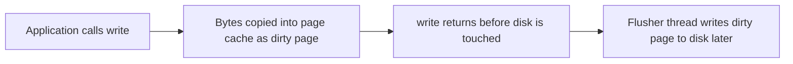
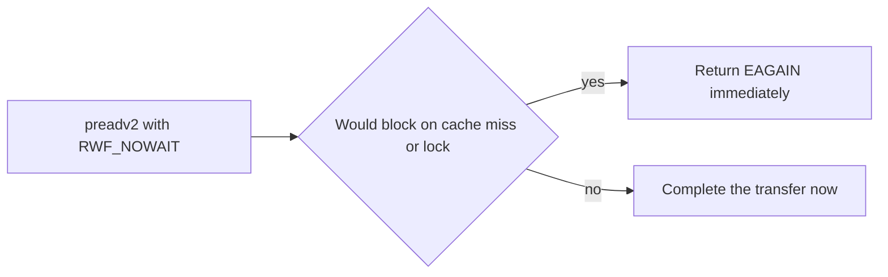

The previous articles of this stage covered what a file descriptor is, how a path becomes an inode, and who may touch a file. This chapter is about how bytes actually move once you have the descriptor open. It is the fourth article of Stage 7, the first of the subject on file I/O and correctness.

A call to `read` or `write` is not a direct conversation with the disk. It is a request to the kernel, and the path that request takes depends on whether the data is buffered, whether the call blocks, whether it may return early, and whether the kernel is allowed to cache it. The differences decide latency, CPU cost, memory use, and even correctness when transfers are interrupted. A backend engineer who ignores them ships code that corrupts data on short writes, wastes memory through double caching, or blocks a thread on a disk that `O_NONBLOCK` never helps. This article is a reference covering every common variant of the file I/O path and when to choose each.

## The basic read and write and the offset

When you open a file with `open` and then call `read` or `write`, the kernel uses the open file description's current offset, advances it by the number of bytes transferred, and returns. The offset is shared by all descriptors that point at the same open file description, which the first article of this stage explained. This is why two processes that each opened the file separately have independent offsets, while a `dup` shares one.



The diagram shows the default, buffered path. The write returns as soon as the bytes are in the kernel's page cache, not when they reach the device. This is fast and decouples the program from disk speed, but it means the data is not yet durable, a point the durability article returns to.

A `read` that reaches the end of the file returns 0 bytes, which is the only signal that distinguishes end-of-file from a short read. A short read in the middle of a file returns a positive count but not the full request; a read at EOF returns 0. Code that treats 0 as "try again" loops forever, while code that treats a short read as EOF truncates data. The contract is precise: 0 means EOF, a positive value less than requested means a partial transfer, and a negative value (an error) means failure.

## Short reads and short writes

A `read` does not always fill the buffer you asked for, and a `write` does not always write everything you gave it. A read may return fewer bytes because it hit the end of the file, because it read all available bytes from a pipe or terminal, or because it was interrupted by a signal. A write may return fewer bytes because the output buffer of a pipe is full, because a disk quota or limit was hit, or because the call was interrupted.

The contract is that a return of fewer than requested bytes is not an error by itself. The correct pattern is to loop, passing the remaining buffer and the advanced offset, until all bytes are handled or a real error occurs. The classic bug is to assume one `read` or `write` moves the whole buffer, which silently truncates data when a short transfer happens. On local files a single `write` of a small buffer almost always completes, which is exactly why the bug hides in testing and appears under load, signals, or network filesystems.

## Positional I/O and the vector variants

`pread` and `pwrite` read or write at a given offset without changing the open file description's current offset. This is valuable for random access and for multithreaded code, because several threads can read different parts of the same file without coordinating on a single shared offset. They are the positional cousins of `read` and `write`, and they make concurrent access to one open descriptor safe for independent regions.

The vector forms `preadv` and `pwritev` combine positional access with scatter-gather: they take an array of buffers and an offset, so a record spread across several memory regions can be written to a specific position in one call. The modern `preadv2` and `pwritev2` add a flags argument with the `RWF_*` set:

| Flag | Meaning |
|---|---|
| `RWF_APPEND` | Atomic append without needing `O_APPEND` |
| `RWF_DSYNC` | Perform this write as if `O_DSYNC` were set, syncing data |
| `RWF_SYNC` | Perform this write as if `O_SYNC` were set, syncing data and metadata |
| `RWF_HIPRI` | Higher priority, polling for the device (used by fast storage) |
| `RWF_NOWAIT` | Do not wait; return `EAGAIN` immediately if the operation would block |

`RWF_NOWAIT` is the closest thing to true non-blocking file I/O: instead of blocking on a cache miss or a contended inode, the call returns `EAGAIN` so the application can do other work and retry. This is the primitive that lets a regular file be serviced from a non-blocking event loop without a thread pool, and it is the file-side counterpart to `O_NONBLOCK` on pipes and sockets.



## Vectored I/O and scatter-gather

`readv` and `writev` let a single call fill or drain several buffers described by an array of base and length pairs. For file I/O this matters when a record is split across a header and a body, or when gathering several pieces into one write without first concatenating them in memory. `preadv` and `pwritev` add the offset, and `preadv2`/`pwritev2` add the `RWF_*` flags above.

Vectored I/O is not zero-copy in the sense of avoiding the kernel, but it avoids an extra copy and an extra call. A server that writes a status line, a set of headers, and a body can do it in one `writev` instead of memcpy-ing them into a staging buffer and then writing. This is also a correctness tool: one call handles a scattered record without an intermediate buffer that could be truncated by a short write.

## Blocking versus non-blocking behavior

By default, `read` and `write` on a regular file block until the kernel has moved the requested bytes (or as many as it will). For a file backed by a fast cache this is instantaneous; for a file whose pages must come from a slow device, the calling thread waits. The exposure is real but simple: a slow disk makes the calling thread pause.

`O_NONBLOCK` changes this for devices, pipes, and sockets, where it makes a call return `EAGAIN` when it would have to wait. For regular files, however, the kernel generally considers the data available and returns it, so non-blocking mode rarely changes file behavior. The meaningful non-blocking path for files is `RWF_NOWAIT` described above, not `O_NONBLOCK`. Blocking file I/O still returns quickly when the cache serves it, which is most of the time on a warm system. The flag can be toggled at runtime with `fcntl` `F_SETFL`, which is how a server switches a descriptor between blocking and non-blocking after opening.

## Buffered I/O and the page cache

Buffered I/O is the default and the subject of the next article in depth. Reads are served from the page cache when possible, so repeated reads of the same region never touch the disk. Writes land in the cache as dirty pages and are written back to the device by a kernel flusher thread on a schedule. The benefits are speed, coalescing of small writes, and readahead for sequential access.

The cost is two copies for a write (user buffer to cache, then cache to device) and one copy for a read (device to cache, then cache to user), plus memory consumed by the cache. For a program that already keeps its own cache, such as a database buffer pool, the page cache becomes a second, redundant copy, which is the double-buffering problem.

You can influence the cache from the application. `posix_fadvise` tells the kernel your intended access pattern: `POSIX_FADV_SEQUENTIAL` triggers aggressive readahead, `POSIX_FADV_RANDOM` disables it, `POSIX_FADV_WILLNEED` asks for prefetch, `POSIX_FADV_DONTNEED` releases pages from the cache, and `POSIX_FADV_NOREUSE` hints that the data will not be reused. The `readahead` syscall primes a range explicitly. Using `DONTNEED` after a one-shot scan keeps a large file from evicting the working set of other processes, which is a real concern for backup and export jobs.

The filesystem also reports a preferred I/O size through `stat`'s `st_blksize`, and the device exposes its logical and physical block sizes under `/sys/block/<dev>/queue/logical_block_size` and `physical_block_size`. Aligning transfers to those sizes and to page boundaries helps both buffered and direct paths.

## Direct I/O and O_DIRECT

`O_DIRECT` asks the kernel to bypass the page cache and move data straight between the application's buffer and the device via DMA. The application becomes responsible for its own caching, readahead, and alignment. The buffer, the length, and the file offset must all be aligned to the device's requirements, which are typically the memory page size and the device's logical block size; an unaligned value fails with `EINVAL`. Buffers are normally allocated with `posix_memalign` or a large-page allocator so they meet the DMA alignment constraint.


The diagram shows the direct path. Databases and storage engines use `O_DIRECT` to avoid double buffering and to control exactly when data reaches the disk, which matters for write-ahead logs and for predictable latency. The cost is that they lose the kernel's readahead and caching, so they must implement their own, and a misaligned buffer or a small random read can perform worse than buffered I/O would have. Direct I/O is a deliberate choice for workloads that already manage memory, not a default to turn on everywhere.

## Synchronous I/O and fsync at write time

Three flags make a write durable at the moment of the call rather than at the kernel's leisure. `O_SYNC` opens the file so that every `write` waits until both data and metadata (such as the file size and timestamps) reach stable storage. `O_DSYNC` waits only for the data, not the unrelated metadata, which is usually enough for an append-only log. `fdatasync` is the per-call version of `O_DSYNC` and `fsync` the stronger per-call version; they are covered in depth in the durability article, but it is worth noting here that these are the tools that turn "the kernel accepted my bytes" into "the bytes are on the device." Opening with `O_SYNC` is simpler but forces every write down the durable path, which is heavier than calling `fsync` only after batching several writes.

## Asynchronous I/O: native AIO and io_uring

For high-throughput services, blocking one thread per I/O caps concurrency. The Linux native asynchronous I/O interface, historically `io_submit` with `IOCB_CMD_PREAD`/`IOCB_CMD_PWRITE`, lets a thread submit many operations and later collect completions with `io_getevents`, without waiting for each. It is awkward to use and has quirks (for example it historically served buffered reads from a kernel thread), but it underpins many database storage engines.

The modern interface is `io_uring`, which uses two ring buffers shared between the application and the kernel to submit and reap I/O with minimal syscalls, and which supports true non-blocking file operations, polling, and linked operations. `io_uring` is the recommended foundation for new high-performance I/O code because it unifies files, sockets, and other descriptors under one completion model. Both approaches move the "wait for the device" off the critical path, which is the real answer to "how do I do non-blocking file I/O at scale."

## Zero-copy and server-side copy helpers

Several syscalls avoid copying bytes through the application at all. `sendfile` moves data from a file to a socket (or between file descriptors) entirely in the kernel, which is how a web server streams a static file without reading it into user space. `splice` and `tee` move data between a pipe and a file or socket using kernel buffers. `copy_file_range` performs a copy within or between files without round-tripping the data through user memory, which is far cheaper than read-plus-write. These are "zero-copy" in the sense discussed in the Stage 6 article on zero-copy, DMA, and high-performance buffers, and they are worth knowing when a service spends CPU copying bytes that the kernel could move itself.

## Observing I/O behavior

`strace` shows whether a program issues `read`, `write`, `pread`, `pwrite`, `writev`, or `splice`, and how large each transfer is. Small transfers in a tight loop are a sign of missing buffering or a missing gather/writev. The page cache is visible in `/proc/meminfo` under `Cached` and `Dirty`, and disk activity in `iostat -x`. Tools such as `vmtouch` or `pcstat` report which pages of a file are resident in the cache, which is how you confirm whether a slow read is a cache miss. `blktrace` and `fio` go deeper for benchmarking and latency analysis of the device itself.

```go
package main

import (
    "fmt"
    "os"
)

// writeAll loops until the whole buffer is written or a real error occurs.
func writeAll(f *os.File, data []byte) error {
    written := 0
    for written < len(data) {
        n, err := f.Write(data[written:])
        if n > 0 {
            written += n
        }
        if err != nil {
            return err
        }
        if n == 0 && err == nil {
            continue
        }
    }
    return nil
}

func main() {
    f, err := os.Create("out.txt")
    if err != nil {
        panic(err)
    }
    defer f.Close()

    // positional write at offset 0 and again at offset 10
    f.WriteAt([]byte("hello"), 0)
    f.WriteAt([]byte("world"), 10)

    buf := make([]byte, 5)
    f.ReadAt(buf, 0)
    fmt.Printf("read back: %s\n", buf)

    big := make([]byte, 1<<16)
    if err := writeAll(f, big); err != nil {
        panic(err)
    }
    fmt.Println("wrote", len(big), "bytes with a short-write-safe loop")
    select {}
}
```

```bash
go build -o iodemo main.go
strace -e trace=read,write,pread,writev -f ./iodemo 2>&1 | head
cat /proc/meminfo | grep -E "Cached|Dirty"
iostat -x 1 2
# which pages of a file are in cache right now
vmtouch -v somefile.dat
# prefetch and drop cache hints from the shell
posix_fadvise()  # via application code, not a standalone command
```

What it shows is the positional calls in action and the loop that makes writes safe. The `strace` output reveals the actual syscalls and sizes, `iostat` shows whether the device is the bottleneck, and `vmtouch` shows whether a read is being served from cache or from disk. For a service with latency complaints, this is how you learn whether the cost is the syscall path, the page cache, or the disk itself.

## A realistic production example

A team built a log-ingestion service that appended records to a file with a single `write` per record, assuming each write moved the whole record. Under normal load it did. Under a traffic spike, several writes returned short: the pipe-like destination and the signal-driven shutdown path caused partial transfers. Because the code ignored the returned count, the tail of each short write was dropped, and the log file became a sequence of corrupted, overlapping records that downstream parsers rejected.

The fix was the write-all loop shown above, which tracks the offset and continues until the full buffer is written or a genuine error stops it. The same service later adopted `O_DIRECT` for its hot write-ahead segment, because it already kept an in-memory buffer pool and did not want the kernel to hold a second copy of every byte. That change removed double buffering and gave predictable write latency, at the cost of managing alignment and readahead itself. It also moved its durability boundary from implicit flusher timing to explicit `fdatasync` calls after batches, which the next article covers. The lesson was that the default I/O path is convenient precisely until it is not, and the two failures, a silent short write and a redundant cache, are both avoided by understanding the path your bytes take.

## How engineers actually reason about file I/O

They loop on short transfers. Any `read` or `write` is treated as potentially partial, and the code advances and repeats until done or errored. This is not defensive nitpicking; it is the correct contract, and the bug from skipping it is silent data loss.

They choose buffered or direct deliberately. Buffered I/O is the right default for most services because the cache does useful work. Direct I/O is for programs that already manage memory and need control or want to avoid double caching, and it demands alignment discipline.

They distinguish blocking from cached. A buffered write returns fast because it hits cache, not because the data is safe. Durability is a separate concern solved by `fsync` or, at write time, by `O_SYNC`/`O_DSYNC`, covered next. Confusing "write returned" with "data is on disk" is a classic durability bug.

They reach for vectored I/O and RWF_NOWAIT when the path is hot. `writev` and `readv` remove a copy and a call, and `RWF_NOWAIT` lets a regular file join a non-blocking event loop without a thread pool. For extreme throughput they use `io_uring` rather than one thread per I/O.

They advise the cache. `posix_fadvise` with `DONTNEED` after a bulk scan, and `WILLNEED` before a known access, keeps the page cache working for the real working set instead of against it.

## I/O throttling and prioritization with cgroups v2

On a multi-tenant host, one service's I/O can starve others, so Linux controls it through cgroups v2. io.max sets per-device IOPS and bandwidth limits for a cgroup, so a batch job can be capped to a fraction of the disk while a latency-sensitive service keeps the rest. io.weight assigns proportional priority, a value from 1 to 10000 with default 100, so that under contention the scheduler gives more throughput to higher-weighted cgroups. This is how you keep a database responsive while a backup runs. io.stat reports the actual throttling and pressure seen by the cgroup, which is the signal that a limit is biting.

This control interacts with the buffering model from earlier in the article. A cgroup limit applies to the I/O that reaches the device, not to the page-cache copy, so a throttled writer may still return quickly from buffered writes and then stall when the flusher tries to drain dirty pages past the cap. The practical rule is to set io.weight for latency-sensitive paths and io.max only where a hard ceiling is needed, and to watch io.stat rather than assuming the limit is or is not in effect. Kubernetes exposes these as the storage limits and the io parameters in a pod spec, so a noisy neighbor can be bounded without changing the application.

## Definitions

### Buffered I/O

> The default file I/O path where reads are served from and writes land in the kernel page cache, so transfers are fast and decoupled from device speed, and data is written to the device later by the flusher.

### Direct I/O

> File I/O opened with `O_DIRECT` that bypasses the page cache and moves data straight between the application buffer and the device, requiring aligned buffers, lengths, and offsets, and shifting caching responsibility to the application.

### A short read or write

> A transfer that moved fewer bytes than requested without being an error, which is normal and requires the caller to loop until the full buffer is handled or a real error occurs. A read of 0 at EOF is a distinct signal meaning end of file.

### Positional and vectored I/O

> `pread`/`pwrite` read or write at a given offset without changing the open file description's current offset, and their `v` variants accept several buffers at once. `preadv2`/`pwritev2` add `RWF_*` flags such as `RWF_NOWAIT` and `RWF_SYNC`.

### Non-blocking and asynchronous I/O

> `O_NONBLOCK` and `RWF_NOWAIT` make a call return `EAGAIN` instead of waiting when it would block; for regular files `O_NONBLOCK` rarely changes behavior, while `RWF_NOWAIT` and `io_uring` provide real non-blocking file access without per-I/O threads.

### Synchronous write flags

> `O_SYNC` and `O_DSYNC` make writes wait for stable storage at write time, and `fdatasync`/`fsync` do so on demand. They turn an accepted-but-cached write into a durable one.

## Beyond the definitions

### Why does a write return before the disk is written

> Because buffered I/O copies the bytes into the page cache and marks them dirty, then returns. The kernel writes them to the device later through the flusher thread. The call is about handing bytes to the kernel, not about reaching stable storage, which is why durability needs `fsync`, `fdatasync`, or `O_SYNC`.

### When is O_DIRECT worth the alignment burden

> When the application already manages its own cache, such as a database, and a second copy in the page cache would waste memory and obscure latency. It is not worth it for ordinary services, where the cache helps and the alignment rules add fragility. Buffers must be aligned to the page and logical block size via `posix_memalign`.

### Why does a short write happen if the disk is not full

> Because the destination may be a pipe with a limited buffer, the call may be interrupted by a signal, or a device or quota may cap the transfer. The kernel returns what it did move and lets the caller continue, which is correct behavior that naive code misreads as success.

### How is pread different from a read plus seek

> `pread` uses the supplied offset and does not touch the shared file offset, so it is safe for concurrent random access by multiple threads on one descriptor, whereas `lseek` plus `read` would require locking the shared offset. `preadv2` adds vectoring and `RWF_*` flags on top.

### Does non-blocking help a slow disk read

> Not via `O_NONBLOCK` for regular files, because the kernel generally completes the read from cache or device and returns it. `RWF_NOWAIT` and `io_uring` are the real answers: they return `EAGAIN` or complete asynchronously instead of blocking the calling thread.

### Why use io_uring instead of threads

> Because one thread per outstanding I/O does not scale to tens of thousands of concurrent operations and wastes stack and scheduler time. `io_uring` submits and reaps completions through shared ring buffers with very few syscalls, unifying files and sockets under one non-blocking completion model.

## Common misconceptions

**"One write moves the whole buffer."** It may move fewer bytes and report that count as success. Code that ignores the returned length silently truncates data, and the failure appears only under load or signals, not in tests.

**"A returned write means the data is safe."** It means the kernel accepted the bytes into its cache. Without `fsync`, `fdatasync`, or `O_SYNC`/`O_DSYNC` they can be lost on crash or power loss, which the durability article explains in full.

**"O_DIRECT is always faster."** It removes the cache, so a workload that benefited from readahead or caching becomes slower and must reimplement those. It helps only when the application already manages memory well and meets the alignment rules.

**"Non-blocking file I/O avoids disk waits."** `O_NONBLOCK` usually does not, because the call still blocks on a cache miss. Non-blocking file behavior comes from `RWF_NOWAIT` or `io_uring`, not from `O_NONBLOCK`.

**"Vectored I/O is only for performance tuning."** It is also a correctness tool for scattered records, letting one call handle a header and body without concatenating them, which avoids an extra buffer and a copy on hot paths.

**"fadvise is optional polish."** It changes what the cache keeps and prefetches, which directly affects tail latency and whether a bulk job evicts the production working set. Ignoring it leaves cache behavior to chance.

## Summary

File I/O is not one path but several, and the choice changes latency, memory, and correctness. The default buffered path copies through the page cache and returns before the device is touched, so writes need `fsync`, `fdatasync`, or `O_SYNC`/`O_DSYNC` to become durable. Short reads and writes are normal and must be looped, with 0 meaning end-of-file. Positional `pread`/`pwrite` and their vectored `preadv2`/`pwritev2` forms make concurrent random access safe and add `RWF_*` controls such as `RWF_NOWAIT`. Direct I/O with `O_DIRECT` bypasses the cache for programs that manage their own, at the cost of alignment and caching discipline. True non-blocking file access comes from `RWF_NOWAIT` and `io_uring`, while `sendfile`, `splice`, and `copy_file_range` avoid user-space copies. The next article examines the cache itself and what it takes to make a write actually durable.
