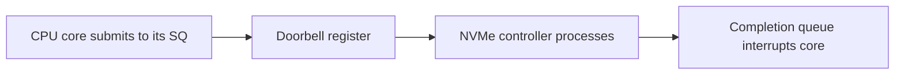
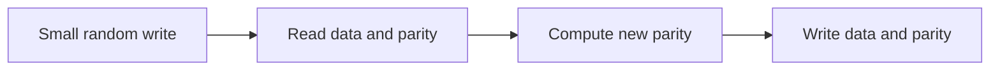

The previous articles of this stage described the software path from descriptor to durable byte. This chapter steps down to the hardware those bytes ultimately live on. It is the seventh and final article of Stage 7, the subject on storage hardware.

A storage device is not a uniform bucket of bytes. A spinning disk, a flash drive, and an NVMe card differ so much in how they handle a random small write that the same workload can be trivial on one and impossible on another. RAID changes the tradeoffs again by spreading data across devices. A backend engineer who picks storage without this model ends up with a database that crawls because its write pattern fights the device, or a RAID that loses data on a rebuild. This article is a reference covering the internals of each device class, the interface and queue mechanics, how to read IOPS and latency, the full set of RAID tradeoffs including the write hole, health monitoring, and how to observe and benchmark real devices.

## Hard disks and the cost of seeking

A hard disk drive stores data on spinning platters read by a moving head. Two physical delays dominate: the seek time to move the head to the right track, and the rotational latency waiting for the sector to arrive under the head. Sequential access amortizes those costs over a long stream, but random access pays them on nearly every operation. The result is a device with decent sequential throughput but very low random IOPS, often in the low hundreds per second.

Disks come in conventional magnetic recording (CMR), where tracks are independent, and shingled magnetic recording (SMR), where tracks overlap like roof shingles to pack more bits, which makes writes that touch a shingled band require rewriting the whole band. SMR disks are cheap for cold, sequential workloads but perform badly and unpredictably for random writes, which is a trap for log-structured and database workloads. Native Command Queuing (NCQ) lets the drive reorder queued commands to minimize seek distance, but it cannot defeat the physical limits of many tiny random operations. The dominant cost remains the seek plus rotation, and no controller trick removes it.

This is why a hard disk is fine for large sequential reads and terrible for many small random writes. A service that writes a million tiny records to a disk is limited by seeks, not by the disk's raw bandwidth. The device is fundamentally optimized for streams, and workloads that are not streams pay the penalty on every operation.

## Solid state drives and the erase-block model

A solid state drive has no moving parts, so seek and rotational delay disappear and random access is fast. But flash memory cannot overwrite a location in place. It writes in pages and erases in larger blocks, so changing a small piece of data means reading the block, erasing it, and writing it back. This is the origin of write amplification: a small logical write becomes a larger physical one.

NAND flash comes in cell types with different endurance and density: SLC (one bit per cell, fastest and most durable), MLC, TLC, and QLC (four bits per cell, cheapest and least durable). Each has a different program/erase cycle budget and a different cost per gigabyte. The drive controller hides much of this behind an internal mapping layer that translates logical block addresses to physical flash, runs wear leveling to spread writes across cells, and performs garbage collection in the background to reclaim erased blocks. An SLC cache, a small fast region used for incoming writes, can mask the slower TLC/QLC write performance until it fills, after which write speed drops; DRAM-less drives use the host memory buffer (HMB) over PCIe for mapping tables. All of this background activity can surface as latency spikes under sustained load, and read-disturb effects mean frequent reads of one page can subtly disturb neighbors, which the controller must refresh.



The diagram shows the NVMe queue-pair mechanism, where each core has its own submission and completion path to the device. For SSDs generally, the controller runs wear leveling and garbage collection, which add background activity that can surface as latency spikes under load. The earlier NVMe discussion builds on the same parallelism idea.

## Wear, health, and TRIM

Flash cells endure a finite number of writes, expressed as a total bytes written budget such as TBW. Wear leveling extends life, but a write-heavy workload still consumes it. The `TRIM` (SATA), `UNMAP` (SCSI/SAS), or `discard` command lets the operating system tell the drive which blocks are no longer in use, so the drive can reclaim them during garbage collection instead of copying stale data. Without TRIM, an SSD's performance and life degrade because the drive must preserve and rewrite blocks the filesystem has already discarded. Secure erase and cryptographic erase are related commands for wiping a device by discarding or rotating its internal encryption key.

Device health is reported through SMART attributes. The ones that matter for prediction are reallocated sector count (spare cells substituted for failed ones), pending and uncorrectable sectors, the wear-leveling or percentage-used indicator, power-on hours, temperature, and the raw error rate. A backend engineer watches these on production storage, because a disk near its write budget or showing reallocated sectors is a failure waiting to happen, and RAID does not help if all members age together.

## NVMe and parallelism

NVMe is a storage protocol over PCIe rather than over the older SATA or SAS attachment. The key advantage is parallelism: an NVMe device exposes many submission and completion queue pairs, up to 64k entries each, often one pair per CPU core, so multiple cores can issue I/O without contending on a single queue. The host writes a command to its submission queue and rings a doorbell register; the controller processes it and posts a completion that interrupts the core. Combined with PCIe's high bandwidth and low overhead, this yields very high IOPS and low latency compared with a SATA SSD, which has a single queue and a controller bottleneck.

The diagram above shows the multiple queues converging on the device. A workload that issues many concurrent I/Os from many cores is exactly what NVMe is built for, while a single-threaded sequential reader sees less of the benefit because it cannot saturate the parallelism. Queue depth, the number of outstanding requests, is the lever that lets NVMe show its strength. End-to-end data protection (DIF/DIX) and NVMe over Fabrics extend the model to shared and networked storage.

## IOPS, throughput, and latency

Three numbers describe a device. IOPS is operations per second, throughput is bytes per second, and latency is the time for one operation. They are related: throughput is roughly IOPS times average request size. A small random write is bounded by IOPS and latency; a large sequential read is bounded by throughput. Tuning for one does not help the other, so the workload's request size and concurrency decide which limit you hit.

Latency has several components: the software and queueing delay in the block layer, the controller processing time, and the media access time. The useful numbers are not the average but the tail: p99 and p999 latency, because a service's worst-case request is usually what breaks an SLA. Queue depth matters because a single outstanding request hides none of the device's latency, while many outstanding requests let the device parallelize and reach its IOPS rating. A benchmark that uses one thread and queue depth one measures latency, not the device's capacity; a benchmark with high queue depth measures throughput and IOPS. Both are real, and the difference explains many misleading storage numbers.

The Linux block layer exposes I/O schedulers that reorder and merge requests: `none` (pass-through, right for fast NVMe), `mq-deadline` (bounded latency, good default for disks), `kyber` (latency-target driven), and `bfq` (fairness for interactive loads). With blk-mq, each queue can have its own scheduler, and choosing the right one changes tail latency on contention.

## RAID and the tradeoffs

RAID combines several disks into one logical device with a chosen balance of redundancy and performance. The common levels:

| Level | Layout | Redundancy | Small-write cost | Use |
|---|---|---|---|---|
| RAID 0 | Striping | None | Best (no parity) | Speed, no safety |
| RAID 1 | Mirroring | One disk | Good (write both) | Fast redundant reads/writes |
| RAID 5 | Striping + one parity | One disk | Poor (read-modify-write) | Capacity-efficient redundancy |
| RAID 6 | Striping + two parity | Two disks | Worse (two parities) | Large arrays, safer rebuilds |
| RAID 10 | Mirror of stripes | One per mirror | Good | Fast redundant OLTP |

RAID 0 stripes data across disks for speed but offers no redundancy: one disk lost, all data lost. RAID 1 mirrors, so a read can be served from either copy and a disk failure is survivable, at the cost of half the raw capacity. RAID 5 and 6 add parity so they survive one or two disk failures while using less overhead than full mirroring, but they pay a write penalty: a small write requires reading the data and parity, computing new parity, and writing both, a read-modify-write that hurts small random writes. RAID 10 combines mirroring and striping for both speed and redundancy, at higher cost.



The diagram is the RAID 5 write amplification: one logical write becomes several physical operations. This is why a database's small synchronous writes on RAID 5 can be far slower than on RAID 10 or a single SSD, and why storage choice is a workload decision, not a default.

## The RAID write hole and rebuild risk

Two failure modes of parity RAID deserve special attention. The RAID write hole occurs when a crash or power loss interrupts an update to data and its parity, leaving them inconsistent. If a disk later fails and the array rebuilds from parity, it reconstructs a block from a parity value that does not match the (now lost) data, producing silently corrupted data. This is a consistency hole, not just an availability gap, and it is the reason parity RAID is weaker than it looks for crash-prone systems. ZFS's RAID-Z and other copy-on-write designs avoid the hole because they never update parity and data in place; instead the new data and parity are written together and atomically switched. Some hardware RAID controllers mitigate it with a battery-backed write cache that completes the in-flight parity write after power returns.

The second risk is the unrecoverable read error (URE) during rebuild. As arrays grow, the probability that a second disk develops a bad sector during the long, stressed rebuild of a failed disk rises, and a URE during rebuild means the reconstructed data is wrong or the rebuild fails. Larger drives and larger arrays make this more likely, which is why RAID 6 (two parities) is preferred over RAID 5 for big arrays, and why scrubs and spare disks matter. Erasure coding generalizes the parity idea with configurable data and parity shards, used by distributed storage to survive multiple failures across nodes rather than just disks.

## Write amplification across layers

Write amplification appears at several layers and compounds. The device has it from flash erase blocks. RAID 5 and 6 have it from parity. A filesystem with a small block size and a workload that updates tiny records has it from partial-block writes. A database that writes a journal and then applies changes has it from double writing. None of these is wrong by itself, but stacking them without accounting for the total multiplier produces a system that does far more physical writing than the logical workload suggests, which shows up as latency and device wear.

The mitigation is to match the write size and pattern to the layers. Aligning writes to block and stripe sizes, batching small records, using the device's preferred I/O size from `/sys/block/<dev>/queue/optimal_io_size`, and putting latency-sensitive write-ahead logs on devices that handle small writes well are the practical answers.

## Zoned storage

A newer device class, zoned storage, exposes the drive's internal structure to the host. ZNS (Zoned Namespace) NVMe and SMR zoned disks require that writes to a zone be sequential and that zones be reset (erased) before reuse, which removes the device's need for background garbage collection and yields predictable latency and higher endurance. Log-structured and LSM-tree storage engines map naturally onto zones. This is an explicit trade: the host takes on the write-ordering responsibility that a conventional SSD hides, in return for lower amplification and steadier performance.

## Observing the devices

The operating system exposes device topology and statistics. `lsblk` shows the block device tree, `smartctl -a` shows health and wear, and `nvme` (nvme-cli) shows NVMe-specific state including temperature, wear, and queue configuration. `iostat -x` shows per-device utilization, average queue size (`aqu-sz`), and `await`, the average time requests spend in the device, plus `%util` as a rough saturation indicator. `/proc/diskstats` and `/sys/block/<dev>/queue/` are the raw sources for request size, merge behavior, and scheduler. For capacity planning, `fio` runs a controlled benchmark at a chosen queue depth and request size so you measure the number that matters for your workload, and `blktrace` traces each request through the block layer to locate latency.

```bash
lsblk
smartctl -a /dev/nvme0n1
nvme list
nvme smart-log /dev/nvme0n1
iostat -x 1
# a targeted benchmark: random 4k writes at queue depth 16
fio --name=rndwrite --rw=randwrite --bs=4k --iodepth=16 --size=1G --numjobs=4
# preferred and minimal I/O sizes exposed by the kernel
cat /sys/block/nvme0n1/queue/optimal_io_size
cat /sys/block/sda/queue/scheduler
```

```go
package main

import (
    "fmt"
    "os"
)

func main() {
    // a tiny write pattern probe: measure how the device feels for small appends
    f, err := os.OpenFile("probe.log", os.O_CREATE|os.O_WRONLY|os.O_APPEND, 0644)
    if err != nil {
        panic(err)
    }
    defer f.Close()
    for i := 0; i < 1000; i++ {
        if _, err := f.WriteString("event\n"); err != nil {
            panic(err)
        }
    }
    if err := f.Sync(); err != nil {
        panic(err)
    }
    fmt.Println("wrote and fsync'd 1000 small appends; check iostat while running")
    select {}
}
```

What it shows is a simple way to generate the small-write pattern that stresses devices and RAID parity, while `iostat` on another terminal reveals the await and queue depth. The `fio` command gives a repeatable measurement at a realistic queue depth, which is the number that predicts production behavior better than a vendor's best-case throughput. `nvme smart-log` shows wear and temperature so you can see a device aging before it fails.

## A realistic production example

A team ran a transactional database whose write-ahead log did many small, synchronous commits, each `fsync`'d for durability. The log lived on a RAID 5 array of hard disks. Under load the commit latency was poor and the disks showed high await, because every small synchronous write triggered the RAID 5 read-modify-write parity dance on slow disks, and the `fsync` waited for all of it. The storage was cheap but wrong for the pattern.

They moved the write-ahead log to an NVMe device and placed the data files on a RAID 10 of SSDs. The NVMe's parallel queues and low latency absorbed the small `fsync`'d commits, and the RAID 10 avoided the parity penalty for random writes while still surviving a disk failure. Commit latency dropped by an order of magnitude and the disks stopped being the bottleneck. They also enabled `TRIM` and monitored SMART wear and the NVMe smart-log so the SSDs would not silently age into failure, and they switched the data array from RAID 5 to RAID 10 specifically because the rebuild-risk and parity-write tradeoffs of RAID 5 were unacceptable for a write-heavy OLTP load. The lesson was that the device must match the write pattern, that a redundant array is not automatically a fast one, and that RAID 5's parity helps capacity and survival, not small random write latency.

## How engineers actually reason about storage

They match device to access pattern. Sequential large streams belong on hard disks or any cheap capacity. Small random writes and low latency belong on SSD or NVMe. The workload's request size and concurrency pick the device, not the budget alone. They consider SMR versus CMR for disks and TLC/QLC endurance for SSDs.

They respect write amplification. Flash erase blocks, RAID parity, and partial writes each multiply physical writes, and stacked they dominate latency and wear. Aligning and batching writes, using optimal I/O sizes, and matching record size to stripe and block sizes is how you keep the multiplier small.

They use RAID for the property they need. Mirroring and RAID 10 for fast redundant writes, RAID 5 or 6 for capacity-efficient redundancy when writes are large and rare, and they account for the write hole and rebuild URE by choosing RAID 6 or copy-on-write storage and by scrubbing. The redundancy protects against disk failure but does not remove the performance character of the underlying devices.

They watch health, not just capacity. SMART attributes, wear budgets, NVMe temperature, and pending sectors predict failure; RAID hides a dead disk but not a fleet aging in step, so monitoring and hot spares matter as much as the array.

## Benchmarking methodology and storage selection

The numbers that decide a purchase or a tuning change come from a benchmark that matches the workload, not from a vendor's peak. Use fio with explicit bs, request size, iodepth, queue depth, rw, read or write mix, and numjobs, concurrency, and read the p99 and p999 latency, not just the average IOPS, because tail latency is what breaks SLAs. A 4k random write at high iodepth measures the device's IOPS ceiling and its controller behavior. A large sequential read measures bandwidth. A mixed rw measures steady state after the SLC cache fills and garbage collection engages. Always state the cache state, the device's internal cache and the host page cache, and the fill level, because both change the result dramatically.


Selection then follows the access pattern. Cold, large, sequential, and capacity-bound data belongs on hard disks or dense QLC SSDs. Small random writes, low latency, and high IOPS belong on TLC or SLC SSDs or NVMe. Durability-critical writes want a device with power-loss protection. For redundancy, mirror or RAID 10 for write-heavy OLTP, RAID 6 for large rare-write capacity, and ZFS or btrfs for checksummed integrity. In shared or cloud environments, also account for the virtualization layer: a virtual disk's I/O passes through a hypervisor that adds queueing and may throttle, so benchmark the actual volume, not the raw device, and use the cgroups v2 controls from the I/O and cache articles to keep one tenant from starving others.

## Definitions

### An HDD

> A hard disk drive storing data on spinning platters read by a moving head, so its cost is dominated by seek and rotational latency, making sequential access fast and random access limited by low IOPS. SMR variants make random writes especially painful.

### An SSD

> A solid state drive with no moving parts, fast random access, but a flash erase-block model that causes write amplification, managed by wear leveling, garbage collection, and over-provisioning, with a finite write endurance that varies by cell type from SLC to QLC.

### NVMe

> A storage protocol over PCIe offering many parallel submission and completion queue pairs, high IOPS, and low latency compared with single-queue SATA attachments, best used with high queue depth from many cores and the `none` scheduler.

### RAID

> A way to combine disks for redundancy or performance, with levels trading capacity and write cost: striping for speed, mirroring for survival, parity for capacity-efficient redundancy at a small-write penalty and with a write-hole risk addressed by copy-on-write designs.

### Write amplification and the write hole

> Write amplification is the multiplier between logical and physical writes from flash blocks, RAID parity, and partial updates, compounding across layers. The RAID write hole is the silent inconsistency that parity and data can become mismatched after a crash, corrupting rebuilds unless avoided by copy-on-write or battery-backed caches.

## Beyond the definitions

### Why is a hard disk bad at small random writes

> Because each write pays a seek and rotational latency, so the IOPS is low regardless of the disk's sequential bandwidth. A million tiny writes are gated by those physical delays, not by throughput, and SMR disks make it worse by rewriting bands.

### What does NVMe parallelism actually require

> Many concurrent outstanding requests from many cores, each with its own queue pair and doorbell, so the device can overlap operations. A single-threaded low queue-depth workload cannot use the parallelism and sees less benefit.

### Why does RAID 5 hurt small writes

> A small write needs the current data and parity read, new parity computed, and both written, a read-modify-write that multiplies physical operations. Large sequential writes amortize this, but random small writes hit it on every operation.

### How does TRIM help an SSD

> It tells the drive which blocks are free so garbage collection can reclaim them without copying stale data, preserving performance and wear life. Without it, the drive preserves and rewrites discarded blocks; UNMAP and discard are the SCSI and filesystem equivalents.

### Does RAID remove the need to watch disk health

> No. RAID survives a disk failure but all members age together, a second failure during a long rebuild (amplified by URE) still loses data, and silent wear still occurs. SMART monitoring, scrubs, and spares remain necessary.

### What is the RAID write hole and why does it matter

> A crash during a parity update can leave data and parity inconsistent; a later rebuild then reconstructs wrong data silently. It matters because it is data corruption, not just downtime, and it pushes careful designs toward RAID 6, ZFS RAID-Z, or battery-backed write caches.

## Common misconceptions

**"More disks in RAID means faster for every workload."** Striping helps large sequential transfers but the parity levels add write cost for small random writes, so the same array can be fast for one pattern and slow for another. RAID 0 is fast but has no redundancy at all.

**"An SSD has no downsides versus a disk."** It has write amplification, finite endurance varying with SLC/MLC/TLC/QLC, and garbage-collection latency spikes. For cold bulk storage it is often more expensive than a disk for no benefit, and it still wears out; SMR disks are worse than they look for random writes too.

**"NVMe is automatically faster than SATA."** Only under concurrent, queue-depth-heavy workloads. A single-threaded sequential reader sees the bandwidth limit, not the queue parallelism, and may see little gain. A SATA SSD already saturates many single-threaded reads.

**"RAID is a backup."** RAID protects against a disk failing, not against accidental deletion, corruption, the write hole, or a site loss. It is redundancy for availability, not a substitute for backups.

**"TRIM happens automatically and I can ignore it."** It must be enabled and supported through the stack (filesystem discard or a periodic `fstrim`). Without it an SSD degrades in performance and life, and many setups leave it off by default.

**"RAID 5 is fine because it has parity."** Parity gives one-disk survival, but the write-hole and rebuild URE risk make it fragile for large or write-heavy arrays; RAID 6 or a copy-on-write design is safer, and parity still penalizes small random writes.

## Summary

Storage devices are not interchangeable. Hard disks win on cheap sequential capacity but suffer on random IOPS, with SMR making random writes worse. SSDs remove seek latency but introduce write amplification, finite endurance, and garbage-collection spikes, managed by leveling, over-provisioning, and TRIM. NVMe adds the parallelism that saturates modern multi-core writes through many queue pairs and high queue depth. RAID trades capacity, redundancy, and write cost in ways that help large sequential work but penalize small random writes on parity levels, and the write hole plus rebuild URE are real consistency and availability risks that copy-on-write storage avoids. Write amplification compounds across device, RAID, and filesystem, so matching the write pattern to the storage is the real engineering decision, and health monitoring is as important as the array itself. With this hardware understood, Stage 7 is complete, from descriptors and the filesystem model through I/O correctness to the devices the bytes finally rest on.
