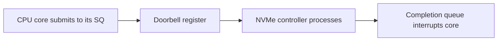
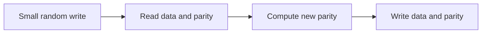
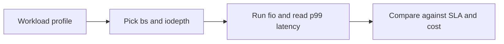

The earlier articles in this stage traced the software path from a file descriptor to a byte on disk. This article goes one layer lower. It looks at the hardware that holds those bytes. It is the seventh and last article in Stage 7, which covers storage hardware.

A storage device is not a simple box of bytes. A spinning disk, a flash drive, and an NVMe card each handle a small random write in a different way. The same workload can run fine on one device and stall on another. RAID spreads data across many devices. That changes the tradeoffs again. Suppose you pick storage without this model. You might build a database that runs slow because its writes fight the device. You might also build a RAID array that loses data while it rebuilds. This article is a reference for those choices. It explains how each type of device works. It explains how the host talks to the device and how queues work. It shows how to read IOPS and latency. It explains RAID tradeoffs and the write hole. It covers health signals and how to watch and test real devices.

## Hard disks and the cost of seeking

A hard disk drive (HDD) stores data on spinning plates called platters. A moving head floats above the platters and reads the data. Two delays set its speed. Seek time is the time the head needs to move to the right track. Rotational latency is the time the platter needs to spin the target sector under the head. A long sequential read or write pays these costs once and then streams many bytes. A random read or write pays these costs on almost every operation. So the disk runs fast on long streams and slow on random work. Its random IOPS, which means random operations per second, is often only a few hundred.

Disks use two ways to lay down tracks. Conventional magnetic recording (CMR) keeps each track separate from the next. Shingled magnetic recording (SMR) overlaps tracks like roof shingles to pack in more bits. That overlap has a cost. A write that touches one SMR band must rewrite the whole band. So SMR disks cost little and work well for cold data that you write once and read in order. They run slow and with uneven timing for random writes. That can trap teams that run log-structured or database workloads on them. Native Command Queuing (NCQ) helps a little. NCQ lets the drive reorder queued commands to shorten the total seek distance. It cannot remove the physical limit of many tiny random operations. The head still must seek and the platter still must spin. No controller trick can remove that cost.

This is why a hard disk handles large sequential reads well and many small random writes poorly. Suppose your service writes a million tiny records to one HDD. The service will wait on seeks, not on raw bandwidth. The device is built for streams. Any workload that is not a stream pays the seek and spin cost on every operation.

## Solid state drives and the erase-block model

A solid state drive (SSD) has no moving parts. It has no seek time and no rotation time. So random access is fast. But flash memory cannot overwrite a single spot in place. The drive writes in small units called pages. It erases in larger units called blocks. To change a small piece of data, the drive must read the whole block, erase the block, and write the block back. This turns one small logical write from your program into a larger physical write on flash. Engineers call this extra work write amplification.

NAND flash is the memory inside the SSD. It comes in cell types that store different numbers of bits. SLC, which means single-level cell, stores one bit per cell. It is the fastest and lasts the longest. MLC stores two bits per cell. TLC stores three. QLC stores four bits per cell. QLC is the cheapest per gigabyte and it wears out fastest. Each type allows a different number of program and erase cycles before it wears out. Each type has a different price per gigabyte. The drive controller hides this detail behind a mapping layer. This layer maps logical block addresses, which are the addresses your operating system sees, to physical flash locations. The controller runs wear leveling. Wear leveling spreads writes across all cells so no cell wears out early. The controller also runs garbage collection in the background. Garbage collection reclaims blocks that hold stale data. Some drives keep a small fast area called an SLC cache. The cache soaks up incoming writes at high speed. It hides the slower speed of TLC or QLC until the cache fills. When the cache fills, write speed falls. Some low cost drives have no DRAM. They use host memory buffer (HMB) instead. HMB lets the drive store its mapping tables in host memory over PCIe, which is the fast link to the CPU. All this background work can appear as spikes in latency when you keep the drive busy. Flash also has read disturb. If your program reads the same page many times, it can slightly disturb nearby pages. The controller must refresh those pages to keep the data safe.



The diagram shows how NVMe uses queue pairs. Each CPU core gets its own path to send work and get completions from the device. For SSDs in general, the controller still runs wear leveling and garbage collection in the background. That background work can show up as latency spikes when the drive is busy. The NVMe section below builds on this same idea of parallelism.

## Wear, health, and TRIM

Each flash cell can handle only a fixed number of writes before it wears out. Vendors state this budget as TBW, which means total bytes written. Wear leveling spreads writes and extends life. But a workload that writes heavily still burns through the budget. The operating system can help with TRIM. TRIM is the name on SATA. UNMAP is the name on SCSI and SAS. Discard is the filesystem name. All three let the operating system tell the drive which blocks are now free. The drive can then reclaim those blocks during garbage collection. It does not need to copy stale data. Without TRIM, the SSD gets slower and wears faster. The drive keeps and rewrites blocks that the filesystem has already freed. Two related commands are secure erase and cryptographic erase. They wipe a device by clearing data or by rotating its internal encryption key so old data becomes unreadable.

The drive reports health through SMART attributes. SMART means Self-Monitoring, Analysis, and Reporting Technology. It is a set of counters the drive keeps. The most useful counters for failure prediction are reallocated sector count, pending sectors, uncorrectable sectors, wear leveling count or percentage used, power on hours, temperature, and raw error rate. Reallocated sector count tells you how many spare cells the drive has swapped in for bad ones. Your service should watch these counters in production. A drive that is close to its write budget or that shows many reallocated sectors will likely fail soon. RAID cannot help if all its disks age together and fail near the same time.

## NVMe and parallelism

NVMe is a storage protocol that runs over PCIe. PCIe is the fast bus that connects the CPU to devices. NVMe is not the older SATA or SAS link. Its main strength is parallelism, which means doing many things at once. An NVMe device exposes many queue pairs. Each pair has a submission queue for requests and a completion queue for replies. Each queue can hold up to 64,000 entries. In many systems the operating system gives one pair to each CPU core. That way many cores can send I/O without waiting for a single shared queue. To send a command, the host places it in its submission queue and rings a doorbell register to tell the device. The controller processes the command and posts a reply in the completion queue. That reply raises an interrupt on the core. PCIe also gives high bandwidth and low overhead. Together these traits give NVMe very high IOPS and low latency. A SATA SSD has only one queue and a slower controller, so it cannot keep up.

The diagram above shows many queues that lead to the device. A workload that sends many concurrent I/Os from many cores fits NVMe well. Suppose your service reads a single file with one thread. That service sees less benefit because it cannot fill the parallel queues. Queue depth is the number of requests waiting at once. A higher queue depth lets NVMe use its parallelism. Two extra features build on this model. DIF and DIX add end to end data protection. NVMe over Fabrics extends the same queue model to storage that lives across a network.

## IOPS, throughput, and latency

Three numbers describe a device. IOPS means operations per second. Throughput means bytes per second. Latency means the time for one operation. The three are linked. Throughput is about IOPS multiplied by average request size. A small random write is limited by IOPS and latency. A large sequential read is limited by throughput. Tuning for one limit does not help the other. The workload's request size and concurrency decide which limit you hit.

Latency comes from several parts. The block layer, which is the kernel code that handles block I/O, adds software and queueing delay. The device controller adds processing time. The media itself adds access time. The most useful latency numbers are not the average. They are the tail numbers, called p99 and p999. P99 is the latency that 99 percent of requests beat. P999 is the latency that 99.9 percent beat. Your service usually breaks its SLA, which means its service level agreement on response time, on the slow tail requests, not on the average. Queue depth also matters. If you keep only one request outstanding, you see the full device latency. If you keep many requests outstanding, the device can work in parallel and reach its rated IOPS. So a benchmark with one thread and queue depth one measures latency. A benchmark with high queue depth measures throughput and peak IOPS. Both results are real. The difference explains many confusing storage claims.

The Linux block layer also offers I/O schedulers. A scheduler reorders and merges requests. The `none` scheduler sends requests straight to the device. It fits fast NVMe. The `mq-deadline` scheduler limits how long a request can wait. It is a good default for hard disks. The `kyber` scheduler tries to meet a latency goal. The `bfq` scheduler shares the device fairly for interactive work. With blk-mq, which means multi-queue block layer, each queue can use its own scheduler. The scheduler you pick changes tail latency when many programs contend for the device.

## RAID and the tradeoffs

RAID combines several disks into one logical device. RAID means Redundant Array of Independent Disks. You pick a level that trades redundancy, which means survival after failure, against performance and capacity. The common levels appear below.

| Level | Layout | Redundancy | Small-write cost | Use |
|---|---|---|---|---|
| RAID 0 | Striping | None | Best (no parity) | Speed, no safety |
| RAID 1 | Mirroring | One disk | Good (write both) | Fast redundant reads/writes |
| RAID 5 | Striping + one parity | One disk | Poor (read-modify-write) | Capacity-efficient redundancy |
| RAID 6 | Striping + two parity | Two disks | Worse (two parities) | Large arrays, safer rebuilds |
| RAID 10 | Mirror of stripes | One per mirror | Good | Fast redundant OLTP |

RAID 0 stripes data across disks for speed. Striping means it splits each file across all disks. RAID 0 has no redundancy. If you lose one disk, you lose all data. RAID 1 mirrors data. It keeps a full copy on two disks. A read can come from either copy. The array survives one disk failure. The cost is half the raw capacity. RAID 5 and RAID 6 use parity. Parity is extra data that the array computes from the other disks. RAID 5 keeps one parity block and survives one disk failure. RAID 6 keeps two parity blocks and survives two failures. Parity uses less extra space than full mirroring. But parity adds a write penalty. A small write must read the old data and old parity, compute new parity, and write the new data and new parity. This read modify write cycle hurts small random writes. RAID 10 combines mirroring and striping. It pairs disks into mirrors and then stripes across the mirrors. It is fast and survives one failure per mirror, but it costs more capacity.



The diagram shows write amplification on RAID 5. One small write from your program turns into several reads and writes on the disks. Suppose your database does many small synchronous writes that must hit disk before the commit returns. On RAID 5 each write pays the parity cost. On RAID 10 or a single SSD it does not. So the same database can run far slower on RAID 5. The right storage choice depends on the workload. It is not a fixed default.

## The RAID write hole and rebuild risk

Parity RAID has two failure modes that deserve care. The first is the RAID write hole. The write hole happens when a crash or power loss stops a write in the middle. The data and its parity are then out of sync. Suppose a disk fails later. The array tries to rebuild the lost block from parity. It reads parity that no longer matches the data. The rebuild then creates silently corrupted data. This is a consistency failure, not just a short outage. That is why parity RAID is weaker than it looks for systems that can crash. ZFS RAID-Z and other copy on write designs avoid the hole. Copy on write means the system never overwrites data and parity in place. It writes the new data and new parity to a new place and then switches to them in one atomic step. Some hardware RAID cards reduce the risk with a battery backed write cache. The battery lets the card finish the parity write after power comes back.

The second risk is an unrecoverable read error, or URE, during a rebuild. A URE is a sector that the disk cannot read even after retries. As arrays and drives get larger, rebuilds take longer and stress the remaining disks. The chance that a second disk hits a bad sector during that long rebuild goes up. If a URE happens during rebuild, the rebuilt data is wrong or the rebuild stops. Larger drives make this more likely. So teams prefer RAID 6 with two parities over RAID 5 for big arrays. That extra parity survives a URE during rebuild. Regular scrubs also help. A scrub reads all data and checks parity before you need it. Hot spare disks help too. They let the rebuild start at once. Erasure coding generalizes parity. It splits data into many shards and adds several parity shards. You can pick how many failures to survive. Distributed storage uses erasure coding to survive failures across whole nodes, not just across disks.

## Write amplification across layers

Write amplification can appear at several layers at once. The SSD adds it from erase blocks. RAID 5 and RAID 6 add it from parity. A filesystem with a small block size adds it when your workload updates tiny records. The filesystem must read and write a full block for a tiny change. A database adds it when it writes a journal and then writes the data again. Each layer alone may be fine. But when you stack them, the total multiplier grows. Suppose your program writes one kilobyte. The stack might write many kilobytes to flash. That extra work shows up as higher latency and faster wear.

You can control the multiplier. Match the write size and pattern to each layer. Align writes to the filesystem block size and the RAID stripe size. Batch small records into larger writes. Check the device's preferred I/O size in `/sys/block/<dev>/queue/optimal_io_size`. That file tells you the size the device handles best. Place write ahead logs that need low latency on devices that handle small writes well. These steps keep the total amplification low.

## Zoned storage

Zoned storage is a newer type of device. It shows the drive's internal structure to the host. ZNS, which means Zoned Namespace for NVMe, and zoned SMR disks divide the drive into zones. Your program must write each zone in order, from start to end. You must reset, which means erase, a zone before you can reuse it. This design removes the need for background garbage collection inside the device. So latency becomes more predictable and endurance goes up. Log structured and LSM tree engines, which already write in order, fit zones well. LSM means log structured merge tree, a common database structure that writes sorted logs and merges them. This is a clear tradeoff. The host takes over the job of ordering writes. A normal SSD hides that job. In return the host gets lower amplification and steadier performance.

## Observing the devices

The operating system shows device layout and counters. `lsblk` shows the tree of block devices. `smartctl -a` shows health and wear counters. `nvme`, from the nvme-cli package, shows NVMe state such as temperature, wear, and queue setup. `iostat -x` shows per device stats. It shows `aqu-sz`, which is average queue size. It shows `await`, which is the average time a request spends on the device. It shows `%util`, which is a rough sign of how busy the device is. `/proc/diskstats` and `/sys/block/<dev>/queue/` hold the raw numbers for request size, merge behavior, and scheduler choice. For capacity planning, run `fio`. Fio is a flexible I/O tester. It runs a controlled test at a queue depth and request size you pick. You then measure the number that matters for your workload. `blktrace` traces each request through the block layer to find where latency comes from.

```bash
lsblk
smartctl -a /dev/nvme0n1
nvme list
nvme smart-log /dev/nvme0n1
iostat -x 1
# a targeted benchmark: random 4k writes at queue depth 16
fio --name=rndwrite --rw=randwrite --bs=4k --iodepth=16 --size=1G --numjobs=4
# preferred and minimal I/O sizes exposed by the kernel
cat /sys/block/nvme0n1/queue/optimal_io_size
cat /sys/block/sda/queue/scheduler
```

```go
package main

import (
    "fmt"
    "os"
)

func main() {
    // a tiny write pattern probe: measure how the device feels for small appends
    f, err := os.OpenFile("probe.log", os.O_CREATE|os.O_WRONLY|os.O_APPEND, 0644)
    if err != nil {
        panic(err)
    }
    defer f.Close()
    for i := 0; i < 1000; i++ {
        if _, err := f.WriteString("event\n"); err != nil {
            panic(err)
        }
    }
    if err := f.Sync(); err != nil {
        panic(err)
    }
    fmt.Println("wrote and fsync'd 1000 small appends; check iostat while running")
    select {}
}
```

The code above creates a small write pattern that stresses devices and RAID parity. You can run `iostat` in another terminal to watch await and queue depth while the probe runs. The `fio` command gives a repeatable score at a queue depth that looks like production. That score predicts real behavior better than a vendor's best case throughput. `nvme smart-log` shows wear and temperature so you can see a device age before it fails.

## A realistic production example

Suppose a team runs a transactional database. The database writes a write ahead log, or WAL. The WAL records each small synchronous commit and calls `fsync` to force the data to disk for durability. In this setup the log lived on a RAID 5 array of hard disks. Under load, commit latency was high. The disks showed high await. Each small synchronous write hit the RAID 5 read modify write cycle on slow disks. The `fsync` had to wait for the full cycle. The storage was cheap, but it did not fit the pattern.

The team moved the WAL to an NVMe device. They placed the main data files on a RAID 10 array of SSDs. The NVMe device used its parallel queues and low latency to absorb the small `fsync` calls. The RAID 10 array avoided the parity penalty for random writes and still survived a disk loss. Commit latency fell by about ten times. The disks were no longer the bottleneck. The team also turned on `TRIM` so the SSDs could reclaim free blocks. They watched SMART wear counters and the NVMe smart log so the SSDs would not age into silent failure. They moved the data array from RAID 5 to RAID 10 because RAID 5 carried two costs for this workload. Its rebuild risk was too high and its parity writes hurt small random writes. OLTP, which means online transaction processing with many small transactions, needs fast random writes. The lesson is clear. The device must match the write pattern. A redundant array is not automatically a fast array. RAID 5 helps with capacity and survival, not with small random write latency.

## How engineers actually reason about storage

Engineers pick the device that fits the access pattern. They place large sequential streams on hard disks or other cheap capacity. They place small random writes that need low latency on SSD or NVMe. The workload's request size and concurrency choose the device. Price alone does not choose it. They also weigh disk types. They compare SMR and CMR for hard disks. They compare TLC and QLC endurance for SSDs.

They watch write amplification. Flash erase blocks, RAID parity, and partial block writes each multiply physical writes. When these multiply together, they set latency and wear. To keep the multiplier low, they align writes and batch small writes. They use the device's optimal I/O size. They match record size to stripe size and block size.

They use RAID for the trait they need. Mirroring and RAID 10 give fast writes that still survive a failure. RAID 5 or RAID 6 give capacity efficient redundancy when writes are large and rare. They plan for the write hole and URE during rebuild. They pick RAID 6 or copy on write systems like ZFS and they run regular scrubs. RAID protects against a disk failure. It does not change the speed character of the disks underneath.

They watch health, not just free space. SMART attributes, wear budgets, NVMe temperature, and pending sectors warn of failure. RAID can hide one dead disk. It cannot hide a whole fleet that ages together. Monitoring and hot spare disks matter as much as the array itself.

## Benchmarking methodology and storage selection

The numbers that guide a purchase or a tuning change must come from a benchmark that looks like your workload. They should not come from a vendor's peak number. Run fio with explicit settings. Set bs, which means block size, set iodepth, which means queue depth, set rw for the read write mix, and set numjobs for concurrency. Read p99 and p999 latency, not just average IOPS. Tail latency is what breaks an SLA. A 4k random write at high iodepth shows the device's IOPS ceiling and how the controller behaves under load. A large sequential read shows bandwidth. A mixed read write test shows steady state after the SLC cache fills and garbage collection starts. Always note cache state. Note whether the device's internal cache and the host page cache are warm or cold. Note how full the device is. Both change results a lot.



Storage choice then follows the access pattern. Cold data that is large, sequential, and capacity bound belongs on hard disks or dense QLC SSDs. Small random writes that need low latency and high IOPS belong on TLC or SLC SSDs or NVMe. Writes that must survive a power loss need a device with power loss protection. For redundancy, use mirroring or RAID 10 for write heavy OLTP. Use RAID 6 for large capacity where writes are rare. Use ZFS or btrfs when you need checksums for integrity. In shared or cloud setups, also allow for the virtualization layer. A virtual disk sends I/O through a hypervisor. The hypervisor adds queueing and may throttle you. So benchmark the actual volume you will use, not the raw device. Use cgroups v2 I/O and cache controls, as described in the I/O and cache articles, to keep one tenant from starving others.

## Definitions

### An HDD

> A hard disk drive (HDD) stores data on spinning platters. A moving head reads them. Its speed is set by seek time and rotational latency. Sequential access is fast. Random access is slow because IOPS is low. SMR versions make random writes even slower because they must rewrite whole bands.

### An SSD

> A solid state drive (SSD) has no moving parts and fast random access. It writes in pages and erases in blocks, so a small change can cause write amplification. The drive hides this with wear leveling, garbage collection, and over provisioning. Over provisioning is extra spare flash that the drive keeps for this work. Write endurance is limited and it depends on cell type from SLC to QLC.

### NVMe

> NVMe is a storage protocol that runs over PCIe. It offers many parallel submission and completion queue pairs. It gives high IOPS and low latency compared with single queue SATA. Use it with high queue depth from many cores and the `none` scheduler.

### RAID

> RAID is a way to combine disks for redundancy or speed. RAID means Redundant Array of Independent Disks. Levels trade capacity and write cost. Striping gives speed. Mirroring gives survival. Parity gives capacity efficient redundancy but adds a small write penalty. Parity RAID also has a write hole risk that copy on write designs avoid.

### Write amplification and the write hole

> Write amplification is the multiplier between logical writes from your program and physical writes on the device. It comes from flash blocks, RAID parity, and partial updates. It stacks across layers. The RAID write hole is a silent mismatch. A crash can leave data and parity out of sync. A later rebuild then recreates wrong data. Copy on write or battery backed caches avoid it.

## Beyond the definitions

### Why is a hard disk bad at small random writes

> Each write pays seek time and rotational latency. IOPS stays low even when sequential bandwidth is high. Suppose your program does a million tiny writes. The disk limits you with those physical delays, not with throughput. SMR disks make it worse because they must rewrite whole bands.

### What does NVMe parallelism actually require

> Many concurrent requests from many cores. Each core has its own queue pair and doorbell register. The device can then overlap work. A single threaded workload at low queue depth cannot use that parallelism. So it sees less benefit.

### Why does RAID 5 hurt small writes

> A small write must read the old data and old parity, compute new parity, and write both back. This read modify write step multiplies physical work. Large sequential writes share that cost across many bytes. Small random writes pay it on every operation.

### How does TRIM help an SSD

> TRIM tells the drive which blocks are now free. Garbage collection can then reclaim those blocks without copying stale data. That keeps speed up and extends wear life. Without TRIM, the drive keeps and rewrites blocks that the filesystem already freed. UNMAP and discard are the SCSI and filesystem names for the same idea.

### Does RAID remove the need to watch disk health

> No. RAID can survive one disk failure but all members age together. A second failure during a long rebuild can still lose data. A URE can make that loss more likely. Wear also happens silently. So you still need SMART monitoring, regular scrubs, and spare disks.

### What is the RAID write hole and why does it matter

> A crash during a parity update can leave data and parity out of sync. A later rebuild then recreates wrong data without any error. It matters because the result is silent corruption, not just downtime. Careful designs use RAID 6, ZFS RAID-Z, or battery backed write caches to avoid it.

## Common misconceptions

**"More disks in RAID means faster for every workload."** Striping helps large sequential transfers. But parity levels add write cost for small random writes. So the same array can be fast for one pattern and slow for another. RAID 0 is fast but it has no redundancy at all.

**"An SSD has no downsides versus a disk."** An SSD has write amplification. It has limited endurance that varies with SLC, MLC, TLC, and QLC. It has garbage collection that can cause latency spikes. For cold bulk storage an SSD often costs more than a disk with little benefit. It also still wears out. SMR disks are also worse than they look for random writes.

**"NVMe is automatically faster than SATA."** NVMe is faster only for concurrent work that keeps queue depth high. A single threaded sequential reader is limited by bandwidth, not by queue parallelism. That reader may see little gain. A SATA SSD already handles many single threaded reads well.

**"RAID is a backup."** RAID protects against one disk that fails. It does not protect against a file that you delete by mistake, against corruption, against the write hole, or against loss of a whole site. It is redundancy for availability. It is not a substitute for backups.

**"TRIM happens automatically and I can ignore it."** The system must turn TRIM on and support it at each layer. The filesystem must send discards or you must run `fstrim` on a schedule. Without it an SSD gets slower and wears faster. Many setups leave TRIM off by default.

**"RAID 5 is fine because it has parity."** Parity lets RAID 5 survive one disk loss. But the write hole and the URE risk during rebuild make RAID 5 fragile for large or write heavy arrays. RAID 6 or a copy on write design is safer. Parity also still hurts small random writes.

## Summary

Storage devices are not interchangeable. Hard disks give the cheapest sequential capacity. But they suffer on random IOPS. SMR makes random writes even worse. SSDs remove seek latency. But they add write amplification, limited endurance, and garbage collection spikes. The drive manages these with wear leveling, over provisioning, and TRIM. NVMe adds parallelism. Its many queue pairs and high queue depth let it keep many cores busy. RAID trades capacity, redundancy, and write cost. That tradeoff helps large sequential work. It hurts small random writes on parity levels. The write hole and URE during rebuild are real risks to consistency and availability. Copy on write designs avoid the write hole. Write amplification also stacks across device, RAID, and filesystem. So the real engineering choice is to match the write pattern to the storage. Health monitoring matters as much as the array itself. With this hardware clear, Stage 7 is complete. It has moved from file descriptors and the filesystem model through I/O correctness to the devices where the bytes finally rest.
