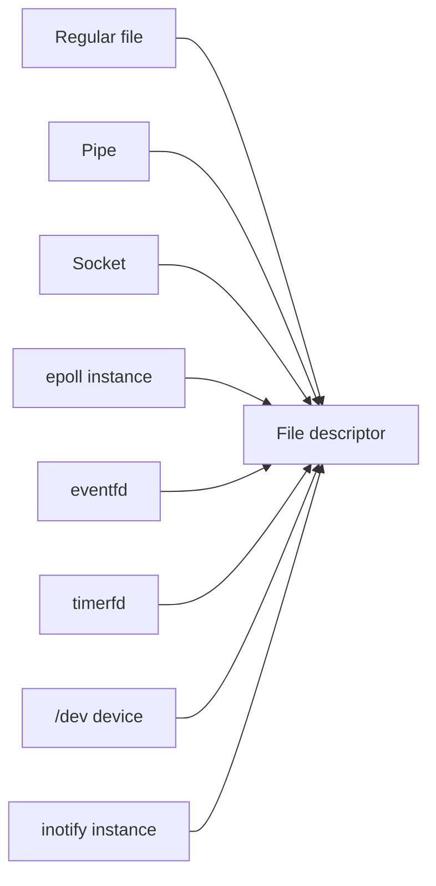
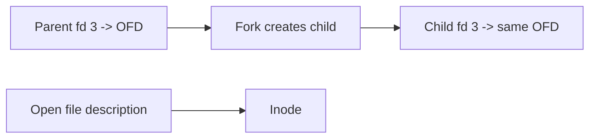

Every time a program reads a file, opens a socket, writes to a pipe, or watches an event, it does so through a small integer called a file descriptor. This chapter opens Stage 7, whose subject is filesystems, devices, and storage input and output. It is the first article of Stage 7, and it is meant to serve as a reference for the descriptor model rather than a brief introduction.

A file descriptor looks trivial: an int returned by `open`, passed to `read` and `write`, and closed when done. Underneath, it is the handle that ties a process to the kernel's view of everything outside its own memory. Getting descriptors right is the difference between correct, secure I/O and a service that leaks handles until it can no longer accept connections. The model has three layers, and most confusion comes from mixing them up. This article works through the layers, the full set of operations, the limits, the security implications, and the observation tools, so that the descriptor is a concept you can reason about precisely.

## What a file descriptor is

A file descriptor is a small non-negative integer that a process uses to refer to an open object. When a program calls `open` on a path, the kernel resolves the name, creates or finds the underlying object, records the process's right to use it, and returns a number. Subsequent `read`, `write`, `stat`, and `close` calls take that number instead of the path, because the kernel already did the resolution and recorded the state.

The integer is local to the process. Descriptor 3 in one process has nothing to do with descriptor 3 in another, even if both refer to the same file. The kernel maps each process's numbers to its own internal objects, which is why the same file opened by two processes gets different descriptor numbers.


The diagram shows the essential shape: a process refers to a descriptor, the descriptor refers to an open file description, and that description refers to the underlying object such as an inode. The middle layer is the part people forget, and it is where the offset and flags live.

## The three layers of an open file

The first layer is the per-process descriptor table, historically called `files_struct` in Linux. It is an array, indexed by the small integer, where each slot either is empty or points at an open file description. The descriptor number is the index. Closing a descriptor clears that slot.

The second layer is the open file description, sometimes called the open file object and represented by `struct file` in Linux. This is the kernel structure that holds the state of one open instance of a file: the current read and write offset, the status flags such as read-only or append, the access mode, and a pointer to the operations vector that knows how to read, write, and seek this particular kind of object. Crucially, this description is what `dup` and `fork` share, so two descriptors can point at the same description and therefore share the same offset.

The third layer is the underlying object, usually an inode for a regular file, but it can be a socket, a pipe, a device node, or an event source. The descriptor and the description are about the process's access; the inode or equivalent is about the data on disk or the device behind it.

The distinction matters because the same file can be opened several times. Each `open` call creates a new open file description with its own offset, even for the same path. Two descriptors from two `open` calls do not share an offset. Two descriptors from one `open` plus a `dup` do share an offset, because they refer to one description.

## Descriptors are small, reused integers

The kernel hands out the lowest unused descriptor number. After closing descriptor 3, the next `open` is likely to receive 3 again. Programs should not rely on a specific number, and they should not assume a number is still valid after a close, because another `open` may have reused it.

This reuse is why storing a descriptor in a global variable and closing it once, but leaving other code that still thinks it is open, is dangerous. The number may later refer to a completely different file, and a write intended for the old object lands on the new one. Descriptor numbers are capabilities, not names, and treating them as stable identifiers across closes is a common source of bugs.

## Open file descriptions and what they hold

An open file description is where the kernel keeps the state that belongs to one act of opening. The read and write offset is the most important field: it advances as you read or write, and it is shared by every descriptor that points at the same description. The status flags include the access mode and options such as `O_APPEND`, which forces every write to the current end of file regardless of the offset.


The diagram shows `dup` producing a second descriptor that lands on the same open file description. Reading through fd 4 moves the offset seen by fd 3, because there is only one offset. This is exactly what makes `dup` useful for redirecting standard input or output: the shell duplicates a pipe's descriptor onto fd 0, and the child's reads and the parent's writes meet at one shared offset.

The description also carries the file operations pointer. When you call `read` on a descriptor, the kernel does not know or care what kind of object it is; it calls the `read` operation registered for that description. That is why a socket, a pipe, and a regular file all accept `read` and `write` yet behave completely differently: the shared interface is the descriptor, and the behavior lives in the operations behind the description.

## Everything that is a file descriptor

The unifying insight of Unix is that almost everything is reached through a descriptor. A regular file is the obvious case, but the same integer names many other objects, and the operations behind each differ:

- Regular files and directories (`O_DIRECTORY` restricts an open to directories).
- Pipes, created by `pipe` or `pipe2`, used for one-way intra-process or inter-process streams.
- Sockets, created by `socket` and used for network and local communication; they accept `read`, `write`, and socket-specific calls.
- Devices, opened through nodes in `/dev`, where reads and writes talk to hardware or a kernel subsystem.
- `epoll` instances, created by `epoll_create`, which are themselves descriptors you can poll for events on other descriptors.
- `eventfd`, `signalfd`, and `timerfd`, which turn an event, a signal, or a timer into something you can `read` and `poll` like any other descriptor.
- `inotify` and `fanotify` instances, which report filesystem events through a descriptor.
- `/dev/null`, `/dev/zero`, and similar, which are ordinary devices reached by descriptors.
- Standard streams: fd 0 is standard input, 1 is standard output, 2 is standard error, established at process start.



The diagram captures the idea: many different kernel objects share the same handle type. A backend engineer benefits from thinking of every external resource as something with a descriptor, because the same primitives, `select`, `poll`, `epoll`, `close`, and close-on-exec, apply uniformly. A server that waits on a socket, a timer, a signal, and a filesystem event can do so through one `epoll` set over several descriptors.

## File descriptors versus stdio FILE streams

The C standard library and many language runtimes add a second layer above descriptors: the buffered stream, called `FILE` in C. A `FILE` wraps a descriptor and adds a user-space buffer plus formatting state. When you `fprintf` to a `FILE`, the data may sit in that buffer until it is full, until you `fflush`, or until the stream is closed. The descriptor underneath only sees the bytes once they are flushed.

This matters for correctness. Writing to a `FILE` and then calling `write` on its underlying descriptor produces interleaved, confusing output unless you flush first, because the buffered bytes and the raw writes are independent. It also matters across `fork`: the buffered data lives in the process's memory and is duplicated by the fork, so both processes may later flush the same buffered bytes, duplicating output. The rule is to flush every `FILE` before forking or execing, or to use descriptors directly when mixing with raw I/O.

## Opening: open, openat, and the flags

The `open` syscall takes a path, a flags word, and optionally a mode. The flags decide the access mode and a set of options. The access mode is one of `O_RDONLY`, `O_WRONLY`, or `O_RDWR`, and it is not a bit you OR in freely; the three are encoded in the low bits, so you choose one. The remaining bits are options:

| Flag | Meaning |
|---|---|
| `O_CREAT` | Create the file if it does not exist, using the mode argument |
| `O_EXCL` | Fail if the file already exists, used with `O_CREAT` for safe creation |
| `O_TRUNC` | Truncate the file to zero length on open |
| `O_APPEND` | Every write goes to the current end of file |
| `O_NONBLOCK` | Make reads and writes return `EAGAIN` instead of blocking when they would wait |
| `O_CLOEXEC` | Set close-on-exec atomically at open time |
| `O_DIRECTORY` | Fail unless the path is a directory |
| `O_NOFOLLOW` | Do not follow a final symbolic link |
| `O_TMPFILE` | Create an unnamed temporary file in the directory |

`openat` is the modern variant that takes a directory descriptor and a relative path, so a path is resolved relative to that directory rather than the process's current working directory. This matters for security and correctness: resolving relative to a known directory descriptor avoids races and surprises from a changing working directory, and it is the basis of the `*at` family of syscalls such as `mkdirat` and `fstatat`. `openat2` extends this with a struct of resolve flags, including `RESOLVE_NO_SYMLINK` and `RESOLVE_IN_ROOT`, which give finer control over path traversal, useful for sandboxes and containers.

`O_PATH` is a special open mode that yields a descriptor that cannot be read or written but can be used as a directory argument to `openat` or passed to `*at` calls. It is a lightweight handle to a location in the filesystem tree, useful when you want to pin a directory or file for later operations without keeping it open for I/O.

## Duplication: dup, dup2, dup3, and close_range

Duplication copies a descriptor entry to a new number, pointing at the same open file description. `dup` picks the lowest free number. `dup2` and `dup3` let the caller choose the target; if the target is already open, `dup2` closes it first, atomically from the caller's view, which is why shells use it to redirect std streams. `dup3` adds the `O_CLOEXEC` flag, so you can duplicate and mark close-on-exec in one call.

The `fcntl` commands `F_DUPFD` and `F_DUPFD_CLOEXEC` duplicate a descriptor to the lowest number at or above a given minimum, which is useful when you need a descriptor at or above a certain value (for example, above the standard streams). `close_range` closes a whole range of descriptors at once, which a tightly written program can use instead of looping, and it pairs well with close-on-exec discipline when execing.



The diagram shows inheritance: the child's fd 3 points at the same open file description as the parent's. Because the description is shared, a read in the child advances the offset for the parent too, which is usually undesirable unless the two are cooperating on a shared stream. This shared-offset behavior is a frequent surprise in pipelines and worker processes.

## Inheritance across fork and exec

When a process forks, the child receives a copy of the parent's descriptor table. Each entry points at the same open file descriptions as the parent, so the child shares offsets and flags with the parent for every inherited descriptor. This is how a child can read or write the same files the parent had open, and why redirection set up before a fork is visible to the child.

The bigger surprise is `exec`. By default, descriptors stay open across an `exec` that replaces the process image with a new program. The new program inherits every descriptor the old one had, whether it knows about them or not. That includes listening sockets, secret files, and pipes the new program never opened. This is sometimes intended, as in a supervisor that sets up sockets and execs a worker, but it is often a leak and a security hole.

A subtlety worth flagging: forking a multithreaded process is dangerous because only the calling thread continues in the child, yet the process memory still contains locks held by other threads. If the child then calls a function that tries to acquire one of those locks, it can deadlock. For that reason, the safe pattern after a fork in a multithreaded program is to call only async-signal-safe functions and then immediately `exec`, or to use `posix_spawn`, which performs the fork and exec in a safer, more controlled way.

## Close-on-exec and the race it closes

The danger of inheritance is solved by close-on-exec. A descriptor marked with the `FD_CLOEXEC` flag is automatically closed when the process calls `exec`, so it does not leak into the new program. The flag can be set with `fcntl` after opening, or, better, at open time with `O_CLOEXEC`. Setting it at open time matters because there is a race: if another thread forks or execs between your `open` and your `fcntl`, the descriptor can leak into the child in that window. `O_CLOEXEC` closes the race because the flag is set before the descriptor is visible to any other thread.

For a backend engineer, close-on-exec is the default you almost always want. A long-running service that opens files, sockets, or pipes and later spawns subprocesses should mark every descriptor close-on-exec unless it explicitly intends to pass it to the child. A listening socket that leaks into a child keeps the port bound and the parent's socket half-open in a process that does not understand it, which is both a resource leak and a confusing failure. Descriptor passing to a child that genuinely needs it is done deliberately with `O_CLOEXEC` cleared on the specific descriptor, or by passing the descriptor over a Unix socket as described later.

## File sealing

When a descriptor to a shared memory region or a file is handed to another process, that process could truncate or modify the backing object in ways that break the original owner. File sealing, set with `fcntl` `F_ADD_SEALS`, restricts future operations on the inode: `F_SEAL_SEAL` prevents further sealing changes, `F_SEAL_SHRINK` prevents truncation, `F_SEAL_GROW` prevents growth, and `F_SEAL_WRITE` prevents writes. This is how inter-process shared memory is made safe when the two parties do not fully trust each other, a common pattern in sandboxed renderers and in `memfd_create` based IPC.

## Passing descriptors between processes

A descriptor is meaningful only inside the process that holds it, because the number indexes that process's table. To give another process access to the same open file description, you pass the descriptor over a Unix domain socket using the `SCM_RIGHTS` ancillary message. The receiving process gets a new descriptor number that points at the same open file description in the kernel. This is how a supervisor hands a connected socket to a worker, or how a connection acceptor distributes accepted connections without the acceptor becoming a bottleneck. It is a privileged and precise form of sharing: the two descriptors share the same offset and flags, just like a `dup`, but across processes.

## Descriptor leaks and exhaustion

A descriptor leak is an open descriptor that is no longer needed but was never closed. The typical cause is an error path that returns before reaching the close, or a cache that holds files open forever. Each leak removes one slot from the process's table, and because the kernel reuses numbers, the count climbs until the table is full.

When the per-process table is full, the next `open`, `socket`, `accept`, or `pipe` fails with `EMFILE`, "too many open files." A service that accepts connections will suddenly fail to accept new ones, even though the machine has free memory and CPU. The existing connections keep working, so the failure looks partial and puzzling. The fix is to find what is not being closed and close it, and the observation tools below show exactly that.

A related but distinct exhaustion is the system-wide limit. If the whole machine runs out of open file descriptions, the error is `ENFILE`, and every process on the box is affected. Raising one process's limit does not help; the global file-max must be raised, or the leak across processes must be stopped. A third condition, `ENOSPC` on the `open` of a file, is different again: it means the filesystem itself is full, not that handles are exhausted, and a service that conflates the two wastes time.

## Resource limits and the global ceilings

The relevant per-process limit is `RLIMIT_NOFILE`, the maximum number of descriptors a process may have open. It has a soft limit, which the process can raise up to the hard limit, and a hard limit, which only privileged code can raise. The shell's `ulimit -n` shows the soft limit, and it is the number most engineers tune when a service complains about too many open files.

Two numbers are easy to confuse. The per-process `RLIMIT_NOFILE` bounds how many descriptors one process may hold. The kernel's `file-max` (seen in `/proc/sys/fs/file-max`) bounds how many open file descriptions the entire system may hold. A third knob, `nr_open`, bounds the per-process maximum at the kernel level and can cap `RLIMIT_NOFILE` even when you raise it. A service that needs tens of thousands of connections must have `RLIMIT_NOFILE` raised and, if the box hosts many such services, `file-max` as well. The live count of system-wide allocations against the maximum is in `/proc/sys/fs/file-nr`, whose first field is the number currently in use.

The default limits are often far smaller than a busy server needs. A proxy that holds a connection per client and per upstream can need hundreds of thousands of descriptors, and the inherited default of a few thousand will cap it well before the CPU or network is saturated. Raising the limit is a standard part of deploying network services, not an exotic tuning, and it must be paired with raising `file-max` and `nr_open` on the host when one process genuinely needs more than the global ceiling allows.

## Observing descriptors in a running system

The descriptors a process holds are visible in `/proc/<pid>/fd`, where each entry is a symlink named by descriptor number pointing at the object it references. Listing that directory shows exactly what is open, which is the fastest way to confirm a leak: if you see thousands of entries pointing at the same file or at sockets that should have been closed, you have found the leak.

A richer view is `/proc/<pid>/fdinfo/<fd>`, which reports the descriptor's state: `pos` is the current offset, `flags` shows `O_RDONLY`/`O_WRONLY`/`O_RDWR` and `O_CLOEXEC` as a bitmask, `mnt_id` identifies the mount, and `ino` is the inode number. For some objects it adds specifics such as the epoll or eventfd internals. This file is how you confirm not just what is open but how it is open, which settles arguments about whether a descriptor was created close-on-exec.

```go
package main

import (
    "fmt"
    "os"
    "syscall"
)

func main() {
    f, err := os.Open("/etc/hosts")
    if err != nil {
        panic(err)
    }
    defer f.Close()
    fmt.Println("opened /etc/hosts as fd", f.Fd())

    newfd, err := syscall.Dup(int(f.Fd()))
    if err != nil {
        panic(err)
    }
    fmt.Println("dup returned fd", newfd, "sharing the same open file description")

    entries, _ := os.ReadDir("/proc/self/fd")
    fmt.Println("this process currently holds", len(entries), "descriptors")
    _ = syscall.Close(newfd)
    select {}
}
```

```bash
go build -o fddemo main.go
./fddemo &
pid=$!
sleep 0.3
ls -l /proc/$pid/fd
echo "--- detailed state of fd 3 ---"
cat /proc/$pid/fdinfo/3
echo "soft descriptor limit:"; ulimit -n
echo "system-wide file handles (used max free):"; cat /proc/sys/fs/file-nr
echo "leak probe: open without close"
while :; do exec 3</etc/hosts 2>/dev/null || { echo "EMFILE reached"; break; }; done
kill $pid
```

What it shows is the descriptor table made visible. The program opens one file and duplicates it, and `/proc/self/fd` lists both. The `fdinfo` file reports the offset and flags of a specific descriptor. The `file-nr` file reports how many open file descriptions the system uses against its maximum, which is the global saturation signal. The shell loop demonstrates `EMFILE` directly by opening without closing until the per-process table is exhausted.

## A realistic production example

A team ran a service that, on each request, opened a small metadata file to read a value, used it, and returned. The happy path closed the file, but one error branch that triggered on a malformed value returned before the close. Under normal traffic the error was rare, so the leak was slow. Under a period of bad input from a misconfigured client, the error path ran thousands of times per second.

Within minutes the service hit its descriptor limit. New inbound connections failed with "too many open files," while existing connections kept working, so the on-call engineer saw a partially failing service with no obvious CPU or memory pressure. `ls /proc/<pid>/fd` showed tens of thousands of entries all pointing at the same metadata file, which pointed straight at the leak. The `fdinfo` listing confirmed they were ordinary read-only descriptors that had simply never been closed.

The fix was to close the file on every exit path, which in their language meant a scoped close that ran whether the function returned normally or errored. They also tightened the deployment: every descriptor the service opened was created with close-on-exec semantics, because the service spawned short-lived helper subprocesses, and any descriptor not marked that way leaked into the helper and kept files and sockets open in a process that did not understand them. After the change, the descriptor count stayed flat under the same bad input, and the partial outage did not recur. The lesson was that descriptors are a finite, per-process resource, and every open needs a matched close on every path, including the ones that are rarely taken.

## How engineers actually reason about descriptors

They treat an open as a commitment with a required release. For every `open`, `socket`, `accept`, `pipe`, or `dup`, they ask where the matching close is, especially on error and cancellation paths where the happy path is not taken. A descriptor with no clear owner is a leak waiting to happen.

They set close-on-exec by default. Any descriptor that is not explicitly meant to survive an `exec` is marked `O_CLOEXEC` at open time, which both prevents leaks into subprocesses and closes the race that a later `fcntl` would leave open. The exceptions are deliberate and documented, and descriptor passing is done over a Unix socket when a child truly needs the handle.

They watch the count. A slowly rising descriptor count in `/proc/<pid>/fd` or a `too many open files` error is an early, specific signal, easier to diagnose than most failures because the culprit is listed right there. They alert on the count, not just on the eventual error, and they read `fdinfo` to confirm how descriptors are opened.

They separate the two limits. When a service needs many connections, they raise `RLIMIT_NOFILE` for the process and check `file-max` and `nr_open` for the system, because the ceilings are independent and all must accommodate the workload. They distinguish `EMFILE`, `ENFILE`, and `ENOSPC` so they fix the right one.

## Descriptors in containers and process managers

When a service runs under systemd or a container runtime, the descriptor rules from this article still apply, but the boundary matters. The runtime starts the process with a small set of inherited descriptors, the standard streams and sometimes a notify socket, and every descriptor the service opens must still be closed on every path. A leaked descriptor that is not close-on-exec can escape into a child container or a helper the runtime spawns, which is why the default for spawned subprocesses is to mark everything O_CLOEXEC and pass only what is needed over a Unix socket.

Resource limits are also namespace and cgroup scoped. RLIMIT_NOFILE is per process and is often set by the runtime from a configured value. Inside a container it is the limit that governs the service, not the host's. The system-wide file-max is a host property and is shared by all containers, so one container's leak can starve others on the same host. Watching the descriptor count with /proc/<pid>/fd and alerting on growth is the practical control, and modern runtimes expose this through process exporters and cgroup metrics.

For capacity planning, estimate the steady-state descriptor count as the sum of open log files, active connections, pipes to subprocesses, and epoll or eventfd instances, then add headroom for spikes. A proxy that holds a connection per client and per upstream, plus a few per backend health check, can need a limit in the hundreds of thousands, and the deployment must raise both RLIMIT_NOFILE and the host file-max accordingly. The failure mode is always the same: a slowly rising count that ends in EMFILE and rejected connections.

## Definitions

### A file descriptor

> A small non-negative integer a process uses to refer to an open object. It is an index into the process's descriptor table and is meaningful only within that process.

### An open file description

> The kernel object created by one act of opening, holding the read and write offset, status flags, mode, and a pointer to the operations that implement reads and writes for this kind of object. Multiple descriptors can point at the same description and therefore share its offset.

### The descriptor table

> The per-process array indexed by descriptor number, where each slot points at an open file description. Closing a descriptor clears its slot, and the number may later be reused.

### Close-on-exec

> A flag, `FD_CLOEXEC` or `O_CLOEXEC`, that causes a descriptor to be closed automatically when the process execs a new program, preventing it from leaking into a child that did not open it.

### Descriptor passing

> The transfer of access to the same open file description to another process, performed over a Unix domain socket with an `SCM_RIGHTS` message, after which the receiver holds a new descriptor number for the same kernel object.

### A descriptor leak

> An open descriptor that is no longer needed but was never closed, consuming a slot in the process table until the process hits `EMFILE` and can no longer open new objects.

## Beyond the definitions

### Why do two opens of the same file not share an offset

> Because each `open` creates a new open file description with its own offset and flags. Sharing happens only through `dup`, `fork`, or descriptor passing, which point a second descriptor at an existing description. Two independent opens are independent instances, even of the same path.

### What is the difference between EMFILE, ENFILE, and ENOSPC

> `EMFILE` means this process hit its own `RLIMIT_NOFILE` descriptor count. `ENFILE` means the entire system ran out of open file descriptions. `ENOSPC` means the filesystem itself is full. They look similar from a failing call but require different fixes.

### Why set O_CLOEXEC at open rather than with fcntl later

> Because between `open` and `fcntl` another thread could fork or exec and inherit the descriptor, leaking it. Setting the flag at open time means the descriptor is close-on-exec before any other thread can see it, which removes the race.

### How does dup share state but open not

> `dup` copies a descriptor entry to point at the very same open file description, so the offset and flags are shared. `open` allocates a brand new description, so even for the same file the state is separate. The difference is whether a new description was created.

### What happens to a descriptor across fork

> The child gets a copy of the parent's descriptor table, with each entry pointing at the same open file descriptions. The child shares offsets and flags with the parent for those descriptors, which is why a read in one process moves the offset seen by the other. Forking a multithreaded program is risky because only one thread survives in the child while locks held by others remain, so the safe path is to exec immediately or use `posix_spawn`.

### Why would you pass a descriptor instead of a filename

> Because the descriptor carries the exact open file description: its offset, flags, and the specific object, including things like a connected socket or a sealed shared memory region that have no stable name. Passing the file description rather than a path gives the receiver the same open instance, not a fresh open that would start at a different offset.

## Common misconceptions

**"A file descriptor is just the file."** It is a process-local index pointing at an open file description, which in turn points at the file. Two descriptors can point at the same description and share an offset, or at different descriptions for the same file with independent offsets. Confusing the layers causes the shared-offset surprises.

**"Closing a descriptor frees the file."** Closing clears the process's slot and, when the last reference to the open file description and inode is gone, the kernel may release resources. But other descriptors or processes holding the same file keep it open, so one close does not necessarily close the file for everyone.

**"Too many open files means the disk is full."** It means the descriptor or open-file-description limit was hit, which is about handle count, not storage. The machine can have plenty of free disk space and still refuse new connections because the process ran out of descriptors.

**"Descriptors do not survive exec, so they are safe."** By default they do survive exec, which is exactly why subprocesses can inherit listening sockets and secret files. Close-on-exec is opt-in, and forgetting it is a common leak and a security weakness.

**"The descriptor number identifies the file."** The number is just a slot index, reused after close. After closing fd 3, that number can refer to a completely different object, so code must not treat a saved descriptor number as a stable name across closes.

**"A FILE stream and a descriptor are interchangeable."** A `FILE` adds a user-space buffer on top of a descriptor. Mixing buffered `FILE` writes with raw descriptor writes without flushing interleaves bytes incorrectly, and forking duplicates the unflushed buffer so both processes may emit it.

## Summary

A file descriptor is the handle a process uses to reach anything outside its memory, but it is only the top of a three-layer model: the per-process descriptor table points at an open file description, which points at the underlying object such as an inode. The middle layer is where offset and flags live, and it is shared by `dup`, inherited by `fork`, and transferable by descriptor passing over a Unix socket. The unifying view is that almost everything, files, pipes, sockets, devices, epoll, eventfd, timers, and inotify, is reached through a descriptor, so the same primitives apply uniformly. Close-on-exec keeps descriptors from leaking into subprocesses, `O_PATH` and the `*at` calls make opening precise and race-free, and the `RLIMIT_NOFILE`, `file-max`, and `nr_open` limits bound how many can exist. The failure mode is a leak that ends in `EMFILE` and rejected connections, and it is diagnosed directly by listing `/proc/<pid>/fd` and reading `/proc/<pid>/fdinfo`. The next article in this subject turns from the descriptor itself to the filesystem names those descriptors resolve to, through inodes, the virtual filesystem, and path resolution.
