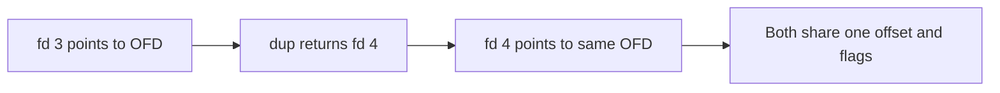
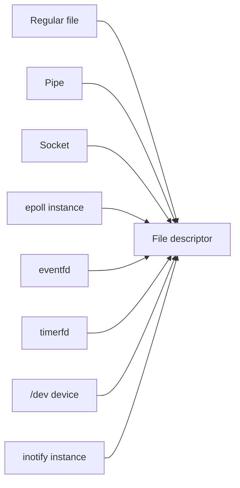
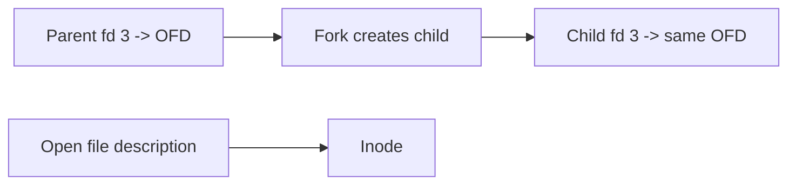

Every program uses one small integer to read a file, open a socket, write to a pipe, or watch an event. That integer is a file descriptor. A file descriptor is the number your program uses to talk to the kernel about an outside resource. The kernel is the core part of the operating system that manages files, devices, and I/O. This article starts Stage 7. Stage 7 covers filesystems, devices, and storage input and output. Stage 7 has several parts. This first part is a full reference for the descriptor model. It is not a short intro.

A file descriptor looks simple. A program gets it from `open`. It passes it to `read` and `write`. It closes the descriptor when done. Under the hood, the descriptor links the program to the kernel's view of the outside world. If you handle descriptors well, your I/O stays correct and safe. If you handle them poorly, your service can leak handles until it cannot accept new connections. The model has three layers. Most confusion comes from mixing up the layers. This article walks through the layers, the operations, the limits, the security risks, and the tools you can use to watch descriptors. After you read it, you can reason about descriptors with care.

## What a file descriptor is

A file descriptor is a small integer that is zero or greater. A process is one running program. The process uses the integer to point at an open object. Suppose your program calls `open` on a path like `/var/log/app.log`. The kernel finds the object behind that name. The kernel records that this process may use it. Then the kernel returns a number. Later calls like `read`, `write`, `stat`, and `close` use that number instead of the path. The kernel already found the object, so it does not need the path again.

The integer belongs to one process only. Descriptor 3 in one process has no link to descriptor 3 in another process. This holds even when both descriptors point at the same file. The kernel maps each process's numbers to its own internal objects. That is why the same file opened by two processes gets two different descriptor numbers.


The diagram shows the basic shape. A process points at a descriptor. The descriptor points at an open file description. An open file description is the kernel's record for one act of opening. That description points at the underlying object, such as an inode. An inode is the kernel structure that describes a file's data on disk. Many readers forget the middle layer. That layer holds the offset and the flags. The offset is the current read and write position. The flags are options like read only or append.

## The three layers of an open file

The first layer is the per-process descriptor table. In Linux the kernel calls it `files_struct`. It is an array. The small integer is the index into that array. Each slot is either empty or points at an open file description. When you close a descriptor, the kernel empties that slot.

The second layer is the open file description. In Linux the kernel calls it `struct file`. This kernel structure holds the state of one open instance. It stores the current read and write offset. It stores the status flags, such as read only or append. It stores the access mode. It stores a pointer to the operations that know how to read, write, and seek this kind of object. `dup` and `fork` share this description. `dup` creates a second descriptor for the same open file. `fork` creates a child process that inherits descriptors. In both cases two descriptors can point at the same description and share the same offset.

The third layer is the underlying object. For a regular file this is usually an inode. For other cases it can be a socket, a pipe, a device node, or an event source. The descriptor and the description describe how the process uses the object. The inode or its equivalent describes the data on disk or the device behind it.

This split matters. Suppose your service opens the same file twice. Each `open` call makes a new open file description. Each description has its own offset, even for the same path. So two descriptors from two `open` calls do not share an offset. Now suppose your service calls `open` once and then calls `dup`. `dup` points a second descriptor at the same description. Then the two descriptors do share one offset, because they point at one description.

## Descriptors are small, reused integers

The kernel gives out the lowest unused descriptor number. Suppose you close descriptor 3. The next `open` will likely return 3 again. So programs should not expect a fixed number. They should not assume a number stays valid after a close. Another `open` can reuse that number at any time.

This reuse can cause hard bugs. Suppose your service stores a descriptor in a global variable. One part of the code closes it. Another part still thinks the descriptor is open and keeps the old number. Later the kernel reuses that number for a different file. A write meant for the old object then lands on the new one. Descriptor numbers act as capabilities. A capability is a temporary permission to use an object. They are not stable names. If you treat them as stable names across closes, you will see confused writes and data loss.

## Open file descriptions and what they hold

An open file description is where the kernel keeps the state for one act of opening. The read and write offset is the most important field. The offset is the position for the next read or write. It moves forward as you read or write. Every descriptor that points at the same description shares this one offset. The status flags include the access mode and options such as `O_APPEND`. `O_APPEND` is an option that forces every write to the current end of the file. It ignores the offset.



The diagram shows `dup` making a second descriptor that lands on the same open file description. Suppose you read through fd 4. That read moves the offset that fd 3 sees. There is only one offset for both. This is why `dup` helps redirect standard input or output. Suppose your shell wants to send a pipe into a program. The shell duplicates the pipe's descriptor onto fd 0. Then the child's reads and the parent's writes meet at one shared offset.

The description also carries the file operations pointer. This pointer tells the kernel how to handle `read` or `write` for this kind of object. When you call `read` on a descriptor, the kernel does not check the object type up front. It calls the `read` operation stored in that description. That is why a socket, a pipe, and a regular file all accept `read` and `write` but behave very differently. The descriptor gives a shared interface. The real behavior lives in the operations behind the description.

## Everything that is a file descriptor

The key idea in Unix is that almost every outside resource uses a descriptor. A regular file is the clear case. The same kind of integer also names many other objects. The operations behind each object differ:

- Regular files and directories. `O_DIRECTORY` limits an open to directories only.
- Pipes, made by `pipe` or `pipe2`. A pipe carries a one way stream inside one process or between processes.
- Sockets, made by `socket`. A socket carries network and local communication. It accepts `read`, `write`, and socket specific calls.
- Devices, opened through nodes in `/dev`. Reads and writes there talk to hardware or a kernel part.
- `epoll` instances, made by `epoll_create`. An `epoll` instance is itself a descriptor. You can use it to watch events on other descriptors.
- `eventfd`, `signalfd`, and `timerfd`. They turn an event, a signal, or a timer into something you can `read` and `poll` like any other descriptor.
- `inotify` and `fanotify` instances. They report filesystem events through a descriptor.
- `/dev/null`, `/dev/zero`, and similar. They are ordinary devices you reach with descriptors.
- Standard streams. Fd 0 is standard input. Fd 1 is standard output. Fd 2 is standard error. The system sets these at process start.



The diagram shows the idea. Many different kernel objects share the same handle type. Think of every outside resource as something with a descriptor. The same basic calls work for all of them. These calls include `select`, `poll`, `epoll`, `close`, and close-on-exec. Suppose your server watches a socket, a timer, a signal, and a filesystem event. It can wait on all of them through one `epoll` set that holds several descriptors.

## File descriptors versus stdio FILE streams

The C standard library and many language runtimes add a layer above descriptors. That layer is the buffered stream. C calls it `FILE`. A `FILE` wraps a descriptor. It adds a buffer in user space and formatting state. A buffer is a small memory area that holds data before it goes to the kernel. When you call `fprintf` on a `FILE`, the data may sit in that buffer. It stays there until the buffer fills, until you call `fflush`, or until you close the stream. `fflush` pushes buffered bytes to the kernel. The descriptor underneath only sees bytes after a flush.

This matters for correctness. Suppose you write to a `FILE` and then call `write` on its descriptor without flushing. The buffered bytes and the raw writes are separate. The output can mix in the wrong order. It also matters across `fork`. `fork` makes a child process by copying the parent. The buffered data lives in process memory, so the fork copies it. Both processes can later flush the same bytes. Then the output appears twice. The rule is simple. Flush every `FILE` before you call `fork` or `exec`. Or use descriptors directly when you mix raw I/O with buffered I/O.

## Opening: open, openat, and the flags

The `open` syscall asks the kernel to open a file. A syscall is a request from your program to the kernel. `open` takes a path, a flags word, and sometimes a mode. The flags choose the access mode and extra options. The access mode is one of `O_RDONLY`, `O_WRONLY`, or `O_RDWR`. `O_RDONLY` means read only. `O_WRONLY` means write only. `O_RDWR` means read and write. You pick one. You do not combine them with a bitwise OR. The three values share the low bits, so you must pick one. The rest of the bits are options:

| Flag | Meaning |
|---|---|
| `O_CREAT` | Create the file if it does not exist, using the mode argument |
| `O_EXCL` | Fail if the file already exists, used with `O_CREAT` for safe creation |
| `O_TRUNC` | Truncate the file to zero length on open |
| `O_APPEND` | Every write goes to the current end of file |
| `O_NONBLOCK` | Make reads and writes return `EAGAIN` instead of blocking when they would wait |
| `O_CLOEXEC` | Set close-on-exec atomically at open time |
| `O_DIRECTORY` | Fail unless the path is a directory |
| `O_NOFOLLOW` | Do not follow a final symbolic link |
| `O_TMPFILE` | Create an unnamed temporary file in the directory |

`openat` is the modern form of `open`. It takes a directory descriptor and a relative path. The kernel resolves the path relative to that directory. It does not use the process's current working directory. This helps security and correctness. A race is a bug where two actions overlap in time and give the wrong result. If you resolve against a known directory descriptor, you avoid races and surprises from a working directory that changes. `openat` is the base for the `*at` family, such as `mkdirat` and `fstatat`. `openat2` adds a struct of resolve flags. Two flags are `RESOLVE_NO_SYMLINK` and `RESOLVE_IN_ROOT`. They give finer control over how the kernel walks a path. Sandboxes and containers use them.

`O_PATH` is a special open mode. It gives a descriptor that you cannot read or write. You can use it as the directory argument to `openat`. You can also pass it to other `*at` calls. It is a light handle to a place in the filesystem tree. Use it when you want to pin a directory or file for later steps without keeping it open for I/O.

## Duplication: dup, dup2, dup3, and close_range

Duplication copies a descriptor entry to a new number. The new entry points at the same open file description. `dup` picks the lowest free number. `dup2` and `dup3` let you choose the target number. If the target is already open, `dup2` closes it first. From your view this close and copy looks atomic. An atomic step is one that completes as a single unbroken action. Shells use `dup2` for this reason. They redirect standard streams with one atomic call. `dup3` adds the `O_CLOEXEC` flag. So you can duplicate and mark close-on-exec in one call.

The `fcntl` commands `F_DUPFD` and `F_DUPFD_CLOEXEC` copy a descriptor to the lowest number at or above a minimum you give. This helps when you need a descriptor above a certain value. For example, you may want a number above the standard streams 0, 1, and 2. `close_range` closes a whole range of descriptors at once. A careful program can call it instead of looping over `close`. It pairs well with close-on-exec rules when you call `exec`.



The diagram shows inheritance. The child's fd 3 points at the same open file description as the parent's fd 3. The two share one description. So a read in the child moves the offset that the parent sees. This is often not what you want. It only helps when the two work together on one shared stream. This shared offset behavior often surprises teams that build pipelines and worker processes.

## Inheritance across fork and exec

When a process forks, the child gets a copy of the parent's descriptor table. `fork` creates a child process from a parent. Each entry in the child's table points at the same open file descriptions as the parent's. The child shares the offset and flags with the parent for every inherited descriptor. That is how a child can read or write the same files the parent had open. It is also why a redirect that you set up before a fork shows up in the child.

The bigger surprise is `exec`. `exec` replaces the current program with a new program. By default, descriptors stay open across `exec`. The new program inherits every descriptor the old one held, even if the new program knows nothing about them. That set can include listening sockets, secret files, and pipes the new program never opened. Sometimes you want this. Suppose a supervisor process sets up sockets and then calls `exec` to run a worker. The worker then uses those sockets. But often this sharing is a leak and a security hole.

One more point needs a warning. Forking a multithreaded process is risky. A multithreaded process has many threads of execution. Only the thread that called `fork` keeps running in the child. The child's memory still holds locks that other threads took before the fork. A lock is a marker that stops two threads from using the same data at once. If the child calls a function that tries to take one of those locks, it can deadlock. A deadlock is a state where two sides wait for each other and never move forward. For safety after a fork in a multithreaded program, call only async-signal-safe functions and then call `exec` right away. Async-signal-safe functions are the small set of functions the system guarantees are safe to call after a fork. Or use `posix_spawn`. It does the fork and exec in one safer, controlled step.

## Close-on-exec and the race it closes

Close-on-exec solves the leak that comes with inheritance. You mark a descriptor with the `FD_CLOEXEC` flag. Then the kernel closes it automatically when the process calls `exec`. So it does not leak into the new program. You can set the flag with `fcntl` after you open the file. It is better to set it at open time with `O_CLOEXEC`. Setting it at open time matters because it avoids a race. Suppose one thread calls `open` and then calls `fcntl` to set the flag. Another thread could call `fork` or `exec` in the gap between the two calls. Then the descriptor can leak into that child during the gap. `O_CLOEXEC` closes that gap. The kernel sets the flag before any other thread can see the new descriptor.

For a backend engineer, close-on-exec is the default you should use. Suppose your long running service opens files, sockets, or pipes and later starts subprocesses. Your service should mark every descriptor close-on-exec. Only skip the flag when you plan to pass the descriptor to the child. Suppose a listening socket leaks into a child. That child keeps the port bound. The parent's socket stays half open in a process that does not know how to use it. That is both a resource leak and a confusing failure. When a child truly needs a descriptor, pass it on purpose. Clear `O_CLOEXEC` on that one descriptor. Or pass the descriptor over a Unix socket, as shown later.

## File sealing

Suppose you hand a descriptor for a shared memory region or a file to another process. That process could then truncate or change the backing object. Truncate means cut the file to a shorter size. That change could break the original owner. File sealing fixes this. You set seals with `fcntl` and `F_ADD_SEALS`. A seal limits what later code can do to the inode. `F_SEAL_SEAL` blocks later changes to the seals themselves. `F_SEAL_SHRINK` blocks truncate that would shrink the file. `F_SEAL_GROW` blocks growth. `F_SEAL_WRITE` blocks writes. This keeps shared memory safe between two processes that do not fully trust each other. Sandboxed renderers and IPC built with `memfd_create` use this pattern. IPC means inter-process communication.

## Passing descriptors between processes

A descriptor only means something inside the process that holds it. The number indexes that process's own table. To give another process access to the same open file description, you can pass the descriptor over a Unix domain socket. A Unix domain socket is a local socket for talk between processes on one host. You pass the descriptor with the `SCM_RIGHTS` ancillary message. The receiver gets a new descriptor number. That new number points at the same open file description in the kernel. This is how a supervisor hands a live socket to a worker. Suppose one acceptor process takes new connections. It can spread those connections to workers without becoming a bottleneck. The two descriptors share the same offset and flags, just like a `dup`. The only difference is that the sharing now spans two processes.

## Descriptor leaks and exhaustion

A descriptor leak is an open descriptor that you no longer need but never closed. The most common cause is an error path that returns before the `close` runs. Another cause is a cache that holds files open forever. Each leak uses one slot in the process's table. The kernel keeps reusing numbers, so the count keeps rising until the table is full.

When the per-process table is full, the next `open`, `socket`, `accept`, or `pipe` fails with `EMFILE`. `EMFILE` means too many open files for this process. Suppose your service accepts new connections. It will suddenly fail to accept them. The machine can still have free memory and CPU. Old connections keep working, so the failure looks partial and hard to explain. To fix it, find the descriptors that were not closed and close them. The tools in the next sections show how.

A related limit is system wide. If the whole machine runs out of open file descriptions, the error is `ENFILE`. `ENFILE` means too many open files for the whole system. Every process on the host feels this error. Raising one process's limit does not help. You must raise the global `file-max` or stop the leak across processes. A third error is `ENOSPC` on `open`. That error is different again. It means the filesystem has no free space. It does not mean you ran out of handles. If your service mixes up these three errors, you will waste time fixing the wrong limit.

## Resource limits and the global ceilings

The per-process limit that matters is `RLIMIT_NOFILE`. It sets the max number of descriptors one process may hold open. It has two parts. The soft limit is the current cap. The process can raise the soft limit up to the hard limit. The hard limit is the ceiling. Only privileged code can raise the hard limit. The shell command `ulimit -n` shows the soft limit. That is the number most teams tune when a service reports too many open files.

Two limits are easy to mix up. The per-process `RLIMIT_NOFILE` caps how many descriptors one process may hold. The kernel's `file-max`, seen at `/proc/sys/fs/file-max`, caps how many open file descriptions the whole system may hold. A third knob is `nr_open`. It caps the per-process max at the kernel level. It can cap `RLIMIT_NOFILE` even after you raise `RLIMIT_NOFILE`. Suppose your service needs tens of thousands of connections. Then you must raise `RLIMIT_NOFILE` for that process. If the host runs many such services, you must also raise `file-max`. You can watch the live system wide use at `/proc/sys/fs/file-nr`. Its first field is the number now in use.

The default limits are often far below what a busy server needs. Suppose a proxy holds one connection per client and one per upstream. It can need hundreds of thousands of descriptors. The default of a few thousand will cap it long before the CPU or network fills up. Raising the limit is a normal step when you deploy network services. It is not rare tuning. When one process needs more than the global ceiling allows, you must also raise `file-max` and `nr_open` on the host.

## Observing descriptors in a running system

You can see the descriptors a process holds in `/proc/<pid>/fd`. `<pid>` is the process id. Each entry is a symlink named by descriptor number. A symlink is a pointer to another path. Each entry points at the object the descriptor refers to. Listing that directory shows what is open right now. This is the fastest way to confirm a leak. Suppose you see thousands of entries that point at the same file. Or you see sockets that should have closed. Then you have found the leak.

A richer view is `/proc/<pid>/fdinfo/<fd>`. It reports the state of one descriptor. `pos` is the current offset. `flags` shows `O_RDONLY`, `O_WRONLY`, `O_RDWR`, and `O_CLOEXEC` as a bitmask. A bitmask is a number where each bit is a yes or no flag. `mnt_id` names the mount. `ino` is the inode number. For some objects the file adds extra details, such as epoll or eventfd internals. This file shows not just what is open but how it is open. It settles debates about whether the program created a descriptor with close-on-exec.

```go
package main

import (
    "fmt"
    "os"
    "syscall"
)

func main() {
    f, err := os.Open("/etc/hosts")
    if err != nil {
        panic(err)
    }
    defer f.Close()
    fmt.Println("opened /etc/hosts as fd", f.Fd())

    newfd, err := syscall.Dup(int(f.Fd()))
    if err != nil {
        panic(err)
    }
    fmt.Println("dup returned fd", newfd, "sharing the same open file description")

    entries, _ := os.ReadDir("/proc/self/fd")
    fmt.Println("this process currently holds", len(entries), "descriptors")
    _ = syscall.Close(newfd)
    select {}
}
```

```bash
go build -o fddemo main.go
./fddemo &
pid=$!
sleep 0.3
ls -l /proc/$pid/fd
echo "--- detailed state of fd 3 ---"
cat /proc/$pid/fdinfo/3
echo "soft descriptor limit:"; ulimit -n
echo "system-wide file handles (used max free):"; cat /proc/sys/fs/file-nr
echo "leak probe: open without close"
while :; do exec 3</etc/hosts 2>/dev/null || { echo "EMFILE reached"; break; }; done
kill $pid
```

This example makes the descriptor table visible. The program opens one file and duplicates it. `/proc/self/fd` lists both descriptors. The `fdinfo` file reports the offset and flags of one descriptor. The `file-nr` file reports how many open file descriptions the system uses compared to its max. That is the global saturation signal. Saturation means the system is full. The shell loop shows `EMFILE` directly. It opens files without closing them until the per-process table fills up.

## A realistic production example

Suppose your team runs a service. On each request, the service opens a small metadata file. It reads one value. It uses the value and returns. The normal path closes the file. But one error branch reads a malformed value. That branch returns before the close. Under normal traffic the error is rare, so the leak is slow. Then a misconfigured client sends bad input. The error path now runs thousands of times per second.

Within minutes the service hits its descriptor limit. New inbound connections fail with too many open files. Old connections keep working. The on-call engineer sees a service that partly fails. CPU and memory look fine. The engineer runs `ls /proc/<pid>/fd`. The listing shows tens of thousands of entries. All point at the same metadata file. That points straight at the leak. The `fdinfo` listing confirms the cause. The entries are ordinary read only descriptors that never closed.

The fix is to close the file on every exit path. In their language that means a scoped close. A scoped close is a close that runs when the function exits for any reason. It runs whether the function returns normally or with an error. The team also tightens the deployment. The service now creates every descriptor with close-on-exec. The service spawns short lived helper subprocesses. Any descriptor without close-on-exec leaks into the helper. The helper then keeps files and sockets open even though it does not know how to use them. After the change, the descriptor count stays flat under the same bad input. The partial outage does not happen again. The lesson is clear. Descriptors are a finite, per-process resource. Every `open` needs a matched `close` on every path. That includes the paths that rarely run.

## How engineers actually reason about descriptors

Good engineers treat an `open` as a promise that needs a `close`. For every `open`, `socket`, `accept`, `pipe`, or `dup`, they ask where the matching `close` lives. This check matters most on error and cancel paths. On those paths the normal close may not run. A descriptor with no clear owner will leak.

They set close-on-exec by default. They mark any descriptor that should not survive an `exec` with `O_CLOEXEC` at open time. This stops leaks into subprocesses. It also closes the race that a later `fcntl` would leave open. They make any exception on purpose and they write it down. When a child truly needs the handle, they pass the descriptor over a Unix socket.

They watch the count. A slowly rising count in `/proc/<pid>/fd` is an early and clear signal. A too many open files error is also a signal. These signals are easier to diagnose than most failures. The culprit is listed right there in `/proc/<pid>/fd`. Good teams alert on the count, not just on the final error. They read `fdinfo` to confirm how each descriptor was opened.

They keep the two limits separate in their minds. When a service needs many connections, they raise `RLIMIT_NOFILE` for the process. They also check `file-max` and `nr_open` for the system. The ceilings are separate, and all must fit the workload. They tell `EMFILE`, `ENFILE`, and `ENOSPC` apart, so they fix the right limit.

## Descriptors in containers and process managers

When your service runs under systemd or a container runtime, the descriptor rules still hold. The boundary still matters. The runtime starts the process with a small set of inherited descriptors. These are the standard streams and sometimes a notify socket. A notify socket lets the service tell systemd it is ready. Every descriptor the service opens must still close on every path. Suppose a leaked descriptor lacks close-on-exec. It can escape into a child container or a helper that the runtime starts. That is why the safe default for spawned subprocesses is to mark every descriptor `O_CLOEXEC`. Pass only what the child needs over a Unix socket.

Resource limits also have scope. A namespace isolates one container's view. A cgroup limits one group's resources. `RLIMIT_NOFILE` is per process. The runtime often sets it from config. Inside a container, that value governs the service, not the host's value. The system wide `file-max` is a host property. All containers share it. So a leak in one container can starve others on the same host. Watch the descriptor count at `/proc/<pid>/fd` and alert when it grows. That is the practical control. Modern runtimes show this count through process exporters and cgroup metrics.

For capacity plans, estimate the steady state count. Add up the open log files, the active connections, the pipes to subprocesses, and the `epoll` or `eventfd` instances. Then add headroom for spikes. Headroom is extra capacity for bursts. Suppose a proxy holds one connection per client and one per upstream. It also holds a few sockets per backend health check. It can need a limit in the hundreds of thousands. The deploy must raise both `RLIMIT_NOFILE` and the host `file-max` to match. The failure mode stays the same. A slowly rising count ends in `EMFILE` and rejected connections.

## Definitions

### A file descriptor

> A file descriptor is a small integer that is zero or greater. A process is one running program. The process uses the integer to refer to an open object. An open object can be a file, a socket, a pipe, or another kernel resource. The descriptor is an index into the process's descriptor table. It only means something inside that process.

### An open file description

> An open file description is the kernel object made by one act of opening. It holds the read and write offset. It holds the status flags and the mode. It also holds a pointer to the operations for this kind of object. Those operations tell the kernel how to read and write it. Many descriptors can point at the same description. Then they share one offset.

### The descriptor table

> The descriptor table is the per-process array indexed by descriptor number. Each slot points at an open file description. When you close a descriptor, the kernel clears its slot. The kernel can reuse that number later.

### Close-on-exec

> Close-on-exec is a flag. You set it as `FD_CLOEXEC` or `O_CLOEXEC`. It tells the kernel to close the descriptor when the process calls `exec`. `exec` starts a new program in the same process. The flag stops the descriptor from leaking into a child that did not open it.

### Descriptor passing

> Descriptor passing moves access to the same open file description to another process. You do it over a Unix domain socket with an `SCM_RIGHTS` message. After the pass, the receiver holds a new descriptor number for the same kernel object.

### A descriptor leak

> A descriptor leak is an open descriptor that you no longer need but never closed. It still uses a slot in the process table. When leaks fill the table, the process hits `EMFILE`. `EMFILE` means too many open files for this process. Then the process cannot open new objects.

## Beyond the definitions

### Why do two opens of the same file not share an offset

> Each `open` makes a new open file description. Each description has its own offset and flags. Sharing only happens with `dup`, `fork`, or descriptor passing. Those calls point a second descriptor at an existing description. Two separate `open` calls make separate instances, even for the same path.

### What is the difference between EMFILE, ENFILE, and ENOSPC

> `EMFILE` means this process hit its own `RLIMIT_NOFILE` count. The process has too many open descriptors. `ENFILE` means the whole system ran out of open file descriptions. Every process on the host is affected. `ENOSPC` means the filesystem has no free space. The three errors look the same from a failing call, but each needs a different fix.

### Why set O_CLOEXEC at open rather than with fcntl later

> Suppose you call `open` and then call `fcntl` to set the flag. Another thread could call `fork` or `exec` in the gap between the two calls. That thread could inherit the descriptor and leak it. If you set the flag at open time, the descriptor is close-on-exec before any other thread can see it. That closes the race.

### How does dup share state but open not

> `dup` copies a descriptor entry so it points at the same open file description. So the offset and flags are shared. `open` makes a brand new description. Even for the same file, the state is separate. The difference is whether the kernel made a new description.

### What happens to a descriptor across fork

> The child gets a copy of the parent's descriptor table. Each entry points at the same open file descriptions as the parent. The child shares the offset and flags with the parent for each inherited descriptor. So a read in one process moves the offset seen by the other. Forking a multithreaded program is risky. Only the thread that called `fork` keeps running in the child. Locks held by other threads stay locked. The safe path is to call `exec` right away or use `posix_spawn`.

### Why would you pass a descriptor instead of a filename

> The descriptor carries the exact open file description. It holds the offset, the flags, and the specific object. That object can be a connected socket or a sealed shared memory region. Those objects have no stable name on disk. If you pass the descriptor, the receiver gets the same open instance. If you pass a path and the receiver calls `open`, the new open starts with a fresh offset.

## Common misconceptions

**"A file descriptor is just the file."** A file descriptor is a process local index. It points at an open file description. That description points at the file. Two descriptors can point at the same description and share one offset. They can also point at two different descriptions for the same file and have separate offsets. If you mix up the layers, the shared offset will surprise you.

**"Closing a descriptor frees the file."** Closing clears one slot in your process. The kernel only frees the file when the last reference is gone. That last reference can be another descriptor or another process. So one close may not close the file for everyone.

**"Too many open files means the disk is full."** Too many open files means you hit a handle limit. It means you hit the descriptor limit or the open file description limit. It does not mean the disk is full. The machine can have plenty of free disk space and still refuse new connections because the process has no free descriptor slots.

**"Descriptors do not survive exec, so they are safe."** By default descriptors do survive `exec`. That is why a child can inherit a listening socket or a secret file. Close-on-exec is opt in. You must set the flag to get it. If you forget it, you get a common leak and a security hole.

**"The descriptor number identifies the file."** The number is only a slot index. The kernel reuses it after a close. Suppose you close fd 3. Later fd 3 can refer to a different object. Do not treat a saved descriptor number as a stable name across closes.

**"A FILE stream and a descriptor are interchangeable."** A `FILE` adds a user space buffer on top of a descriptor. Suppose you mix buffered `FILE` writes with raw descriptor writes and you do not flush. Then bytes can interleave in the wrong order. Suppose you fork with buffered bytes still waiting. Then the fork copies those bytes. Both processes can emit them.

## Summary

A file descriptor is the handle a process uses to reach anything outside its memory. It is the top layer of a three layer model. The per-process descriptor table points at an open file description. That description points at the underlying object, such as an inode. The middle layer holds the offset and flags. `dup` shares that middle layer. `fork` inherits it. Descriptor passing over a Unix socket transfers it. The key view is that almost every outside resource uses a descriptor. Files, pipes, sockets, devices, `epoll`, `eventfd`, timers, and `inotify` all use the same handle type. So the same basic calls work for all of them. Close-on-exec stops descriptors from leaking into subprocesses. `O_PATH` and the `*at` calls make opening precise and race free. The limits `RLIMIT_NOFILE`, `file-max`, and `nr_open` bound how many can exist. The common failure is a leak. The leak ends in `EMFILE` and rejected connections. You can diagnose it by listing `/proc/<pid>/fd` and reading `/proc/<pid>/fdinfo`. The next article moves from the descriptor to the names those descriptors point to. It covers inodes, the virtual filesystem, and path resolution.
