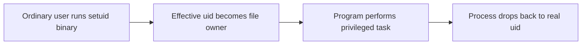
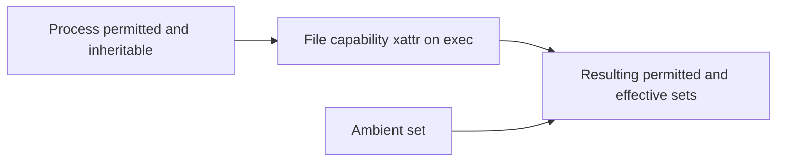

The previous chapter explained what a file is and how a path reaches it. This chapter explains who is allowed to touch it. It is the third article of Stage 7. It completes the subject of file descriptors and filesystem interfaces.

Every file operation is checked against two things: an identity and a policy. The identity is the process user and the process group. On Linux it also includes a set of capabilities. The policy is the file permission mode, its access control list, and the kernel rules for checking them.

A backend engineer hits these checks all the time. A service cannot read a config file. A setuid binary runs as the wrong user. A container lacks a privilege it needs. A bad umask creates a file that anyone can write to. Understanding the model turns these puzzles into predictable checks.

This article is a reference. It covers the process identity in full. It covers the Unix mode and its special bits. It covers ACLs, including default ACLs. It covers the capability model and how privileges survive `exec`. It covers mandatory access control. It covers the tools you use to observe all of it.

## Users, groups, and the process identity

A Unix system names principals with numbers. These numbers are the user identifier (uid) and the group identifier (gid). A file has an owning user and an owning group. A process has its own identity. On Linux this identity is more than one number. A process has a real uid. This is the user who started the process. It has an effective uid. The kernel uses this for access checks. It also has a saved-set uid. A setuid program uses this to switch back after it changes identity. A process also has a real gid, an effective gid, a saved-set gid, and a list of supplementary groups.

The kernel uses the effective uid and the effective groups for access checks. This is why a setuid program runs with the file owner's effective uid. Its real uid is still the user who launched it. A process in a group can open files owned by that group. This works even if a different user started the process. Group membership gives shared access without sharing a user account. A process adds a user to a group to share files.

The saved-set uid lets a setuid program drop to the real uid and later regain the privileged one. Privileged daemons use this trick to hold privilege only when they need it. The trick is the `seteuid` call.

## The Unix permission model

The basic model uses nine bits. Three kinds of access exist: read, write, and execute. Three parties get them: the owning user, the owning group, and everyone else. The execute bit on a file means the file can run as a program. On a directory it means search permission. Search permission lets you look up names inside the directory. We write the bits in octal. For example 0644 is a readable file. 0755 is a runnable program.

The model is a three-way match. The kernel picks one of the three triplets. If the process effective uid equals the file owner, the owner triplet applies. Else if the process is in the file group, the group triplet applies. Else the other triplet applies.

This simple structure covers most cases. That is why it has lasted for decades. But it is coarse. It cannot say "this one extra user besides the owner." It cannot say "this one extra group besides the owning group." ACLs add that power.

On top of the nine bits sit three special bits, also expressed in octal:

| Octal | Bit | On a file | On a directory |
|---|---|---|---|
| 4000 | setuid | Runs with file owner's effective uid | (no standard effect) |
| 2000 | setgid | Runs with file's group; also forces file group to owner's group on some systems | New files inherit the directory's group |
| 1000 | sticky | (no standard effect) | Only file or directory owner and root may delete or rename within it |

These octal values add to the permission bits. 4755 is setuid plus 0755. 2770 is setgid plus group-writable. 1777 is the sticky world-writable pattern of `/tmp`.

## Setuid, setgid, and the sticky bit

The setuid bit sits on an executable. When the program runs, the process gets the file owner's effective uid. This is how `passwd` can write to a privileged file. An ordinary user launches it. It runs as root for the task. Then it drops the privilege.

The setgid bit works the same way for the group. On a directory it means something else. New files created there inherit the directory's group. A shared group directory stays group-owned this way.



The sticky bit sits on a directory. It restricts deletion. Only the file owner, the directory owner, or root may delete or rename files inside. This holds even if other users have write access to the directory. That is why `/tmp` is world-writable yet one user cannot delete another user's files. The sticky bit is a small but useful protection for shared directories. On a regular file the bit does nothing.

## How ownership changes

Changing a file's owner or group is itself a privileged operation. Only a process with `CAP_CHOWN` may `chown` a file to any user. Traditionally that means root. A non-privileged process can at most change the group to one of its own supplementary groups.

Old Unix systems allowed a non-root owner to give a file away. The owner could `chown` the file to someone else and lose access. Linux blocks this with `fs.protected_hardlinks` and similar sysctls. Giving away a file you still hold open is a classic privilege-escalation trick.

The owner of a file can always change its own permissions. With `CAP_FOWNER` or ownership, the owner can also change its group. This is a deliberate rule. An owner is never locked out of their own metadata.

## Access control lists

An ACL extends the three-triplet model. It adds per-user and per-group rules. The basic mode says "group members get read." An ACL can say "user alice gets read and write, group qa gets read." Each rule is one entry. The kernel checks the list after the basic mode. The ACL mask limits the maximum permissions any entry may grant.

The kernel stores ACLs as extended attributes on the inode. That is why the previous chapter's xattr discussion matters here. The entry types are `ACL_USER_OBJ` (the owner), `ACL_USER` (a named user), `ACL_GROUP_OBJ` (the owning group), `ACL_GROUP` (a named group), `ACL_MASK` (the cap on named-user, named-group, and group-obj rights), and `ACL_OTHER` (everyone else).

A directory can also carry a default ACL. The kernel applies it to newly created children. They inherit a policy instead of relying on umask alone. This is how a team keeps every file under a shared tree readable by the team group.

The tools are `getfacl` and `setfacl`. A common confusion is the mask. Setting an ACL entry does not guarantee that permission. The mask may be narrower. The mask caps the effective rights. When you change the group permission with `chmod`, you may silently lower the ACL mask. That surprises later readers.

The `ls` plus sign only tells you an ACL exists. It says nothing about whether access is wider or narrower. `getfacl` is the real source of truth.

## Capabilities: privilege without full root

Linux splits the old all-powerful root into a set of capabilities. Each capability grants one class of privilege. A process can hold capabilities even if its uid is not zero. A non-root process with the right capability can do what used to require full root. Important ones include:

| Capability | Grants |
|---|---|
| `CAP_NET_BIND_SERVICE` | Bind a socket to a port below 1024 |
| `CAP_NET_RAW` | Use raw and packet sockets (what `ping` needs) |
| `CAP_DAC_OVERRIDE` | Bypass file read, write, and execute permission checks |
| `CAP_DAC_READ_SEARCH` | Bypass read and directory search checks |
| `CAP_FOWNER` | Bypass ownership checks for operations on files it does not own |
| `CAP_CHOWN` | Change file ownership arbitrarily |
| `CAP_SETUID` / `CAP_SETGID` | Set arbitrary uids or gids, including making a process setuid-like |
| `CAP_SYS_ADMIN` | A broad, near-root set of administrative operations |
| `CAP_KILL` | Send signals to processes owned by others |
| `CAP_IPC_LOCK` | Lock memory and bypass memory limits |
| `CAP_SYS_PTRACE` | Inspect and modify other processes |

A process carries capabilities in several sets. The permitted set is the maximum it may ever use. The effective set is what is active now. The inheritable set is what may pass across `exec`. The ambient set holds capabilities that survive `exec` for non-root processes. The kernel adds them to the permitted and effective sets of the executed program.

There is also a bounding set. It limits which capabilities can ever be gained, even by `CAP_SYS_ADMIN`. A binary can carry a file capability in the `security.capability` xattr. When executed, it gains specific capabilities without being setuid root. This is the modern replacement for setuid binaries like `ping`.



The diagram shows how privilege is computed at `exec`. The process sets combine with the executable's file capability and the ambient set. Together they produce the new process capabilities.

Capabilities appear in `/proc/<pid>/status` under `CapEff`, `CapPrm`, `CapInh`, and `CapBnd`. You manage them with `capsh`, `getpcaps`, or by setting them on containers and executables. Securebits are a further control. They can lock capability changes and stop a process from regaining privileges. This helps harden a system.

## Mandatory access control

The Unix mode and ACLs are discretionary. The file owner decides who may access the file. Mandatory access control, or MAC, adds a system-wide policy. The owner cannot override it.

On Linux the common MAC systems are SELinux and AppArmor. They can deny access that the Unix permission bits would allow. A root process can still get "permission denied" for reasons that are not the file mode.

When you debug, a denial that survives a correct mode and ACL usually means a MAC rule or a mount flag. MAC contexts are stored as extended attributes. For example the `security.selinux` xattr. This ties back to the inode metadata discussed earlier.

## Umask and the default permission of new files

When a program creates a file, the process umask modifies the requested mode. The umask masks off bits. A common default umask of 022 turns a requested 0666 into 0644. It turns a requested 0777 into 0755. That is why files are not world-writable by default. A umask of 077 would make new files accessible only to the owner.

A default ACL on the parent directory can override the umask for the group and other portions. A directory with a default ACL may produce files whose permissions do not match the simple umask formula.

The umask is a process property. It is inherited across `fork` and `exec`. It depends on how the process started. The init system and the container environment matter. A container or shell that sets umask to 0000 will create world-readable and world-writable files. This is a frequent source of accidental exposure.

The robust practice is to set an explicit umask. Also request an explicit mode. Do not rely on defaults.

## How the kernel performs an access check

An access check answers one question. May the process open, read, write, or execute a file? The kernel first checks whether the process is privileged. If the effective uid is zero and the operation is not forbidden, the access is allowed. If the process holds `CAP_DAC_OVERRIDE`, the access is allowed. This is the root bypass. It is why root ignores permission bits.

If not privileged, the kernel matches the process to the file's owner, group, or other triplet. This is the match described earlier. The kernel checks the requested permission against that triplet. If an ACL is present, it refines the decision. It uses the matching entries and the mask.

The owner of the file is special. The owner may always change the file's permissions and ownership. This holds even without other permissions. This is a deliberate exception. An owner is never locked out of their own file.

The `access` syscall checks permissions the way the kernel would. Use it with care. The result can be stale by the time the program acts on it. This is a time-of-check-to-time-of-use race, or TOCTOU race. The correct pattern is to attempt the operation and handle the error. Do not pre-check with `access`.

The order of layers matters for debugging. A "permission denied" for root usually means a different block. The block may be a mount flag such as `nosuid` or read-only. It may be a MAC system like SELinux. It is not the Unix mode. A "permission denied" for a non-root process is usually the triplet or the ACL. The fix is to adjust the mode, group, or ACL. Do not run as root.

## Observing permissions and capabilities

The shell shows the basic mode with `ls -l`. It shows deeper detail with `stat`. ACLs need `getfacl`. `ls` only hints at their presence with a plus sign. The capabilities of a running process are in `/proc/<pid>/status`. `getpcaps` summarizes them.

```bash
ls -l config.yaml
stat config.yaml
getfacl config.yaml
getpcaps $$            # capabilities of the current shell
grep Cap /proc/self/status
namei -l /var/log/app/access.log   # permission path walk
umask
ls -l /usr/bin/passwd   # setuid example
capsh --print           # capability state of the shell
```

```go
package main

import (
    "fmt"
    "os"
    "syscall"
)

func main() {
    f, err := os.OpenFile("created.txt", os.O_CREATE|os.O_WRONLY, 0666)
    if err != nil {
        panic(err)
    }
    f.Close()

    info, _ := os.Stat("created.txt")
    st := info.Sys().(*syscall.Stat_t)
    fmt.Printf("created.txt mode: %o (umask-dependent)\n", info.Mode())
    fmt.Printf("owner uid: %d gid: %d\n", st.Uid, st.Gid)

    fmt.Printf("process euid: %d egid: %d\n", os.Geteuid(), os.Getegid())

    os.Chmod("created.txt", 0640)
    info2, _ := os.Stat("created.txt")
    fmt.Printf("after chmod 0640: %o\n", info2.Mode())
    select {}
}
```

The sample shows two things. The created mode depends on umask. The program can read both the file's owner and its own effective identity.

The `chmod` call sets an explicit mode. This is the reliable way to get the permissions you intend. It works regardless of umask.

For capability checks, read `/proc/self/status` CapEff. It tells you what the process may actually do. Use `namei -l` to walk a path. It shows the permission bits the kernel evaluated at each component. This exposes where a check failed.

## A realistic production example

A team deployed a service as a non-root user. This is good security hygiene. The service needed to bind port 80. It also needed to read a privileged credentials file.

The old answer would be to make the binary setuid root. That gives the whole process root for its entire lifetime. The team wanted to avoid that.

They instead granted two narrow capabilities in the deployment. `CAP_NET_BIND_SERVICE` let the service bind port 80. Group membership and a precise ACL gave read access to the credentials file. They avoided a world-readable mode.

They also set a default ACL on the credentials directory. Rotated files kept the same access policy automatically.

A second incident showed the other failure mode. A batch job ran in a container. The base image set umask to 0000. The job wrote output files that were world-readable and world-writable. One file held temporary secrets. A security scan flagged the world-writable files in a shared directory.

The fix was to set the umask to 0027 in the container startup. The job opened files with an explicit mode. Outputs were then readable only by the owner and group.

The two incidents show both halves of the model. Grant the minimum privilege you need through capabilities and ACLs. Never let a permissive umask decide your file exposure.

## How engineers actually reason about access

They separate identity from policy. The process identity is one side. It holds the uid, gids, and capabilities. The file's mode, ACL, and owning metadata is the other side. A denial is a mismatch between them. The fix is usually to adjust the narrower side. Do not become root.

They prefer capabilities over setuid. Running as root or setuid root grants far more than needed. It widens the impact of any bug. A single capability gives the one privilege required. It gives nothing else. This is the principle of least privilege in practice. File capabilities let a specific binary gain it without a setuid bit.

They set permissions explicitly. Relying on umask for security is fragile. It depends on the process start environment. Request an explicit mode. Use default ACLs on shared trees. Verify with `getfacl` when ACLs are involved. This produces predictable, auditable access.

They respect the root bypass and its limits. Root ignores Unix mode bits. But mount flags and MAC systems can still stop it. A "permission denied" for root points at those layers. It does not point at the file mode. They use `namei -l` and `getpcaps` to find the real cause. They do not reach for `chmod 777`.

## Immutable attributes and setting capabilities in practice

Beyond the discretionary model and the capability model, the kernel offers file attributes. These change behavior regardless of the permission bits. `chattr` sets them on ext4, XFS, and other filesystems.

The immutable bit is `+i`. It prevents any modification, deletion, or link creation. Even root cannot do these until the bit is removed. It protects critical files from accidental or compromised writes.

The append-only bit is `+a`. It allows only appending. Audit logs use it. The logs must not be edited.

The synchronous bit is `+S`. It forces data writes to commit synchronously. It is a per-file version of O_SYNC.

`lsattr` displays these attributes. They are an extra layer beneath the permission and capability checks.

File capabilities are set in practice with setcap, which writes the security.capability xattr so that executing the binary grants the listed capabilities without making it setuid root. A web server that needs to bind a low port can be given cap_net_bind_service=+ep, removing the need for a setuid bit and shrinking the attack surface. Removing capabilities with setcap -r restores a normal binary. For mandatory access control, SELinux and AppArmor enforce policy beyond the Unix model; a process confined by a SELinux type may be denied a file that the permission bits would allow, which is why a permission denied that survives correcting the mode usually points at a MAC rule. In containers, the effective capabilities are the intersection of the runtime's granted set and the container's bounding and ambient sets, and dropping capabilities such as CAP_SYS_ADMIN is a standard hardening step.

## Definitions

### User and group identity

> Numeric identifiers that name principals on the system. A process has a real, effective, and saved-set uid and gid plus supplementary groups; the effective values are what access checks use, and the saved-set values let a privileged process drop and regain identity.

### Unix permission bits

> The nine-bit mode split into read, write, and execute for owner, group, and other, deciding access by matching the process to one of those three triplets. Above them sit the setuid, setgid, and sticky special bits.

### Setuid, setgid, sticky

> Special bits: setuid (octal 4000) runs a program with the file owner's effective uid, setgid (octal 2000) does so for the group or forces group inheritance on a directory, and the sticky bit (octal 1000) restricts file deletion in a shared directory to the file or directory owner.

### An ACL

> An access control list adding per-user and per-group entries to a file, stored as an xattr and consulted after the basic mode, with a mask that caps effective rights. A directory may also carry a default ACL applied to new children.

### A capability

> One unit of privilege from the set Linux splits out of root, held in permitted, effective, inheritable, and ambient sets, and grantable to a binary via a file capability xattr. It lets a non-root process do what used to require full root, with a far smaller blast radius.

### MAC and umask

> Mandatory access control is a system-wide policy, such as SELinux or AppArmor, that can deny access the Unix mode would allow and that even the owner cannot override. The umask is a process property that masks permission bits off newly created files, so the requested mode is reduced to what the umask permits.

## Beyond the definitions

### Why does root ignore permission bits but still get denied

> Root bypasses the Unix mode checks through privilege, but other layers can still block it: a read-only mount refuses writes, a `nosuid` mount ignores setuid, a MAC system enforces its own policy, and a bounding set can strip capabilities. A denial for root points at those layers.

### What is the ACL mask and why does it surprise people

> The mask caps the maximum permissions any ACL entry may grant. Changing the group permission with `chmod` can lower the mask, silently reducing effective rights of named entries. Administrators who set an entry and see it not take effect are usually hitting the mask, or omitting a default ACL on a directory.

### How is a capability different from being root

> Root holds every capability and ignores mode bits, a very broad grant. A capability grants one specific privilege to a non-root process, limiting the blast radius if the process is compromised. It is least privilege instead of all-or-nothing, and file capabilities avoid the setuid bit entirely.

### Why is setuid risky even when convenient

> The program runs with the owner's identity for its whole life, so any bug, injection, or unexpected code path executes with elevated privilege. Capabilities or a small privileged helper limit the exposure to the exact operation needed, and securebits can lock further privilege changes.

### Why set an explicit mode instead of relying on umask

> Umask depends on how the process was started, including init system and container defaults, and a permissive umask can create world-writable files silently. An explicit `chmod` or open mode, optionally backed by a default ACL, makes the resulting permission predictable and auditable.

### Why is access dangerous to use for a pre-check

> `access` reports permissions at the moment it is called, but the file can change before the program acts, a TOCTOU race. The safe pattern is to attempt the operation and handle the resulting error, rather than to check first and assume the answer still holds.

## Common misconceptions

**"chmod 777 fixes permission problems."** It removes the check entirely by granting everyone everything, which is rarely necessary and often creates a security hole. The right fix is usually a narrower mode, a group, or an ACL that grants exactly the access required.

**"A non-root process cannot bind port 80."** It cannot by default, but it can with the `CAP_NET_BIND_SERVICE` capability, which is safer than running the whole process as root. The limitation is a capability check, not an absolute rule.

**"The plus sign in ls means the file is more open."** The plus only means an ACL is present; it says nothing about whether access is wider or narrower than the mode. You must read `getfacl` to know what the ACL actually grants, and `namei -l` to see the effective path permissions.

**"setgid on a file and on a directory mean the same thing."** On a file it makes the program run with the file's group; on a directory it makes new files inherit the directory's group. The same bit has two different effects depending on what it is set on.

**"Deleting a file is controlled by the file's permissions."** Deletion is controlled by the containing directory's write and search permissions, plus the sticky bit if set, not by the file's own mode. You can often delete a file you cannot read if you can write its directory.

**"Capabilities and root are the same as long as you are root."** Root holds all capabilities by default, but the bounding set and securebits can remove or lock them, and a non-root process with one capability is far from root. They are related but not equivalent, and MAC can constrain both.

## Summary

Access to a file is decided by matching a process identity, its effective uid, groups, and capabilities, against a file's policy, its mode, ACL, and owning metadata. The Unix mode is a fast three-way check extended by the setuid, setgid, and sticky special bits, and the ACL refines it with named entries under a masking limit and, on directories, a default ACL for children. Capabilities replace the blunt instrument of root with narrowly scoped privilege carried in several sets and grantable through file capabilities, while MAC systems can deny what the mode allows. The umask and default ACLs quietly shape the permissions of everything newly created, so explicit modes beat defaults. The subject of file descriptors and filesystem interfaces is now complete across descriptors, the path-to-inode model, and the access model, and the next subject in Stage 7 turns to how files are actually read and written, buffered, made durable, and kept consistent.
