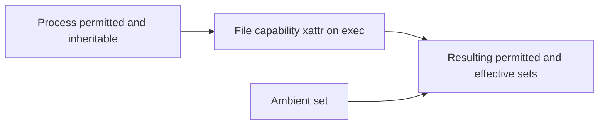

The previous chapter explained what a file is and how a path reaches it. This chapter explains who is allowed to touch it. It is the third article of Stage 7, completing the subject of file descriptors and filesystem interfaces.

Every operation on a file is checked against an identity and a policy. The identity is the process's user and group, plus a set of capabilities in the Linux model. The policy is the file's permission mode, its access control list, and the kernel's rules for evaluating them. A backend engineer meets this constantly: a service that cannot read a config, a setuid binary that runs as the wrong user, a container that lacks a privilege it needs, or a file created world-writable by a bad umask. Understanding the model turns these from mysteries into predictable checks. This article is a reference covering process identity in full, the Unix mode and its special bits, ACLs including default ACLs, the capability model and how privileges survive `exec`, mandatory access control, and the practical tools for observing all of it.

## Users, groups, and the process identity

A Unix system identifies principals by numeric user identifiers and group identifiers. A file has an owning user and an owning group. A process has its own identity, and on Linux that identity is more than one number. A process has a real uid (who started it), an effective uid (used for access checks), and a saved-set uid (used to switch back after a setuid transition). It also has a real gid, an effective gid, a saved-set gid, and a list of supplementary groups.

The effective uid and groups are what the kernel uses for access checks. This is why a setuid program runs with the file owner's effective uid even though its real uid is still the invoking user, and why a process in a particular group can access files owned by that group even if it was started by a different user. Group membership, including supplementary groups, is how shared access is granted without sharing a user. The saved-set uid exists so a setuid program can drop to the real uid and later regain the privileged one, the basis of the `seteuid` dance that privileged daemons use to hold privilege only while needed.

## The Unix permission model

The basic permission model is nine bits: read, write, and execute for the owning user, for the owning group, and for everyone else. The execute bit on a file means the file may be run as a program; on a directory it means the search permission that lets you look up names within it. The bits are usually written in octal, such as 0644 for a readable file or 0755 for a runnable program.

The model is a three-way match. The kernel decides which of the three triplets applies to the process: if the process's effective uid equals the file's owner, the owner triplet applies; else if the process is a member of the file's group, the group triplet applies; else the other triplet applies. This simple structure covers most cases, which is why it has survived for decades, but it is coarse: it cannot express "this specific user besides the owner" or "this specific group besides the owning one." That is what ACLs add.

On top of the nine bits sit three special bits, also expressed in octal:

| Octal | Bit | On a file | On a directory |
|---|---|---|---|
| 4000 | setuid | Runs with file owner's effective uid | (no standard effect) |
| 2000 | setgid | Runs with file's group; also forces file group to owner's group on some systems | New files inherit the directory's group |
| 1000 | sticky | (no standard effect) | Only file or directory owner and root may delete or rename within it |

These octal values compose with the permission bits: 4755 is setuid plus 0755, 2770 is setgid plus group-writable, 1777 is the sticky world-writable pattern of `/tmp`.

## Setuid, setgid, and the sticky bit

The setuid bit on an executable means that when run, the process gets the file owner's effective uid. This is how a program like `passwd` can write to a privileged file while being launched by an ordinary user: it runs as root for the duration of its task, then drops privileges. The setgid bit is the analogous mechanism for the group, and on a directory it has a different meaning: new files created there inherit the directory's group, which is how a shared group directory stays group-owned.


The sticky bit, when set on a directory, restricts deletion: only the file's owner, the directory's owner, or root may delete or rename files within it, even if others have write access to the directory. This is why `/tmp` is world-writable yet one user cannot delete another's files there. It is a small but important protection for shared directories, and the same bit is meaningless on regular files.

## How ownership changes

Changing a file's owner or group is itself a privileged operation. Only a process with `CAP_CHOWN` (traditionally root) may `chown` a file to any user, and a non-privileged process may at most change the group to one of its own supplementary groups. The historical "give away" semantics, where a non-root owner could `chown` a file to someone else and lose access, are restricted on Linux by `fs.protected_hardlinks` and similar sysctls, because giving away a file you still hold open is a classic privilege-escalation trick. The owner of a file can always change its own permissions and, with `CAP_FOWNER` or ownership, its group, which is the deliberate exception that an owner is never locked out of their own metadata.

## Access control lists

An ACL extends the three-triplet model with per-user and per-group rules. Where the basic mode says "group members get read", an ACL can say "user alice gets read and write, group qa gets read." Each rule is an entry, and the list is consulted after the traditional mode, with the ACL mask limiting the maximum permissions any entry may grant.

ACLs are stored as extended attributes on the inode, which is why the previous chapter's xattr discussion matters here. The entry types are `ACL_USER_OBJ` (the owner), `ACL_USER` (a named user), `ACL_GROUP_OBJ` (the owning group), `ACL_GROUP` (a named group), `ACL_MASK` (the cap on named-user, named-group, and group-obj rights), and `ACL_OTHER` (everyone else). A directory can also carry a default ACL, which is applied to newly created children so they inherit a policy instead of relying on umask alone, which is how a team keeps every file under a shared tree readable by the team group automatically.

Tools are `getfacl` and `setfacl`. A common confusion is the mask: setting an ACL entry does not guarantee that permission if the mask is narrower, because the mask caps the effective rights. When you change the group permission with `chmod`, you may be silently lowering the ACL mask and surprising later readers. The `ls` plus sign only tells you an ACL exists; it says nothing about whether access is wider or narrower, which is why `getfacl` is the real source of truth.

## Capabilities: privilege without full root

Linux divides the traditional all-powerful root into a set of capabilities, each granting one class of privilege. A process can hold capabilities regardless of whether its uid is zero, and a non-root process with the right capability can do what used to require full root. Important ones include:

| Capability | Grants |
|---|---|
| `CAP_NET_BIND_SERVICE` | Bind a socket to a port below 1024 |
| `CAP_NET_RAW` | Use raw and packet sockets (what `ping` needs) |
| `CAP_DAC_OVERRIDE` | Bypass file read, write, and execute permission checks |
| `CAP_DAC_READ_SEARCH` | Bypass read and directory search checks |
| `CAP_FOWNER` | Bypass ownership checks for operations on files it does not own |
| `CAP_CHOWN` | Change file ownership arbitrarily |
| `CAP_SETUID` / `CAP_SETGID` | Set arbitrary uids or gids, including making a process setuid-like |
| `CAP_SYS_ADMIN` | A broad, near-root set of administrative operations |
| `CAP_KILL` | Send signals to processes owned by others |
| `CAP_IPC_LOCK` | Lock memory and bypass memory limits |
| `CAP_SYS_PTRACE` | Inspect and modify other processes |

A process carries capabilities in several sets: the permitted set (the maximum it may ever use), the effective set (what is currently active), the inheritable set (what may pass across `exec`), and the ambient set (capabilities that survive `exec` for non-root processes and are added to the permitted and effective sets of the executed program). There is also a bounding set that limits which capabilities can ever be gained, even by `CAP_SYS_ADMIN`. A binary can carry a file capability in the `security.capability` xattr, so that when executed it gains specific capabilities without being setuid root, which is the modern replacement for setuid binaries like `ping`.



The diagram shows how privilege is computed at `exec`: the process's sets combine with the executable's file capability and the ambient set to produce the new process's capabilities. Capabilities appear in `/proc/<pid>/status` under `CapEff`, `CapPrm`, `CapInh`, and `CapBnd`, and they are managed with `capsh`, `getpcaps`, or set on containers and executables. Securebits are a further control that can lock capability changes and prevent a process from regaining privileges, useful for hardening.

## Mandatory access control

The Unix mode and ACLs are discretionary: the file owner decides who may access it. Mandatory access control, or MAC, adds a system-wide policy that even the owner cannot override. On Linux the common implementations are SELinux and AppArmor. They can deny access that the Unix permission bits would have allowed, which is why a root process can still get "permission denied" for reasons that are not the file mode. When debugging, a denial that survives correcting the mode and ACL usually means a MAC rule or a mount flag is interfering. MAC contexts are themselves stored as extended attributes (for example the `security.selinux` xattr), tying back to the inode metadata discussed earlier.

## Umask and the default permission of new files

When a program creates a file, the mode it requests is modified by the process umask, which masks off bits. A common default umask of 022 turns a requested 0666 into 0644 and a requested 0777 into 0755, which is why files are not world-writable by default. A umask of 077 would make new files accessible only to the owner. A default ACL on the parent directory can override the umask for the group and other portions, which is why a directory with a default ACL may produce files whose permissions do not match the simple umask formula.

The umask is a process property inherited across `fork` and `exec`, so it depends on how the process was started, including its init system and container environment. A container or shell that sets umask to 0000 will create world-readable and world-writable files, which is a frequent source of accidental exposure. The robust practice is to set an explicit umask and to request an explicit mode, rather than relying on defaults.

## How the kernel performs an access check

An access check answers whether a process may open, read, write, or execute a file. The kernel first checks whether the process is privileged: if the effective uid is zero and the operation is not forbidden, or if the process holds `CAP_DAC_OVERRIDE`, the access is allowed regardless of the mode. This is the root bypass, and it is why root ignores permission bits.

If not privileged, the kernel matches the process to the file's owner, group, or other triplet as described earlier, and checks the requested permission against that triplet. If an ACL is present, it refines the decision using the matching entries and the mask. The owner of the file is special: the owner may always change the file's permissions and ownership, even without other permissions, which is a deliberate exception so an owner is never locked out of their own file.

The `access` syscall checks permissions the way the kernel would, but it should be used with care: the result can be stale by the time the program acts on it, a time-of-check-to-time-of-use or TOCTOU race. The correct pattern is to attempt the operation and handle the error, rather than to pre-check with `access`. The order of layers matters for debugging. A "permission denied" that appears for root usually means a different block, such as a mount flag (`nosuid`, read-only) or a MAC system like SELinux, not the Unix mode. A "permission denied" for a non-root process is usually the triplet or ACL, and the fix is to adjust the mode, group, or ACL rather than to run as root.

## Observing permissions and capabilities

The shell shows the basic mode in `ls -l`, and deeper detail in `stat`. ACLs require `getfacl`, because `ls` only hints at their presence with a plus sign. Capabilities of a running process are in `/proc/<pid>/status`, summarized by `getpcaps`.

```bash
ls -l config.yaml
stat config.yaml
getfacl config.yaml
getpcaps $$            # capabilities of the current shell
grep Cap /proc/self/status
namei -l /var/log/app/access.log   # permission path walk
umask
ls -l /usr/bin/passwd   # setuid example
capsh --print           # capability state of the shell
```

```go
package main

import (
    "fmt"
    "os"
    "syscall"
)

func main() {
    f, err := os.OpenFile("created.txt", os.O_CREATE|os.O_WRONLY, 0666)
    if err != nil {
        panic(err)
    }
    f.Close()

    info, _ := os.Stat("created.txt")
    st := info.Sys().(*syscall.Stat_t)
    fmt.Printf("created.txt mode: %o (umask-dependent)\n", info.Mode())
    fmt.Printf("owner uid: %d gid: %d\n", st.Uid, st.Gid)

    fmt.Printf("process euid: %d egid: %d\n", os.Geteuid(), os.Getegid())

    os.Chmod("created.txt", 0640)
    info2, _ := os.Stat("created.txt")
    fmt.Printf("after chmod 0640: %o\n", info2.Mode())
    select {}
}
```

What it shows is that the created mode depends on umask, and that the program can read both the file's owner and its own effective identity. The `chmod` call sets an explicit mode, which is the reliable way to get the permissions you intend regardless of umask. For capability checks, reading `/proc/self/status` CapEff tells you what the process may actually do, and `namei -l` walks a path showing the permission bits the kernel evaluated at each component, which exposes where a check failed.

## A realistic production example

A team deployed a service as a non-root user for good security hygiene, but the service needed to bind port 80 and to read a privileged credentials file. The historical answer would have been to make the binary setuid root, but that gives the whole process root for its entire lifetime, which the team wanted to avoid. They instead granted two narrowly scoped capabilities via the deployment: `CAP_NET_BIND_SERVICE` so the service could bind port 80, and read access to the credentials file through group membership and a precise ACL rather than world-readable mode. They also set a default ACL on the credentials directory so rotated files kept the same access policy automatically.

A second, separate incident showed the other failure mode. A batch job ran in a container whose base image set umask to 0000. The job wrote output files that were created world-readable and world-writable, including a file containing temporary secrets. A security scan flagged world-writable files in a shared directory. The fix was to set the umask to 0027 in the container's startup and to open files with an explicit mode, so outputs were readable only by the owner and group. Together the two incidents show both halves of the model: grant the minimum privilege you actually need through capabilities and ACLs, and never let a permissive umask decide your file exposure for you.

## How engineers actually reason about access

They separate identity from policy. The process identity (uid, gids, capabilities) is one side; the file's mode, ACL, and owning metadata is the other. A denial is a mismatch between them, and the fix is usually to adjust the narrower side rather than to become root.

They prefer capabilities over setuid. Running as root or setuid root grants far more than needed and widens the impact of any bug. A single capability gives the one privilege required and nothing else, which is the principle of least privilege in practice, and file capabilities let a specific binary gain it without a setuid bit.

They set permissions explicitly. Relying on umask for security is fragile because it depends on the process's start environment. Requesting an explicit mode, using default ACLs on shared trees, and verifying with `getfacl` when ACLs are involved produces predictable, auditable access.

They respect the root bypass and its limits. Root ignores Unix mode bits, but it can still be stopped by mount flags and MAC systems, so "permission denied" for root points at those layers, not at the file mode. They use `namei -l` and `getpcaps` to localize the real cause instead of reaching for `chmod 777`.

## Immutable attributes and setting capabilities in practice

Beyond the discretionary and capability model, the kernel offers file attributes that change behavior regardless of the permission bits. chattr sets these on ext4, XFS, and others: the immutable bit (+i) prevents any modification, deletion, or link creation even by root until it is removed, which is useful for protecting critical files from accidental or compromised writes; the append-only bit (+a) allows only appending, used for audit logs that must not be edited; and the synchronous bit (+S) forces data writes to be committed synchronously, a per-file version of O_SYNC. lsattr displays these attributes, and they are an extra layer beneath the permission and capability checks.

File capabilities are set in practice with setcap, which writes the security.capability xattr so that executing the binary grants the listed capabilities without making it setuid root. A web server that needs to bind a low port can be given cap_net_bind_service=+ep, removing the need for a setuid bit and shrinking the attack surface. Removing capabilities with setcap -r restores a normal binary. For mandatory access control, SELinux and AppArmor enforce policy beyond the Unix model; a process confined by a SELinux type may be denied a file that the permission bits would allow, which is why a permission denied that survives correcting the mode usually points at a MAC rule. In containers, the effective capabilities are the intersection of the runtime's granted set and the container's bounding and ambient sets, and dropping capabilities such as CAP_SYS_ADMIN is a standard hardening step.

## Definitions

### User and group identity

> Numeric identifiers that name principals on the system. A process has a real, effective, and saved-set uid and gid plus supplementary groups; the effective values are what access checks use, and the saved-set values let a privileged process drop and regain identity.

### Unix permission bits

> The nine-bit mode split into read, write, and execute for owner, group, and other, deciding access by matching the process to one of those three triplets. Above them sit the setuid, setgid, and sticky special bits.

### Setuid, setgid, sticky

> Special bits: setuid (octal 4000) runs a program with the file owner's effective uid, setgid (octal 2000) does so for the group or forces group inheritance on a directory, and the sticky bit (octal 1000) restricts file deletion in a shared directory to the file or directory owner.

### An ACL

> An access control list adding per-user and per-group entries to a file, stored as an xattr and consulted after the basic mode, with a mask that caps effective rights. A directory may also carry a default ACL applied to new children.

### A capability

> One unit of privilege from the set Linux splits out of root, held in permitted, effective, inheritable, and ambient sets, and grantable to a binary via a file capability xattr. It lets a non-root process do what used to require full root, with a far smaller blast radius.

### MAC and umask

> Mandatory access control is a system-wide policy, such as SELinux or AppArmor, that can deny access the Unix mode would allow and that even the owner cannot override. The umask is a process property that masks permission bits off newly created files, so the requested mode is reduced to what the umask permits.

## Beyond the definitions

### Why does root ignore permission bits but still get denied

> Root bypasses the Unix mode checks through privilege, but other layers can still block it: a read-only mount refuses writes, a `nosuid` mount ignores setuid, a MAC system enforces its own policy, and a bounding set can strip capabilities. A denial for root points at those layers.

### What is the ACL mask and why does it surprise people

> The mask caps the maximum permissions any ACL entry may grant. Changing the group permission with `chmod` can lower the mask, silently reducing effective rights of named entries. Administrators who set an entry and see it not take effect are usually hitting the mask, or omitting a default ACL on a directory.

### How is a capability different from being root

> Root holds every capability and ignores mode bits, a very broad grant. A capability grants one specific privilege to a non-root process, limiting the blast radius if the process is compromised. It is least privilege instead of all-or-nothing, and file capabilities avoid the setuid bit entirely.

### Why is setuid risky even when convenient

> The program runs with the owner's identity for its whole life, so any bug, injection, or unexpected code path executes with elevated privilege. Capabilities or a small privileged helper limit the exposure to the exact operation needed, and securebits can lock further privilege changes.

### Why set an explicit mode instead of relying on umask

> Umask depends on how the process was started, including init system and container defaults, and a permissive umask can create world-writable files silently. An explicit `chmod` or open mode, optionally backed by a default ACL, makes the resulting permission predictable and auditable.

### Why is access dangerous to use for a pre-check

> `access` reports permissions at the moment it is called, but the file can change before the program acts, a TOCTOU race. The safe pattern is to attempt the operation and handle the resulting error, rather than to check first and assume the answer still holds.

## Common misconceptions

**"chmod 777 fixes permission problems."** It removes the check entirely by granting everyone everything, which is rarely necessary and often creates a security hole. The right fix is usually a narrower mode, a group, or an ACL that grants exactly the access required.

**"A non-root process cannot bind port 80."** It cannot by default, but it can with the `CAP_NET_BIND_SERVICE` capability, which is safer than running the whole process as root. The limitation is a capability check, not an absolute rule.

**"The plus sign in ls means the file is more open."** The plus only means an ACL is present; it says nothing about whether access is wider or narrower than the mode. You must read `getfacl` to know what the ACL actually grants, and `namei -l` to see the effective path permissions.

**"setgid on a file and on a directory mean the same thing."** On a file it makes the program run with the file's group; on a directory it makes new files inherit the directory's group. The same bit has two different effects depending on what it is set on.

**"Deleting a file is controlled by the file's permissions."** Deletion is controlled by the containing directory's write and search permissions, plus the sticky bit if set, not by the file's own mode. You can often delete a file you cannot read if you can write its directory.

**"Capabilities and root are the same as long as you are root."** Root holds all capabilities by default, but the bounding set and securebits can remove or lock them, and a non-root process with one capability is far from root. They are related but not equivalent, and MAC can constrain both.

## Summary

Access to a file is decided by matching a process identity, its effective uid, groups, and capabilities, against a file's policy, its mode, ACL, and owning metadata. The Unix mode is a fast three-way check extended by the setuid, setgid, and sticky special bits, and the ACL refines it with named entries under a masking limit and, on directories, a default ACL for children. Capabilities replace the blunt instrument of root with narrowly scoped privilege carried in several sets and grantable through file capabilities, while MAC systems can deny what the mode allows. The umask and default ACLs quietly shape the permissions of everything newly created, so explicit modes beat defaults. The subject of file descriptors and filesystem interfaces is now complete across descriptors, the path-to-inode model, and the access model, and the next subject in Stage 7 turns to how files are actually read and written, buffered, made durable, and kept consistent.
