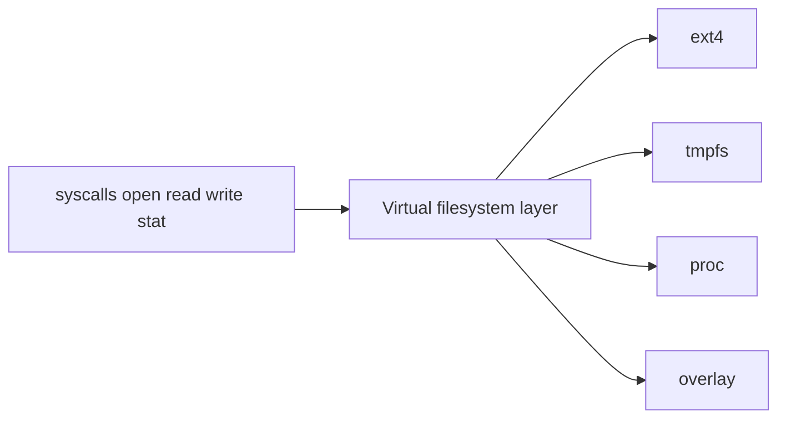
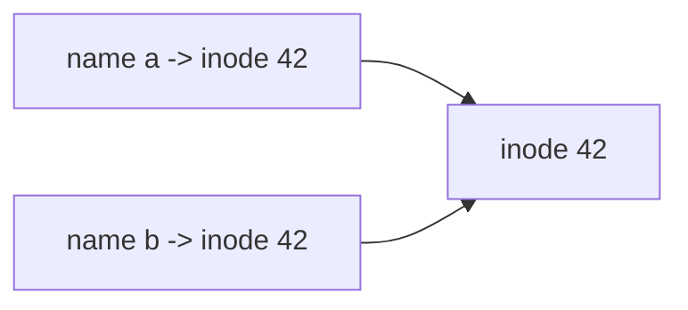
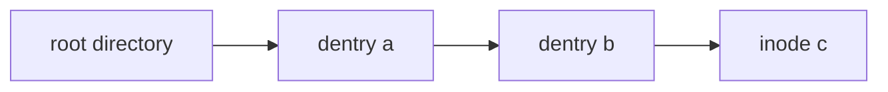
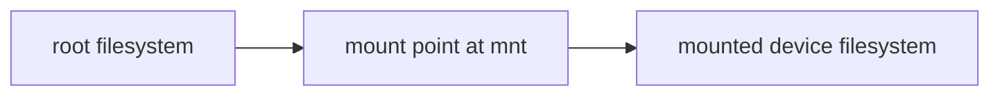
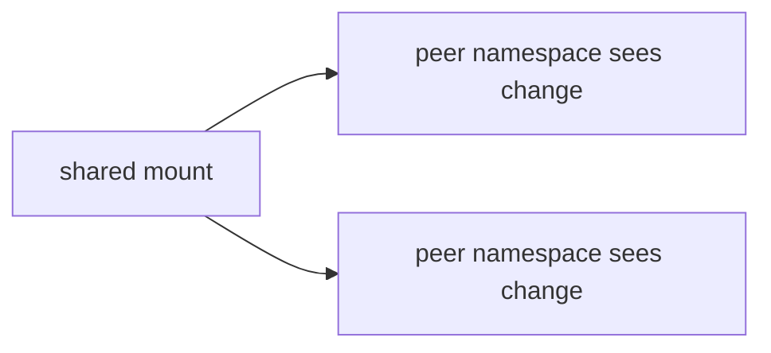
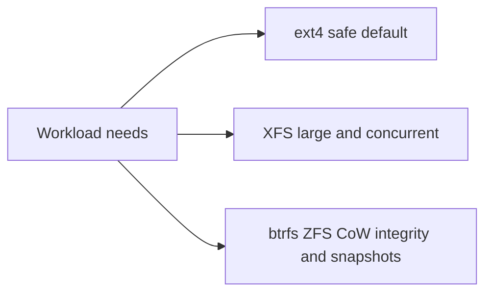

The previous article showed that a file descriptor points at an open file description, which in turn points at an underlying object. This chapter explains what that object is and how a textual path becomes it. It is the second article of Stage 7, still inside the subject of file descriptors and filesystem interfaces.

A path like `/var/log/app/access.log` is a name, not the file. The kernel must resolve that name into an inode, the actual kernel object that describes the file, and it must do so through a layer that works the same way whether the file lives on a disk, in memory, or in a virtual filesystem like `/proc`. Understanding that resolution is how you reason about performance, mounts, containers, and the difference between a file's name and its identity. This article is a reference: it covers the VFS objects, the inode in detail, the dentry cache, the full resolution algorithm, links, mounts and their propagation, namespaces, metadata via `statx`, and sparse files and extended attributes.

## The virtual filesystem layer

The kernel presents one uniform set of operations, `open`, `read`, `write`, `stat`, and so on, over many different storage backends. The virtual filesystem, usually called the VFS, is the abstraction that makes this possible. It defines common objects and requires each concrete filesystem to implement them.



The program never knows or cares which concrete filesystem backs a path. That is the point. A read from `/etc/hostname` (probably a regular file on a disk filesystem) and a read from `/proc/self/status` (a virtual file produced on demand) go through the same VFS calls and return bytes the same way. The difference is only in what the concrete filesystem does behind the interface. This uniformity is why a mount can replace one filesystem with another without changing application code.

The VFS defines four central objects. The superblock describes one mounted instance of a filesystem: its block device or backing, its root, and its type. The inode describes one file. The dentry describes one name-to-inode link inside a directory. The file (the open instance) describes an active open, with offset and flags. Each concrete filesystem supplies operations vectors that the VFS calls: `inode_operations` for things that change the namespace such as `create` and `link`, `file_operations` for per-open actions such as `read` and `write`, and `address_space_operations` for moving pages between memory and storage. The VFS itself holds no data; it routes each call to the right vector. This indirection is exactly why `/proc`, `/sys`, `tmpfs`, `overlayfs`, and disk filesystems all behave like "the filesystem" to your program.

## Inodes are the identity of a file

An inode is the kernel object that represents a file's metadata and the location of its data. It holds the file type (regular, directory, device, and so on), the permission mode, the owner user and group, the size, the timestamps, the link count, and the pointers to the data blocks on disk. What it does not hold is the file's name. A file can have several names and still be one inode.



The diagram shows a hard link: two directory entries point at one inode. The inode is the identity and the paths are only names reaching it. Two directory entries that point at the same inode number refer to the same file, a hard link. Deleting one name does not delete the file until the last name and the last open descriptor are gone, which is why the link count and the open count both matter to when data is truly freed.

In memory, each open filesystem has an inode cache, and the in-memory inode carries extra state such as the dirty flag, locks, and the address space used by the page cache. On disk, the inode is a fixed-size structure in the filesystem's inode table. The inode number is unique within a single filesystem, which is why comparing `(st_dev, st_ino)` across two paths is the reliable way to detect whether they are the same file: the inode alone is only unique per device.

## Directory entries and what a directory contains

A directory is itself a file whose content is a table of names mapped to inode numbers. A directory entry, or dentry, is one row in that table: a name and the inode number it points to. When you list a directory, you are reading these rows. When you look up a name, the kernel searches the rows for that name and follows the inode number.

This is why renaming a file within a directory is fast and does not move data: it only changes or adds a dentry. It is also why a directory needs both read and execute permission for different reasons. Read permission lets you list the names; execute permission (called search permission on directories) lets you look up a specific name within it. A directory you can read but not search lets you see names but not access the files behind them, which is a confusing but real state.

The dentry cache, or dcache, keeps recent name-to-inode resolutions in memory so repeated lookups avoid re-reading the directory from storage. It also caches negative dentries, which record that a name does not exist, so failed lookups are fast too. This is why the first `open` of a file on a cold, remote filesystem is slow while the second is nearly free, and why a directory with millions of entries is slow to list the first time but faster afterward. The cache is bounded and evicted under memory pressure, which is why performance can change with workload and available RAM.

## Hard links versus symbolic links

A hard link is a second directory entry pointing at the same inode. It can only be created within one filesystem (because inode numbers are local to a filesystem) and cannot point at a directory on most systems, to avoid creating cycles the tree walk cannot handle. All hard links are equal: no one is "the original," and removing any one only decrements the link count.

A symbolic link, or symlink, is a special file whose content is a path string. It can cross filesystems and point at directories, and it has its own inode distinct from the target. Resolution treats the symlink as a redirect: when the kernel meets a symlink component, it substitutes the link's target text and continues the walk. The difference shows up in `stat`: `stat` follows symlinks and reports the target, while `lstat` reports the symlink itself, and `O_NOFOLLOW` makes `open` refuse to follow a final-component symlink, which is important for security when writing to a path an attacker might have replaced with a link.

## How path resolution walks from root to inode

Path resolution is the process of turning `/a/b/c` into the inode for `c`. The kernel starts at the root directory's dentry, looks up the name `a` to find its inode, confirms `a` is a directory it may search, then looks up `b` inside `a`, then `c` inside `b`. Each step is a dentry lookup plus a permission check on the search bit of the containing directory.



Several details make this interesting. Symbolic links interrupt the walk: when a component is a symlink, the kernel replaces that component with the link's target and continues, with a maximum depth (40 on Linux) to prevent infinite loops, returning `ELOOP` past that. Relative paths start from the current working directory instead of root, and `..` moves up one directory, bounded by the root of the resolution, which in a chroot or mount namespace is not the true system root. Each successful lookup may be cached in the dentry cache, so repeated resolution of the same path is far cheaper than the first.

Path resolution is also where mount points are crossed transparently. When the walk reaches a directory that is a mount point, the kernel switches to the inode from the mounted filesystem, and the program never notices. This is the mechanism that makes a file on a different device appear at a path inside the tree. The resolution is therefore a combined walk of the dentry tree and the mount tree at once.

## Mounts and the mount tree

A mount attaches a filesystem at a directory, called the mount point, so that paths under that directory resolve into the mounted filesystem. The kernel keeps a mount tree describing these attachments, and path resolution follows it automatically. Mounts carry flags that change behavior: read-only makes the tree unwritable, `noexec` prevents execution, `nosuid` ignores setuid bits, and `nodev` ignores device nodes; bind mounts attach an existing directory or file at a new location without a new filesystem.

| Mount flag | Effect |
|---|---|
| `ro` | Writes are rejected |
| `noexec` | No file under the mount may be executed |
| `nosuid` | Setuid and setgid bits are ignored |
| `nodev` | Device nodes under the mount are not treated as devices |
| `noatime` / `relatime` | Controls access-time updates |
| `bind` | Re-presents an existing directory tree at a new path |



You can see the active mounts through `mount` or, more precisely, `/proc/self/mountinfo`, which lists each mount with its id, parent, root within the filesystem, mount point, and options. For a backend engineer, the mountinfo file is the authoritative view of what a process's filesystem actually looks like, which matters when a path resolves to something unexpected because of an overlay or bind mount. `/proc/mounts` is a legacy view that omits some fields; mountinfo is the one to trust.

## Mount namespaces and propagation

A mount namespace is a process's private view of the mount tree. By default processes share the initial namespace, so they all see the same mounts. A process can instead enter a new mount namespace, after which its mounts are independent: it can mount and unmount without affecting others. This is one of the core isolation mechanisms behind containers.

Mount propagation controls whether a mount or unmount in one part of the tree is reflected into peer mounts or namespaces. The four propagation types are `shared` (changes propagate to peers), `private` (changes stay local), `slave` (receives propagation from a shared master but does not send its own), and `unbindable` (cannot be bind-mounted). Container runtimes use these to decide whether a volume mounted on the host appears inside a container. A volume mount that should be visible in the container is set up on a shared or slave peer; a mount that must stay private is marked private or unbindable.



Container runtimes use mount namespaces so each container sees its own root filesystem and set of mounts, even though the same kernel backs them all. A change made inside one container's namespace does not appear in another or on the host, unless propagation makes it so. Mount propagation further controls whether mounts in a shared subtree are visible to peer namespaces, which is why nested containers and volume mounts have subtle rules. The key takeaway is that the filesystem a process sees is not necessarily the host's filesystem; it is the view defined by its mount namespace and the propagation of its mounts.

`pivot_root` and `chroot` both change what a process considers the root. `chroot` only rewrites the root used for resolution and is easy to escape with sufficient privilege; `pivot_root` swaps the entire mount tree for a new one and is the mechanism container runtimes use to install a container rootfs, after which the old root is unmounted. Together with mount namespaces, this gives containers an isolated, hard-to-escape filesystem view.

## File metadata with stat, lstat, and statx

When you `stat` a file, you get the inode's metadata: the type and mode, the link count, the owning user and group, the size in bytes, the number of blocks used, and three timestamps. The timestamps are often misunderstood. `atime` is the last access time, `mtime` is the last content modification, and `ctime` is the last inode change time, not the creation time. There is no standard creation time exposed through the basic stat in the same way, which surprises people who expect a birth time.

The modern syscall is `statx`, which reports the same fields plus a birth or creation time (`btime`), version/change counters, and per-field availability masks so a filesystem can say which fields it actually supports. `statx` also lets a caller request only the fields it needs, which avoids fetching expensive metadata. `lstat` differs from `stat` in that it reports the symlink itself rather than following it, and `fstat` works on an already-open descriptor so no path resolution is needed at all, which is both faster and immune to rename races.

Updating `atime` on every read once caused a storm of metadata writes, so Linux introduced `relatime`, which updates atime only if it is older than mtime or past a threshold. Mounting with `noatime` disables atime updates entirely, which is a common performance tune for read-heavy services because it removes writeback triggered purely by reads. The metadata also reports block usage, which is where sparse files become visible.

## Sparse files and extended attributes

A sparse file contains holes: regions that have never been written and read back as zeros but occupy no disk blocks. A program seeks past the end of a file and writes a byte, and the gap between the old end and the write becomes a hole. The apparent size is large, but the actual disk usage is small, which is why `ls -l` (apparent size) and `du` (block usage) disagree for sparse files. Sparse files are used for disk images, for databases that preallocate large but mostly empty regions, and anywhere a large logical file is mostly empty.

Sparse regions can be created or removed with `fallocate`: `FALLOC_FL_PUNCH_HOLE` carves a hole in the middle of an existing file (releasing blocks), and the default mode preallocates blocks without writing data. A program can also discover where the holes are with `lseek` using `SEEK_HOLE` and `SEEK_DATA`, which lets backup tools skip empty regions and copy only the data. On copy-on-write filesystems such as btrfs or overlayfs layers, what counts as a hole and how writes are charged depends on the backing store, so the apparent-versus-real gap can behave differently than on ext4.

Extended attributes, or xattrs, are small key-value pairs attached to an inode, outside the usual metadata. They carry things like security labels (SELinux context), ACLs, and capabilities. The `user` namespace of xattrs is available to applications for arbitrary metadata. They are why a file can carry information the basic permission model does not express, and they are read and written with `getfattr` and `setfattr` or the `getxattr` and `setxattr` syscalls. ACLs and capabilities, covered in the next article, are themselves stored as extended attributes, which is why a careless `tar` or `rsync` that ignores xattrs silently drops them.

## File handles instead of paths

Sometimes you want to refer to a file without a path, for example to reopen it later or to refer to it across an NFS export. The syscalls `name_to_handle_at` and `open_by_handle_at` convert between a path and an opaque file handle (a filesystem identifier plus a variable-length key). A file handle names the inode directly, bypassing path resolution and immune to renames. This is the machinery behind NFS filehandles and behind some backup and deduplication tools. The handle is not a descriptor and does not keep the file open; it is a durable name for the inode that can be reopened later by a process with the right capability.

## Observing the filesystem from a program and the shell

A program can read inode identity and metadata directly. The inode number is the stable identity; two paths with the same inode number are the same file. The link count and block count reveal hard links and sparseness. `statx` exposes the birth time and per-field availability that basic `stat` cannot.

```go
package main

import (
    "fmt"
    "os"
    "syscall"
)

func describe(path string) {
    info, err := os.Stat(path)
    if err != nil {
        fmt.Println("stat error:", err)
        return
    }
    st := info.Sys().(*syscall.Stat_t)
    fmt.Printf("%s: ino=%d nlink=%d size=%d blocks=%d mode=%o\n",
        path, st.Ino, st.Nlink, st.Size, st.Blocks, info.Mode())
}

func main() {
    os.WriteFile("orig.txt", []byte("hello\n"), 0644)
    os.Link("orig.txt", "link.txt")

    describe("orig.txt")
    describe("link.txt")

    f, _ := os.Create("sparse.bin")
    f.Seek(1<<20, 0)
    f.Write([]byte("x"))
    f.Close()
    describe("sparse.bin")

    var st syscall.Stat_t
    if err := syscall.Lstat("link.txt", &st); err == nil {
        fmt.Printf("lstat link.txt: mode=%o (symlink if 120xxx)\n", st.Mode)
    }

    select {}
}
```

```bash
go build -o fsinfo main.go
./fsinfo &
sleep 0.3
ls -li orig.txt link.txt
echo "--- sparse apparent size vs disk usage ---"
ls -l sparse.bin
du -h sparse.bin
echo "--- this process mount view (first lines) ---"
head -n 3 /proc/$!/mountinfo
echo "--- extended attribute example ---"
setfattr -n user.note -v "demo" orig.txt
getfattr -d orig.txt
echo "--- statx view with birth time ---"
stat orig.txt
kill %1 2>/dev/null
```

What it shows is the identity layer. `orig.txt` and `link.txt` share one inode number and link count, proving they are the same file under two names. `sparse.bin` reports a large apparent size but few blocks, which is the hole. The mountinfo lines show the process's mount view as the kernel sees it. Extended attributes appear as extra metadata attached to the inode. The `stat` command exposes the birth time that `statx` provides, and `lstat` distinguishes a symlink from its target.

## A realistic production example

A team ran a service that, for every request, resolved a path from the root such as `/data/tenants/<id>/files/<name>`, where each request built the string and called `open` from the current directory. Under load on a network-backed filesystem, the service spent a surprising amount of CPU and issued many metadata reads. The problem was path resolution: every open re-walked the whole chain of directories from root, and because the dentries were not all cached, each component sometimes required reading the directory from the remote filesystem. Worse, the default mount updated `atime` on reads, so simply reading files generated write traffic back to the storage.

The fixes followed directly from this chapter. They moved the service to `openat` with a directory file descriptor for the tenant root, so resolution started one step from the target instead of from the system root, removing most of the walk. They remounted the data filesystem with `relatime` (or `noatime`) so reads stopped triggering metadata writes. They also pre-opened and cached directory descriptors for hot tenants, turning a multi-component root-to-file walk into a single local lookup, and they switched mounts to `nodev,noexec` where the data tree never needed devices or executables. After the change, per-request filesystem metadata work dropped sharply and tail latency from storage round-trips disappeared. The lesson was that path resolution is real work, it is cache sensitive, and mount options and flags change its cost.

## How engineers actually reason about paths and inodes

They separate name from identity. A path is a route; the inode is the destination. Two paths can reach one inode, and one inode can outlive any single name, so reasoning about "the file" means reasoning about the inode, not the string. They compare `(st_dev, st_ino)` to test identity reliably.

They watch the cost of resolution. Deep paths, cold caches, and remote filesystems make each `open` do visible work. Using directory descriptors with `openat`, keeping hot paths short, and understanding the dentry cache is a concrete performance practice, not a micro-optimization.

They read mountinfo, not assumptions. A path that "should" be on fast local disk may be an overlay, a bind mount, or a network mount, and the only way to know is to inspect the process's mount view. Containerized services in particular rarely see the host tree, and mount propagation decides whether a host volume reaches them.

They use sparse files and xattrs deliberately. Sparse files save real space for large mostly-empty data, and xattrs carry the labels, ACLs, and capabilities that security and tooling depend on, even though they are invisible in a normal listing and lost by careless copy tools.

## Choosing a filesystem and copy-on-write features

A backend engineer is often asked which filesystem to use, and the answer depends on the workload and the features needed. ext4 is the conservative default: journaling with ordered mode, solid performance, and broad tooling. XFS suits large files, high concurrency, and metadata-heavy workloads, with strong scaling and online defragmentation. btrfs and ZFS are copy-on-write filesystems: they never update blocks in place, so a crash leaves a consistent tree, they checksum every block to detect corruption, and they offer snapshots, subvolumes, and transparent compression. The cost is more write amplification and heavier memory use, but for data integrity and operational features they are compelling.



Two copy-on-write features change everyday operations. Reflink, exposed by cp --reflink and the FICLONE ioctl, makes a copy of a file that shares blocks until one side is written, so duplicating a large file is instant and space efficient. This is how container image layers and backup systems save space. Snapshots freeze a subvolume's state so you can roll back a bad deploy or take a consistent backup without stopping writes. Both rely on copy-on-write, which is why they are native to btrfs and ZFS and absent or limited on ext4. The trade is that copy-on-write filesystems fragment and amplify small random writes unless tuned, so a database on btrfs or ZFS usually needs its own volume with copy-on-write disabled for its data files.

## Definitions

### The virtual filesystem

> The kernel layer that presents one uniform set of file operations across many concrete filesystems, defining common objects such as superblocks, inodes, dentries, and open files, and routing each call to a filesystem-supplied operations vector.

### An inode

> The kernel object representing a file's metadata and data location: type, mode, owner, size, timestamps, link count, and block pointers. It is the identity of the file, unique per device, independent of any name.

### A dentry

> A directory entry mapping a name to an inode number. Directories are files whose content is a table of these entries, and path resolution walks them component by component. Recent resolutions are cached, including negative entries for missing names.

### A mount and its propagation

> A mount attaches a filesystem at a directory, after which paths under that point resolve into the mounted filesystem. Propagation type (shared, private, slave, unbindable) controls whether mount and unmount changes are reflected into peer mounts and namespaces.

### A mount namespace

> A process's private view of the mount tree, so its mounts can differ from other processes and from the host. It is a core isolation mechanism used by containers, typically combined with `pivot_root`.

### A sparse file and an xattr

> A sparse file has holes that read as zeros but use no blocks, so apparent size exceeds disk usage. An extended attribute is a key-value pair attached to an inode for metadata such as security labels, ACLs, and capabilities.

## Beyond the definitions

### Why does deleting a file not always free its space

> Because the file may still be open by a process. The data is freed only when the last name (link count zero) and the last open descriptor are both gone. A log file deleted by `rm` while a process still writes to it keeps occupying disk until that process closes or is killed.

### What is the difference between atime, mtime, ctime, and btime

> `atime` is last read access, `mtime` is last content change, `ctime` is last inode change (including permission and ownership changes, not creation), and `btime` is the birth or creation time, available through `statx` but not classic `stat`. atime updates are throttled by `relatime` or disabled by `noatime` to avoid read-induced writes.

### How does a symbolic link change resolution

> When a path component is a symlink, the kernel substitutes the link target and continues resolving, up to a maximum depth (40) to stop loops, returning `ELOOP` past that. Absolute targets restart from root; relative targets are resolved against the current directory in the walk. `O_NOFOLLOW` refuses to follow a final-component symlink on `open`.

### Why would you use openat with a directory descriptor

> Because it starts resolution at an already-open directory instead of from the root, skipping the walk to that point and avoiding races if the path is renamed. For servers that touch many files under a known root, it cuts resolution cost and improves correctness. `statx` with an open descriptor removes a path walk entirely.

### How is a mount namespace different from a chroot

> A chroot changes only the apparent root for path resolution and is easy to escape with sufficient privileges. A mount namespace gives a private mount tree visible to the process, is harder to escape, and combined with `pivot_root` is the mechanism containers use for isolated filesystems. They are related but not equivalent.

### When would you use a file handle instead of a path

> When you need a durable, rename-proof name for an inode, for example to reopen a file later or to reference it across an NFS export. `name_to_handle_at` and `open_by_handle_at` name the inode directly, bypassing path resolution, but require privilege and a cooperating filesystem.

## Common misconceptions

**"The path is the file."** The path is a name that resolves to an inode, which is the file. The same inode can have many names, and the name can be renamed or deleted without changing the inode while descriptors stay open.

**"ls shows how much disk a file uses."** `ls -l` shows apparent size, not disk usage. A sparse file or a file with many holes can look huge while using few blocks. `du` reports actual block usage, which is what fills the device, and `statx` reports both.

**"Every directory component costs the same."** Resolution cost depends on cache state and filesystem location. A cold, deep path on a network filesystem is far more expensive than a cached local lookup, and atime updates can turn reads into writes.

**"Mounts are global."** By default they are shared, but a mount namespace makes them per-process, and propagation decides whether a change reaches peers. In containers the filesystem you see is the namespace's view, and changes there may or may not reflect on the host.

**"Deleting a file frees it immediately."** Not while it is open. The space is reclaimed only after the last reference, name or descriptor, is released, which is why a deleted-but-open log can still grow the disk usage.

**"A symlink and a hard link are the same kind of link."** A hard link is another name for the same inode on the same filesystem and cannot be a directory; a symlink is its own inode whose content is a path, can cross filesystems, and is followed at resolution time with loop limits.

## Summary

A path is a route, and the inode is the destination. The VFS gives every filesystem a uniform face through common objects and operations vectors, the inode carries a file's identity and metadata (now extendable via `statx`, including birth time), and the dentry chain plus the dentry cache are how a name becomes an inode through path resolution, symbolic links, and mount points. Hard links add names to one inode; symlinks redirect the walk. Mounts attach filesystems and carry flags and propagation that decide visibility across namespaces, the foundation of container filesystems. File handles name inodes without paths, and sparse files and extended attributes round out what an inode actually contains. The next article in this subject turns from what a file is to who may touch it, with the permission model of users, groups, Unix modes, ACLs, and capabilities.
