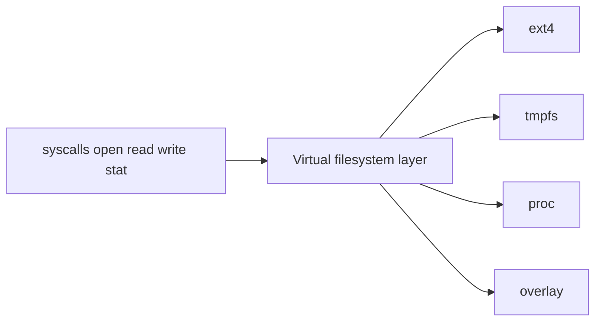
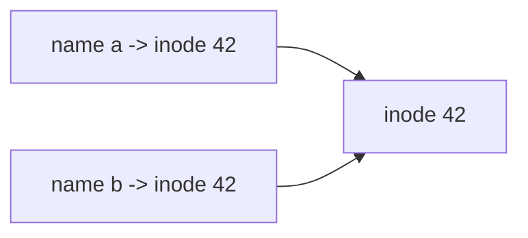
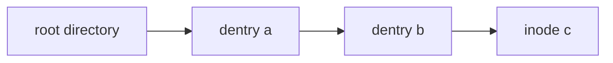
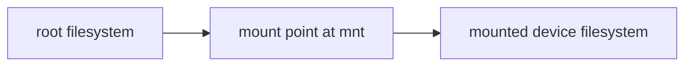
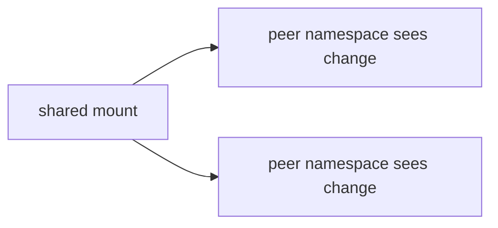
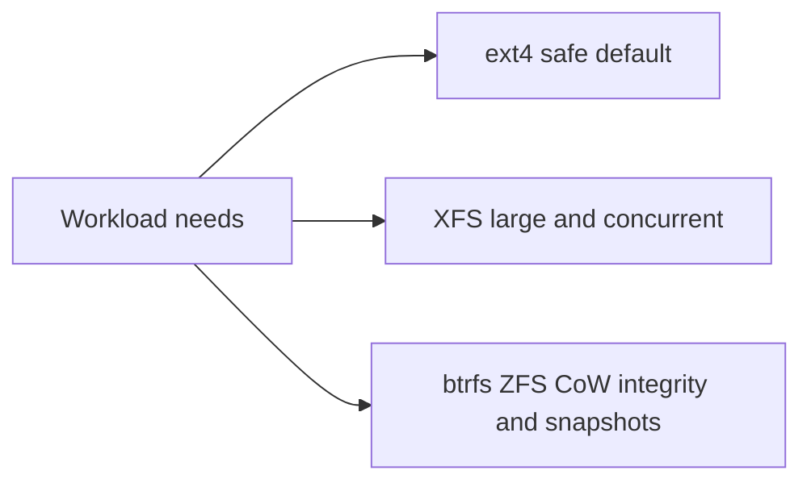

The previous article showed that a file descriptor points at an open file description. That description points at an underlying object. This chapter explains what that object is and how a textual path becomes it. It is the second article of Stage 7. It stays inside the subject of file descriptors and filesystem interfaces.

A path like `/var/log/app/access.log` is a name. It is not the file itself. The kernel must turn that name into an inode. An inode is the kernel object that describes a file. The kernel does this through one layer that works the same whether the file is on a disk, in memory, or in a virtual filesystem such as `/proc`. Understanding this lookup helps you reason about performance, mounts, containers, and the gap between a file's name and its identity. This article is a reference. It covers the VFS objects, the inode, the dentry cache, the full lookup steps, links, mounts and their propagation, namespaces, metadata via `statx`, and sparse files and extended attributes.

## The virtual filesystem layer

The kernel gives your program one uniform set of operations. These include `open`, `read`, `write`, and `stat`. They work over many storage backends. The virtual filesystem, or VFS, is the layer that makes this possible. It defines common objects and asks each real filesystem to implement them.



Your program never knows or cares which real filesystem backs a path. That is the point. Suppose your service reads `/etc/hostname`. That is probably a normal file on a disk. Now suppose it reads `/proc/self/status`. That is a virtual file made on demand. Both reads go through the same VFS calls and return bytes the same way. The only difference is what the real filesystem does behind the interface. Because the interface is uniform, you can swap one filesystem for another with a mount and your application code does not change.

The VFS defines four central objects. The superblock describes one mounted filesystem. It records the block device or backing store, the root, and the type. The inode describes one file. The dentry describes one name-to-inode link inside a directory. The file object describes one active open. It holds the read offset and the flags. Each real filesystem gives the VFS a set of operation functions. The VFS calls them. `inode_operations` handles changes to the namespace such as `create` and `link`. `file_operations` handles per-open actions such as `read` and `write`. `address_space_operations` moves pages between memory and storage. The VFS itself holds no data. It routes each call to the right function. This routing is why `/proc`, `/sys`, `tmpfs`, `overlayfs`, and disk filesystems all look like one filesystem to your program.

## Inodes are the identity of a file

An inode is the kernel object that holds a file's metadata and the location of its data. It stores the file type (regular file, directory, device, and so on), the permission mode, the owner user and group, the size, the timestamps, the link count, and the pointers to the data blocks on disk. It does not store the file's name. A file can have several names and still be one inode.



The diagram shows a hard link. Two directory entries point at one inode. The inode is the identity. The paths are just names that reach it. When two directory entries point at the same inode number, they refer to the same file. That is a hard link. Deleting one name does not delete the file. The file is gone only when the last name and the last open descriptor are both gone. This is why both the link count and the open count decide when the data is truly freed.

In memory, each open filesystem keeps an inode cache. The in-memory inode carries extra state. This includes the dirty flag, the locks, and the address space used by the page cache. The page cache holds file data in RAM. On disk, the inode is a fixed-size structure in the filesystem's inode table. The inode number is unique within one filesystem. This is why comparing `(st_dev, st_ino)` across two paths is the reliable way to check if they are the same file. The inode number alone is unique only per device.

## Directory entries and what a directory contains

A directory is itself a file. Its content is a table that maps names to inode numbers. A directory entry, or dentry, is one row in that table. It has a name and the inode number it points to. When you list a directory, you read these rows. When you look up a name, the kernel searches the rows for that name and follows the inode number.

This is why renaming a file inside a directory is fast and moves no data. It only changes or adds a dentry. It is also why a directory needs both read and execute permission, and for different reasons. Read permission lets you list the names. Execute permission (called search permission on directories) lets you look up a specific name inside it. If you can read a directory but not search it, you can see the names but not open the files behind them. This is a confusing but real state.

The dentry cache, or dcache, keeps recent name-to-inode lookups in memory. Repeated lookups then avoid re-reading the directory from storage. It also caches negative dentries. A negative dentry records that a name does not exist, so failed lookups are fast too. Suppose your service opens a file on a cold, remote filesystem. The first `open` is slow. The second is nearly free. A directory with millions of entries is slow to list the first time but faster afterward. The cache has a size limit. The kernel evicts entries under memory pressure. This is why performance can change with the workload and the available RAM.

## Hard links versus symbolic links

A hard link is a second directory entry that points at the same inode. You can create it only within one filesystem. Inode numbers are local to a filesystem. A hard link also cannot point at a directory on most systems. This avoids cycles that the tree walk cannot handle. All hard links are equal. None is "the original." Removing any one only decrements the link count.

A symbolic link, or symlink, is a special file. Its content is a path string. It can cross filesystems and point at directories. It has its own inode, distinct from the target. The kernel treats a symlink as a redirect. When the kernel meets a symlink component, it substitutes the link's target text and continues the walk. The difference shows up in `stat`. `stat` follows symlinks and reports the target. `lstat` reports the symlink itself. `O_NOFOLLOW` makes `open` refuse to follow a symlink in the final component. This matters for security. Suppose you write to a path that an attacker replaced with a link. `O_NOFOLLOW` stops the open.

## How path resolution walks from root to inode

Path resolution is the process of turning `/a/b/c` into the inode for `c`. The kernel starts at the root directory's dentry. It looks up the name `a` to find its inode. It confirms `a` is a directory it may search. Then it looks up `b` inside `a`, and `c` inside `b`. Each step is a dentry lookup plus a permission check on the search bit of the containing directory.



Several details make this interesting. Symbolic links interrupt the walk. When a component is a symlink, the kernel replaces that component with the link's target and continues. Linux sets a maximum depth of 40 to prevent infinite loops. Past that, it returns `ELOOP`. Relative paths start from the current working directory instead of root. `..` moves up one directory. The walk is bounded by the root of the resolution. In a chroot or mount namespace, that root is not the true system root. Each successful lookup may be cached in the dentry cache. So repeated resolution of the same path is far cheaper than the first.

Path resolution is also where the kernel crosses mount points without you noticing. When the walk reaches a directory that is a mount point, the kernel switches to the inode from the mounted filesystem. Your program never notices. This is how a file on a different device appears at a path inside the tree. The resolution is therefore a combined walk of the dentry tree and the mount tree at once.

## Mounts and the mount tree

A mount attaches a filesystem at a directory. That directory is called the mount point. Paths under that directory then resolve into the mounted filesystem. The kernel keeps a mount tree that describes these attachments. Path resolution follows it automatically. Mounts carry flags that change behavior. read-only makes the tree unwritable. `noexec` prevents execution. `nosuid` ignores setuid bits. `nodev` ignores device nodes. A bind mount attaches an existing directory or file at a new location without a new filesystem.

| Mount flag | Effect |
|---|---|
| `ro` | Writes are rejected |
| `noexec` | No file under the mount may be executed |
| `nosuid` | Setuid and setgid bits are ignored |
| `nodev` | Device nodes under the mount are not treated as devices |
| `noatime` / `relatime` | Controls access-time updates |
| `bind` | Re-presents an existing directory tree at a new path |



You can see the active mounts with `mount`. More precisely, you can read `/proc/self/mountinfo`. It lists each mount with its id, parent, root within the filesystem, mount point, and options. For a backend engineer, the mountinfo file is the authoritative view of a process's filesystem. This matters when a path resolves to something unexpected because of an overlay or bind mount. `/proc/mounts` is a legacy view. It omits some fields. Trust mountinfo instead.

## Mount namespaces and propagation

A mount namespace is a process's private view of the mount tree. By default, processes share the initial namespace. They all see the same mounts. A process can instead enter a new mount namespace. After that, its mounts are independent. It can mount and unmount without affecting others. This is one of the core isolation mechanisms behind containers.

Mount propagation controls whether a mount or unmount in one part of the tree appears in peer mounts or namespaces. There are four propagation types. `shared` means changes propagate to peers. `private` means changes stay local. `slave` means it receives propagation from a shared master but does not send its own. `unbindable` means it cannot be bind-mounted. Container runtimes use these to decide whether a volume mounted on the host appears inside a container. A volume that should be visible in the container is set up on a shared or slave peer. A mount that must stay private is marked private or unbindable.



Container runtimes use mount namespaces so each container sees its own root filesystem and set of mounts. The same kernel backs them all. A change made inside one container's namespace does not appear in another or on the host. It appears only if propagation allows it. Mount propagation also controls whether mounts in a shared subtree are visible to peer namespaces. This is why nested containers and volume mounts have subtle rules. The key point is this. The filesystem a process sees is not necessarily the host's filesystem. It is the view defined by its mount namespace and the propagation of its mounts.

`pivot_root` and `chroot` both change what a process treats as the root. `chroot` only rewrites the root used for resolution. It is easy to escape with enough privilege. `pivot_root` swaps the entire mount tree for a new one. This is the mechanism container runtimes use to install a container rootfs. After that, the old root is unmounted. Together with mount namespaces, this gives containers an isolated and hard-to-escape filesystem view.

## File metadata with stat, lstat, and statx

When you `stat` a file, you get the inode's metadata. This includes the type and mode, the link count, the owning user and group, the size in bytes, the number of blocks used, and three timestamps. The timestamps are often misunderstood. `atime` is the last access time. `mtime` is the last content change. `ctime` is the last inode change time. It is not the creation time. The basic `stat` does not expose a standard creation time. This surprises people who expect a birth time.

The modern syscall is `statx`. It reports the same fields plus a birth or creation time (`btime`), version and change counters, and per-field availability masks. A filesystem uses these masks to say which fields it actually supports. `statx` also lets a caller ask for only the fields it needs. This avoids fetching expensive metadata. `lstat` differs from `stat`. It reports the symlink itself instead of following it. `fstat` works on an already-open descriptor. No path resolution is needed. This is faster and immune to rename races.

Updating `atime` on every read once caused a storm of metadata writes. So Linux added `relatime`. It updates atime only if it is older than mtime or past a threshold. Mounting with `noatime` disables atime updates entirely. This is a common performance tune for read-heavy services. It removes writeback that reads alone trigger. The metadata also reports block usage. This is where sparse files become visible.

## Sparse files and extended attributes

A sparse file contains holes. A hole is a region that has never been written. It reads back as zeros but occupies no disk blocks. Suppose your program seeks past the end of a file and writes one byte. The gap between the old end and the write becomes a hole. The apparent size is large, but the actual disk usage is small. This is why `ls -l` (apparent size) and `du` (block usage) disagree for sparse files. Sparse files are used for disk images. They are used for databases that reserve large but mostly empty regions. They are used anywhere a large logical file is mostly empty.

You can create or remove sparse regions with `fallocate`. `FALLOC_FL_PUNCH_HOLE` carves a hole in the middle of an existing file. It releases blocks. The default mode preallocates blocks without writing data. A program can also find the holes with `lseek` using `SEEK_HOLE` and `SEEK_DATA`. This lets backup tools skip empty regions and copy only the data. On copy-on-write filesystems such as btrfs or overlayfs layers, what counts as a hole depends on the backing store. How writes are charged also depends on it. So the apparent-versus-real gap can behave differently than on ext4.

Extended attributes, or xattrs, are small key-value pairs attached to an inode. They live outside the usual metadata. They carry things like security labels (an SELinux context), ACLs, and capabilities. The `user` namespace of xattrs is available to applications for arbitrary metadata. This is why a file can carry information the basic permission model does not express. You read and write them with `getfattr` and `setfattr` or the `getxattr` and `setxattr` syscalls. ACLs and capabilities are covered in the next article. They are themselves stored as extended attributes. This is why a careless `tar` or `rsync` that ignores xattrs silently drops them.

## File handles instead of paths

Sometimes you want to refer to a file without a path. For example, you may want to reopen it later. Or you may want to refer to it across an NFS export. The syscalls `name_to_handle_at` and `open_by_handle_at` convert between a path and an opaque file handle. A file handle is a filesystem identifier plus a variable-length key. A file handle names the inode directly. It bypasses path resolution and is immune to renames. This is the machinery behind NFS filehandles and behind some backup and deduplication tools. The handle is not a descriptor. It does not keep the file open. It is a durable name for the inode. A process with the right capability can reopen it later.

## Observing the filesystem from a program and the shell

A program can read inode identity and metadata directly. The inode number is the stable identity; two paths with the same inode number are the same file. The link count and block count reveal hard links and sparseness. `statx` exposes the birth time and per-field availability that basic `stat` cannot.

```go
package main

import (
    "fmt"
    "os"
    "syscall"
)

func describe(path string) {
    info, err := os.Stat(path)
    if err != nil {
        fmt.Println("stat error:", err)
        return
    }
    st := info.Sys().(*syscall.Stat_t)
    fmt.Printf("%s: ino=%d nlink=%d size=%d blocks=%d mode=%o\n",
        path, st.Ino, st.Nlink, st.Size, st.Blocks, info.Mode())
}

func main() {
    os.WriteFile("orig.txt", []byte("hello\n"), 0644)
    os.Link("orig.txt", "link.txt")

    describe("orig.txt")
    describe("link.txt")

    f, _ := os.Create("sparse.bin")
    f.Seek(1<<20, 0)
    f.Write([]byte("x"))
    f.Close()
    describe("sparse.bin")

    var st syscall.Stat_t
    if err := syscall.Lstat("link.txt", &st); err == nil {
        fmt.Printf("lstat link.txt: mode=%o (symlink if 120xxx)\n", st.Mode)
    }

    select {}
}
```

```bash
go build -o fsinfo main.go
./fsinfo &
sleep 0.3
ls -li orig.txt link.txt
echo "--- sparse apparent size vs disk usage ---"
ls -l sparse.bin
du -h sparse.bin
echo "--- this process mount view (first lines) ---"
head -n 3 /proc/$!/mountinfo
echo "--- extended attribute example ---"
setfattr -n user.note -v "demo" orig.txt
getfattr -d orig.txt
echo "--- statx view with birth time ---"
stat orig.txt
kill %1 2>/dev/null
```

This example shows the identity layer. `orig.txt` and `link.txt` share one inode number and link count. This proves they are the same file under two names. `sparse.bin` reports a large apparent size but few blocks. That is the hole. The mountinfo lines show the process's mount view as the kernel sees it. Extended attributes appear as extra metadata attached to the inode. The `stat` command shows the birth time that `statx` provides. `lstat` distinguishes a symlink from its target.

## A realistic production example

A team ran a service. For every request, it resolved a path from the root such as `/data/tenants/<id>/files/<name>`. Each request built the string and called `open` from the current directory. Under load on a network-backed filesystem, the service used a surprising amount of CPU and issued many metadata reads. The problem was path resolution. Every `open` re-walked the whole chain of directories from root. The dentries were not all cached. So each component sometimes required reading the directory from the remote filesystem. Worse, the default mount updated `atime` on reads. So simply reading files generated write traffic back to the storage.

The fixes followed directly from this chapter. They moved the service to `openat` with a directory file descriptor for the tenant root. Resolution then started one step from the target instead of from the system root. This removed most of the walk. They remounted the data filesystem with `relatime` or `noatime`. Reads then stopped triggering metadata writes. They also pre-opened and cached directory descriptors for hot tenants. This turned a multi-component root-to-file walk into a single local lookup. They switched mounts to `nodev,noexec` where the data tree never needed devices or executables. After the change, per-request filesystem metadata work dropped sharply. Tail latency from storage round-trips disappeared. The lesson is this. Path resolution is real work. It is cache sensitive. Mount options and flags change its cost.

## How engineers actually reason about paths and inodes

They separate name from identity. A path is a route. The inode is the destination. Two paths can reach one inode. One inode can outlive any single name. So reasoning about "the file" means reasoning about the inode, not the string. They compare `(st_dev, st_ino)` to test identity reliably.

They watch the cost of resolution. Deep paths, cold caches, and remote filesystems make each `open` do visible work. Using directory descriptors with `openat`, keeping hot paths short, and understanding the dentry cache is a concrete performance practice. It is not a micro-optimization.

They read mountinfo, not assumptions. A path that should be on fast local disk may be an overlay, a bind mount, or a network mount. The only way to know is to inspect the process's mount view. Containerized services in particular rarely see the host tree. Mount propagation decides whether a host volume reaches them.

They use sparse files and xattrs deliberately. Sparse files save real space for large mostly-empty data. xattrs carry the labels, ACLs, and capabilities that security and tooling depend on. They are invisible in a normal listing. Careless copy tools lose them.

## Choosing a filesystem and copy-on-write features

A backend engineer is often asked which filesystem to use. The answer depends on the workload and the features needed. ext4 is the conservative default. It uses journaling with ordered mode, has solid performance, and broad tooling. XFS suits large files, high concurrency, and metadata-heavy workloads. It scales well and can defragment online. btrfs and ZFS are copy-on-write filesystems. They never update blocks in place. A crash leaves a consistent tree. They checksum every block to detect corruption. They offer snapshots, subvolumes, and transparent compression. The cost is more write amplification and heavier memory use. For data integrity and operational features they are compelling.



Two copy-on-write features change everyday operations. Reflink is exposed by cp --reflink and the FICLONE ioctl. It makes a copy of a file that shares blocks until one side is written. So duplicating a large file is instant and space efficient. This is how container image layers and backup systems save space. Snapshots freeze a subvolume's state. You can roll back a bad deploy. You can take a consistent backup without stopping writes. Both rely on copy-on-write. This is why they are native to btrfs and ZFS and absent or limited on ext4. The trade is this. Copy-on-write filesystems fragment and amplify small random writes unless tuned. So a database on btrfs or ZFS usually needs its own volume with copy-on-write disabled for its data files.

## Definitions

### The virtual filesystem

> The kernel layer that gives one uniform set of file operations across many real filesystems. It defines common objects such as superblocks, inodes, dentries, and open files. It routes each call to a function that the filesystem supplies.

### An inode

> The kernel object that holds a file's metadata and the location of its data. This includes the type, mode, owner, size, timestamps, link count, and block pointers. It is the identity of the file. It is unique per device and independent of any name.

### A dentry

> A directory entry that maps a name to an inode number. A directory is a file whose content is a table of these entries. Path resolution walks them one component at a time. Recent resolutions are cached. The cache also holds negative entries for missing names.

### A mount and its propagation

> A mount attaches a filesystem at a directory. After that, paths under that point resolve into the mounted filesystem. The propagation type controls whether mount and unmount changes appear in peer mounts and namespaces. The types are shared, private, slave, and unbindable.

### A mount namespace

> A process's private view of the mount tree. Its mounts can differ from other processes and from the host. It is a core isolation mechanism used by containers. It is typically combined with `pivot_root`.

### A sparse file and an xattr

> A sparse file has holes that read as zeros but use no blocks. So the apparent size exceeds the disk usage. An extended attribute is a key-value pair attached to an inode. It holds metadata such as security labels, ACLs, and capabilities.

## Beyond the definitions

### Why does deleting a file not always free its space

> Because the file may still be open by a process. The data is freed only when the last name (link count zero) and the last open descriptor are both gone. Suppose a process writes to a log file. You delete it with `rm`. The file keeps occupying disk until that process closes or is killed.

### What is the difference between atime, mtime, ctime, and btime

> `atime` is the last read access. `mtime` is the last content change. `ctime` is the last inode change. It includes permission and ownership changes, not creation. `btime` is the birth or creation time. It is available through `statx` but not classic `stat`. `relatime` throttles atime updates. `noatime` disables them. This avoids read-induced writes.

### How does a symbolic link change resolution

> When a path component is a symlink, the kernel substitutes the link target and continues resolving. It does this up to a maximum depth of 40 to stop loops. Past that, it returns `ELOOP`. Absolute targets restart from root. Relative targets are resolved against the current directory in the walk. `O_NOFOLLOW` refuses to follow a final-component symlink on `open`.

### Why would you use openat with a directory descriptor

> Because it starts resolution at an already-open directory instead of from the root. This skips the walk to that point. It avoids races if the path is renamed. For servers that touch many files under a known root, it cuts resolution cost and improves correctness. `statx` with an open descriptor removes a path walk entirely.

### How is a mount namespace different from a chroot

> A chroot changes only the apparent root for path resolution. It is easy to escape with sufficient privileges. A mount namespace gives a private mount tree visible to the process. It is harder to escape. Combined with `pivot_root`, it is the mechanism containers use for isolated filesystems. They are related but not equivalent.

### When would you use a file handle instead of a path

> When you need a durable, rename-proof name for an inode. For example, to reopen a file later or to reference it across an NFS export. `name_to_handle_at` and `open_by_handle_at` name the inode directly. They bypass path resolution. They require privilege and a cooperating filesystem.

## Common misconceptions

**"The path is the file."** The path is a name that resolves to an inode. The inode is the file. The same inode can have many names. The name can be renamed or deleted without changing the inode. Open descriptors stay valid.

**"ls shows how much disk a file uses."** `ls -l` shows apparent size, not disk usage. A sparse file or a file with many holes can look huge while using few blocks. `du` reports actual block usage. That is what fills the device. `statx` reports both.

**"Every directory component costs the same."** Resolution cost depends on cache state and filesystem location. A cold, deep path on a network filesystem is far more expensive than a cached local lookup. atime updates can turn reads into writes.

**"Mounts are global."** By default they are shared. A mount namespace makes them per-process. Propagation decides whether a change reaches peers. In containers the filesystem you see is the namespace's view. Changes there may or may not reflect on the host.

**"Deleting a file frees it immediately."** Not while it is open. The space is reclaimed only after the last reference is released. The reference can be a name or a descriptor. This is why a deleted-but-open log can still grow the disk usage.

**"A symlink and a hard link are the same kind of link."** A hard link is another name for the same inode on the same filesystem. It cannot be a directory. A symlink is its own inode whose content is a path. It can cross filesystems. The kernel follows it at resolution time with loop limits.

## Summary

A path is a route. The inode is the destination. The VFS gives every filesystem a uniform face through common objects and operations vectors. The inode carries a file's identity and metadata. This is now extendable via `statx`, including birth time. The dentry chain plus the dentry cache are how a name becomes an inode through path resolution, symbolic links, and mount points. Hard links add names to one inode. Symlinks redirect the walk. Mounts attach filesystems and carry flags and propagation that decide visibility across namespaces. This is the foundation of container filesystems. File handles name inodes without paths. Sparse files and extended attributes round out what an inode actually contains. The next article in this subject turns from what a file is to who may touch it. It covers the permission model of users, groups, Unix modes, ACLs, and capabilities.
