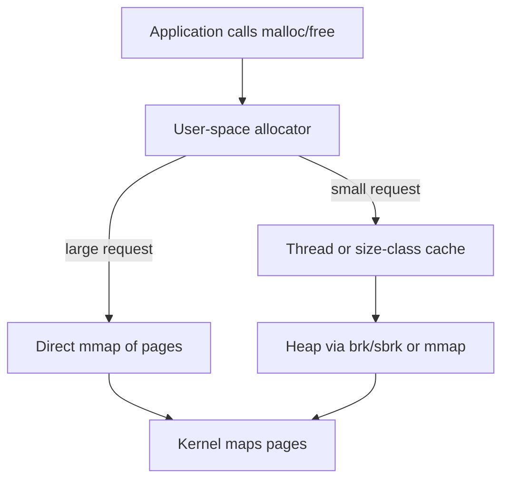
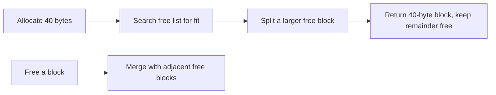
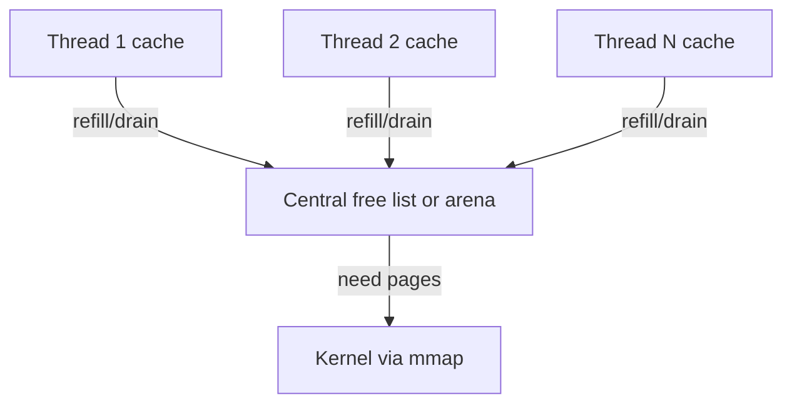

The previous chapter described the heap as the region for data whose lifetime or size is not known at compile time. This chapter goes inside it to the allocator, the machinery that actually hands out memory. It is the sixth article of Stage 6, and it is where the heap's abstract promise becomes concrete, and where many production memory problems are really born.

When a program calls `malloc`, it does not talk to the kernel directly for every small request. The kernel deals in pages, typically four kilobytes and up. A program asks for seventeen bytes, or forty, or a few hundred, far smaller than a page and far more frequent than page faults. The allocator sits between the program and the kernel, taking large chunks of pages from the operating system and carving them into the small blocks the program requests, while remembering what is free so it can be reused. Getting this right under concurrency and fragmentation pressure is one of the hardest problems in systems software.

## What an allocator actually does

The allocator's job is to satisfy allocation requests from a pool of memory it obtained from the kernel, and to reclaim that memory when the program frees it. It must do this quickly, with low overhead, in a thread-safe way, and without wasting too much memory to fragmentation.



The kernel interface is coarse. The allocator grows the heap with `brk` or `sbrk`, which moves the heap boundary, or it requests whole pages with `mmap`. Either way it receives page-aligned blocks. It then subdivides those blocks into the arbitrary sizes a program wants, which means it must track ownership, size, and free state for every block, and it must answer the question "where can I put the next request" efficiently.

## The contract and its constraints

The allocator gives the program a pointer to a block of at least the requested size, aligned to a boundary suitable for any type (often sixteen bytes). The program later returns that pointer with `free`, and the allocator may reuse the space. The contract looks simple, but it hides hard constraints.

Alignment matters because some CPU instructions require that a value live at a particular memory boundary. The allocator must round up requests so the returned pointer satisfies the strictest common requirement, which already introduces a little internal fragmentation.

The allocator cannot know the future. It does not know how many blocks of each size will be requested, nor in what order they will be freed. It must perform well across every pattern a program might use, from a few long-lived large buffers to millions of tiny short-lived objects. No single strategy is best for all of them, which is why allocators are full of heuristics.

## A simple allocator to build intuition

Imagine the allocator keeps a list of free blocks, each tagged with its size. On an allocation it searches the list for a block large enough, splits it if there is leftover space, and returns the fitting piece. On a free it returns the block to the list. This is a free-list allocator with first-fit search.

The problems appear immediately. Searching the whole list on every allocation is slow. Splitting leaves small fragments that may never be requested again. When two adjacent free blocks exist, they should be merged back into one larger block, a step called coalescing, or the free list fills with unusable crumbs. A program that allocates and frees many different sizes can turn a heap with plenty of free bytes into one that cannot satisfy a large request because those bytes are scattered.



A bump allocator is the opposite extreme: it keeps a single pointer and hands out the next slice, never reusing freed memory until the whole region is reset. It is blazingly fast and fragmentation-free within a region, but it only works when all allocations share a known lifetime, as in an arena or a request-scoped scratch buffer. Real general-purpose allocators borrow ideas from both, using bump-style fast paths for common cases and free-list style management for the rest.

## Fragmentation seen from the allocator

The two fragmentation kinds from the previous chapter are the allocator's daily struggle. Internal fragmentation is the rounding-up overhead: a request for 24 bytes rounded to 32, or a size class of 64 used for a 50-byte object, leaves slack inside every block. External fragmentation is the scattered-free problem: total free memory is enough, but no single contiguous piece fits the request.

External fragmentation is especially nasty because it is invisible from the program's view of "how much I allocated." The live data may be small while the resident heap is large, because the allocator is holding onto many half-used pages waiting for a request shape that may never come. This is why a service can free most of its memory and still show a high resident set: the allocator has not, or cannot, return those pages to the kernel.

## The concurrency problem

On a single thread, an allocator just needs a fast free list. On many threads, every allocation touches shared state, and shared state needs protection. A naive allocator with one global lock serializes all allocations through a single point, and on a service with dozens of threads allocating constantly, that lock becomes a bottleneck. The symptom is high CPU in allocation paths and poor scaling as thread count grows, even when the work per thread is independent.

The modern answer is to give each thread, or each CPU, its own pool of memory, so most allocations never touch shared state. A thread allocates from its local cache and frees back to it; only when the cache is empty or full does it coordinate with a shared structure. This removes most lock contention, at the cost of some memory sitting idle in one thread's cache while another thread is short.

## The major allocators in practice

Three designs dominate production C and C++ services, and a backend engineer should know how they differ because the choice changes both latency and memory footprint.

glibc's ptmalloc2 is the default on most Linux systems. It uses multiple arenas, each a independent heap region protected by its own lock, so threads can allocate in parallel up to the number of arenas. It organizes freed memory into bins by size, with fast paths for small objects. Its weakness is that it can create many arenas (often scaled to the number of CPUs), each reserving a sizable chunk of address space and memory, which can inflate resident size. It also holds onto freed memory rather than returning it to the kernel promptly, so freed-but-unreturned memory shows as high RSS.

jemalloc was built for threading and low fragmentation. It uses arenas, each divided into size classes, and gives every thread a small cache (the tcache) so common allocations stay local. Its design deliberately reduces fragmentation and, importantly, returns memory to the operating system through a background decay mechanism, so a service that frees memory tends to give it back. This makes jemalloc a common choice for long-running, allocation-heavy services such as databases and caches.

tcmalloc, from the same lineage as Google's workload, emphasizes per-thread caches backed by a central free list, grouping memory into spans. It is extremely fast for small object allocation and scales well with threads, which is why it appears in many high-throughput systems. Its size-class design also keeps small-object overhead low.



The practical difference shows up under load. A service doing many small allocations across many threads may stall on ptmalloc's arenas and hold memory it no longer needs, while the same service on jemalloc or tcmalloc can show lower tail latency and a resident set that actually shrinks when load drops. The allocator is not a detail you can ignore once a service is big enough.

## Small and large allocations are different

Allocators split the world by size. Small allocations, the common case, go through size classes and thread caches, because speed and fragmentation control matter most there. A request for 24 bytes is rounded to the nearest class, say 32, and served from a cache of pre-carved 32-byte blocks.

Large allocations bypass the small-object machinery. A request for several megabytes is satisfied directly with `mmap`, so it is backed by its own pages and can be returned to the kernel cleanly when freed. This is why a single large buffer freed can reduce RSS, while a million small objects freed may not, because the small objects live inside pages shared with other live objects that keep the whole page resident.

This distinction explains a debugging rule: if you want memory to be returned to the OS quickly, prefer fewer, larger allocations, or use an allocator whose decay returns small-object pages. If you allocate countless tiny objects, expect some overhead to stay resident.

## Alignment, hooks, and safety tools

Allocators also honor stricter alignment requests through functions like `posix_memalign` or `aligned_alloc`, used for direct I/O buffers or SIMD data. They expose introspection: glibc has `mallinfo` and `malloc_stats`, jemalloc has `malloc_stats_print` and the `jeprof` tool, and tcmalloc has its own statistics. These are how you see what the allocator thinks is going on, which is often different from what the program thinks.

Safety tools build on the allocator. AddressSanitizer replaces the allocator with one that surrounds every block with guard regions and checks accesses, catching overflows and use-after-free that a normal allocator would silently allow. These tools are the bridge to the memory-safety chapter, because the allocator is exactly where such bugs can be caught early.

## Observing allocator behavior

The environment shapes the allocator. `MALLOC_ARENA_MAX` caps how many arenas glibc will create, which directly limits the address space and memory it reserves per thread. `MALLOC_TRIM_THRESHOLD` influences when it returns memory to the kernel. For jemalloc, options like background thread decay control how eagerly freed memory is released.

```bash
# limit glibc arenas to reduce RSS inflation
export MALLOC_ARENA_MAX=2
# enable jemalloc stats via mallctl in code, or read from the running process
# see heap growth over time
watch -n 1 "grep -E 'VmRSS|VmData' /proc/\$(pgrep myservice)/status"
# profile allocations (glibc)
MALLOC_STATS=1 ./myservice 2>&1 | grep -A20 'arenas'
# jemalloc heap profile
export MALLOC_CONF="prof:true,prof_active:true,prof_prefix:/tmp/jeprof"
jeprof --show_bytes /path/to/binary /tmp/jeprof.*.heap
```

What this surfaced in real incidents is memory that the program freed but the allocator kept, arenas that multiplied with thread count, and size classes whose overhead added up. The `smaps` and `status` views from earlier chapters still apply; here they are paired with allocator-specific stats to explain why the heap looks the way it does.

## A realistic production example

A team ran a C++ service that handled many small messages, each parsed into a tree of small objects allocated with `new` and freed when the request finished. Under moderate load it was fine, but as they added cores to raise throughput, resident memory grew far past the live data size, and tail latency rose. Profiling showed time spent inside `malloc` and `free`, and `pmap` showed dozens of large anonymous regions, one per arena, each reserving tens of megabytes.

The default allocator had created an arena per CPU, and because request handling touched many small objects across threads, those arenas stayed populated. When load dropped, the service did not shrink, because the freed small objects lived in pages also holding live objects, so the pages could not be returned. The memory was "free" inside the allocator but not free to the kernel.

They first set `MALLOC_ARENA_MAX` to a small number, which capped the worst of the arena proliferation and lowered resident memory. The real improvement came from switching the build to link jemalloc, whose per-thread caches reduced allocation contention and whose background decay returned idle pages to the OS. After the change, resident set tracked live data much more closely, dropped when load dropped, and the allocation-time portion of tail latency largely disappeared. The lesson was that at scale the allocator is part of the system's behavior, not an implementation detail, and the choice between ptmalloc, jemalloc, and tcmalloc is a production decision with measurable consequences.

## How engineers actually reason about allocators

They match the allocator to the workload. A single-threaded utility can use the default and never notice. A multi-threaded, allocation-heavy service should be evaluated on jemalloc or tcmalloc, because the default's arena behavior and reluctance to return memory can cost both latency and footprint.

They watch for the signature of allocator trouble: rising RSS that does not fall when load falls, high CPU in allocation functions, and poor scaling as threads increase. Those point at fragmentation and lock contention, not at the application logic.

They think in size classes. Designing data structures to land in the same size class, or to use fewer larger allocations, reduces overhead and fragmentation. A request-scoped arena that bumps allocations and frees them all at once can eliminate per-object free-list cost entirely for the right workload.

They use the tools. `MALLOC_ARENA_MAX`, allocator stats, heap profilers, and sanitizers are how you see past "the heap is big" to "the allocator is holding these pages because of this pattern."

## The kernel's own allocators: slab, slub, and kmalloc

The user-space allocator is not the only one in play. The kernel itself allocates memory constantly: for each open file, socket, process, page table, and inode it keeps objects whose size is fixed and known. Rather than carve these from the page allocator by hand, the kernel uses the slab allocator, specifically the slub variant on most Linux systems, which caches pre-initialized objects of common sizes in slabs backed by pages. `kmalloc` draws from these caches for small kernel allocations, and `vmalloc` handles larger virtually-contiguous regions. These show up in `/proc/meminfo` as the `Slab` and `SReclaimable` or `SUnreclaim` lines, and `slabtop` ranks them by usage.


This matters to a backend engineer because kernel memory is part of the machine's total even though it does not appear in a process's RSS, and a workload that opens many files, sockets, or connections grows the slab. `SReclaimable` can be reclaimed under pressure, but `SUnreclaim` is pinned by kernel objects that are still referenced, and a leak of kernel objects, say, never-closed descriptors or sockets, shows up there first, long before your allocator metrics move.

## Tuning the allocator: the knobs that change footprint and latency

The environment variables and `mallopt` calls change behavior without recompiling. `MALLOC_ARENA_MAX` caps the number of arenas glibc creates, which directly limits address space and memory reserved per thread; setting it low reduces RSS inflation at the cost of more contention. `M_MMAP_THRESHOLD` sets the size above which glibc uses `mmap` directly instead of the heap, so large allocations stay returnable to the kernel; raising it keeps more in the heap. `M_TRIM_THRESHOLD` and `M_TOP_PAD_` control when the top of the heap is returned to the kernel and how much padding is kept, which governs whether a freed large region actually lowers RSS.

Two more are about correctness rather than size. `MALLOC_CHECK_` and `MALLOC_PERTURB_` catch heap corruption early by checking consistency or poisoning freed memory on every call, at a large performance cost, useful in test runs. Modern glibc also enables safe-linking, which encodes free-list pointers so common heap-overflow and use-after-free exploits that rewrite them fail, a mitigation that lives in the allocator itself. For introspection, prefer `mallinfo2` over the old 32-bit `mallinfo`, which overflows on large heaps, and call `malloc_trim` to ask the allocator to return idle pages now rather than waiting for its own threshold.

## Profiling and debugging: heap profilers and sanitizers

When a heap misbehaves, the right tool depends on the question. To see what the allocator is holding, use its own stats: glibc `malloc_stats` and `mallinfo2`, jemalloc `malloc_stats_print` and the `jeprof` heap profiler, and tcmalloc's `pprof`-compatible heap profile. To see what your program allocated over time, use a sampling profiler such as `heaptrack` or `valgrind --tool=massif`, which attribute bytes to call sites so you can find the structure that grows.

For leaks and lifetime bugs, the sanitizers are the workhorses. AddressSanitizer catches heap buffer overflows and use-after-free by surrounding allocations with poisoned redzones. LeakSanitizer, often bundled with it, reports allocations that were never freed at exit. For C++, a custom `std::allocator` can point containers at a tracking allocator to find leaks in specific subsystems. The key is to run these in CI or on a canary, because they trade speed for coverage and are too slow for full production traffic, but they pinpoint the exact line that misuses memory.

## Definitions

### An allocator

> The user-space component that obtains pages from the kernel and carves them into the arbitrary-size blocks a program requests, tracking free space so it can be reused. It sits between `malloc` and the operating system.

### A free list

> A structure recording which blocks of memory are available to hand out. The allocator searches it on allocation and returns blocks to it on free, often merging adjacent free blocks to fight fragmentation.

### An arena

> An independent region of the heap with its own lock and bookkeeping, used by threaded allocators so that different threads can allocate in parallel without contending on a single global lock.

### Size classes

> Fixed bucket sizes into which requests are rounded, so the allocator can keep pre-carved pools of common sizes and avoid managing arbitrary sizes for every object.

### Fragmentation, revisited

> Internal waste from rounding up to a size class or alignment, and external waste from free memory scattered so no contiguous piece fits a request. Both keep resident memory higher than live data requires.

## Beyond the definitions

### Why does the allocator not just return freed memory to the kernel

> Because it usually cannot. Small freed objects share pages with live objects, so the page stays resident. The allocator only returns whole pages, and only when none of their blocks are in use, or when a decay or trim mechanism decides to. That is why RSS can stay high after freeing.

### Why do different allocators give different memory usage for the same program

> They make different tradeoffs on arenas, size classes, thread caches, and how eagerly they return pages. One may keep memory warm for speed, another may return it for footprint, and those choices change both latency and resident set under identical application behavior.

### What does per-thread caching buy you

> It lets most allocations avoid touching shared, locked state, so threads allocate in parallel without stalling on each other. The cost is memory sitting idle in one thread's cache while another is short, which good allocators balance with periodic draining.

### When should you use an arena instead of the general allocator

> When many allocations share a clear lifetime, such as a single request or a parsing pass. An arena bumps allocations and frees them all at once, removing per-object overhead and fragmentation for that phase, at the cost of not supporting individual frees mid-phase.

### How do sanitizers relate to the allocator

> Tools like AddressSanitizer replace or wrap the allocator to add redzones and tracking, then check every access against that metadata. The allocator is the natural control point for catching overflows and use-after-free, which is why the memory-safety chapter leans on it.

## Common misconceptions

**"malloc talks to the kernel every time."** It talks to the kernel only when it needs more pages. For the common small request it serves from memory it already holds, which is why allocation is normally cheap and why allocator design, not syscalls, dominates its cost.

**"Freeing memory lowers RSS."** It lowers the allocator's free pool, but RSS only drops if the freed objects let whole pages be returned to the kernel, which depends on the allocator, the size, and the surrounding live objects. Small-object frees often do not reduce RSS.

**"The default allocator is fine for everything."** It is fine for most programs but can cost latency and memory at high thread counts and high allocation rates, where arenas multiply and memory is held. Choosing jemalloc or tcmalloc is a real production lever.

**"Fragmentation is only an embedded or old-system problem."** It appears in any long-running service that allocates and frees many sizes, and it is a leading cause of creeping RSS that looks like a leak but is actually scattered free space the allocator cannot reuse.

**"More threads always make allocation faster."** More threads increase contention unless the allocator gives each thread local space. With a global lock, more threads make allocation slower; with per-thread caches, they scale until cache balancing becomes the limit.

## Summary

The allocator is the layer that turns kernel pages into the small blocks a program requests, and its design decides the heap's real cost. It must balance speed, fragmentation, and thread scaling, using arenas and size classes and per-thread caches to do so. The differences between ptmalloc, jemalloc, and tcmalloc are not academic: they change tail latency and resident memory in production, especially for allocation-heavy, multi-threaded services. The final chapter of this stage turns from obtaining memory to keeping it correct, with the memory-safety bugs that the allocator and the languages on top of it are meant to prevent.
