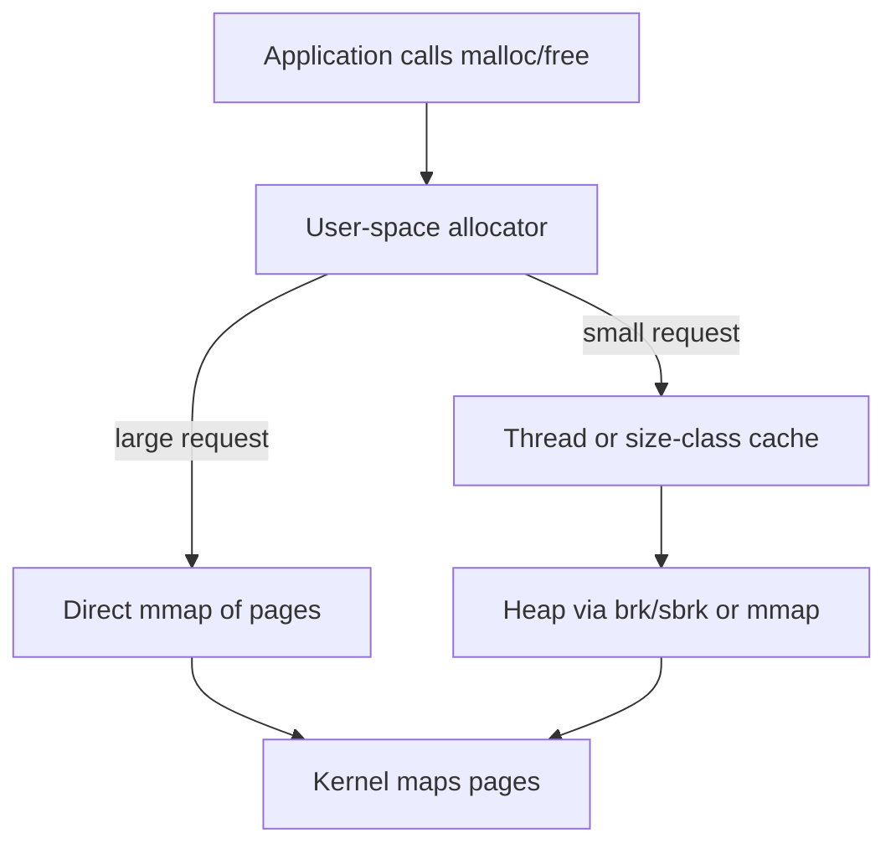
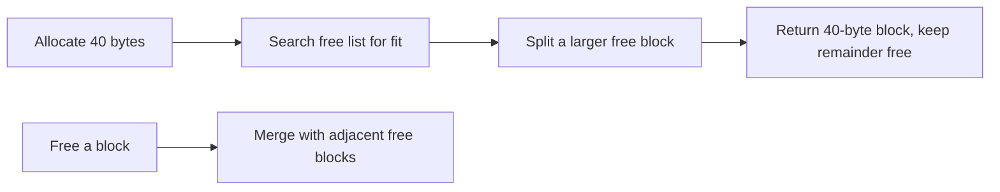
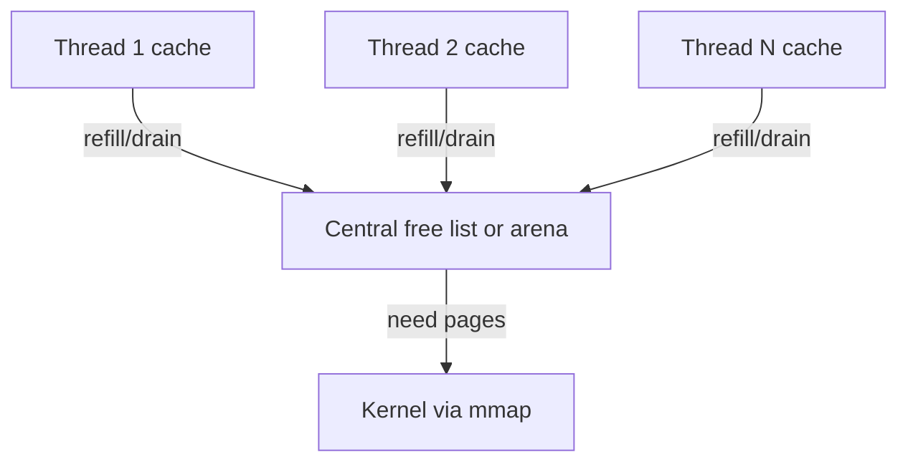

The previous chapter described the heap. The heap holds data whose size or lifetime is not known when the program is compiled. This chapter looks inside the heap at the allocator. The allocator is the part that actually hands out memory blocks. This is the sixth article of Stage 6. Here the heap's promise becomes real, and here many production memory problems begin.

When a program calls `malloc`, it does not ask the kernel for every small request. The kernel works in pages. A page is usually four kilobytes or more. A program may ask for seventeen bytes, or forty, or a few hundred. These sizes are far smaller than a page and far more common than a page request. The allocator sits between the program and the kernel. It takes big chunks of pages from the operating system. Then it cuts those chunks into the small blocks the program asks for. It also remembers which blocks are free so it can reuse them. Doing this well under heavy load from many threads is one of the hardest problems in systems software.

## What an allocator actually does

The allocator has one job. It gives the program memory blocks from a pool it got from the kernel. It gives that memory back to the pool when the program frees it. It must do this fast. It must use little extra memory. It must work safely when many threads run at once. It must avoid wasting memory through fragmentation. Fragmentation is wasted free space that the allocator cannot hand out.



The kernel interface is coarse. The allocator grows the heap with `brk` or `sbrk`. These calls move the heap boundary. Or the allocator asks the kernel for whole pages with `mmap`. Either way it receives blocks that line up with page boundaries. Then it cuts those blocks into the exact sizes the program wants. It must track who owns each block, how big it is, and whether it is free. It must answer one question fast: where can I put the next request.

## The contract and its constraints

The allocator gives the program a pointer to a block. The block is at least as big as the request. The block starts at an address that works for any data type. Such an address is called an alignment. The common rule is sixteen bytes. The program later returns the pointer with `free`. The allocator may then reuse that space. The rule looks simple, but it hides hard limits.

Alignment matters because some CPU instructions need a value at a specific memory boundary. The allocator must round requests up to satisfy the strictest common rule. This rounding already wastes a little space inside each block. That waste is called internal fragmentation.

The allocator cannot see the future. It does not know how many blocks of each size the program will want. It does not know the order in which blocks will be freed. It must work well for every pattern a program may use. A program might ask for a few large buffers that live a long time. Or it might ask for millions of tiny objects that live for a moment. No single plan is best for all of them. That is why allocators rely on rules of thumb, called heuristics.

## A simple allocator to build intuition

Suppose the allocator keeps a list of free blocks. Each block carries a tag with its size. On an allocation it walks the list to find a block big enough. If the block has extra space, it splits off the part it needs and keeps the rest free. On a free it puts the block back on the list. This is a free-list allocator with first-fit search.

Problems show up at once. Walking the whole list on every allocation is slow. Splitting leaves small leftover pieces that may never be used. When two free blocks sit next to each other, the allocator should merge them into one bigger block. This step is called coalescing. Without it the free list fills with crumbs no one can use. Suppose your service allocates and frees many different sizes. It can turn a heap with plenty of free bytes into a heap that cannot satisfy a large request, because those bytes are scattered.

A bump allocator is the opposite extreme. It keeps one pointer and hands out the next slice. It never reuses freed memory until the whole region is reset. It is very fast and it causes no fragmentation inside the region. But it only works when all allocations share a known lifetime. An arena or a request-scoped scratch buffer is a good fit. Real general-purpose allocators borrow from both. They use bump-style fast paths for common cases. They use free-list style management for the rest.



A bump allocator is the opposite extreme. It keeps a single pointer and hands out the next slice. It never reuses freed memory until the whole region is reset. It is blazingly fast and fragmentation-free within a region. But it only works when all allocations share a known lifetime, as in an arena or a request-scoped scratch buffer. Real general-purpose allocators borrow ideas from both. They use bump-style fast paths for common cases and free-list style management for the rest.

## Fragmentation seen from the allocator

The allocator fights the two kinds of fragmentation from the previous chapter. Internal fragmentation is wasted space from rounding up. Suppose a program asks for 24 bytes and the allocator gives 32. Or it puts a 50-byte object into a 64-byte size class. Each block then holds slack the program cannot use. External fragmentation is the scattered-free problem. The total free memory is enough, but no single continuous piece is big enough for the request.

External fragmentation is hard to see. The program knows how much it allocated, but it cannot see the scatter. The live data may be small while the resident heap is large. The allocator holds many half-used pages and waits for a request shape that may never come. This is why a service can free most of its memory and still show a high resident set. The allocator has not returned those pages to the kernel. Or it cannot, because the pages still hold live objects.

## The concurrency problem

On a single thread, the allocator just needs a fast free list. With many threads, every allocation touches shared state. Shared state needs protection. A naive allocator uses one global lock. That lock forces all allocations through a single point. Suppose your service runs dozens of threads that allocate constantly. That lock becomes a bottleneck. The symptom is high CPU in allocation code and poor scaling as you add threads, even when each thread does independent work.

The modern answer is to give each thread its own pool of memory. A CPU can also get its own pool. Most allocations then never touch shared state. A thread takes memory from its local cache and returns it there. It only talks to a shared structure when its cache is empty or full. This removes most lock contention. The cost is some memory sitting idle in one thread's cache while another thread runs short.

## The major allocators in practice

Three designs dominate production C and C++ services. A backend engineer should know how they differ. The choice changes both latency and memory footprint.

glibc's ptmalloc2 is the default on most Linux systems. It uses multiple arenas. An arena is an independent heap region with its own lock. Threads can allocate in parallel up to the number of arenas. ptmalloc2 sorts freed memory into bins by size and gives small objects fast paths. Its weakness is that it can create many arenas. The count often scales with the number of CPUs. Each arena reserves a sizable chunk of address space and memory. That can inflate the resident set. It also holds freed memory instead of returning it to the kernel quickly. So freed-but-unreturned memory shows as high RSS.

jemalloc was built for threads and low fragmentation. It uses arenas, each split into size classes. It gives every thread a small cache called the tcache. Common allocations then stay local to the thread. Its design cuts fragmentation on purpose. Importantly, it returns memory to the operating system through a background decay mechanism. A service that frees memory tends to give it back. This makes jemalloc a common pick for long-running, allocation-heavy services like databases and caches.

tcmalloc comes from Google's workload lineage. It emphasizes per-thread caches backed by a central free list. It groups memory into spans. It is extremely fast for small object allocation and it scales well with threads. That is why it shows up in many high-throughput systems. Its size-class design also keeps small-object overhead low.



The practical difference shows up under load. Suppose your service does many small allocations across many threads. On ptmalloc it may stall on its arenas and hold memory it no longer needs. On jemalloc or tcmalloc the same service can show lower tail latency. Its resident set can shrink when load drops. Once a service is big enough, you cannot treat the allocator as a detail you can ignore.

## Small and large allocations are different

Allocators split the world by size. Small allocations are the common case. They go through size classes and thread caches, because speed and fragmentation control matter most there. Suppose a program asks for 24 bytes. The allocator rounds it to the nearest class, say 32. It serves the request from a cache of pre-carved 32-byte blocks.

Large allocations bypass the small-object machinery. A request for several megabytes is served directly with `mmap`. It is backed by its own pages and can be returned to the kernel cleanly when freed. This is why freeing one large buffer can reduce RSS. Freeing a million small objects may not. The small objects live inside pages shared with other live objects. Those live objects keep the whole page resident.

This points to a debugging rule. If you want memory returned to the OS quickly, use fewer and larger allocations. Or use an allocator whose decay returns small-object pages. If you allocate countless tiny objects, expect some overhead to stay resident.

## Alignment, hooks, and safety tools

Allocators also honor stricter alignment requests. Functions like `posix_memalign` or `aligned_alloc` ask for a specific boundary. Programs use them for direct I/O buffers or SIMD data. Allocators also expose introspection. This means they report what they are doing. glibc has `mallinfo` and `malloc_stats`. jemalloc has `malloc_stats_print` and the `jeprof` tool. tcmalloc has its own statistics. These reports show what the allocator thinks is going on. That is often different from what the program thinks.

Safety tools build on the allocator. AddressSanitizer replaces the allocator with one that surrounds every block with guard regions. It checks every access. It catches overflows and use-after-free that a normal allocator would allow silently. These tools bridge to the memory-safety chapter. The allocator is exactly where such bugs can be caught early.

## Observing allocator behavior

The environment shapes the allocator. `MALLOC_ARENA_MAX` caps how many arenas glibc will create. This directly limits the address space and memory it reserves per thread. `MALLOC_TRIM_THRESHOLD` influences when it returns memory to the kernel. For jemalloc, options like background thread decay control how eagerly freed memory is released.

```bash
# limit glibc arenas to reduce RSS inflation
export MALLOC_ARENA_MAX=2
# enable jemalloc stats via mallctl in code, or read from the running process
# see heap growth over time
watch -n 1 "grep -E 'VmRSS|VmData' /proc/\$(pgrep myservice)/status"
# profile allocations (glibc)
MALLOC_STATS=1 ./myservice 2>&1 | grep -A20 'arenas'
# jemalloc heap profile
export MALLOC_CONF="prof:true,prof_active:true,prof_prefix:/tmp/jeprof"
jeprof --show_bytes /path/to/binary /tmp/jeprof.*.heap
```

In real incidents these commands surfaced a pattern. The program freed memory but the allocator kept it. Arenas multiplied as thread count grew. Size classes added overhead that piled up. The `smaps` and `status` views from earlier chapters still apply. Here they are paired with allocator-specific stats to explain why the heap looks the way it does.

## A realistic production example

A team ran a C++ service that handled many small messages. Each message was parsed into a tree of small objects allocated with `new`. The objects were freed when the request finished. Under moderate load it was fine. As they added cores to raise throughput, resident memory grew far past the live data size. Tail latency rose. Profiling showed time spent inside `malloc` and `free`. `pmap` showed dozens of large anonymous regions. There was one region per arena, and each reserved tens of megabytes.

The default allocator had created one arena per CPU. Request handling touched many small objects across threads, so those arenas stayed full. When load dropped, the service did not shrink. The freed small objects lived in pages that also held live objects, so the pages could not be returned. The memory was "free" inside the allocator but not free to the kernel.

They first set `MALLOC_ARENA_MAX` to a small number. This capped the worst of the arena growth and lowered resident memory. The real improvement came from linking jemalloc instead. Its per-thread caches reduced allocation contention. Its background decay returned idle pages to the OS. After the change, the resident set tracked live data much more closely. It dropped when load dropped. The part of tail latency spent in allocation largely disappeared. The lesson was this. At scale the allocator is part of the system's behavior, not an implementation detail. The choice between ptmalloc, jemalloc, and tcmalloc is a production decision with measurable consequences.

## How engineers actually reason about allocators

They match the allocator to the workload. A single-threaded utility can use the default and never notice. A multi-threaded, allocation-heavy service should be tried on jemalloc or tcmalloc. The default's arena behavior and reluctance to return memory can cost both latency and footprint.

They watch for the signature of allocator trouble. RSS rises and does not fall when load falls. CPU is high in allocation functions. Scaling gets poor as threads increase. These signs point at fragmentation and lock contention, not at the application logic.

They think in size classes. They design data structures to land in the same size class. Or they use fewer and larger allocations. This reduces overhead and fragmentation. A request-scoped arena can bump allocations and free them all at once. For the right workload this removes per-object free-list cost entirely.

They use the tools. `MALLOC_ARENA_MAX`, allocator stats, heap profilers, and sanitizers show you what is really happening. They move you past "the heap is big" to "the allocator is holding these pages because of this pattern."

## The kernel's own allocators: slab, slub, and kmalloc

The user-space allocator is not the only one in play. The kernel itself allocates memory constantly. For each open file, socket, process, page table, and inode it keeps objects whose size is fixed and known. Rather than carve these from the page allocator by hand, the kernel uses the slab allocator. The slub variant runs on most Linux systems. It caches pre-initialized objects of common sizes in slabs backed by pages. `kmalloc` draws from these caches for small kernel allocations. `vmalloc` handles larger virtually-contiguous regions. These show up in `/proc/meminfo` as the `Slab`, `SReclaimable`, and `SUnreclaim` lines. `slabtop` ranks them by usage.


This matters to a backend engineer for a simple reason. Kernel memory is part of the machine's total even though it does not appear in a process's RSS. A workload that opens many files, sockets, or connections grows the slab. `SReclaimable` can be reclaimed under pressure. `SUnreclaim` is pinned by kernel objects that are still referenced. A leak of kernel objects shows up there first. An example is never-closed descriptors or sockets. This happens long before your allocator metrics move.

## Tuning the allocator: the knobs that change footprint and latency

The environment variables and `mallopt` calls change behavior without recompiling. `MALLOC_ARENA_MAX` caps the number of arenas glibc creates. This directly limits address space and memory reserved per thread. Setting it low reduces RSS inflation at the cost of more contention. `M_MMAP_THRESHOLD` sets the size above which glibc uses `mmap` directly instead of the heap. Large allocations then stay returnable to the kernel. Raising it keeps more in the heap. `M_TRIM_THRESHOLD` and `M_TOP_PAD_` control when the top of the heap is returned to the kernel. They also control how much padding is kept. This governs whether a freed large region actually lowers RSS.

Two more options are about correctness rather than size. `MALLOC_CHECK_` and `MALLOC_PERTURB_` catch heap corruption early. They check consistency or poison freed memory on every call. This costs a lot of performance, so it is useful in test runs. Modern glibc also enables safe-linking. It encodes free-list pointers so common heap-overflow and use-after-free exploits that rewrite them fail. This mitigation lives in the allocator itself. For introspection, prefer `mallinfo2` over the old 32-bit `mallinfo`. The old one overflows on large heaps. Call `malloc_trim` to ask the allocator to return idle pages now instead of waiting for its own threshold.

## Profiling and debugging: heap profilers and sanitizers

When a heap misbehaves, the right tool depends on the question. To see what the allocator is holding, use its own stats. glibc has `malloc_stats` and `mallinfo2`. jemalloc has `malloc_stats_print` and the `jeprof` heap profiler. tcmalloc has a `pprof`-compatible heap profile. To see what your program allocated over time, use a sampling profiler. `heaptrack` and `valgrind --tool=massif` are two examples. They attribute bytes to call sites so you can find the structure that grows.

For leaks and lifetime bugs, the sanitizers are the workhorses. AddressSanitizer catches heap buffer overflows and use-after-free. It surrounds allocations with poisoned redzones. LeakSanitizer is often bundled with it. It reports allocations that were never freed at exit. For C++, a custom `std::allocator` can point containers at a tracking allocator. This helps find leaks in specific subsystems. The key is to run these in CI or on a canary. They trade speed for coverage and are too slow for full production traffic. But they pinpoint the exact line that misuses memory.

## Definitions

### An allocator

> The user-space component that gets pages from the kernel. It cuts those pages into the arbitrary-size blocks a program requests. It tracks free space so it can be reused. It sits between `malloc` and the operating system.

### A free list

> A structure that records which blocks of memory are free to hand out. The allocator searches it on allocation and returns blocks to it on free. It often merges adjacent free blocks to fight fragmentation.

### An arena

> An independent region of the heap with its own lock and bookkeeping. Threaded allocators use arenas so that different threads can allocate in parallel. They do not contend on a single global lock.

### Size classes

> Fixed bucket sizes into which requests are rounded. The allocator keeps pre-carved pools of common sizes. This avoids managing arbitrary sizes for every object.

### Fragmentation, revisited

> Internal waste comes from rounding up to a size class or alignment. External waste comes from free memory that is scattered, so no contiguous piece fits a request. Both keep resident memory higher than live data requires.

## Beyond the definitions

### Why does the allocator not just return freed memory to the kernel

> Because it usually cannot. Small freed objects share pages with live objects, so the page stays resident. The allocator only returns whole pages. It does so only when none of their blocks are in use, or when a decay or trim mechanism decides to. That is why RSS can stay high after freeing.

### Why do different allocators give different memory usage for the same program

> They make different tradeoffs on arenas, size classes, thread caches, and how eagerly they return pages. One may keep memory warm for speed. Another may return it for footprint. Those choices change both latency and resident set under identical application behavior.

### What does per-thread caching buy you

> It lets most allocations avoid touching shared, locked state. Threads allocate in parallel without stalling on each other. The cost is memory sitting idle in one thread's cache while another is short. Good allocators balance this with periodic draining.

### When should you use an arena instead of the general allocator

> When many allocations share a clear lifetime, such as a single request or a parsing pass. An arena bumps allocations and frees them all at once. This removes per-object overhead and fragmentation for that phase. The cost is that it does not support individual frees mid-phase.

### How do sanitizers relate to the allocator

> Tools like AddressSanitizer replace or wrap the allocator to add redzones and tracking. Then they check every access against that metadata. The allocator is the natural control point for catching overflows and use-after-free. That is why the memory-safety chapter leans on it.

## Common misconceptions

**"malloc talks to the kernel every time."** It talks to the kernel only when it needs more pages. For the common small request it serves from memory it already holds. This is why allocation is normally cheap. Allocator design, not syscalls, drives its cost.

**"Freeing memory lowers RSS."** It lowers the allocator's free pool. But RSS only drops if the freed objects let whole pages be returned to the kernel. This depends on the allocator, the size, and the surrounding live objects. Small-object frees often do not reduce RSS.

**"The default allocator is fine for everything."** It is fine for most programs. But it can cost latency and memory at high thread counts and high allocation rates. There arenas multiply and memory is held. Choosing jemalloc or tcmalloc is a real production lever.

**"Fragmentation is only an embedded or old-system problem."** It appears in any long-running service that allocates and frees many sizes. It is a leading cause of creeping RSS. That RSS looks like a leak but is actually scattered free space the allocator cannot reuse.

**"More threads always make allocation faster."** More threads increase contention unless the allocator gives each thread local space. With a global lock, more threads make allocation slower. With per-thread caches, they scale until cache balancing becomes the limit.

## Summary

The allocator is the layer that turns kernel pages into the small blocks a program requests. Its design decides the heap's real cost. It must balance speed, fragmentation, and thread scaling. It uses arenas, size classes, and per-thread caches to do so. The differences between ptmalloc, jemalloc, and tcmalloc are not academic. They change tail latency and resident memory in production, especially for allocation-heavy, multi-threaded services. The final chapter of this stage turns from obtaining memory to keeping it correct. It covers the memory-safety bugs that the allocator and the languages on top of it are meant to prevent.
