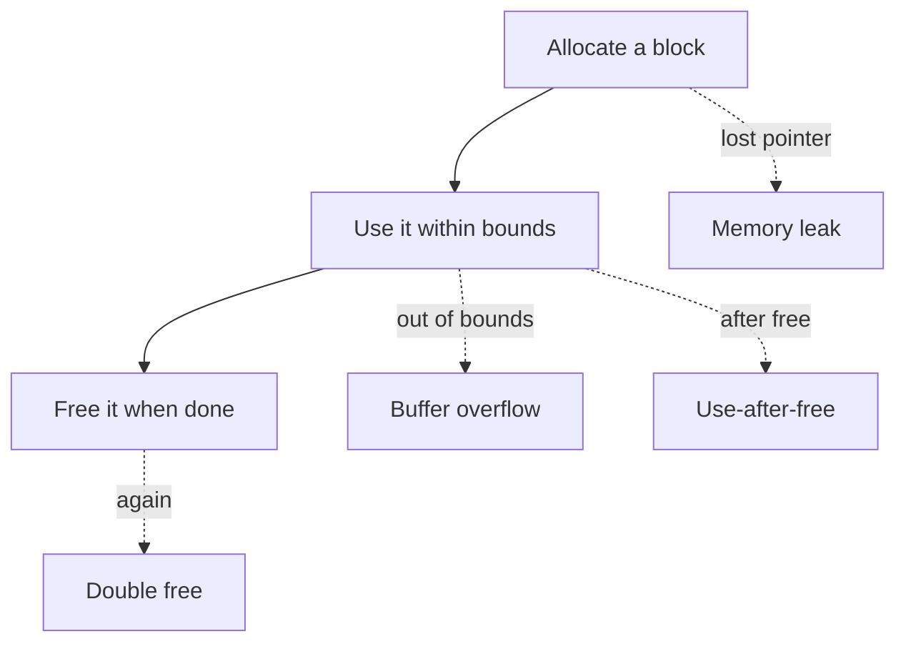
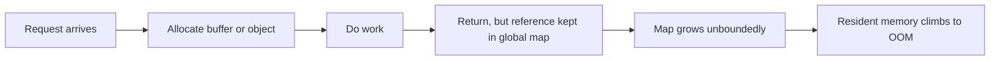
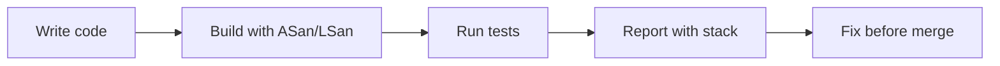
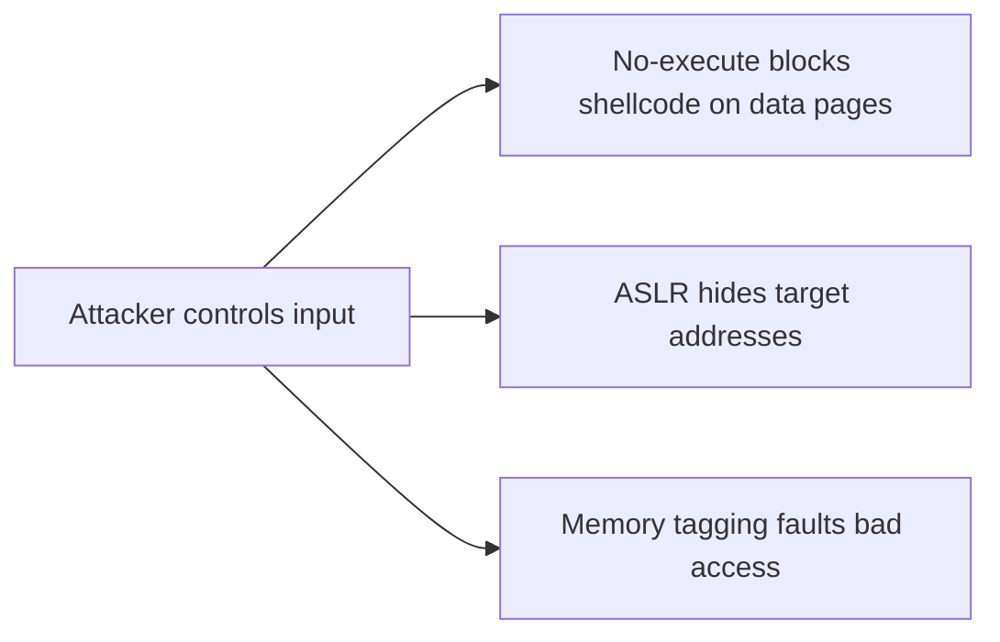

The previous chapters described how memory is addressed, translated, faulted in, mapped, laid out, and allocated. This final chapter of the stage asks the hard question that sits on top of all of it: is the program using that memory correctly. It is the seventh article of Stage 6, and it is where the cost of getting memory wrong leaves the realm of performance and enters the realm of crashes and security breaches.

Memory safety means a program only touches memory it owns, only while it owns it, and in the way it owns it. Break any of those and the failure is rarely a clean error. It is corrupted state, a crash hours later in an unrelated function, or a vulnerability an attacker can drive deliberately. A leak is the quieter failure: memory that is still owned but no longer useful, creeping upward until the machine swaps or the OOM killer arrives. Both are the reasons the allocator and the language on top of it exist in the first place.

## What memory safety means

A safe use of memory has three properties. The access is in bounds: the pointer points inside a block the program allocated. The access is in time: the block has not been freed yet, and it will not be freed while the access happens. The access respects ownership: the program may read or write as permitted, and no other part quietly changed the rules. When all three hold, memory is safe. When any fails, the program is in undefined territory, which means anything can happen, and often does.



The diagram shows the lifecycle and the four classic breaks. Each is a different mistake, but they share a root: the program lost track of what memory it owns and when. The earlier chapters gave the machinery; this one is about discipline and tools to keep that machinery honest.

## The common memory-safety bugs

A buffer overflow writes or reads past the end of a block. On the heap it clobbers adjacent allocations, corrupting data the program believed safe; on the stack it can overwrite the return address, which is how a benign-looking array write becomes a control-flow hijack. The previous chapter's stack discussion is exactly why stack overflows are so dangerous: they reach the return address and change where the function goes when it ends.

Use-after-free accesses a block after it has been freed. The allocator may have handed that memory to someone else, so the program is now reading or writing another object's data. The bug rarely shows where it happened; it shows later, when the real owner of that memory behaves impossibly. This is one of the hardest classes to debug because the symptom is disconnected from the cause.

Double free returns the same block twice. The allocator's bookkeeping assumes each block is freed once, and a second free corrupts its free list, often leading to a crash or, worse, to crafted allocations that reuse the same region in an attacker-controlled way.

Uninitialized reads use memory that was allocated but never written, so the contents are whatever was there before. The values are effectively random, and a program that depends on them has nondeterministic behavior that passes in test and fails in production.

Off-by-one errors and integer overflows deserve callouts because they cause the others. An integer that wraps, or a loop bound that is one too high, produces a size or index that looks plausible and then drives an overflow. Many real overflows start as an arithmetic mistake, not a careless copy.

## Why these bugs are dangerous beyond crashing

A crash is the kind outcome. The dangerous case is when the corruption is silent. An overflow that lands on data rather than on a return address changes program state in a way that is wrong but not immediately fatal, so the program keeps running with corrupted assumptions. A use-after-free that coincides with the memory being reused turns one bug into two interacting bugs.

From a security view, these are the basis of a large fraction of exploits. An attacker who can overflow a buffer can often overwrite a pointer or return address and redirect execution. A use-after-free can be manipulated to confuse ownership and gain access to memory that should be out of reach. This is why memory-safety bugs are treated as vulnerabilities, not mere defects, and why the tooling in this chapter has matured so far.

## Leaks and the slow failure

A leak is memory that remains allocated but is no longer reachable or useful. The simplest form is a lost pointer: the program allocated a block and then overwrote or dropped the only reference to it, so it can never be freed. A subtler form is a reachable but unused object, such as an entry in a cache or map that nothing will ever read again, which the garbage collector or allocator cannot reclaim because a reference still exists.



Leaks are insidious because they do not fail fast. A service with a slow leak can run for days before resident memory crosses into swapping or triggers the OOM killer, and by then the cause is buried under weeks of requests. The latency from the swapping chapter and the allocator retention from the previous chapter are exactly the mechanisms by which a leak becomes an outage.

## How languages try to prevent these bugs

The safeguards vary by language, and a backend engineer meets all of them across a career. C and C++ leave memory management to the programmer, which is the source of speed and of most of the bugs above. C++ offers RAII, smart pointers, and standard containers that tie lifetime to scope or reference counts, removing most manual-free errors when used consistently.

Garbage-collected languages such as Go and Java remove use-after-free and double-free for managed objects, because the collector only reclaims what nothing references. They do not remove leaks: a forgotten reference in a long-lived map is just as leak-prone as in C, and Go adds a distinctive variant, the goroutine leak, where a goroutine blocked forever holds its stack and everything it references. The collector cannot free what a live goroutine keeps alive.

Rust takes a different path: its ownership and borrow checker enforce at compile time that a value has exactly one owner and that references do not outlive what they point to. Whole classes of use-after-free and data races are rejected before the program runs. The cost is a stricter language to learn, but the memory-safety guarantee is structural rather than procedural.

The takeaway is that no language removes the need to think about ownership. Even with a collector or a checker, retaining references you no longer need is a leak, and unsafe escape hatches still exist. Tools and discipline remain necessary everywhere.

## Detecting bugs and leaks

The good news is that the bugs in this chapter are highly detectable with the right tools, and catching them early is far cheaper than debugging them in production.

Valgrind instruments a program to track every memory access, reporting overflows, use-after-free, and leaks precisely. It is thorough but slow, which makes it ideal for test runs rather than production.

AddressSanitizer, or ASan, compiles the program with runtime checks around every access, catching overflows and use-after-free with low overhead compared to Valgrind. LeakSanitizer, or LSan, builds on the same machinery to report leaks at exit. UndefinedBehaviorSanitizer catches the integer overflows and misaligned accesses that lead to the others.

Static analyzers scan source for patterns that often indicate these bugs, catching some issues without running the code. Heap profilers such as `jeprof` for jemalloc or `pprof` for Go show what is allocated and who holds references, which is how you find a cache that never evicts.



The pipeline that matters is putting these in continuous integration. A service built with sanitizers and exercised by its tests catches most memory bugs the moment they are introduced, instead of after a customer hits them. This is the single highest-leverage practice for memory safety.

## Defensive practices that prevent the bugs

Beyond tools, certain habits remove whole categories of failure. Prefer containers and safe wrappers over raw pointers, so bounds are checked and lifetime is tied to scope. Use smart pointers in C++ so frees happen automatically when the last owner disappears. Avoid unsafe integer arithmetic in size calculations, and check lengths before copies.

Zero sensitive memory when done with it, using a function the compiler cannot optimize away, which matters for keys and tokens; this ties back to the `mlock` discussion, since pinned memory holding secrets should also be wiped deliberately. Fuzz inputs, because the overflows that matter come from adversarial or unexpected data, exactly like the deep-recursion stack example from earlier.

Keep allocations scoped. The arena idea from the previous chapter is not only fast but safe: when a phase's memory is freed all at once, there is no per-object free to forget. Structure code so that the end of a request frees its memory in one place, and leaks become obvious rather than scattered.

## Observing memory safety in production

Production rarely tells you directly, but the signals are consistent. A steadily climbing resident set that does not fall with load is the leak signature from the allocator chapter. A crash with a stack trace in a completely different part of the code than the bug is the use-after-free signature. A corruption report, such as a hash table whose invariants break, is the overflow signature.

```bash
# watch resident memory for the leak signature
watch -n 5 "grep VmRSS /proc/\$(pgrep myservice)/status"
# capture a Go heap profile to find who holds memory
go tool pprof http://localhost:6060/debug/pprof/heap
# run a test binary under LeakSanitizer (built with -fsanitize=address)
./mytest 2>&1 | grep -A15 "LeakSanitizer"
# valgrind for a one-off thorough check
valgrind --leak-check=full ./mytest
```

These do not replace in-CI sanitizers, but they explain a running system. The heap profile is especially powerful in GC languages, where the leak is usually a retained reference rather than a lost free, and seeing the retaining path is the only way to find it.

## A realistic production example

A team shipped a C service that parsed requests and allocated a temporary buffer for each one. Most code paths freed the buffer before returning, but one error branch, taken only when a downstream call returned a specific rare status, returned early without freeing. Each occurrence leaked one buffer. In tests the status never appeared, so the leak was invisible.

In production the status happened a few times per million requests. Over days the service's resident memory crept upward, and eventually it began swapping and then was killed by the OOM killer, taking the whole process down. Because the growth was slow, it looked like ordinary memory pressure until the outage.

The fix came from process, not heroics. They added an AddressSanitizer and LeakSanitizer build to CI and ran the test suite under it. A new test that exercised the rare error branch reported the leak with the exact allocation and free-path stack. The fix was a single missing free on that branch, plus a restructure so the buffer was tied to a scope that freed it automatically on every exit. After that, the leak was impossible to reintroduce unnoticed, because CI failed on any leak. The lesson was that memory-safety bugs are cheap to catch early and expensive to catch late, and the difference is whether the tools run where the code is written.

## How engineers actually reason about memory safety

They assume the bug is there until tools say otherwise. Memory bugs are not a matter of writing carefully enough by hand; they are a matter of having ASan, LSan, and Valgrind in the loop so the compiler and runtime catch what the eye misses.

They treat leaks as reachable references, not only as missing frees. In a GC language that means auditing what holds a pointer, especially global maps and long-lived structs. In C++, it means ensuring every allocation has a clear owner and a clear free.

They scope lifetime to the request. The safest memory is memory that dies when the work that needed it dies. Arenas, RAII, and request-scoped contexts all serve this, and they make both leaks and use-after-free rare by construction.

They respect that undefined behavior is not "probably fine." An out-of-bounds read that works today may corrupt data tomorrow when the allocator layout changes. Memory bugs are not flukes to wave away; they are defects that will surface, often at the worst time.

## Hardware and kernel defenses: ASLR, no-execute, and memory tagging

The bugs in this chapter are easier to exploit when memory is predictable. ASLR, address space layout randomization, defeats the simplest attacks by placing the stack, heap, libraries, and executable at randomized addresses each run, so an attacker cannot hardcode where to jump. The no-execute, or NX, bit marks data pages such as the heap and stack as non-executable, so even if an attacker writes shellcode there, the CPU refuses to run it; this is why modern overflows must reuse existing code rather than inject their own.



Memory tagging pushes detection into hardware. ARM's Memory Tagging Extension assigns a small tag to each allocation and checks it on every access, so an overflow or use-after-free that touches the wrong tag faults immediately, with far lower overhead than software tools, which is why it is used in production on Android and on servers that support it. The kernel complements this with `init_on_alloc` and `init_on_free`, which zero memory on allocation or free, so an uninitialized read sees zeros instead of another object's secrets, and a use-after-free is far less likely to expose prior contents. These are defense in depth: they do not fix the bug, but they make it fail loudly and safely instead of silently.

## Detecting beyond tests: production sampling and data races

Sanitizers in CI catch most bugs, but some only appear under production traffic shapes. GWP-ASan is a sampling allocator that, in a small fraction of allocations, surrounds objects with guard pages and tracks them precisely, so it can report use-after-free and heap overflow in production with negligible overhead, and it is used in Chrome, Android, and large C++ services. For the rare, input-dependent bug, this is the safety net when unit tests miss the path.

Memory safety also has a concurrency twin: the data race, where two threads access the same memory without ordering and at least one writes. Races produce nondeterministic corruption that looks like a memory-safety bug, and ThreadSanitizer, or TSan, detects them by tracking access ordering. A backend engineer building concurrent services should run TSan as routinely as ASan, because the symptoms, corrupted state that appears to come from nowhere, are the same even if the root cause is a missing lock rather than a bad pointer.

## Real-world memory-safety failures: the cost of one bad bounds check

The stakes are not theoretical. Heartbleed was a buffer over-read in OpenSSL's TLS heartbeat handler: a request could ask for more data than it sent, and the server happily returned up to sixty-five kilobytes of adjacent process memory, which included private keys, session tokens, and other users' data. A single missing bounds check on an attacker-controlled length leaked the secrets of a large fraction of the internet's servers, and the fix was a few lines of length validation.

That example captures the whole chapter. The bug was a trivial arithmetic mistake, the exploit required no credentials, the failure was silent until researchers noticed, and the blast radius was enormous because the leaked memory was exactly the memory that had to stay secret. Memory safety is treated as a security discipline for this reason: the cost of being wrong is not a crash you can reproduce, but a breach you may never detect.

## Definitions

### Memory safety

> The property that a program only accesses memory it owns, only while it owns it, and only in the permitted way, so no access reads or writes outside its valid block or after its lifetime ends.

### A buffer overflow

> An access that goes past the allocated bounds of a block, corrupting adjacent memory or, on the stack, critical control data such as the return address.

### Use-after-free

> An access to a block after it has been freed and possibly reused, which reads or writes memory now owned by another part of the program and causes disconnected, hard-to-trace failures.

### A memory leak

> Memory that remains allocated but is no longer useful and, in the worst case, no longer reachable, so it is never freed and the process's resident set grows until it swaps or is killed.

### A sanitizer

> An instrumentation tool such as AddressSanitizer or LeakSanitizer that adds runtime checks to detect overflows, use-after-free, and leaks, usually run in tests and continuous integration.

## Beyond the definitions

### Why are memory-safety bugs so hard to debug

> Because the symptom appears far from the cause. A use-after-free may corrupt data that is used much later in an unrelated function, and an overflow may change a value whose effect surfaces only under specific input, so the visible failure does not point at the bad access.

### Does a garbage collector make these bugs impossible

> It removes use-after-free and double-free for managed objects, but it does not remove leaks, because a retained reference keeps memory alive forever, and it does not remove unsafe code paths or goroutine leaks. Ownership discipline still matters.

### Why run sanitizers in CI rather than only in production

> Because production tells you after the fact, often through a crash or an outage, while CI with ASan and LSan fails the build the moment a test exercises the bug. Catching it at write time is orders of magnitude cheaper than debugging it live.

### What is the difference between a true leak and a cache that grows

> A true leak has no reference left to free the memory, so it is unrecoverable. A growing cache still has references and could be freed, but it is never evicted, so it behaves like a leak in practice. Both climb in RSS, but the second is fixed by adding eviction, the first by fixing ownership.

### How does Rust's approach differ from the others

> It enforces ownership and borrowing at compile time, so many use-after-free and data-race bugs are rejected before the program runs, rather than caught at runtime by tools or in production by failure.

## Common misconceptions

**"It crashed, so the bug is where it crashed."** The crash site is often downstream of the real bug. A corruption introduced elsewhere surfaces where the corrupted data is finally used, which is why tools that report the allocation and free stack are essential.

**"Memory leaks only happen in C and C++."** Any language with references can leak by retaining them. A forgotten entry in a global map, a never-cancelled goroutine, or a listener that is never removed leaks memory in managed languages just as surely.

**"If it passes tests, the memory is safe."** Tests rarely cover every input path, and the rare branch that leaks or overflows is exactly the one tests miss. Only sanitizers running in CI across the test suite catch the paths people forget.

**"Use-after-free only matters for crashes."** It is also a security vulnerability. An attacker who can time an allocation to reuse freed memory can often read or write through the dangling reference, which is a class of exploit on its own.

**"A slow RSS climb is just the OS caching."** The page cache is reclaimable and shown separately from your heap. A climb in your process's own heap RSS that does not fall with load is a leak, and waiting for it to "settle" lets it reach the OOM killer.

## Summary

Memory safety is the discipline of owning memory correctly: in bounds, in time, and by the rules of ownership. The failures range from buffer overflows and use-after-free, which corrupt state and enable exploits, to leaks, which quietly consume memory until the system fails. Languages help differently, from manual discipline in C, through RAII and collectors, to compile-time checks in Rust, but none remove the need for tools. Sanitizers and profilers in continuous integration are the highest-leverage defense, catching the bugs at write time where they are cheap. This closes Stage 6: from the address space, through translation, faults, mapping, layout, allocation, and finally correctness, a backend engineer now has the full picture of how a process actually uses memory.
