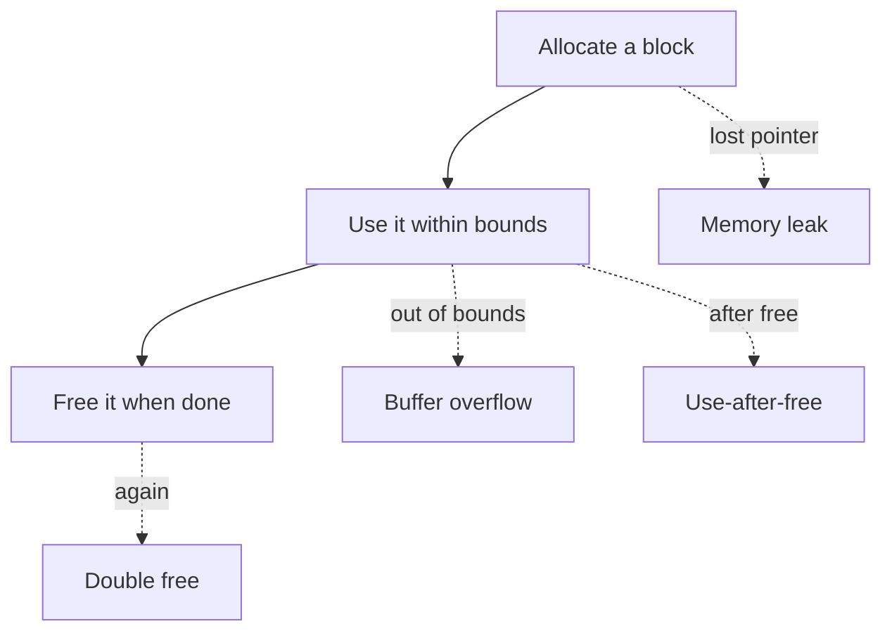
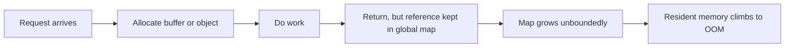
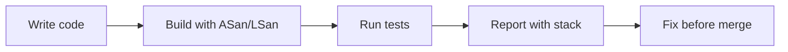
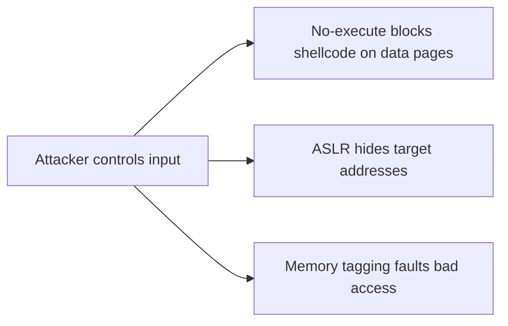

The earlier chapters showed how memory is addressed, translated, faulted in, mapped, laid out, and allocated. This final chapter asks a hard question about all of that. Is the program using that memory correctly? When memory is used wrong, the cost is no longer just slow performance. It becomes crashes and security breaches.

Memory safety means a program touches only memory it owns. It touches that memory only while it owns it. And it touches the memory in the way it owns it. Break any of those rules and the failure is rarely a clean error. Instead you get corrupted state, a crash hours later in an unrelated function, or a weakness an attacker can trigger on purpose. A leak is the quieter failure. The program still owns the memory but no longer needs it. The memory use creeps upward until the machine swaps or the out of memory killer stops the process. Both failures are exactly why the allocator and the language above it exist.

## What memory safety means

Memory is used safely when three things are true. First, the access is in bounds. The pointer points inside a block the program allocated. Second, the access is in time. The block has not been freed yet, and it will not be freed while the access happens. Third, the access respects ownership. The program may read or write as allowed, and no other part quietly changed the rules. When all three hold, memory is safe. When any one fails, the program enters undefined behavior. Undefined behavior means anything can happen, and it often does.



The diagram shows the lifecycle and the four classic breaks. Each comes from a different mistake, but they share one root cause. The program lost track of what memory it owns and when. The earlier chapters gave the machinery. This one is about discipline and tools that keep that machinery honest.

## The common memory-safety bugs

A buffer overflow writes or reads past the end of a block. On the heap it damages nearby allocations and corrupts data the program believed safe. On the stack it can overwrite the return address. That is how a simple array write becomes a way to hijack control flow. The previous chapter on the stack is exactly why stack overflows are so dangerous. They reach the return address and change where the function goes when it ends.

Use-after-free means you access a block after it has been freed. The allocator may have given that memory to something else. Now your program reads or writes another object's data. The bug rarely shows where it happened. It shows later, when the real owner of that memory acts in an impossible way. This is one of the hardest bug types to debug because the symptom is far from the cause.

Double free returns the same block twice. The allocator's bookkeeping assumes each block is freed once. A second free corrupts its free list. That often leads to a crash, or worse, to crafted allocations that reuse the same region under an attacker's control.

Uninitialized reads use memory that was allocated but never written. The contents are whatever was there before. The values are effectively random. A program that depends on them has nondeterministic behavior. It can pass in test and fail in production.

Off-by-one errors and integer overflows deserve special mention because they cause the others. An integer that wraps, or a loop bound that is one too high, produces a size or index that looks right. Then it drives an overflow. Many real overflows start as an arithmetic mistake, not a careless copy.

## Why these bugs are dangerous beyond crashing

A crash is the kind outcome. The dangerous case is silent corruption. An overflow that lands on data rather than a return address changes program state in a wrong but not fatal way. The program keeps running with corrupted assumptions. A use-after-free that happens as the memory is reused turns one bug into two interacting bugs.

From a security view, these bugs are the basis of a large share of exploits. An attacker who can overflow a buffer can often overwrite a pointer or return address and redirect execution. A use-after-free can be steered to confuse ownership and reach memory that should be out of reach. This is why memory-safety bugs are treated as vulnerabilities, not mere defects. It is also why the tools in this chapter have improved so much.

## Leaks and the slow failure

A leak is memory that stays allocated but is no longer reachable or useful. The simplest form is a lost pointer. The program allocated a block and then overwrote or dropped the only reference to it, so it can never be freed. A subtler form is a reachable but unused object. Think of an entry in a cache or map that nothing will ever read again. The garbage collector or allocator cannot reclaim it because a reference still exists.



Leaks are insidious because they do not fail fast. A service with a slow leak can run for days before its resident memory crosses into swapping or triggers the out of memory killer. By then the cause is buried under weeks of requests. The latency from the swapping chapter and the allocator retention from the previous chapter are exactly the mechanisms that turn a leak into an outage.

## How languages try to prevent these bugs

The safeguards differ by language, and a backend engineer meets all of them over a career. C and C++ leave memory management to the programmer. That is the source of both speed and most of the bugs above. C++ offers RAII, smart pointers, and standard containers. These tie lifetime to scope or reference counts. Used consistently, they remove most manual-free errors.

Garbage-collected languages such as Go and Java remove use-after-free and double-free for managed objects. The collector reclaims only what nothing references. They do not remove leaks. A forgotten reference in a long-lived map leaks just as easily as in C. Go adds a distinct variant, the goroutine leak. A goroutine blocked forever holds its stack and everything it references. The collector cannot free what a live goroutine keeps alive.

Rust takes a different path. Its ownership and borrow checker enforce at compile time that a value has exactly one owner. References must not outlive what they point to. Whole classes of use-after-free and data races are rejected before the program runs. The cost is a stricter language to learn. But the memory-safety guarantee is structural, not procedural.

The takeaway is that no language removes the need to think about ownership. Even with a collector or a checker, keeping references you no longer need is a leak. Unsafe escape hatches still exist. Tools and discipline remain necessary everywhere.

## Detecting bugs and leaks

The good news is that the bugs in this chapter are easy to detect with the right tools. Catching them early is far cheaper than debugging them in production.

Valgrind instruments a program to track every memory access. It reports overflows, use-after-free, and leaks precisely. It is thorough but slow. That makes it ideal for test runs rather than production.

AddressSanitizer, or ASan, compiles the program with runtime checks around every access. It catches overflows and use-after-free with low overhead compared to Valgrind. LeakSanitizer, or LSan, builds on the same machinery to report leaks at exit. UndefinedBehaviorSanitizer catches the integer overflows and misaligned accesses that lead to the other bugs.

Static analyzers scan source for patterns that often indicate these bugs. They catch some issues without running the code. Heap profilers such as `jeprof` for jemalloc or `pprof` for Go show what is allocated and who holds references. That is how you find a cache that never evicts.



The pipeline that matters is putting these tools in continuous integration. A service built with sanitizers and exercised by its tests catches most memory bugs the moment they are introduced. It catches them before a customer hits them. This is the single highest-leverage practice for memory safety.

## Defensive practices that prevent the bugs

Beyond tools, certain habits remove whole categories of failure. Prefer containers and safe wrappers over raw pointers, so bounds are checked and lifetime is tied to scope. Use smart pointers in C++ so frees happen automatically when the last owner disappears. Avoid unsafe integer arithmetic in size calculations, and check lengths before copies.

Zero sensitive memory when done with it, using a function the compiler cannot optimize away. This matters for keys and tokens. It ties back to the `mlock` discussion. Pinned memory that holds secrets should also be wiped on purpose. Fuzz your inputs, because the overflows that matter come from adversarial or unexpected data. This is like the deep-recursion stack example from earlier.

Keep allocations scoped. The arena idea from the previous chapter is not only fast but safe. When a phase's memory is freed all at once, there is no per-object free to forget. Structure code so that the end of a request frees its memory in one place. Then leaks become obvious instead of scattered.

## Observing memory safety in production

Production rarely tells you directly, but the signals are consistent. A resident set that climbs steadily and does not fall with load is the leak signature from the allocator chapter. A crash with a stack trace in a completely different part of the code is the use-after-free signature. A corruption report, such as a hash table whose invariants break, is the overflow signature.

```bash
# watch resident memory for the leak signature
watch -n 5 "grep VmRSS /proc/\$(pgrep myservice)/status"
# capture a Go heap profile to find who holds memory
go tool pprof http://localhost:6060/debug/pprof/heap
# run a test binary under LeakSanitizer (built with -fsanitize=address)
./mytest 2>&1 | grep -A15 "LeakSanitizer"
# valgrind for a one-off thorough check
valgrind --leak-check=full ./mytest
```

These commands do not replace in-CI sanitizers, but they explain a running system. The heap profile is especially powerful in GC languages. There the leak is usually a retained reference rather than a lost free, and seeing the retaining path is the only way to find it.

## A realistic production example

A team shipped a C service that parsed requests and allocated a temporary buffer for each one. Most code paths freed the buffer before returning. But one error branch, taken only when a downstream call returned a specific rare status, returned early without freeing. Each occurrence leaked one buffer. In tests the status never appeared, so the leak stayed invisible.

In production the status happened a few times per million requests. Over days the service's resident memory crept upward. Eventually it began swapping and then was killed by the out of memory killer, taking the whole process down. Because the growth was slow, it looked like ordinary memory pressure until the outage.

The fix came from process, not heroics. They added an AddressSanitizer and LeakSanitizer build to CI and ran the test suite under it. A new test that exercised the rare error branch reported the leak with the exact allocation and free-path stack. The fix was a single missing free on that branch, plus a restructure so the buffer was tied to a scope that freed it automatically on every exit. After that, the leak was impossible to reintroduce unnoticed because CI failed on any leak. The lesson was that memory-safety bugs are cheap to catch early and expensive to catch late. The difference is whether the tools run where the code is written.

## How engineers actually reason about memory safety

They assume the bug is there until tools say otherwise. Memory bugs are not a matter of writing carefully enough by hand. They are a matter of having ASan, LSan, and Valgrind in the loop so the compiler and runtime catch what the eye misses.

They treat leaks as reachable references, not only as missing frees. In a GC language that means auditing what holds a pointer, especially global maps and long-lived structs. In C++, it means ensuring every allocation has a clear owner and a clear free.

They scope lifetime to the request. The safest memory is memory that dies when the work that needed it dies. Arenas, RAII, and request-scoped contexts all serve this. They make both leaks and use-after-free rare by construction.

They respect that undefined behavior is not "probably fine." An out-of-bounds read that works today may corrupt data tomorrow when the allocator layout changes. Memory bugs are not flukes to wave away. They are defects that will surface, often at the worst time.

## Hardware and kernel defenses: ASLR, no-execute, and memory tagging

The bugs in this chapter are easier to exploit when memory is predictable. ASLR stands for address space layout randomization. It defeats the simplest attacks by placing the stack, heap, libraries, and executable at randomized addresses each run. That way an attacker cannot hardcode where to jump. The no-execute bit, or NX bit, marks data pages such as the heap and stack as non-executable. Even if an attacker writes shellcode there, the CPU refuses to run it. This is why modern overflows must reuse existing code rather than inject their own.



Memory tagging pushes detection into hardware. ARM's Memory Tagging Extension assigns a small tag to each allocation and checks it on every access. An overflow or use-after-free that touches the wrong tag faults immediately, with far lower overhead than software tools. That is why it is used in production on Android and on servers that support it. The kernel complements this with `init_on_alloc` and `init_on_free`. These zero memory on allocation or free. An uninitialized read then sees zeros instead of another object's secrets, and a use-after-free is far less likely to expose prior contents. These are defense in depth. They do not fix the bug, but they make it fail loudly and safely instead of silently.

## Detecting beyond tests: production sampling and data races

Sanitizers in CI catch most bugs, but some only appear under production traffic shapes. GWP-ASan is a sampling allocator. In a small fraction of allocations, it surrounds objects with guard pages and tracks them precisely. It can report use-after-free and heap overflow in production with negligible overhead. It is used in Chrome, Android, and large C++ services. For the rare, input-dependent bug, this is the safety net when unit tests miss the path.

Memory safety also has a concurrency twin: the data race. That is when two threads access the same memory without ordering and at least one writes. Races produce nondeterministic corruption that looks like a memory-safety bug. ThreadSanitizer, or TSan, detects them by tracking access ordering. A backend engineer building concurrent services should run TSan as routinely as ASan. The symptoms are the same even if the root cause is a missing lock rather than a bad pointer.

## Real-world memory-safety failures: the cost of one bad bounds check

The stakes are not theoretical. Heartbleed was a buffer over-read in OpenSSL's TLS heartbeat handler. A request could ask for more data than it sent. The server happily returned up to sixty-five kilobytes of adjacent process memory. That memory included private keys, session tokens, and other users' data. A single missing bounds check on an attacker-controlled length leaked the secrets of a large fraction of the internet's servers. The fix was a few lines of length validation.

That example captures the whole chapter. The bug was a trivial arithmetic mistake. The exploit needed no credentials. The failure was silent until researchers noticed. The blast radius was enormous because the leaked memory was exactly the memory that had to stay secret. Memory safety is treated as a security discipline for this reason. The cost of being wrong is not a crash you can reproduce, but a breach you may never detect.

## Definitions

### Memory safety

> A program has memory safety when it accesses only memory it owns, only while it owns it, and only in the permitted way. No access reads or writes outside its valid block. No access happens after the memory's lifetime ends.

### A buffer overflow

> An access that goes past the allocated bounds of a block. It corrupts adjacent memory, or on the stack it corrupts critical control data such as the return address.

### Use-after-free

> An access to a block after it has been freed and possibly reused. It reads or writes memory now owned by another part of the program. This causes disconnected, hard-to-trace failures.

### A memory leak

> Memory that remains allocated but is no longer useful. In the worst case it is no longer reachable, so it is never freed. The process's resident set grows until it swaps or is killed.

### A sanitizer

> An instrumentation tool such as AddressSanitizer or LeakSanitizer. It adds runtime checks to detect overflows, use-after-free, and leaks. It is usually run in tests and continuous integration.

## Beyond the definitions

### Why are memory-safety bugs so hard to debug

> The symptom appears far from the cause. A use-after-free may corrupt data that is used much later in an unrelated function. An overflow may change a value whose effect surfaces only under specific input. The visible failure does not point at the bad access.

### Does a garbage collector make these bugs impossible

> A garbage collector removes use-after-free and double-free for managed objects. It does not remove leaks, because a retained reference keeps memory alive forever. It does not remove unsafe code paths or goroutine leaks. Ownership discipline still matters.

### Why run sanitizers in CI rather than only in production

> Production tells you after the fact, often through a crash or an outage. CI with ASan and LSan fails the build the moment a test exercises the bug. Catching it at write time is orders of magnitude cheaper than debugging it live.

### What is the difference between a true leak and a cache that grows

> A true leak has no reference left to free the memory, so it is unrecoverable. A growing cache still has references and could be freed, but it is never evicted. In practice it behaves like a leak. Both climb in RSS, but the second is fixed by adding eviction and the first by fixing ownership.

### How does Rust's approach differ from the others

> Rust enforces ownership and borrowing at compile time. Many use-after-free and data-race bugs are rejected before the program runs. They are not caught at runtime by tools or in production by failure.

## Common misconceptions

**"It crashed, so the bug is where it crashed."** The crash site is often downstream of the real bug. A corruption introduced elsewhere surfaces where the corrupted data is finally used. This is why tools that report the allocation and free stack are essential.

**"Memory leaks only happen in C and C++."** Any language with references can leak by retaining them. A forgotten entry in a global map, a never-cancelled goroutine, or a listener that is never removed leaks memory in managed languages just as surely.

**"If it passes tests, the memory is safe."** Tests rarely cover every input path. The rare branch that leaks or overflows is exactly the one tests miss. Only sanitizers running in CI across the test suite catch the paths people forget.

**"Use-after-free only matters for crashes."** It is also a security vulnerability. An attacker who can time an allocation to reuse freed memory can often read or write through the dangling reference. That is a class of exploit on its own.

**"A slow RSS climb is just the OS caching."** The page cache is reclaimable and shown separately from your heap. A climb in your process's own heap RSS that does not fall with load is a leak. Waiting for it to settle lets it reach the OOM killer.

## Summary

Memory safety is the discipline of owning memory correctly. Access it in bounds, in time, and by the rules of ownership. The failures range from buffer overflows and use-after-free, which corrupt state and enable exploits, to leaks, which quietly consume memory until the system fails. Languages help differently. C uses manual discipline. C++ and collectors use RAII. Rust uses compile-time checks. None remove the need for tools. Sanitizers and profilers in continuous integration are the highest-leverage defense. They catch the bugs at write time, where they are cheap. This closes Stage 6. From the address space, through translation, faults, mapping, layout, allocation, and finally correctness, a backend engineer now has the full picture of how a process actually uses memory.
