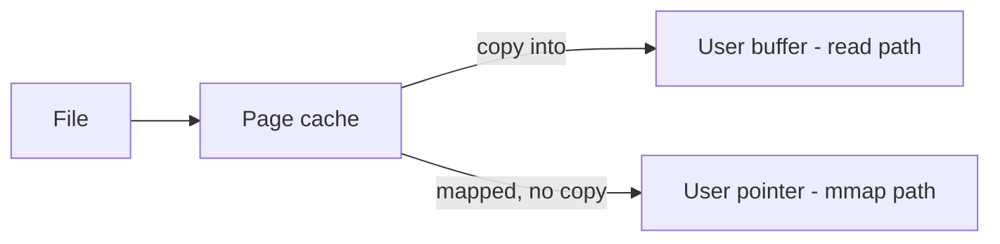
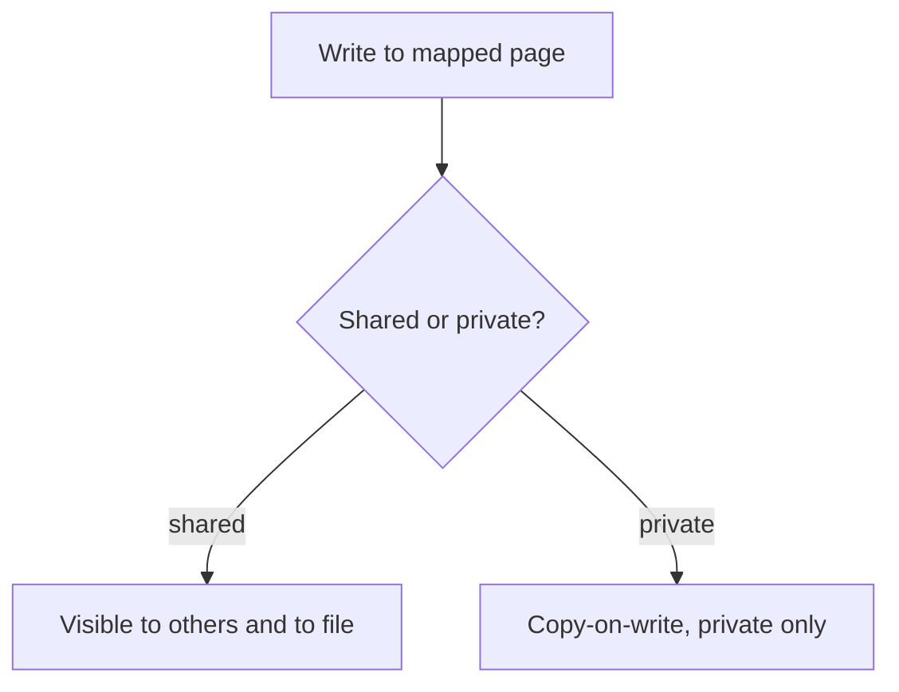
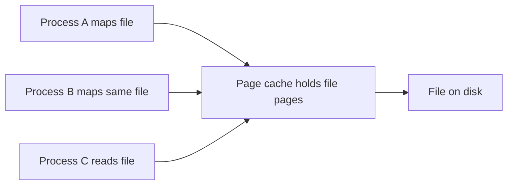

The previous chapter showed that `mmap` is where many page faults start. This chapter explains how that mechanism works. This is the fourth article in Stage 6.

`mmap` is a system call. It maps a region of memory to something else: a file, a device, or nothing. After it returns, the program reads and writes bytes through normal pointers. The kernel turns those reads and writes into file I/O, copy-on-write, or shared memory. It connects the address space you have read about to data that lives on disk or in another process.

## What mmap does

A normal file read copies bytes from the kernel's page cache into a buffer you made. With `mmap`, the program asks the kernel to place the file directly into your virtual address space. After that, reading the file is just using a pointer. The page faults from the last chapter are what bring the bytes in.



The difference is the copy. With `read` and a buffer, the data moves from the cache into your memory. With `mmap`, your pointer sits on the cache, so there is no second copy. This is why `mmap` is called zero-copy on the read side. It is also why the faults you saw earlier appear. The first time you touch a mapped page, the kernel pulls it from the file.

## Anonymous and file-backed mappings

An anonymous mapping is not attached to any file. It acts like a region of memory that several processes can share, or that one process can use as a large allocation. It is backed by RAM (and maybe swap) and starts as zeros.

A file-backed mapping attaches a file to the region. Reading a byte reads the file. Writing, depending on the flags, changes the file or a private copy. The file is the source of truth. The page cache is the middle layer that holds the bytes while they are mapped.

Both kinds use the same machinery. Each is a range in the virtual address space. A `vm_area_struct` (a kernel record that describes one mapped region) tracks it. Both translate through page tables and both can fault. They differ in what the kernel does when it needs to fill or reclaim a page.

## MAP_SHARED and MAP_PRIVATE

These two flags decide what a write does. They are the most important choice you make with `mmap`.

A `MAP_SHARED` mapping means your writes are visible to other processes that map the same file. The writes are eventually written back to the file. This is how memory-mapped shared state works. Two processes that map the same file see each other's changes.

A `MAP_PRIVATE` mapping means writes are not shared and are not written to the file. The kernel does this with copy-on-write (the mechanism from the previous chapter). The first write to a private page makes a copy. The writer sees its own version while others keep the original.



The trap is thinking you got one when you got the other. If you map a file privately and write to it, nothing on disk changes. People who expected their edits to persist are surprised. If you map it shared and write, you change the file under every other reader. People who expected privacy are surprised.

## The flags worth knowing

Beyond the sharing mode, a few flags and protections decide behavior.

| Flag or protection | Effect |
|---|---|
| PROT_READ | The mapping may be read |
| PROT_WRITE | The mapping may be written |
| PROT_EXEC | Instructions may be fetched from the mapping |
| MAP_SHARED | Writes are shared and written back to the file |
| MAP_PRIVATE | Writes are private via copy-on-write |
| MAP_ANONYMOUS | The mapping has no file backing |
| MAP_FIXED | Place the mapping at the exact address given |
| MAP_POPULATE | Fault all pages in at mmap time instead of on access |
| MAP_NORESERVE | Do not reserve swap space for the mapping |

`MAP_FIXED` is dangerous. It can overwrite an existing mapping at that address and clobber your program's own code or libraries. `MAP_POPULATE` trades a slow mmap call for faster later access. Use it when you would rather pay the fault cost up front than suffer it during a request. `MAP_NORESERVE` is a memory-overcommitting choice. It matters when swap reservation matters.

## How mmap uses the page cache

For a file-backed mapping, the kernel does not keep a separate copy of the file for your process. It uses the same page cache that `read` and `write` use. If another process reads the file or maps it, they share those cached pages. This is why mapping a large file that is also read elsewhere does not double the memory. The bytes live once in the cache.



Writes to a shared mapping also go through the cache. They mark pages dirty. The kernel writes them back to disk later, just as it would for a `write` syscall. The timing of that writeback is up to the kernel unless you call `msync` to force it. This is one reason a crash can lose recently written mapped data.

This also explains the major-fault story from the last chapter. A mapped page that is not in the cache faults in from disk. A mapped page already in the cache faults in as a minor fault. The page cache makes both possible, and it is shared across every way the file is accessed.

## mmap as zero-copy reading

The classic use is serving or scanning a large file without copying it through a user buffer. Instead of `open`, `read` into a buffer, process, repeat, you `mmap` the file and walk the pointer. There is no per-call copy from kernel to user. The kernel only faults in the pages you actually touch.

This matters for large file handling. A tool that scans a multi-gigabyte file can map it and read sequentially. The kernel pages it in one window at a time. You do not manage a buffer loop by hand. For sending a file over a socket, `mmap` plus writing the pointer works. Better still, `sendfile` avoids copying the bytes through user space at all.

The catch is that `mmap` works in page-sized units. A small file still uses at least one page of address space. A file smaller than a page wastes the rest of that page. For many tiny files, the cost of one mapping per file is more than the copy you avoided. Ordinary `read` is simpler and faster.

## Prefaulting and pinning with madvise and mlock

The first touch faults, so a workload that needs predictable latency can ask the kernel to prepare pages ahead of time. `madvise(MADV_WILLNEED)` tells the kernel to prefetch a range. Later faults become hits. `madvise(MADV_DONTNEED)` tells the kernel a range will not be used soon, so it releases the pages. `madvise(MADV_HUGEPAGE)` asks for huge pages in that range. This links back to the translation chapter.

`mlock` goes further. It pins pages in RAM so they cannot be swapped out and will not fault. This removes both the swap risk and the fault latency. The cost is that it ties up physical memory and, on most systems, needs privilege. Pinning a large region under memory pressure makes things worse for everyone else. Use it sparingly for small, critical areas such as crypto keys or a latency-critical hot loop.

## Use cases that earn their place

Shared memory between processes is the clearest win. Two processes that map the same file with `MAP_SHARED`, or that use an anonymous shared mapping, exchange data by writing memory. No syscalls run on the hot path. This is how many high-performance IPC designs avoid copying.

Read-only shared datasets are another case. A service with several worker processes can map a large read-only index file once. Every worker shares the cached pages. The file is loaded into the cache a single time. Each worker's resident memory stays small because they point at the same frames.

Large file scanning benefits from avoiding the copy and the buffer management. Hardware access also benefits. By mapping a device register range, a driver can touch hardware through pointers. This is specialized and outside the usual backend path.

## Risks and pitfalls

The most famous trap is `SIGBUS`. If you map a file and then the file is truncated, or the mapped region falls past the end of the file, touching that page raises a bus error instead of a normal fault. This happens when a background job rewrites a file in place while you have it mapped.

Mapping a file larger than RAM is fine, because not all of it is resident at once. What breaks is assuming it is all available instantly. Touching far regions faults from disk. Under pressure, those pages can be reclaimed and faulted again. An anonymous private mapping of a huge region is different. It is backed by RAM and swap. It can push the system toward swapping if the working set is large.

Address space limits matter on 32-bit builds. A few gigabytes of mapping can exhaust the space. Threads and `fork` interact badly with large mappings because the address space is duplicated or shared. A `MAP_PRIVATE` file mapping in a forked child behaves with copy-on-write, just like the heap does.

`MAP_SHARED` writes are not flushed immediately. If you write through a shared mapping and the machine crashes before writeback, those writes can be lost. A direct `write` that you `fsync` would not lose them. Use `msync` when durability matters.

## Observing mappings and residency

The mappings of a process are visible in `/proc/<pid>/maps`. Their memory accounting is in `/proc/<pid>/smaps`. The second file shows, per mapping, its size, resident set, and the page size used. This is how you confirm a mapping is using huge pages or how much of it is actually resident.

```go
package main

import (
    "fmt"
    "os"
    "syscall"
)

func main() {
    data := []byte("mmap example content for a small file\n")
    tmp, err := os.CreateTemp("", "mmap-*.txt")
    if err != nil {
        panic(err)
    }
    defer os.Remove(tmp.Name())
    if _, err := tmp.Write(data); err != nil {
        panic(err)
    }
    tmp.Sync()
    tmp.Seek(0, 0)

    size := int64(len(data))
    mem, err := syscall.Mmap(int(tmp.Fd()), 0, int(size), syscall.PROT_READ, syscall.MAP_PRIVATE)
    if err != nil {
        panic(err)
    }
    fmt.Printf("mapped content: %q\n", string(mem))
    if err := syscall.Munmap(mem); err != nil {
        panic(err)
    }
    fmt.Println("unmapped cleanly; see /proc/self/maps while running to inspect")
    select {}
}
```

```bash
go build -o mmapdemo main.go
./mmapdemo &
pid=$!
sleep 0.3
grep -E "mmap-.*\.txt" /proc/$pid/maps
grep -A6 "mmap-.*\.txt" /proc/$pid/smaps
kill $pid
```

This shows that the mapped file appears as a region in `maps`. `smaps` breaks down how much of it is resident. For a production service, scanning `smaps` for the large mappings tells you which files are mapped. It tells you how much is actually in RAM and whether huge pages are in use. This links directly back to the TLB and working-set chapters.

## A realistic production example

A service used a large read-only index file to answer queries. Each worker process opened the file and read it into its own buffer at startup. The index was loaded once per worker. The total resident memory grew with the number of workers. The team switched to mapping the file `MAP_PRIVATE` and sharing it across workers. This cut resident memory sharply because all workers pointed at the same cached pages.

Then a deploy pipeline started rewriting that index file in place. It opened the existing path, truncated it, and wrote the new contents. It did not write to a temporary file and rename. A worker that had the old file mapped and touched a page past where the new truncated file ended got `SIGBUS` and crashed. The mapping still pointed at the old inode for workers that held it. The rewrite raced with workers that re-mapped. The in-place truncation removed pages from under them.

The fix was to stop rewriting in place. The pipeline wrote the new index to a temporary file, called `fsync`, then renamed it over the old name. Renaming changes which inode the path points to. It leaves existing mappings valid because they hold the old inode. Workers that already had the old file mapped kept serving from it until they reloaded. New workers mapped the new inode. They also added a signal handler for `SIGBUS` on the mapping as a guard. A truncated mapping would then log and recover instead of crashing. The lesson is that `mmap` couples your address space to a file's lifetime. The safe pattern is immutable, versioned files that are replaced by rename. Never truncate a file under a live mapping.

## How engineers actually reason about mmap

Engineers choose `mmap` for sharing and for avoiding copies. They do not use it for every file. Small files, or files read once in a stream, are often simpler and faster with `read`. The win from `mmap` grows with file size and with the number of readers or writers that share the data.

They respect the coupling to the file. A live mapping assumes the file stays at least as large as the region touched. The deployment and rotation story around that file matters as much as the `mmap` call itself. Immutable files swapped by rename are the safe default.

They think about residency. A mapped file is not free memory. Touching far parts faults from disk. `madvise` hints, and for the truly hot path `mlock`, turn unpredictable faults into predictable behavior. Both cost memory that is then unavailable to the rest of the system.

They remember durability. Shared mappings are written back lazily. Important writes need `msync` or an explicit `fsync` path, or a crash can lose them.

## Beyond the basic flags: fixed replacement, huge pages, locked and populated mappings, mremap, and mincore

The common flags cover most uses, but a set of related options and helpers matter in production. `MAP_FIXED` overwrites whatever mapping already sits at the address. It can silently clobber your own code or libraries. `MAP_FIXED_NOREPLACE` does the opposite. It places the mapping only if the address is free and fails otherwise. This is almost always what you wanted `MAP_FIXED` for. Use the safe variant unless you are deliberately taking over a region you control.

For special memory, `MAP_HUGETLB` requests the mapping from the huge-page pool. `MAP_SYNC` (with a persistent-memory or DAX file) makes `msync` flush writes all the way to persistent media instead of just the page cache. `MAP_LOCKED` combines `mmap` and `mlock` in one call so the region is pinned immediately. `mlockall(MCL_FUTURE)` pins everything faulted in afterward. A related helper is `mremap`. It grows or shrinks an existing mapping in place. Some allocators use it to extend the heap. A shared buffer is resized with it without copying. `mincore` answers a different question. Given a range, which of its pages are currently resident. A program can learn residency without faulting the pages in. This is useful for warmup checks and for predicting whether the next access will be a hit or a major fault.

## memfd, anonymous shared memory, and fork and core-dump safety

Not every shared mapping needs a file on a visible filesystem. `memfd_create` makes an anonymous file that lives in tmpfs. It has no path. It can be shared with another process by passing its descriptor over a Unix socket or through `fork`. Because it is a real file descriptor, it can be sealed with `F_SEAL_SEAL`, `F_SEAL_SHRINK`, `F_SEAL_GROW`, and `F_SEAL_WRITE`. A receiver can then trust the contents will not change underneath it. This is the modern, safer basis for passing shared memory and for sandboxing. It links directly to the sealing discussion from the file-descriptor article.


The older paths still exist. POSIX shared memory uses `shm_open` plus `mmap`. The legacy System V `shmget` and `shmat` also work. They leak named objects and lack sealing. This is why `memfd` is preferred for new code. Fork and core-dump safety matter when a mapping holds secrets. `MADV_DONTFORK` excludes a region from the child after `fork`. A child that goes on to `exec` another program never sees a parent's keys. `MADV_DONTDUMP` keeps a region out of core dumps for the same reason. `MADV_WIPEONFORK` zeroes the region in the child so the child can never read the parent's copy. On the other side, `MADV_MERGEABLE` lets the kernel deduplicate identical pages across processes. This feature is called KSM. It saves memory for many similar guests or containers at some CPU cost.

## Making mapped writes durable with msync

A `MAP_SHARED` write lands in the page cache and is written back lazily. It is not durable until the kernel decides to flush. `msync` forces that flush for a range. `MS_SYNC` blocks until the pages are written back to the file on storage. `MS_ASYNC` schedules the writeback without waiting. `MS_INVALIDATE` discards cached copies so later reads come from the file. For correctness across a crash, `msync(MS_SYNC)` (or an `fsync` on the underlying file descriptor) turns a shared mapped write into a committed one. Only after that can you assume the bytes will survive power loss.

This is the mapped version of the durability rules from the storage stage. The trap is assuming a write through a pointer is saved just because it returned. Like a buffered `write`, it is only a promise to the cache until explicitly synced. The difference is that a mapped write has no `write` call to attach the sync to. The discipline is to call `msync` on the exact range you need durable. Do it on a cadence rather than after every write.

## Definitions

### mmap

> A system call that maps a file, device, or anonymous region into a process's virtual address space so it can be accessed through ordinary pointers, with the kernel handling the underlying I/O and faults.

### A file-backed mapping

> A mapping whose pages are sourced from a file through the page cache, so reads pull file bytes and shared writes are eventually written back to the file.

### MAP_SHARED

> A mapping flag where writes are visible to other mappers of the same file and are written back to the file, making the mapping a shared view of the data.

### MAP_PRIVATE

> A mapping flag where writes are kept private through copy-on-write and are never written to the file, so the mapper sees its own version unseen by others.

### The page cache

> The kernel's in-memory store of file contents, shared by `read`, `write`, and file-backed `mmap`, so the same file mapped or read by many processes uses the bytes only once in memory.

### madvise and mlock

> `madvise` gives the kernel hints about future access so it can prefetch or release pages, while `mlock` pins pages in RAM so they cannot be swapped or faulted, trading memory for predictability.

## Beyond the definitions

### Why is mmap described as zero-copy

> Because it projects the kernel page cache directly into the address space, so reading a file is a pointer dereference rather than a copy from kernel buffer to user buffer. The data lives in one place and is shared with every other accessor of the file.

### What is the difference between reading a file and mapping it

> `read` copies bytes into a buffer you own and pays the copy per call; `mmap` lets you address the cached pages directly and pays through page faults on first touch. Mapping avoids the copy but adds fault and residency behavior to manage.

### Why does a truncated mapped file cause SIGBUS

> The mapping promises a range of addresses backed by the file. If the file shrinks so a mapped page no longer exists, there is no data to fault in, and the access raises a bus error instead of a normal page fault. Replacing a file by rename avoids this because existing mappings keep their original inode.

### When should you avoid mmap

> For many small files, where mapping overhead per file outweighs the copy saved; for one-shot streaming reads where a simple `read` loop is clearer; and when you cannot control the file's lifecycle, because a mapped file that gets truncated or replaced under you is a hazard.

### How do you make mapped access predictable

> Use `madvise(MADV_WILLNEED)` to prefetch the range you will touch, `madvise(MADV_DONTNEED)` to release what you are done with, and `mlock` only for small critical regions that must never fault or swap. The goal is to move the fault cost to a known time.

## Common misconceptions

**"mmap loads the whole file into memory."** It maps the address range. Pages are faulted in on access and may be reclaimed under pressure, so a file larger than RAM is fine and only touched parts become resident.

**"Writing to a mapped file saves it immediately."** A shared mapping writes back lazily through the page cache. Without `msync` or `fsync`, a crash can lose those writes, unlike an explicit durable write path.

**"Private mappings are always safe to write."** They are private to your process via copy-on-write, but they are never written to the file, so edits vanish when the mapping is gone unless you also write them elsewhere.

**"mmap is always faster than read."** For large shared or randomly accessed files it often wins by avoiding copies. For many small files or simple streaming, the mapping overhead and fault handling make `read` the better choice.

**"Sharing memory through mmap needs a real file."** An anonymous mapping created shared, or a POSIX shared memory object, gives the same interprocess sharing without a file on a filesystem, which is often cleaner for IPC.

## Summary

`mmap` projects files, devices, or anonymous regions into the address space so they are reached through pointers. The kernel turns accesses into page-cache reads, copy-on-write, or shared writes. The sharing mode decides whether writes are visible and durable. The page cache means the bytes live once and are shared with every reader. `madvise` or `mlock` trade memory for predictable faults. The coupling to the file's lifetime is the real hazard. The safe pattern is immutable files replaced by rename. The next chapter moves down from these system mappings to the memory a program asks for day to day. It covers stack and heap layout and the allocators that hand it out.
