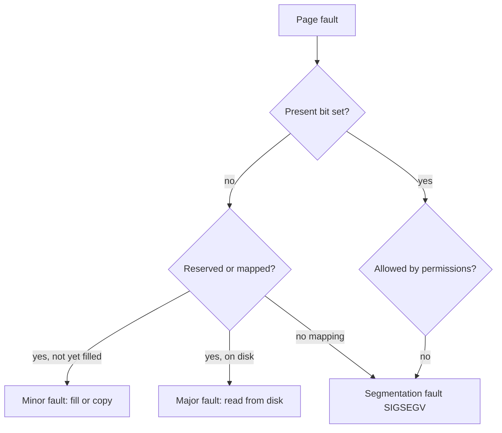
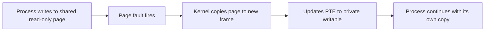
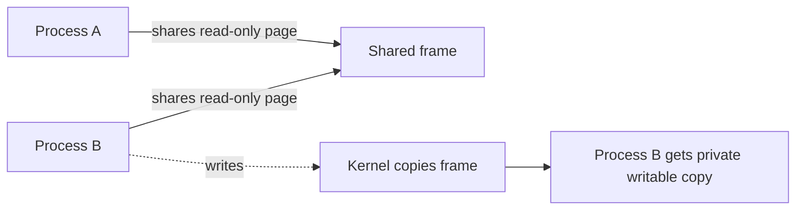
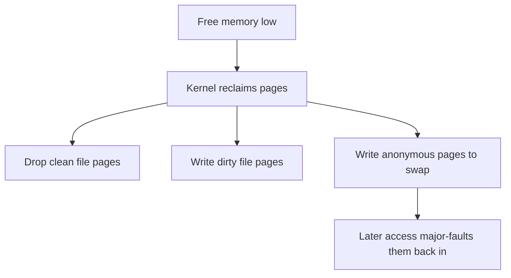
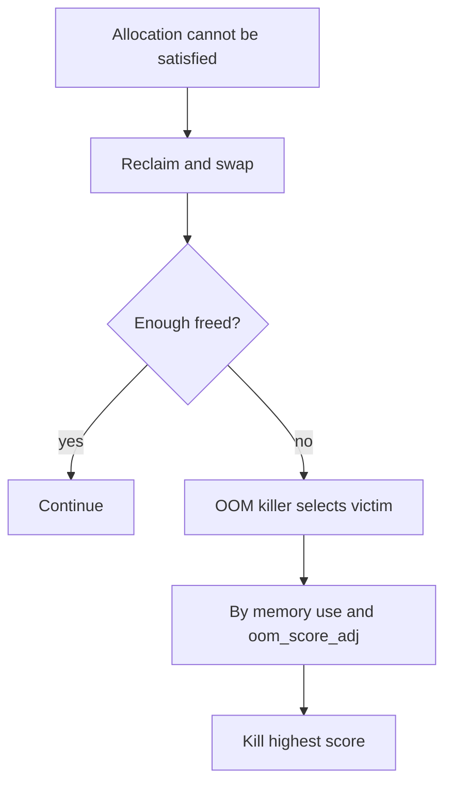
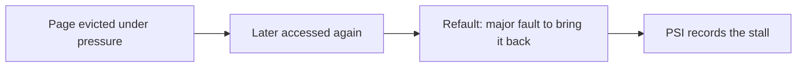

The previous chapter ended by noting that a cleared present bit does not always mean the process is wrong. This chapter follows that thread. It is the third article of Stage 6.

A page fault is the hardware asking the kernel for help with an address. Sometimes the help is trivial: a page was reserved but not yet filled, or a copy is needed only because someone wrote to shared memory. Sometimes the help is expensive: a page must be read from disk. And sometimes there is no valid answer at all, only a signal to the process. Knowing which kind you are looking at is the difference between a slow startup you can ignore and an outage you must chase.

## What a page fault actually is

When the CPU translates a virtual address and finds the page table entry cannot satisfy the access, it raises a page fault exception. The memory management unit hands control to the kernel with the faulting address and the reason. The kernel then classifies the fault.



The split that matters most for a backend engineer is between a fault the kernel can satisfy in memory and one that requires disk I/O. The first is a minor fault, the second a major fault, and the cost difference is the difference between nanoseconds and milliseconds or worse.

## Minor faults and why they are cheap

A minor fault is resolved without touching disk. The page is already conceptually part of the process, but the kernel has not yet attached a physical frame, or the frame needs a small adjustment. Three common cases show up constantly.

The first is demand paging. When a program allocates a large region, the kernel often only records that the region exists. The first time the program writes a byte, the page is not present, a fault fires, and the kernel allocates a zeroed frame and points the entry at it. This is why a freshly allocated gigabyte does not immediately consume a gigabyte of RAM.

The second is copy-on-write. After a fork, or when mapping a file privately, the kernel marks pages read-only and shared. When a process writes, the fault fires, the kernel makes a private copy of the page, and the writer proceeds. The copy happens per page, on write, not up front.

The third is a file mapping that has not been read yet. The region is valid, but the contents still live in the file. Touching it faults in the page from the page cache, which may itself be a minor fault if the file is already cached, or a major one if it must be read from storage.



A minor fault is cheap because it stays in memory and usually just attaches or duplicates a frame. It is still work, and a program that faults in millions of pages on startup will be slow, but it is a different universe from waiting on a disk.

## Demand paging in practice

Demand paging is the reason restarts feel lazy. A service that allocates a huge buffer at startup does not pay for the memory until it touches it. If the warmup path only touches a fraction of the buffer, the rest stays unmapped and costs nothing in RAM.

This cuts both ways. It means memory is used only as needed, which is good for density. It also means the first access to a region carries a fault, so a workload that streams through a large allocation for the first time will show a burst of minor faults. If you measure steady-state latency you may miss that burst, but a request that happens to be the first to touch a cold region will pay it.

Programs can give hints. `madvise(MADV_WILLNEED)` tells the kernel to expect access, and `madvise(MADV_DONTNEED)` releases pages back. Used well, these turn lazy behavior into predictable behavior.

## Copy-on-write and shared memory

Copy-on-write is why fork is cheap and why many processes can share one read-only library without multiplying its memory. The pages stay shared and read-only until someone modifies them.



The subtlety is that the cost lands on write, not on creation. A process that forks and then writes to a large portion of its heap will quietly turn shared pages into private copies, and its resident memory will rise. This is the same mechanism described in the virtual memory chapter when a forked process wrote to a large read-only cache and appeared to double its memory. The page tables showed the growth, and the page faults caused the copies.

Private file mappings use the same trick. Mapping a file privately does not copy it; it marks pages copy-on-write. Only modified pages become private, so a process that reads a large file but changes little keeps the shared, cached version.

## Major faults and the cost of disk

A major fault requires the kernel to read a page from somewhere other than RAM. For an anonymous page that was swapped out, that means reading swap. For a file-backed page not in cache, that means reading the file. Either way, the faulting thread waits on I/O.

The latency depends on the device. A page read from a fast NVMe drive might cost hundreds of microseconds, which is still far above a minor fault. A page read from a congested disk, or from a network-backed filesystem, can cost milliseconds, and a thread stuck behind many of them shows up as latency spikes rather than steady slowdown.

The key takeaway for a backend engineer is that major faults are a form of I/O hidden inside a memory access. A request that looks like it should be pure compute can stall because the page it touched was not resident. This is why swap on a latency-sensitive service is dangerous: it turns memory access into disk access without changing the code path that caused it.

## Swapping and reclaim

Swapping is what happens when the system needs physical frames and free memory is low. The kernel reclaims pages. File-backed pages that are clean can be dropped and reread later. Dirty file pages are written back. Anonymous pages, which have no file, are written to a swap area and read back on a major fault.

The existence of swap does not mean the machine is out of memory in the dramatic sense. The kernel uses swap proactively to free RAM for the page cache and for processes that need it now. Problems appear when the rate of swapping, measured as pages written to and read from swap, stays high, because that means the working set no longer fits and the machine is thrashing at the margin.



Two knobs matter in practice. `swappiness` influences how eagerly the kernel swaps anonymous memory versus reclaiming file pages. `cgroup` memory limits, on systems using them, bound how much a single service can grow before it is contained or killed, which prevents one service from swapping out the rest of the machine.

## Working set and thrashing

The working set is the set of pages a program needs resident to make progress without faulting. If the working set fits in RAM, faults are rare and fast. If it exceeds available RAM, the program constantly faults pages in, and the kernel constantly reclaims them, a state called thrashing.

Thrashing is brutal because more load makes it worse. A service under thrashing spends most of its time waiting on page I/O, so each request takes longer, so more requests pile up, so the working set of in-flight work grows, so even more paging happens. Throughput collapses even though the CPU looks busy.

A useful mental model is that memory is a cache for the address space, and the working set is the hot fraction. The question is never "how much memory did I allocate" but "how much do I touch often enough to need it resident." A program with a huge allocation it barely reads may be fine; a program with a small allocation it touches constantly may still thrash if RAM is tiny.

## The OOM killer

When reclaim cannot free enough memory, the kernel faces a choice between stalling everything and killing something. It chooses to kill, via the out-of-memory killer. The killer scores processes by how much memory they use and by a tunable `oom_score_adj`, then kills the highest-scoring victim to free the most memory with the least number of deaths.

For a backend engineer this is the worst case because it is sudden and often lands on the wrong process. A small but critical service can be killed because it happened to share a machine with a memory-hungry batch job, or a useful process dies while the actual leak in another process survives. The kernel logs the event in `dmesg` with the scores it considered, which is the first place to look after an unexplained death.



Mitigations are about blast radius and priority. A `cgroup` memory limit contains a runaway service to its own boundary instead of letting it drag the machine down. Setting `oom_score_adj` negative protects a critical process so the killer prefers others. Watching `majflt` and swap rates catches the slide into trouble before the killer ever runs.

## Observing faults, swap, and the OOM path

The counters are easy to read. Per process, `/proc/<pid>/stat` reports minor and major faults, and `/proc/<pid>/status` summarizes them. System-wide, `/proc/vmstat` reports `pgmajfault`, `pswpin`, and `pswpout`. The OOM decisions appear in `dmesg`, and a process's vulnerability shows in `/proc/<pid>/oom_score` and `oom_score_adj`.

```go
package main

import (
    "fmt"
    "os"
    "strings"
    "syscall"
)

func main() {
    buf := make([]byte, 1<<28)
    for i := 0; i < len(buf); i += 4096 {
        buf[i] = 1
    }
    fmt.Println("touched 256 MiB via first touch (minor faults)")

    f, err := os.Open("/etc/hosts")
    if err != nil {
        panic(err)
    }
    fi, _ := f.Stat()
    size := int(fi.Size())
    mem, err := syscall.Mmap(int(f.Fd()), 0, size, syscall.PROT_READ, syscall.MAP_PRIVATE)
    if err != nil {
        panic(err)
    }
    sum := 0
    for _, b := range mem {
        sum += int(b)
    }
    _ = sum
    syscall.Munmap(mem)
    f.Close()
    fmt.Println("read /etc/hosts through mmap (minor if cached, major if cold)")

    data, _ := os.ReadFile("/proc/self/stat")
    fields := strings.Fields(string(data))
    fmt.Println("my minflt:", fields[9], "majflt:", fields[11])
    select {}
}
```

```bash
go build -o faultdemo main.go
./faultdemo &
pid=$!
sleep 0.3
# per-process faults
awk '{print "minflt", $10, "majflt", $12}' /proc/$pid/stat
grep -E "VmRSS|VmSwap" /proc/$pid/status
# system-wide
grep -E "pgmajfault|pswpin|pswpout" /proc/vmstat
# if the killer fired, inspect the record
dmesg | grep -i "oom" | tail
kill $pid
```

What it shows is the difference between the two fault kinds. The large allocation causes a burst of minor faults as pages are first touched. The `mmap` read causes a fault that is minor if the file is already in the page cache and major if it must be read from disk, which is why reading a cold file, or one after dropping caches with `echo 1 > /proc/sys/vm/drop_caches` as root, produces a major fault. Watching `majflt` climb in production is the early warning that the working set is escaping RAM.

## A realistic production example

A team ran a service with a large in-memory cache that fit comfortably in RAM. A deploy added a second large cache for a new feature, and total resident memory crossed the machine's free capacity. The kernel began reclaiming, then swapping, and `pgmajfault` in `/proc/vmstat` started climbing. Request latency developed a tail: some requests stalled for tens of milliseconds because they touched a page that had been swapped out and had to be faulted back from disk.

Worse, the OOM killer eventually fired. The service and a smaller but critical sidecar shared the box. Because the service used the most memory, it had the highest `oom_score`, and the killer chose it. The sidecar survived, but the main service died, and the killer's log in `dmesg` showed the scores it had weighed.

The fix was containment and protection. They put the service in a `cgroup` with a memory limit below the machine's capacity, so it could not grow until it swapped out everything else. They set `oom_score_adj` negative on the critical sidecar so the killer would prefer the service over the sidecar. They also reduced the working set by sizing the second cache to what it actually needed and by using `madvise(MADV_DONTNEED)` on regions that were allocated but rarely used. After that, `pswpout` and `pswpin` stayed near zero, the major-fault tail disappeared, and the unexplained deaths stopped. The lesson was that memory pressure is a system property, not a per-process one, and the tools that matter are the ones that bound and prioritize it.

## How engineers actually reason about faults

They read the fault type first. A burst of minor faults at startup is normal and can be ignored or smoothed with pre-touch. A rising rate of major faults under load is the real signal, because it means pages are leaving RAM and coming back on demand.

They separate anonymous swap from file reads. Both appear as major faults, but swap means the working set is too big for RAM, while file faults often mean a cold cache that will warm up. The remedy for the first is less memory use or more RAM; the remedy for the second is often just time, or `madvise` hints to prefetch.

They watch the slide, not just the crash. `majflt`, `pswpin`, and `pswpout` trending up tell you trouble is coming before the OOM killer does its work. By the time the killer logs a victim, the machine was already in distress for a while.

They think in blast radius. A memory limit and a sensible `oom_score_adj` turn an unpredictable machine-wide death into a contained, predictable one, which is far easier to operate.

## Refaults, pressure stall information, and cgroup memory pressure

A fault that reads a page back from disk is one thing, but the more telling signal is a refault: a page was resident, was reclaimed because memory was tight, and then faulted back in almost immediately. Refaults mean the kernel evicted a page the workload actually needed, so the reclaim was counterproductive. The kernel's refault detection counts this, and it is the real evidence that the working set is larger than RAM, more so than a raw major-fault count that could just be a one-time cold start.



Pressure stall information, in /proc/pressure/memory and the cgroup memory.pressure file, reports the fraction of time tasks waited on memory, for both partial stalls and full stalls where no work progressed. A rising memory pressure value is the early warning that the working set no longer fits, before the OOM killer ever runs. Under cgroups v2, memory.events reports `oom`, `oom_kill`, and `high` crossings of memory.high, so each workload can be watched independently, and memory.pressure gives per-cgroup stall time. This is how you tell whether a slowdown is memory pressure rather than CPU or I/O elsewhere, and it turns the vague "the machine feels slow" into a measurable number.

## Pinning memory with mlock for predictable latency

Some workloads cannot tolerate a fault at all, because the stall would break a latency target. Real-time and high-frequency trading systems, and parts of databases, use `mlock` or `mlockall` to lock pages into physical RAM so they are never evicted and never fault. `MCL_CURRENT` locks present pages, `MCL_FUTURE` locks pages faulted in later, and `MCL_ONFAULT` locks only on demand while still preventing later eviction. A locked page also will not be swapped, which removes the swap-stall risk entirely for that region.

The catch is the `memlock` limit, set by `ulimit -l` or a cgroup, because locking unbounded memory can starve the rest of the system. Pinning is a precise tool: lock only the hot, latency-critical region, not the whole process, and size the limit accordingly. It trades flexibility for determinism, and it is the answer when even a single major fault per request is unacceptable.

## Reclaim tuning, compressed swap, and memory advice

Several knobs shape when and how aggressively the kernel reclaims. `vm.swappiness` biases the kernel toward swapping anonymous memory versus reclaiming file pages; on a server where swapping is catastrophic, lowering it, or setting it to 0 to prefer file reclaim, reduces anonymous swap at the cost of less flexibility. `vm.min_free_kbytes` keeps a reserve so allocations do not hit absolute zero and stall, and `vm.vfs_cache_pressure` controls how eagerly inode and dentry caches are reclaimed versus the page cache. `vm.watermark_scale_factor` tunes the point at which the background reclaimer wakes.

Compressed swap changes the swap story. zswap keeps swapped pages in a compressed pool in RAM instead of on disk, so a reclaim that would have gone to slow storage stays fast, at the cost of CPU for compression. zram provides a compressed block device in RAM for the same purpose. Both turn some swap pressure into CPU and memory use rather than disk I/O, which is a good trade for many latency-sensitive hosts.

The `madvise` family lets a program steer reclaim directly. `MADV_DONTNEED` releases a region immediately, `MADV_FREE` marks it reclaimable while letting the kernel keep it until pressure actually arrives, which is cheaper than DONTNEED, and `MADV_COLD` or `MADV_PAGEOUT` suggest the kernel reclaim specific pages now. `MADV_WILLNEED` prefetches. Used deliberately, these turn the lazy, fault-driven default into explicit, predictable memory management, which is the same idea as the I/O hints from the storage chapters.

## Definitions

### A page fault

> An exception raised by the MMU when a virtual address cannot be satisfied as accessed, either because the page is not present, because it needs a copy or a read from storage, or because the access breaks a permission rule.

### Minor fault

> A fault resolved without disk I/O, such as attaching a freshly allocated frame on first touch, copying a copy-on-write page, or pulling an already cached file page into the mapping.

### Major fault

> A fault that requires reading a page from disk, either from swap for an anonymous page or from a file for a not-yet-cached mapping, which makes the faulting thread wait on I/O.

### Swapping

> The kernel writing anonymous pages to a swap area when free memory is low, so they can be read back as major faults later, and the mechanism that turns memory access into disk access under pressure.

### Working set

> The set of pages a program must have resident to make progress without faulting. When it exceeds RAM the system thrashes, spending its time paging instead of computing.

### The OOM killer

> The kernel's last-resort mechanism that kills the highest-scoring process, by memory use weighted by `oom_score_adj`, when reclaim and swap cannot free enough memory to satisfy an allocation.

## Beyond the definitions

### Why does a cleared present bit not mean the process is wrong

> Because the page may be demand-paged, copy-on-write, swapped, or a lazily read file mapping. The kernel inspects the mapping and PTE state to decide whether to fix the fault or deliver a signal, and only the last case is a true error.

### What is the practical difference between minor and major faults

> A minor fault stays in memory and costs at most a frame allocation or copy, while a major fault waits on disk. A service can absorb millions of minor faults at startup but a steady rate of major faults under load is a direct hit to latency.

### Why does swap hurt a latency-sensitive service

> Swap turns a memory access into a disk read when the page is not resident, but the code path that touched the page looks identical to a normal memory access. The stall is invisible in the code and only shows up as latency and rising major-fault counts.

### How do you stop the OOM killer from killing the wrong process

> Use cgroup memory limits to contain runaway services to their own boundary, and set `oom_score_adj` negative on critical processes so the killer prefers others. The goal is to make the death predictable and contained rather than machine-wide and surprising.

### What does thrashing look like from the outside

> Throughput collapses while CPU looks busy, latency grows with load instead of flattening, and swap and major-fault counters climb steadily. More requests make it worse because each in-flight request adds to the working set that no longer fits.

## Common misconceptions

**"A page fault is always a crash."** Most faults are normal. Demand paging, copy-on-write, and file mapping all fault by design, and only a fault with no valid mapping or permission becomes a segmentation fault.

**"Swap means the machine is out of memory."** The kernel uses swap proactively to free RAM for hotter uses. The danger sign is a sustained high rate of swap reads and writes, not the mere presence of a swap device.

**"Major faults only happen on slow disks."** Any page not resident causes a major fault, including from a fast device. The cost is lower on fast storage, but the request still waits on I/O that pure compute would not.

**"The OOM killer picks the process with the leak."** It picks the highest-scoring process by memory use and adjustment, which is often but not always the one at fault, and a critical process can die while the leak survives unless priorities are set.

**"Allocating memory uses it immediately."** Under demand paging, allocation reserves address space but the frame is attached on first touch. A large buffer can look allocated while costing little RAM until something writes to it.

## Summary

A page fault is the kernel fixing an address the MMU could not satisfy: a cheap minor fault for demand paging, copy-on-write, or cached file pages, or an expensive major fault that reads from disk. Swapping begins when reclaim cannot keep up, and a working set that outgrows RAM thrashes, trading compute for paging. The OOM killer is the final backstop, and the way to live with it is containment through limits and priority through `oom_score_adj`. The next chapter turns from faults to how memory is obtained and shared through `mmap` and file mapping, which is where many of these faults are born.
