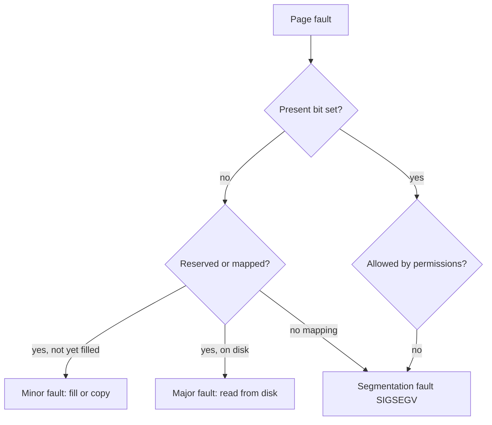
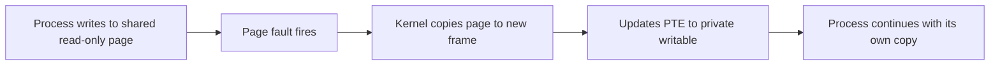
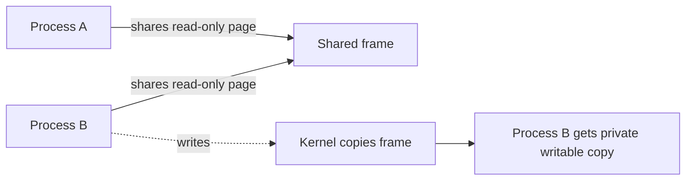
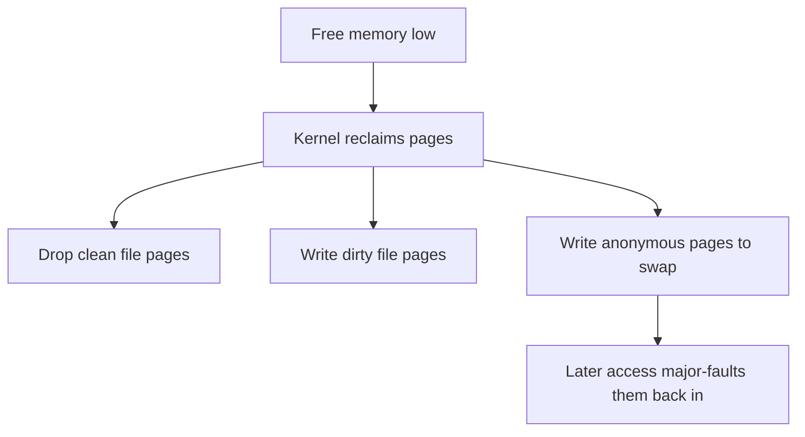
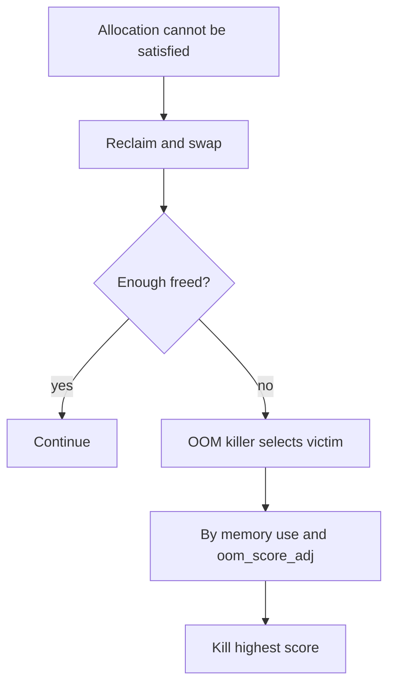
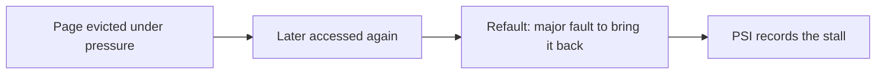

The previous chapter noted that a cleared present bit does not always mean the process is wrong. This chapter continues that idea. It is the third article in Stage 6.

A page fault is the CPU asking the kernel for help with an address. Sometimes the help is cheap. A page was reserved but not yet filled, or a copy is needed because someone wrote to shared memory. Sometimes the help is costly. A page must be read from disk. Sometimes there is no good answer. The kernel can only send a signal to the process. You must know which kind you see. That knowledge separates a slow startup you can ignore from an outage you must chase.

## What a page fault actually is

The CPU turns a virtual address into a physical one. When it finds the page table entry cannot allow the access, it raises a page fault exception. The memory management unit gives control to the kernel. It passes the faulting address and the reason. The kernel then decides what kind of fault this is.



As a backend engineer, the split that matters is simple. Either the kernel can fix the fault in memory, or it must read from disk. The first case is a minor fault. The second is a major fault. The cost gap is huge. Minor faults take nanoseconds. Major faults take milliseconds or worse.

## Minor faults and why they are cheap

A minor fault is fixed without touching disk. The page already belongs to the process in concept. The kernel has not yet attached a physical frame, or it must make a small change. Three cases happen often.

The first case is demand paging. Suppose your program asks for a large region. The kernel often only records that the region exists. The first time the program writes a byte, the page is not present. A fault fires. The kernel gives a zeroed frame and points the entry at it. This is why a freshly allocated gigabyte does not use a gigabyte of RAM right away.

The second case is copy-on-write. After a fork, or when you map a file privately, the kernel marks pages read-only and shared. When a process writes, the fault fires. The kernel makes a private copy of the page. The writer then continues. The copy happens one page at a time, on write. It does not happen up front.

The third case is a file mapping that has not been read yet. The region is valid. But the contents still live in the file. Touching the region faults in the page from the page cache. If the file is already cached, this is a minor fault. If the file must be read from storage, this is a major fault.



A minor fault is cheap. It stays in memory. It only attaches or duplicates a frame. But it is still work. A program that faults in millions of pages at startup will be slow. Even so, it is nothing like waiting on a disk.

## Demand paging in practice

Demand paging is why restarts feel lazy. Suppose your service allocates a huge buffer at startup. It does not pay for the memory until it touches that buffer. If the warmup path touches only part of the buffer, the rest stays unmapped. It costs no RAM.

This has two sides. Memory is used only as needed. That is good for density. But the first access to a region causes a fault. A workload that streams through a large allocation for the first time shows a burst of minor faults. If you measure steady-state latency, you may miss that burst. Yet the first request to touch a cold region will pay the cost.

Programs can give hints. `madvise(MADV_WILLNEED)` tells the kernel to expect access. `madvise(MADV_DONTNEED)` gives pages back. Used well, these hints turn lazy behavior into predictable behavior.

## Copy-on-write and shared memory

Copy-on-write is why fork is cheap. It is also why many processes can share one read-only library without multiplying its memory. The pages stay shared and read-only until someone changes them.



The subtle part is that the cost arrives on write, not on creation. Suppose a process forks and then writes to a large part of its heap. It quietly turns shared pages into private copies. Its resident memory rises. The virtual memory chapter showed this. A forked process wrote to a large read-only cache and appeared to double its memory. The page tables showed the growth. The page faults caused the copies.

Private file mappings use the same trick. Mapping a file privately does not copy it. It marks pages copy-on-write. Only changed pages become private. So a process that reads a large file but changes little keeps the shared, cached version.

## Major faults and the cost of disk

A major fault forces the kernel to read a page from somewhere other than RAM. For an anonymous page that was swapped out, it reads swap. For a file-backed page not in cache, it reads the file. Either way, the faulting thread waits on I/O.

The wait depends on the device. A page read from a fast NVMe drive may cost hundreds of microseconds. That is still far above a minor fault. A page read from a busy disk, or from a network filesystem, can cost milliseconds. A thread stuck behind many such reads shows latency spikes. It does not show a steady slowdown.

The key point for a backend engineer is this. Major faults are a form of I/O hidden inside a memory access. A request that should be pure compute can stall. The page it touched was not resident. This is why swap is dangerous on a latency-sensitive service. It turns memory access into disk access. The code path does not change.

## Swapping and reclaim

Swapping happens when the system needs physical frames and free memory is low. The kernel reclaims pages. Clean file-backed pages can be dropped and read again later. Dirty file pages are written back to disk. Anonymous pages have no file. They are written to a swap area. They are read back on a major fault.

Swap existing does not mean the machine is out of memory. The kernel uses swap early. It frees RAM for the page cache and for processes that need it now. Problems appear when swapping stays high. That is measured as pages written to and read from swap. It means the working set no longer fits. The machine thrashes at the edge.



Two settings matter in practice. `swappiness` controls how eagerly the kernel swaps anonymous memory instead of reclaiming file pages. `cgroup` memory limits, on systems that use them, cap how much one service can grow before it is contained or killed. This stops one service from swapping out the rest of the machine.

## Working set and thrashing

The working set is the set of pages a program needs in RAM to make progress without faulting. If the working set fits in RAM, faults are rare and fast. If it exceeds available RAM, the program faults pages in constantly. The kernel reclaims them constantly. This state is called thrashing.

Thrashing is brutal. More load makes it worse. A service under thrashing spends most of its time waiting on page I/O. Each request takes longer. More requests pile up. The working set of in-flight work grows. Even more paging happens. Throughput collapses even though the CPU looks busy.

Think of memory as a cache for the address space. The working set is the hot part. The question is never "how much memory did I allocate". It is "how much do I touch often enough to need it resident". A program with a huge allocation it barely reads may be fine. A program with a small allocation it touches constantly may thrash if RAM is tiny.

## The OOM killer

When reclaim cannot free enough memory, the kernel must choose. It can stall everything, or it can kill something. It chooses to kill, through the out-of-memory killer. The killer scores each process. It uses how much memory the process uses and a tunable `oom_score_adj`. It kills the highest-scoring victim. This frees the most memory with the fewest deaths.

For a backend engineer this is the worst case. It is sudden. It often lands on the wrong process. A small but critical service can be killed because it shared a machine with a memory-hungry batch job. A useful process can die while the real leak in another process survives. The kernel logs the event in `dmesg` with the scores it weighed. Check `dmesg` first after an unexplained death.



To limit the damage, think about blast radius and priority. A `cgroup` memory limit contains a runaway service to its own boundary. It cannot drag the machine down. Setting `oom_score_adj` negative protects a critical process. The killer then prefers others. Watching `majflt` and swap rates catches the slide into trouble before the killer runs.

## Observing faults, swap, and the OOM path

The counters are easy to read. Per process, `/proc/<pid>/stat` reports minor and major faults. `/proc/<pid>/status` summarizes them. System-wide, `/proc/vmstat` reports `pgmajfault`, `pswpin`, and `pswpout`. The OOM decisions appear in `dmesg`. A process's risk shows in `/proc/<pid>/oom_score` and `oom_score_adj`.

```go
package main

import (
    "fmt"
    "os"
    "strings"
    "syscall"
)

func main() {
    buf := make([]byte, 1<<28)
    for i := 0; i < len(buf); i += 4096 {
        buf[i] = 1
    }
    fmt.Println("touched 256 MiB via first touch (minor faults)")

    f, err := os.Open("/etc/hosts")
    if err != nil {
        panic(err)
    }
    fi, _ := f.Stat()
    size := int(fi.Size())
    mem, err := syscall.Mmap(int(f.Fd()), 0, size, syscall.PROT_READ, syscall.MAP_PRIVATE)
    if err != nil {
        panic(err)
    }
    sum := 0
    for _, b := range mem {
        sum += int(b)
    }
    _ = sum
    syscall.Munmap(mem)
    f.Close()
    fmt.Println("read /etc/hosts through mmap (minor if cached, major if cold)")

    data, _ := os.ReadFile("/proc/self/stat")
    fields := strings.Fields(string(data))
    fmt.Println("my minflt:", fields[9], "majflt:", fields[11])
    select {}
}
```

```bash
go build -o faultdemo main.go
./faultdemo &
pid=$!
sleep 0.3
# per-process faults
awk '{print "minflt", $10, "majflt", $12}' /proc/$pid/stat
grep -E "VmRSS|VmSwap" /proc/$pid/status
# system-wide
grep -E "pgmajfault|pswpin|pswpout" /proc/vmstat
# if the killer fired, inspect the record
dmesg | grep -i "oom" | tail
kill $pid
```

The demo shows the difference between the two fault kinds. The large allocation causes a burst of minor faults as pages are first touched. The `mmap` read causes a fault. It is minor if the file is already in the page cache. It is major if the file must be read from disk. Reading a cold file produces a major fault. So does reading a file after dropping caches with `echo 1 > /proc/sys/vm/drop_caches` as root. Watching `majflt` climb in production is the early warning. The working set is escaping RAM.

## A realistic production example

A team ran a service with a large in-memory cache. It fit in RAM. A deploy added a second large cache for a new feature. Total resident memory crossed the machine's free capacity. The kernel began reclaiming, then swapping. `pgmajfault` in `/proc/vmstat` started climbing. Request latency grew a tail. Some requests stalled for tens of milliseconds. They touched a page that had been swapped out and had to be faulted back from disk.

Worse, the OOM killer fired in the end. The service and a smaller but critical sidecar shared the box. The service used the most memory. It had the highest `oom_score`. The killer chose it. The sidecar survived. The main service died. The killer's log in `dmesg` showed the scores it had weighed.

The fix was containment and protection. They put the service in a `cgroup` with a memory limit below the machine's capacity. It could not grow until it swapped out everything else. They set `oom_score_adj` negative on the critical sidecar. The killer would then prefer the service over the sidecar. They also shrank the working set. They sized the second cache to what it actually needed. They used `madvise(MADV_DONTNEED)` on regions that were allocated but rarely used. After that, `pswpout` and `pswpin` stayed near zero. The major-fault tail disappeared. The unexplained deaths stopped. The lesson is that memory pressure is a system property, not a per-process one. The tools that matter are the ones that bound it and prioritize it.

## How engineers actually reason about faults

Engineers read the fault type first. A burst of minor faults at startup is normal. You can ignore it or smooth it with pre-touch. A rising rate of major faults under load is the real signal. It means pages are leaving RAM and coming back on demand.

They separate anonymous swap from file reads. Both appear as major faults. But swap means the working set is too big for RAM. File faults often mean a cold cache that will warm up. The fix for the first is less memory use or more RAM. The fix for the second is often just time, or `madvise` hints to prefetch.

They watch the slide, not just the crash. `majflt`, `pswpin`, and `pswpout` trending up warn you before the OOM killer acts. By the time the killer logs a victim, the machine has been in distress for a while.

They think in blast radius. A memory limit and a sensible `oom_score_adj` turn an unpredictable machine-wide death into a contained, predictable one. That is far easier to operate.

## Refaults, pressure stall information, and cgroup memory pressure

A fault that reads a page back from disk tells you one thing. A stronger signal is a refault. A page was resident. Memory was tight, so the kernel reclaimed it. Then the workload faulted it back in almost at once. Refaults mean the kernel threw out a page the workload actually needed. The reclaim was counterproductive. The kernel counts refaults. This is the real proof that the working set is larger than RAM. A raw major-fault count could just be a one-time cold start.



Pressure stall information lives in `/proc/pressure/memory` and the cgroup `memory.pressure` file. It reports the share of time tasks waited on memory. It covers both partial stalls and full stalls where no work moved. A rising memory pressure value is the early warning. The working set no longer fits. This happens before the OOM killer runs. Under cgroups v2, `memory.events` reports `oom`, `oom_kill`, and `high` crossings of `memory.high`. Each workload can be watched on its own. `memory.pressure` gives per-cgroup stall time. This is how you tell whether a slowdown is memory pressure or CPU or I/O elsewhere. It turns the vague "the machine feels slow" into a number you can measure.

## Pinning memory with mlock for predictable latency

Some workloads cannot take a fault at all. The stall would break a latency target. Real-time systems, high-frequency trading systems, and parts of databases use `mlock` or `mlockall`. They lock pages into physical RAM. The pages are never evicted and never fault. `MCL_CURRENT` locks present pages. `MCL_FUTURE` locks pages faulted in later. `MCL_ONFAULT` locks only on demand but still blocks later eviction. A locked page is also never swapped. That removes the swap-stall risk for that region.

The catch is the `memlock` limit. It is set by `ulimit -l` or a cgroup. Locking too much memory can starve the rest of the system. Pinning is a precise tool. Lock only the hot, latency-critical region, not the whole process. Size the limit to match. It trades flexibility for determinism. Use it when even one major fault per request is unacceptable.

## Reclaim tuning, compressed swap, and memory advice

Several settings shape when and how the kernel reclaims. `vm.swappiness` pushes the kernel toward swapping anonymous memory instead of reclaiming file pages. On a server where swapping is catastrophic, lower it. Set it to 0 to prefer file reclaim. This cuts anonymous swap but costs flexibility. `vm.min_free_kbytes` keeps a reserve. Allocations do not hit zero and stall. `vm.vfs_cache_pressure` controls how eagerly inode and dentry caches are reclaimed versus the page cache. `vm.watermark_scale_factor` tunes when the background reclaimer wakes.

Compressed swap changes the story. zswap keeps swapped pages in a compressed RAM pool instead of on disk. A reclaim that would have gone to slow storage stays fast. The cost is CPU for compression. zram gives a compressed block device in RAM for the same goal. Both turn some swap pressure into CPU and memory use instead of disk I/O. That is a good trade for many latency-sensitive hosts.

The `madvise` family lets a program steer reclaim directly. `MADV_DONTNEED` releases a region at once. `MADV_FREE` marks it reclaimable but lets the kernel keep it until pressure arrives. That is cheaper than DONTNEED. `MADV_COLD` or `MADV_PAGEOUT` tells the kernel to reclaim specific pages now. `MADV_WILLNEED` prefetches. Used on purpose, these turn the lazy, fault-driven default into clear, predictable memory management. This is the same idea as the I/O hints from the storage chapters.

## Definitions

### A page fault

> The MMU raises a page fault when a virtual address cannot be used as requested. This happens when the page is not present, when it needs a copy or a read from storage, or when the access breaks a permission rule.

### Minor fault

> A fault fixed without disk I/O. Examples are attaching a freshly allocated frame on first touch, copying a copy-on-write page, or pulling an already cached file page into the mapping.

### Major fault

> A fault that requires reading a page from disk. For an anonymous page, the read comes from swap. For a not-yet-cached mapping, it comes from a file. The faulting thread waits on I/O.

### Swapping

> When free memory is low, the kernel writes anonymous pages to a swap area. They can be read back later as major faults. This mechanism turns memory access into disk access under pressure.

### Working set

> The set of pages a program must have in RAM to make progress without faulting. When it exceeds RAM, the system thrashes. It spends its time paging instead of computing.

### The OOM killer

> The kernel's last resort. When reclaim and swap cannot free enough memory for an allocation, it kills the highest-scoring process. The score is memory use weighted by `oom_score_adj`.

## Beyond the definitions

### Why does a cleared present bit not mean the process is wrong

> The page may be demand-paged, copy-on-write, swapped, or a lazily read file mapping. The kernel checks the mapping and the PTE state. It decides whether to fix the fault or send a signal. Only the last case is a true error.

### What is the practical difference between minor and major faults

> A minor fault stays in memory. It costs at most a frame allocation or copy. A major fault waits on disk. A service can absorb millions of minor faults at startup. A steady rate of major faults under load is a direct hit to latency.

### Why does swap hurt a latency-sensitive service

> When the page is not resident, swap turns a memory access into a disk read. But the code that touched the page looks the same as a normal memory access. The stall is invisible in code. It shows up only as latency and rising major-fault counts.

### How do you stop the OOM killer from killing the wrong process

> Use cgroup memory limits to contain runaway services to their own boundary. Set `oom_score_adj` negative on critical processes so the killer prefers others. The goal is a death that is predictable and contained, not machine-wide and surprising.

### What does thrashing look like from the outside

> Throughput collapses while CPU looks busy. Latency grows with load instead of flattening. Swap and major-fault counters climb steadily. More requests make it worse. Each in-flight request adds to the working set that no longer fits.

## Common misconceptions

**"A page fault is always a crash."** Most faults are normal. Demand paging, copy-on-write, and file mapping all fault by design. Only a fault with no valid mapping or permission becomes a segmentation fault.

**"Swap means the machine is out of memory."** The kernel uses swap early to free RAM for hotter uses. The danger sign is a sustained high rate of swap reads and writes. The mere presence of a swap device is not.

**"Major faults only happen on slow disks."** Any page not resident causes a major fault. This includes pages on a fast device. The cost is lower on fast storage. But the request still waits on I/O that pure compute would not.

**"The OOM killer picks the process with the leak."** It picks the highest-scoring process by memory use and adjustment. That is often but not always the one at fault. A critical process can die while the leak survives unless you set priorities.

**"Allocating memory uses it immediately."** Under demand paging, allocation reserves address space. The frame is attached on first touch. A large buffer can look allocated while costing little RAM until something writes to it.

## Summary

A page fault is the kernel fixing an address the MMU could not satisfy. A minor fault is cheap. It covers demand paging, copy-on-write, or cached file pages. A major fault is expensive. It reads from disk. Swapping begins when reclaim cannot keep up. A working set that outgrows RAM thrashes. It trades compute for paging. The OOM killer is the final backstop. The way to live with it is containment through limits and priority through `oom_score_adj`. The next chapter turns from faults to how memory is obtained and shared through `mmap` and file mapping. That is where many of these faults are born.
