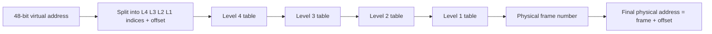
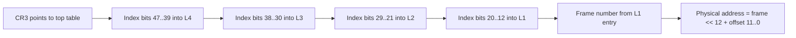
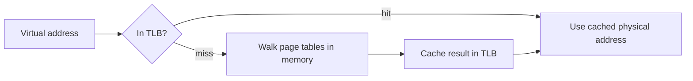
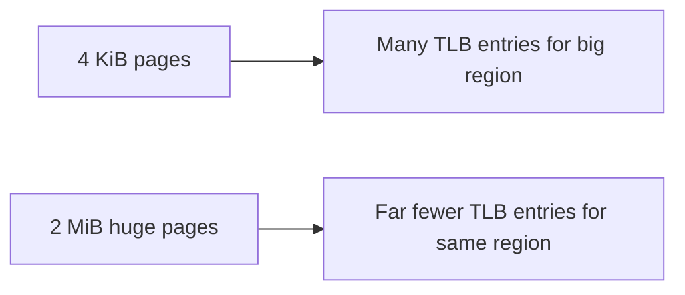
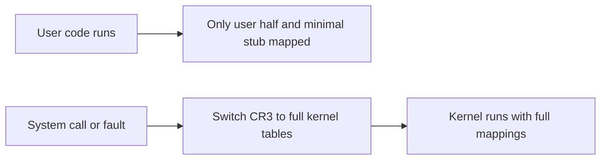

The previous chapter introduced virtual addresses and the page tables that translate them. It kept the translation itself at a distance. This chapter opens up that mechanism. It is the second article of Stage 6.

A program gives the CPU a virtual address. Before any byte moves, the MMU (the memory management unit) must turn that address into a physical frame number and an offset. That data lives in page tables. Page tables sit in memory and use levels, so a 64-bit address space never needs one giant table.

Walking those levels on every access would be too slow. So the hardware keeps recent translations in a cache called the TLB (translation lookaside buffer). A TLB miss costs time. Larger pages reduce both the table depth and the number of translations the TLB must hold.

## Pages and page sizes

Memory is managed in fixed-size blocks called pages. On most Linux systems the base page size is 4 KiB. This means the address space splits into 4096-byte units. The lowest bits of an address pick a byte inside one of those units.

The page size matters because it sets the grain of translation. A 4 KiB page needs 12 offset bits. The rest of the virtual address names which page. Larger pages, such as 2 MiB and 1 GiB on x86-64, shift the balance to fewer and larger units. This changes the shape of the tables and the behavior of the TLB cache.

You can ask the system what it uses.

```bash
getconf PAGESIZE
getconf PAGESIZES
grep Huge /proc/meminfo
```

The first line reports the base size in bytes. The second reports every size the architecture supports. The `meminfo` lines report whether huge pages are reserved or free, which becomes relevant later in this chapter.

## Why translation needs a structure, not one table

A simple design would use one array. It would be indexed by virtual page number. Each slot would give the physical frame. For a 4 KiB page and a 48-bit address space, that array would have millions of billions of entries. Almost all of them would be empty. No process uses more than a sliver of the address space.

Instead, page tables are hierarchical. The virtual page number splits into several indices, one per level. Each level points to the next. Empty regions need no deeper table. So unused address ranges cost almost nothing. The structure matches how the address space is used. There are large unused gaps, a few mapped regions, and only some pages present.



The diagram shows the idea at a high level. Each level is a table of pointers to the next level. Only the last level points to the actual physical frame. The number of levels depends on the architecture and the address width.

## Multi-level page tables

On x86-64 with four levels, the hardware uses 48 bits of virtual address. Those bits split into four 9-bit indices and a 12-bit page offset. Each 9-bit index selects one of 512 entries in a table. So each table is exactly one page. The math is simple. 512 entries times 8 bytes equals 4096 bytes.

An entry in an upper-level table says one of two things. The region is unmapped, or it points to the next table. The final level entry points to the physical frame and carries the permissions for that page. Each level is itself page-sized and is only created when needed. So a process with a small mapped region keeps only a tiny fraction of the possible tables.

ARM64 can use a similar four-level scheme. It also supports larger pages such as 16 KiB and 64 KiB. These change the number of offset bits and therefore the split. The principle is the same across architectures. Split the page number into indices, walk them, and only pay for the tables that back mapped memory.

## What a page-table entry holds

Each entry in the lowest-level table does more than name a frame. It is a bundle of control bits. The hardware checks these bits on every access.

| Bit or field | Meaning |
|---|---|
| Present | Whether the page is currently mapped in physical memory |
| Read/Write | Whether writes are allowed to this page |
| User/Supervisor | Whether user-space code may access the page |
| Accessed | Set by hardware when the page is read or written |
| Dirty | Set by hardware when the page is written |
| Execute-disable | Whether instructions may be fetched from the page |
| Frame number | The upper bits that identify the physical frame |

These bits enforce the permissions from the previous chapter. A page marked read-only but not writable causes a fault when the program writes. A page with execute-disable set causes a fault when the CPU fetches instructions from it.

The present bit makes a page fault possible. But its absence does not mean the process is wrong. A cleared present bit can mean several things. The page may have been swapped to disk and must be read back. It may be demand-paged. This means the region was reserved but no frame was allocated until the first touch. It may be a copy-on-write page whose private copy has not been made yet. It may be a lazily mapped file whose contents have not been read.

The kernel reads the fault reason from the surrounding virtual memory area and the PTE state. Then it either fixes the mapping or, if none of those explanations apply, delivers a fatal fault. The next chapter follows this in detail. This is exactly what a backend engineer sees when a service is slow after a restart. It is also what an `mmap` of a large file feels lazy rather than eager.

## Walking an address by hand

Take a 48-bit virtual address on x86-64 with 4 KiB pages. The low 12 bits are the offset. The next 9 bits index the level 1 table. The next 9 bits index the level 2 table, then level 3, then level 4. The CPU starts at the top-level table. Its physical address sits in a privileged register called `CR3` on x86-64.



Here is a concrete walk. Suppose `CR3` points to a top table. Bits 47..39 pick an entry there. That entry gives the physical address of the level 3 table. Bits 38..30 pick an entry in that table. That gives the level 2 table, and so on, until bits 20..12 pick the final entry. That entry's frame number is shifted left by 12 and added to the low 12 offset bits. The result is the physical address sent to the memory controller.

The hardware must do this walk for every translation that is not already cached. With four levels, a full walk touches five memory locations. The four tables and then the final data. That cost is why the next section exists.

## The translation lookaside buffer

The translation lookaside buffer, usually called the TLB, is a small fast cache inside the MMU. It remembers recent virtual-to-physical translations. When the CPU needs to translate an address, it checks the TLB first. If the translation is there, the physical address is ready in a single cycle and no page-table walk happens.



The TLB is small on purpose because it must be fast. A typical core holds a few dozen to a few thousand entries for data, and a similar range for instructions. That covers the working set of most programs. But a program with a very large or scattered working set can exceed it. Then it pays the walk cost again and again.

## TLB misses and their cost

A TLB miss means the hardware walks the page tables. On a four-level design this is several memory reads. Each read may itself miss in the data caches. A miss costs far more than a hit. A stream of misses can dominate a workload that otherwise looks compute bound.

The TLB is also tied to isolation. Each process has its own page tables. The translations cached for one process are not valid for another. On a context switch the kernel must make the TLB safe. A simple kernel flushed the entire TLB. That is correct but expensive, because the new process then starts cold. Modern kernels instead tag each TLB entry with an address-space identifier. On ARM it is called ASID. On x86-64 it is called PCID. Entries from the old process stay valid for that process. They are simply ignored when the new process runs. The TLB does not have to be wiped on every switch. It is only wiped when the identifier space wraps or when specific mappings change. This is the main reason context switches are cheaper than a full flush. It is also why the earlier mention of address-space tagging does real work rather than being a small detail.

Address randomization from the previous chapter also interacts here. Randomizing bases does not change TLB behavior much by itself. But a workload that touches many distinct pages keeps the TLB from reaching a steady warm state. So does a workload that switches address spaces often.

## Huge pages

Huge pages are larger than the base size. Most often 2 MiB, and sometimes 1 GiB on x86-64. They change the translation in two useful ways. First, a larger page means fewer offset bits. This removes one or more levels from the walk. A 2 MiB page can be reached with one fewer table level, so the walk is shorter. Second, one huge page maps far more memory per TLB entry. So the same number of cached translations covers a much larger working set.



The benefit is a lower TLB miss rate and shorter walks for large, regularly accessed memory. Examples are in-memory databases, big heaps, and memory-mapped files. The tradeoffs are real. Huge pages must be aligned and are allocated in larger units. So they can waste space for small or sparse allocations. Reserving them can require explicit configuration or defragmentation that briefly stalls allocation.

Linux offers two kinds. Explicit huge pages are reserved by an administrator and requested by a program through `mmap` with the right flags. Transparent huge pages are pages the kernel tries to promote from 4 KiB to huge automatically. Transparent promotion can improve throughput. But it can also cause latency spikes while the kernel compacts memory. That is why some latency-sensitive services prefer explicitly reserved huge pages for only their hot regions.

There is a middle path between fully transparent promotion and manual reservation. The kernel exposes `/sys/kernel/mm/transparent_hugepage/defrag`. Setting it to `madvise` means the kernel only attempts promotion for regions the program marks with `madvise(MADV_HUGEPAGE)`. The rest stay on normal pages. This is the fix many practitioners use. It removes the surprise global compaction stalls from the production example above. The hot index still gets huge pages through an explicit hint. No fixed pool needs to be reserved at startup. The choice then becomes per-region rather than all-or-nothing.

On multi-socket machines, which node owns the frame also matters. A huge page that lands on a remote NUMA node adds cross-socket latency on top of the TLB saving. That interaction is covered in the scheduling and NUMA chapter of this series. But keep it in mind here. A huge page helps the TLB. Yet the node it lives on decides the memory bandwidth it actually sees.

## Observing page sizes, tables, and TLB behavior

You can see the base page size from a program and from the shell. You can measure TLB behavior with `perf`.

```go
package main

import (
    "fmt"
    "os"
)

func main() {
    fmt.Println("page size:", os.Getpagesize(), "bytes")
    fmt.Println("pid:", os.Getpid())
    big := make([]byte, 1<<20)
    _ = big
    select {}
}
```

```bash
go build -o tiny main.go
./tiny &
pid=$!
sleep 0.2
getconf PAGESIZE
grep Huge /proc/meminfo
cat /proc/$pid/smaps | grep -E "Size|KernelPageSize|MMUPageSize" | head
perf stat -e dTLB-loads,dTLB-load-misses,iTLB-loads,iTLB-load-misses ./tiny 2>&1 | head
kill $pid
```

This shows the difference between declared and observed behavior. `getconf` shows the base size. `meminfo` shows whether huge pages are reserved. `smaps` shows the page size the kernel used for each mapping. `perf` shows how many data and instruction TLB accesses missed. A workload with a high `dTLB-load-misses` rate relative to `dTLB-loads` is a candidate for huge pages. It is also a candidate for reducing the span of its working set.

## A realistic production example

A team ran an in-memory store. It kept a multi-gigabyte index and served lookups from it. Under load they saw good average latency but bad tail latency. `perf` on a representative request path showed a high rate of `dTLB-load-misses`. The index was allocated as normal anonymous memory in 4 KiB pages. The working set of a hot request touched many pages spread across gigabytes. That exceeded what the small data TLB could hold.

Their first attempt was to enable transparent huge pages and let the kernel promote pages. Average latency improved and the miss rate dropped. But every so often a request would stall for tens of milliseconds. The kernel was compacting memory to form huge pages on demand. That compaction paused the allocating thread. The tail got worse in a different way.

They then switched to explicitly reserved huge pages. The administrator reserved a pool sized to the hot index. The program mapped the index with the huge-page flag instead of relying on promotion. The miss rate fell as before. But because the pages were already huge and pre-reserved, there was no runtime compaction and no stall. The `smaps` output for the index region showed `KernelPageSize: 2048 kB`. The tail latency that had been erratic became steady.

The lesson is that the TLB is a real resource with a real miss cost. Huge pages are the main lever for it. But the method of obtaining huge pages matters. Transparent promotion trades a stall for a later compaction pause. Explicit reservation moves that cost to startup, where it is predictable.

## How engineers actually reason about translation

They start from the working set. How much memory does a hot code path actually touch. Is it contiguous enough that a handful of translations cover it. If `perf` shows a high TLB miss rate, they ask whether the data is scattered. They ask whether huge pages or a denser layout would reduce the number of distinct pages.

They also separate the walk cost from the isolation cost. A TLB miss costs a walk. A context switch costs a TLB flush or a re-tagging. A service that does many system calls pays both. One that switches between many address spaces also pays both. The symptom is slow even when the algorithm looks right.

For huge pages they weigh the win against the cost. Reserved huge pages are predictable but require planning. They can waste space if the region is smaller than a page. Transparent huge pages are convenient but can stall. The choice tracks whether the workload is latency sensitive or throughput oriented.

## Page table isolation, Meltdown, and the user and kernel split

A process's address space has two halves. The user half is where the program runs. The kernel half is mapped so the kernel can service system calls and faults without switching page tables. For years, both halves were present in the tables at all times. The Meltdown class of attacks showed a problem. Speculative execution could read kernel memory through the user mapping. So Linux adopted kernel page table isolation, called KPTI or KAISER. It keeps only a minimal stub of kernel memory mapped while user code runs. It switches to the full kernel tables on entry to the kernel.



The security gain is real. But the cost is paid at every kernel entry and exit. The CR3 switch flushes the user-space TLB entries that KPTI deliberately unmapped. On machines with PCID support the kernel can tag and partly preserve those entries. This softens the blow. The general lesson holds. Isolation features that divide the address space also divide the TLB. A workload that makes many system calls per unit of work will feel the switch. This is why the earlier mention of PCID is not a footnote. It is a load-bearing optimization for exactly this mitigation.

## Second-level translation for virtual machines and DMA remapping

When a virtual machine runs, its guest operating system builds page tables. These translate guest virtual addresses to guest physical addresses. But guest physical addresses are not host physical addresses. The hypervisor must translate them again to real RAM. This is second-level address translation. On Intel it is called EPT. On AMD it is called SLAT or RVI. The hardware walks the guest tables and then the EPT tables in one step. So a guest memory access is translated twice without the hypervisor trapping on every access.


Without EPT, the hypervisor would have to shadow the guest's page tables. That is slow and complex. With EPT, virtualization of memory is nearly free. That is why nested paging is a baseline expectation for any modern cloud host. A related mechanism is the IOMMU. Intel calls it VT-d. AMD calls it AMD-Vi. It remaps device DMA the same way. A device's physical addresses can be confined to the memory the OS assigned it. That matters for the zero-copy and DMA work in a later chapter. Direct device access from user space is only safe once the IOMMU bounds what the device may touch.

## Memory protection keys

Beyond the read, write, and execute bits, x86-64 and some other architectures offer memory protection keys. They are called pkeys. The kernel can assign a key to a range of pages. A process holds a permission register, the PKRU on x86, that says whether the current thread may read or write pages of each key. Unlike `mprotect`, changing the key permission is a single register write. It does not require a system call or a page-table walk. So a program can switch protection on and off per thread at very low cost.

This is useful for in-process sandboxes. It can mark sensitive regions such as cryptographic keys as unreadable except in a tight critical section. It can catch stray writes by revoking write permission to a pool of pages while it is not in active use. It is a finer and faster tool than the coarse page permission bits. It is the modern way to build memory protections that once required separate mappings or `mprotect` calls.

## Introspecting the page tables

The kernel exposes the translation state for debugging and measurement. `/proc/<pid>/pagemap` lets a privileged reader learn, for each virtual page of a process, whether it is present. It shows which physical frame backs it. It shows whether it was recently accessed or dirtied. Writing to `/proc/<pid>/clear_refs` resets the accessed and dirty bits. Then you can measure working-set churn over an interval. This is how tools estimate which pages a process actually used. `/proc/kpageflags` and `/proc/kpagecount` describe the physical frames globally. For live TLB and walk behavior, `perf` events such as `dTLB-load-misses`, `iTLB-load-misses`, and `page-faults` quantify the cost described throughout this chapter. Combined with `smaps`, these let an engineer prove whether a slow path is paying for translation, for reclaim, or for both.

## Definitions

### A page table

> A structure that the kernel keeps. It maps virtual page numbers to physical frames. It is organized in levels. Unmapped regions of the address space need no table entries. The lowest-level entry also carries the permission and status bits for the page.

### Address translation

> The hardware process of turning a virtual address into a physical address. The page number splits into level indices. The hardware walks the page tables from the top. It combines the final frame number with the page offset.

### A page-table entry

> The record at the end of a walk. It names the physical frame. It holds the present, read/write, user/supervisor, accessed, dirty, and execute-disable bits. The MMU checks these bits on every access.

### The TLB

> A small fast cache in the MMU. It remembers recent virtual-to-physical translations. So most accesses skip the page-table walk. A miss forces a walk through several memory reads.

### Huge pages

> Pages larger than the base size. Commonly 2 MiB or 1 GiB. They shorten the walk and let one TLB entry cover more memory. They reduce the TLB miss rate. The cost is alignment, reservation, and potential waste or compaction stalls.

## Beyond the definitions

### Why are page tables hierarchical

> A flat table for a large address space would be enormous and almost empty. Levels let unused regions cost nothing. A table is only allocated when some address inside it is actually mapped.

### What happens on a TLB miss

> The MMU walks the page tables in memory. It reads each level until it reaches the frame. Then it caches the result. The walk touches several memory locations. So a miss costs far more than a hit. A burst of misses can dominate a workload.

### Why context switches affect the TLB

> Each process has its own page tables. So translations cached for one process are invalid for another. The kernel flushes or re-tags the TLB on switch. This makes the new process start with a cold TLB. It adds to the switch cost.

### When do huge pages help

> When a workload has a large, heavily accessed working set that overflows the small TLB. One huge page covers more memory per cached translation and shortens the walk. They help least for small or sparse allocations.

### What is the difference between reserved and transparent huge pages

> Reserved huge pages are allocated up front by the system and mapped on request. Their cost is predictable. Transparent huge pages are promoted by the kernel automatically. This can improve throughput but may stall a thread during memory compaction.

## Common misconceptions

**"The page table is one big array."** It is hierarchical. Only mapped regions have table entries. The levels are created on demand. So a process with a small footprint keeps a tiny fraction of the possible tables.

**"Every memory access walks the page tables."** Only a TLB miss does. A hit uses the cached translation and never touches the tables. That is why the TLB is the performance-critical structure.

**"Huge pages are always better."** They help large regular working sets. But they waste space for small ones. They can stall when obtained through compaction. The right choice depends on the workload's size and latency sensitivity.

**"A TLB flush only happens on reboot."** It happens on context switches and on changes to a process's own mappings. Cached translations for the old context or old layout would be wrong.

**"The MMU is only for isolation."** Isolation is one result. But translation also enables lazy mapping, copy-on-write, swapping, and shared pages. All of these depend on the page tables being the single source of truth for memory.

## Summary

Virtual addresses become physical addresses through page tables. The MMU walks them level by level. It uses the present, permission, and status bits in each entry to locate the frame and enforce what the program may do. The TLB caches those translations. So most accesses avoid the walk. Misses cost several memory reads, which is why a large or scattered working set can suffer. Huge pages shorten the walk and cover more memory per TLB entry. They trade some flexibility for a lower miss rate. The next chapter will follow what happens when a translation is not present at all. That is the page fault.
