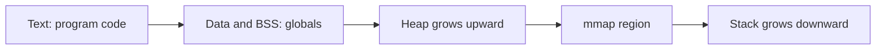
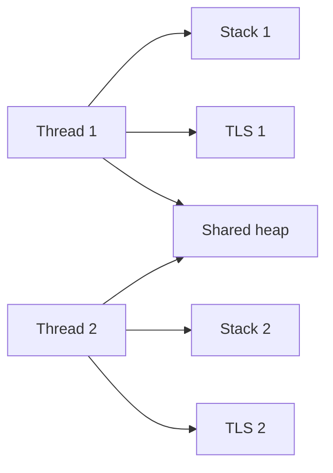
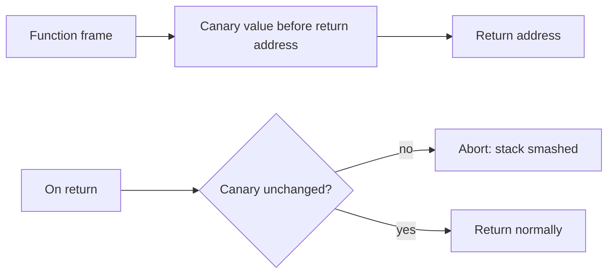

The first four chapters of this stage described the address space as a whole, the tables that translate it, the faults that fill it, and the mappings that project files into it. This chapter goes down to the two regions a working program touches every instant: the stack and the heap. It is the fifth article of Stage 6, and it is the foundation for the allocator and memory-safety chapters that follow.

Every function call puts something on the stack, and almost every dynamic data structure lives on the heap. Understanding where each lives, how it grows, what bounds it, and what fails when those bounds break is not optional for a backend engineer. A misjudged stack size crashes a thread; a misunderstood heap turns into a slow memory leak in production. The distinction is also where a large class of security bugs begins, which the later memory-safety chapter will treat directly.

## The shape of a process address space

A Linux process on x86-64 does not get one flat blob of memory. The kernel lays out several distinct regions in the virtual address space, each with a job. From low to high addresses, the usual order is: the program text (the machine code), the initialized data, the zero-initialized data, the heap, the memory-mapped region, and the stack at the top.



The heap and the stack grow toward each other. The heap starts just above the data and bss and expands upward as the program asks for more memory. The stack starts near the top of the address space and expands downward as functions are called and local variables are created. Between them sits the mmap region, which is where the previous chapter's file mappings and shared memory live, along with most shared libraries. As long as the two moving boundaries do not meet, the process has room.

This layout is why the first chapter's observation of `/proc/<pid>/maps` showed several named regions. `[heap]` and `[stack]` appear as labeled segments, and the mmap region is the cluster of file and anonymous mappings in the middle. The addresses are randomized by ASLR, as covered earlier, but the relative order is stable.

## The stack and what it holds

The stack is the region that backs function calls. Each time a function runs, the compiler emits code that reserves a slice of the stack for that function's frame. The frame holds the return address (where to go back to when the function ends), saved registers, and the function's local variables. When the function returns, its frame is discarded and the stack pointer moves back.


The crucial property is automatic lifetime. A local variable exists exactly as long as its function is on the call chain, and it vanishes the instant the function returns. The program does not ask for it or free it; the stack pointer moving is the entire allocation and deallocation. This makes the stack extraordinarily fast: reserving space is one register adjustment, and freeing is another. There is no bookkeeping, no search for free space, and no fragmentation.

Because the stack is a single contiguous block per thread, it also has excellent cache behavior. Variables in the current frame and recently called frames sit close together in memory, so they are likely already in cache. This locality is one reason deeply nested, small-local function code is fast.

## Stack growth and the guard page

The stack grows downward, meaning each new frame uses a slightly lower address. The kernel allocates the stack lazily: it does not wire up every page up front. Instead it places a guard page just past the current limit. When a function writes into the guard page, a page fault fires, the kernel extends the stack by mapping the next page, and execution continues. This is the same demand-paging idea from the page-fault chapter, applied to a specific region.

The guard page is also the safety rail. If the stack grows past what is available and there is no room left before it would collide with another region, the next access hits an unmapped area with no valid mapping, and the process receives a segmentation fault. This is the classic stack overflow. It is not a graceful error; it is a signal, and by default it kills the process.

The maximum stack size is bounded. On Linux the default is often eight megabytes per thread, visible through `ulimit -s`. That limit is deliberate: a stack that could grow without bound would let a bug consume the address space. A thread that needs more must ask for it explicitly, usually when the thread is created.

## Thread stacks and the heap they share

In a multi-threaded program, each thread gets its own stack. The main thread uses the process stack described above, but every worker thread is given a separate stack, typically allocated in the mmap region and sized to the requested or default limit. This is why a crash in one thread's deep call chain does not corrupt another thread's stack: they are separate regions with separate guard pages.

The heap, by contrast, is shared. All threads allocate from the same heap and the same allocator, which means heap allocation must be thread-safe. The allocator uses locks or per-thread caches (the next chapter covers how) so that two threads calling `malloc` at once do not corrupt the heap. The stack needs no such coordination because each thread owns its own.

This split explains a recurring design tension. Stack memory is private, fast, and automatically reclaimed, but small and fixed in size. Heap memory is shared, large, and long-lived, but slower to obtain and the engineer must manage its lifetime. Choosing where data lives is one of the most consequential decisions in systems code.

## The heap and dynamic lifetime

The heap exists for data whose size or lifetime is not known at compile time. When a function allocates a buffer whose length comes from a request, or builds a structure that must outlive the function that created it, that memory comes from the heap. The allocator carves it out of a larger region the kernel granted, and returns a pointer.

Unlike the stack, heap memory does not vanish when the allocating function returns. Its lifetime is controlled by the programmer (in C and C++) through an explicit free, or by a runtime system (in Go, Java, and others) through a garbage collector. That freedom is powerful: it lets programs build trees, lists, caches, and request-scoped buffers of arbitrary size. It is also the source of two enduring problems: leaks, when memory is never freed, and fragmentation, when free memory exists but not in a usable contiguous shape.

The heap grows upward through `brk` and `mmap`. Small or early allocations often extend the heap boundary with `brk`, while larger allocations and many runtime allocators use `mmap` to obtain whole pages directly. Either way, the kernel hands out pages, and the user-space allocator subdivides them into the small blocks a program requests. The next chapter examines that subdivision closely.

## Internal and external fragmentation

Fragmentation is why the heap is not simply "a big array you append to." Two kinds matter.

Internal fragmentation happens when the allocator gives you a block larger than you asked for. If the allocator works in fixed sizes, a request for 24 bytes may round up to 32, and the extra 8 bytes are wasted inside the block. Across millions of allocations this waste adds up to noticeable memory overhead.

External fragmentation happens when free memory exists in total but not in a single contiguous piece. Suppose the heap has two free 1 KB blocks separated by an allocated 1 KB block. A request for 2 KB contiguous bytes cannot be satisfied from those free pieces, even though 2 KB is free overall. The allocator either fails, falls back to asking the kernel for more, or spends effort coalescing adjacent free blocks. Long-running services that allocate and free many different sizes are exactly where external fragmentation bites.

The stack does not have these problems, because every frame is the same shape at its level and is reclaimed whole. The price the stack pays is its rigid size limit.

## Stack versus heap, in practice

The tradeoffs are worth stating plainly, because they decide where data should live.

| Property | Stack | Heap |
|---|---|---|
| Allocation speed | One pointer move, very fast | Allocator work, slower, may fault |
| Lifetime | Until function returns | Until explicitly freed or collected |
| Size limit | Small, fixed per thread | Large, bounded by RAM and address space |
| Thread safety | Private per thread | Shared, needs coordination |
| Fragmentation | None | Internal and external possible |
| Failure mode | Overflow kills the thread or process | Leak grows RSS, fragmentation wastes it |

A useful rule of thumb: if the data's lifetime matches a function call and it fits within the stack limit, the stack is the right home. If the size is large, comes from input, or must survive the call, it belongs on the heap. The bugs in this area are predictable. Putting a huge buffer on the stack invites overflow. Putting short-lived small objects on the heap invites allocator pressure and leaks.

## Stack overflow in the real world

Stack overflow is not only a student's infinite recursion. It appears in production as deep call chains on hostile or unexpected input, or as a too-large local variable. A parser that recurses on nested structure, given pathologically deep input, descends until it exhausts the eight-megabyte stack. A function that declares a large local array, say a buffer of several megabytes, consumes a large slice of the stack in a single frame, leaving little room for anything else.

When the guard page is breached, the process takes a `SIGSEGV`. The crash dump shows a stack trace many thousands deep, or a single frame whose local variable is enormous. The fix is rarely to raise the limit endlessly. It is to move large buffers to the heap, or to rewrite the recursion as an explicit loop with a heap-allocated work stack, which trades a bounded stack for an effectively unbounded heap.

## Observing the regions

You can see the stack and heap directly. `/proc/<pid>/maps` labels them, and `/proc/<pid>/status` reports their sizes. A program can also print the addresses of its own variables to show where each region sits.

```go
package main

import (
    "fmt"
    "os"
    "runtime"
)

var global int

func show() {
    local := 1
    heap := new(int)
    fmt.Printf("code   (show fn): %p\n", show)
    fmt.Printf("global var    : %p\n", &global)
    fmt.Printf("local  var    : %p\n", &local)
    fmt.Printf("heap   alloc  : %p\n", heap)
}

func main() {
    show()
    fmt.Println("goroutines:", runtime.NumGoroutine())
    _ = os.Getpid()
    select {}
}
```

```bash
go build -o layout main.go
./layout &
pid=$!
sleep 0.3
grep -E "\[heap\]|\[stack\]" /proc/$pid/maps
grep -E "VmStack|VmData|VmExe|VmRSS" /proc/$pid/status
echo "default stack limit (bytes):"; ulimit -s
kill $pid
```

What it shows depends on the runtime. In a C program the local's address is high (near the stack top), the heap allocation's address is lower (in the heap region), the global is in the data/bss area, and the function code is in the text region, exactly matching the layout diagram. In Go the picture is more subtle: goroutine stacks are small and can be moved and grown by the runtime, and what `new` returns still lives in the heap, but the printed addresses illustrate the same relative ordering at a high level. The point is that these regions are real, addressable, and inspectable, not abstract.

## A realistic production example

A team ran a service that parsed a configuration language. The parser was written recursively, descending into nested blocks with one function call per level. For normal configurations with a few dozen levels of nesting, it worked flawlessly. Then a customer submitted a configuration with thousands of nested blocks, a shape the authors had never tested.

Each nesting level consumed a stack frame, and the frames accumulated down the call chain. At roughly eight megabytes of stack, the next frame crossed the guard page with no room left, and the worker thread took a `SIGSEGV`. The process died, and because the parser ran on the request thread, the whole worker process crashed, not just the one request. The logs showed a stack trace thousands of frames deep ending in the parser, which was the tell.

The first fix some engineers reached for was to raise the stack size with `ulimit -s` or a larger thread stack. That only delayed the crash: a deeper input would still overflow a larger stack, and a bigger stack per thread also raised the memory cost of every worker. The real fix was to change the parser to use an explicit loop with a heap-allocated stack of work items, so the depth of nesting became a heap allocation bounded by available memory rather than by the fixed thread stack. After that, the same pathological configuration parsed correctly, and the only cost was a larger but manageable heap allocation that the service could reject if it grew truly unreasonable.

The lesson was that the stack is a fixed, per-thread resource sized for ordinary call depth, not for adversarial or unexpected input. Anything whose depth or size can be driven by external data belongs on the heap, where growth is bounded by policy and by RAM rather than by a hard eight-megabyte wall that fails closed.

## How engineers actually reason about stack and heap

They decide placement by lifetime and size. Data that lives exactly as long as a function call and is small belongs on the stack, where it is free to allocate and free and where it stays cache-hot. Data whose size comes from input, or that must outlive the call, belongs on the heap, with the understanding that someone must manage it.

They treat deep recursion as a stack-risk. Any parser, serializer, or walker that descends on input should be assumed to meet a pathologically deep input eventually, and the design should move that depth to the heap. The crash from a stack overflow is a process death, not a recoverable error, so it must be designed out, not caught.

They watch the heap for the slow failures. A stack overflow is loud and immediate; a heap leak is quiet and cumulative, growing resident memory until the machine swaps or the OOM killer arrives. The address-space regions are observable, so a steady climb in `VmData` or heap `RSS` in `smaps` is an early warning the next chapter's tools can act on.

They remember that the heap is shared and the stack is not. Concurrent code can allocate on the heap freely only because the allocator is built to be thread-safe, and that safety has a cost that the stack never pays. Hot paths that can stay on the stack are faster for that reason.

## Thread-local storage and the per-thread memory region

The stack is not the only per-thread region. A variable declared with `thread_local` in C++ or `__thread` in C, or any language's per-thread state, lives in a thread-local storage region that the runtime allocates for each thread, separate from both the stack and the shared heap. Each thread sees its own copy at the same name, so the variable behaves like a global but is private to the thread, which is how libraries keep state without locks.



TLS sits between the stack and the heap in the layout, and like the stack it is private and fast, but its lifetime matches the thread, not the function call. A thread that exits loses its TLS. This matters when reasoning about memory: a thread-local cache looks like a small per-thread allocation, but under many short-lived threads it multiplies, and a leak held in TLS survives the function that created it for as long as the thread runs.

## Stack hardening: canaries, the stack protector, shadow stacks, and stack-clash protection

Because the stack holds return addresses and local buffers adjacent in memory, it has always been a prime target for memory corruption. The stack protector, enabled by `-fstack-protector`, places a random canary value on the stack frame and checks it before the function returns. If a buffer overflow wrote past the local variable into the canary or the return address, the check fails and the program aborts instead of jumping to attacker-controlled code.



Modern CPUs add a hardware shadow stack, part of Intel CET and ARM Pointer Authentication, which keeps a separate, protected copy of return addresses that cannot be overwritten by a buffer overflow, so even a corrupted stack return address is ignored in favor of the shadow copy. Stack-clash protection, `-fstack-clash-protection`, closes a different hole: an attacker who allocates a huge stack object can skip over the guard page and write into unrelated memory. The protection touches the stack in small steps so the guard page is always hit. Together these turn the stack from a fragile region into one that fails safely, and they are standard in hardened production builds.

## Signal stacks, alloca, and special stack uses

A few stack uses deserve their own caution. `alloca` and variable-length arrays allocate within the current frame, so they disappear when the function returns, but they consume stack space that the compiler may not have reserved against the limit, and a large or attacker-influenced size is a direct path to overflow. They are best avoided in network-facing code, where the size can be driven by input.

Signal delivery is the other edge. When a signal such as `SIGSEGV` or `SIGBUS` arrives, the handler runs on the current stack by default. If the signal was caused by a stack overflow, the handler itself has no room and faults again. `sigaltstack` lets a process install a small dedicated alternate stack for signal handlers, so a handler can run even when the normal stack is exhausted, which is how a service can log a crash or clean up instead of dying silently. For a backend engineer building robustness, an alternate signal stack plus a `SIGSEGV` handler that records the fault and exits is the difference between a mysterious disappearance and a useful crash report.

## Definitions

### The stack

> The per-thread region that backs function calls, holding return addresses, saved registers, and local variables in frames that are allocated and freed automatically as functions are entered and returned. It grows downward from near the top of the address space.

### A stack frame

> The slice of the stack a single function call uses, containing its local variables, saved state, and the return address that tells the CPU where to resume the caller when the function ends.

### The heap

> The shared region used for memory whose size or lifetime is not known at compile time. It is obtained from the kernel in pages and subdivided by a user-space allocator, and its contents persist beyond the function that allocated them.

### Stack overflow

> The failure that occurs when the stack grows past its guard page and available space, usually from unbounded recursion or an over-large local variable, delivered as a segmentation fault that by default kills the process or thread.

### Fragmentation

> The mismatch between total free memory and usable free memory in the heap, of two kinds: internal, where blocks are larger than requested, and external, where free pieces are scattered and cannot satisfy a contiguous request.

## Beyond the definitions

### Why is allocating on the stack so much faster than the heap

> The stack only moves a pointer to reserve or release a frame, with no search, no bookkeeping, and no thread coordination. The heap must find a suitable free block, split it, track it, and do so safely under concurrent access, which is real work on every allocation.

### Why does each thread need its own stack

> Because the stack holds the call chain and local state of that thread's execution. A single shared stack would mean one thread's function calls overwrote another's, so each thread gets a private region with its own guard page, while the heap stays shared because data often needs to be visible across threads.

### What is the guard page for

> It is an unmapped page placed just past the stack's current limit. A access into it triggers a fault the kernel handles by mapping the next page and extending the stack. If there is no room to extend, the access instead becomes a fatal fault, which is the stack-overflow signal.

### Why is deep recursion dangerous even when it looks correct

> Because its stack consumption is proportional to input depth, not to a fixed amount. A parser that works on test inputs can still consume the entire fixed stack on a deeply nested hostile input, turning a correctness issue into a process crash that takes down the worker, not just the request.

### How do Go and other managed runtimes differ here

> They still have a stack and a heap, but the runtime often grows stacks dynamically and may move them, and the heap is reclaimed by a garbage collector rather than explicit frees. The regions and their tradeoffs remain the same, but the engineer is relieved of manual free and of fixed stack sizing for ordinary depth.

## Common misconceptions

**"The heap is slow, so everything should be on the stack."** The stack is fast precisely because it cannot do what the heap does. Large or long-lived data cannot live there, and forcing it there causes overflow. The right move is to match lifetime to region, not to avoid the heap.

**"A stack overflow is a recoverable error."** It is a signal that by default kills the process or thread. You can install a handler, but the stack is already corrupted at that point, so the only safe response is often to exit. It must be designed out, not caught.

**"Raising the stack size fixes deep recursion."** It only raises the threshold. A larger input still overflows, and a bigger stack per thread costs memory for every thread. Moving depth to the heap is the real fix.

**"The heap has no limit."** It is bounded by RAM, by swap, and by the address space, and allocations fail or trigger the OOM path when those are exhausted. The limit is softer than the stack's hard wall, but it is very real, and leaks find it slowly.

**"Local variables are always on the stack."** In most native code they are, but compilers may keep them in registers, and some runtimes (and some optimizations) place certain objects on the heap despite their lexical scope. The mental model holds for reasoning, but the details vary by language and optimization level.

## Summary

The stack and the heap are the two working regions of every process, with opposite strengths. The stack is fast, private, automatically reclaimed, and strictly bounded; it backs function calls and holds local state until the function returns. The heap is shared, large, long-lived, and managed by an allocator that pays for flexibility with bookkeeping and fragmentation. The boundary between them is where a program's correctness and its resource behavior are decided: overflow the stack and the process dies loudly, mismanage the heap and it dies slowly. The next chapter goes inside the heap to the allocator itself, which is the machinery that turns kernel pages into the small blocks a program actually requests.
