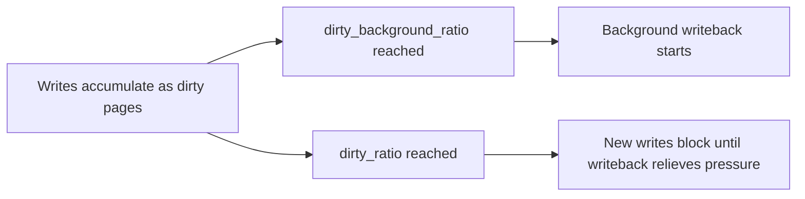

The previous article described two kinds of I/O. Buffered I/O goes through the kernel cache. Direct I/O goes straight to the device. With buffered I/O, your write call returns before the device stores the data. This article explains where that data waits. It also explains how to make the data stay after a crash. This is the fifth article in Stage 7. Stage 7 covers file I/O and correctness.

The page cache is the kernel's main speed trick for storage. The page cache is also the most common source of durability bugs. Durability means the data survives a crash or power loss. A write can return success and still be unsafe. In that case the kernel holds your bytes in memory only. You need a separate step to push them to storage. That step makes the promise real after a crash. If you understand the cache, the writeback engine, and the flush path, you can avoid a false promise. You will not tell users their data is safe when it is only in memory. This article is a reference. It covers how the cache works. It covers how the kernel tunes writeback. It covers which calls force a flush. It covers how to replace a file safely. It covers how devices handle flushes. It covers how to watch and debug the whole path.

## What the page cache is

The page cache is the kernel's memory copy of file data. Think of it as a fast shelf in RAM. When your program reads a file, the kernel copies pages from the device to that shelf. A page is a fixed size chunk of a file. Most systems use 4 KB per page. The next read of the same page comes from RAM. It does not hit the device. When your program writes, the kernel puts your bytes on the shelf. It then marks that page dirty. Dirty means the page holds new data that is not yet on the device. The cache is shared. The `read`, `write`, and `mmap` paths all use the same pages. `mmap` maps a file into memory. Your program can then access the file like an array. If many processes read or map the same file, the kernel keeps only one copy in memory. Each open file has an `address_space` object. That object tracks which file offsets live on which pages. That map makes lookups by offset fast. It also means `mmap` and `read` and `write` all see the same pages.


The diagram shows the life of a buffered write. Your program writes at step B. The call returns right away. The kernel writes the dirty page to the device later at step C. The data becomes durable only at step D. At step D the kernel pushes the data and the device confirms it. Many programs never do step D. That is fine for temp files. It is unsafe for data that must survive a crash.

## Read caching, readahead, and the warm versus cold distinction

The first read of a file is slow. The kernel must fetch pages from the device and fill the cache. Later reads of the same pages are fast. They come from memory. Suppose your service serves the same files again and again. The cache then absorbs most reads. That is why it stays fast. Suppose a web server sends the same image many times. The first request hits the device. Later requests hit the cache. Engineers call this cold versus warm. Cold means the cache starts empty. Warm means the cache already holds the hot pages. That is why the first requests are slow and later ones are fast.

The kernel also does readahead. Readahead means the kernel fetches the next pages before you ask for them. It does this when it sees you read in order. Your program then waits less for the device. That is why sequential reads beat random small reads. You can hint the kernel with `posix_fadvise`. Use `POSIX_FADV_SEQUENTIAL` to say you will read in order. The kernel can then prefetch more. Use `POSIX_FADV_RANDOM` to say you will jump around. The kernel then turns readahead off. That avoids wasted reads. Cache thrashing is another case. It happens when your working set is larger than RAM. The working set is the set of pages your program uses often. The kernel evicts a page before your program reuses it. Throughput drops. You can see this pressure in PSI at `/proc/pressure/memory`. PSI stands for pressure stall information. You can also watch it with `sar` and `vmstat`.

Benchmark numbers can mislead for this reason. A test that fits in cache measures memory speed. It does not measure storage speed. A test that starts cold measures the device. When you read a benchmark, ask which state it used.

## Write caching and the writeback engine

A buffered write only copies bytes into the cache. Then it returns. Later the kernel writes dirty pages to the device. A writeback thread does this work for each device. Several thresholds control it. The key ones are `vm.dirty_background_ratio` and `vm.dirty_background_bytes`. The ratio is a percent of memory. The bytes value is the same limit in absolute size. When enough dirty data builds up, background writeback starts. `vm.dirty_ratio` and `vm.dirty_bytes` set a hard ceiling. Once you pass that ceiling, new writes block. They wait until writeback frees space. Two timers also matter. `vm.dirty_writeback_centisecs` controls how often the writeback thread wakes to check for work. `vm.dirty_expire_centisecs` controls how old a dirty page must be before the kernel can write it.



This design trades a little risk for a lot of speed. Many small writes become one large device write. Reads of recent writes come from cache. The cost is clear. The data is not on stable storage until writeback runs. Stable storage means the device that keeps data after power loss. Suppose your service writes a file and then the machine loses power. Those dirty pages are gone. The thresholds are tunable. The right balance depends on your needs. If you value throughput, raise the dirty ratios. If you want bounded loss, lower them. Databases lower them.

## Dirty pages, memory pressure, and backpressure

The kernel cannot evict dirty pages like it evicts clean pages. Dirty pages hold the only copy of pending changes. Under memory pressure, memory is scarce. The kernel must write dirty pages back before it can free that memory. A system with a lot of dirty data can stall without warning. Writeback then competes with other work for CPU and I/O. Watch the `Dirty` field in `/proc/meminfo` to see how much data is pending.

Suppose your service writes faster than the device can accept data. It will hit the dirty limit. Its writes then wait for the flusher. The flusher is the kernel thread that writes dirty pages. This wait is backpressure from storage. Backpressure means the storage path pushes back on the writer. It shows as latency that rises with write volume, not CPU. You can keep the pending set bounded in two ways. Tune the dirty ratios. Or call `fsync` at set points. The `Writeback` field shows pages the kernel is writing right now. `nr_dirty` in `/proc/vmstat` gives the same count for scripts.

## Double buffering and why databases bypass the cache

Suppose an application already keeps its own copy of data in memory. A database buffer pool is one example. A buffer pool is the database's own cache. The page cache then holds a second copy of the same bytes. That duplication wastes memory. It also adds extra copy work. This is the double buffering problem. It is the main reason databases open files with `O_DIRECT`. `O_DIRECT` tells the kernel to skip the page cache. The previous article covered `O_DIRECT`. With it, the kernel does not cache what the application already caches.

The tradeoff is real. If you bypass the cache, you lose readahead. You also lose the free speedup for data the database did not plan to cache. Databases accept this cost. They have their own cache and prefetch logic. That logic is tuned to their access patterns. It often beats the generic page cache for their workload. Persistent memory and DAX file systems go further. DAX stands for direct access. They map storage directly into the address space. They bypass the page cache entirely. This fits when the storage is already byte addressable memory.

## fsync, fdatasync, sync_file_range, and the durability boundary

`fsync` forces all dirty data and metadata for a file to the device. Metadata means extra info about the file, such as its size. `fsync` also waits for the device to confirm the write. After `fsync` returns, the data survives a normal crash or power loss. This holds unless the device's own write cache breaks the promise. That case is discussed below. `fdatasync` is a lighter form. It flushes the data and only the metadata needed to find it, such as file size. It skips other metadata like modification time. It is often faster when only the file contents matter.

For finer control there is `sync_file_range`. It can write a specific byte range without waiting. It does this with `SYNC_FILE_RANGE_WRITE`. It can wait for a write that is already queued. It does this with `SYNC_FILE_RANGE_WAIT_BEFORE` or `WAIT_AFTER`. It can combine these flags. It is a speed tool for large files. Flushing a whole large file can be wasteful. `sync_file_range` avoids that. But it does not give a full durability guarantee. It does not force the metadata needed to find the data. `sync` and `syncfs` flush all file systems, or one file system. `O_SYNC` and `O_DSYNC` are flags you set at open time. They make each write wait as if you called `fsync` or `fdatasync`. That is simpler than checkpointing. It is also heavier.


The diagram shows the standard atomic file replace steps. This article returns to that pattern later. The durability rule is simple. A write without `fsync` is only a cache entry. It is not yet committed to storage. Renaming a file into place does not make it durable. You must flush the new file first.

## The atomic rename-replace pattern

A common need is safe file replacement. You want to replace a file with new contents. Readers must never see a half written file. The replace must also survive a crash. Here is the safe recipe. Write the new contents to a temp file in the same directory. Call `fsync` on that temp file. This pushes its data and metadata to the device. Then `rename` the temp file over the target name. The rename is atomic. Atomic means readers see either the old file or the new file. They never see a mix. Then `fsync` the directory. This records the rename itself. Many people forget the directory `fsync`, but it is required. A rename changes directory metadata. That change also lives in the cache until you flush it. `O_TMPFILE` is a handy way to create the temp file without a visible name. Editors and package managers use this same pattern when they save.

## Durability guarantees and device write caches

There is a subtle point beyond `fsync`. Many devices have a volatile write cache. Volatile means it loses data on power loss. Hard disks are a common example. Their cache confirms a write before the bytes reach the platter. Suppose the machine loses power right after that confirm. The kernel thought the data was durable, but it is still lost. File systems close this gap. They send a cache flush command during `fsync`. On modern drives they also use the FUA bit. FUA stands for force unit access. It tells the device to skip the cache for that write. You can disable the device write cache with `sdparm` or `hdparm -W0`. That trades speed for honest durability. Some compliance rules require it.

Solid state drives act in a similar way. Their controllers group and reorder writes. They do this for wear leveling. Wear leveling spreads writes to extend flash life. That makes the flush contract even more important. Here is the practical guarantee. `fsync` plus a device that honors flushes gives durability across power loss. Anything less is a gamble. Your odds depend on the exact hardware and its settings. Some enterprise SSDs have power loss protection. A capacitor flushes the cache when power fails. Those drives can confirm writes honestly without a flush. The kernel still sends flushes to be safe. Behavior depends on the drive class.

## Lost writeback errors

A subtle failure mode can hide writeback errors from your program. Suppose a dirty page fails to reach the device. The cause could be a bad sector. It could be a detached network mount. It could be a thin provisioned volume that ran out of space. Thin provisioned means the volume pretends to have more space than it does. The kernel records the error on the file's mapping. The next `fsync`, `fdatasync`, or `close` on that file should return `EIO`. `EIO` means I/O error. Once the kernel reports the error, it clears it. A second `fsync` may then return success, even though the data was lost. In some setups the error goes to only one file descriptor. A descriptor is a handle for an open file. A different descriptor or a later `close` may see no error. The lesson is clear. Check the return value of the `fsync` or `close` that follows the writes you care about. Do not assume a later success means the earlier data landed. Programs that must know about write failures should call `fsync` soon after important writes. They should not rely on a distant `close`.

## Flush behavior and related controls

Beyond per file `fsync`, the system offers `sync` and `syncfs`. `sync` flushes all dirty data in all file systems. `syncfs` flushes one file system. Knobs under `/proc/sys/vm` tune how hard the flusher works. You set them with `sysctl`. Mount options also change behavior. The `sync` mount option makes each write durable right away. That is safe but slow. `async` is the default. It lets the cache do its work. `relatime` and `noatime` lower metadata writes. The paths article covered them. Choosing among these is a deliberate tradeoff. You trade speed for safety on the critical path. Journaling interacts with all of this. The next article covers journaling. The file system must choose the order in which metadata and data reach the device. That order keeps the structure consistent after a crash.

## Observing the cache and durability path

You can see the cache in `/proc/meminfo`. Look at `Cached`, `Dirty`, `Writeback`, `Mapped`, and `Buffers`. The dirty counts are also in `/proc/vmstat`. The flusher thresholds live in `sysctl`. Disk activity and queue depth show in `iostat`. Suppose a service should call `fsync`. `strace` shows whether it actually does. `strace` traces the system calls a process makes. `vmtouch` or `pcstat` report which pages of a file are in memory. `mincore` queries residency from a program. Residency means which pages are in RAM. PSI at `/proc/pressure/memory` shows whether the cache causes allocation stalls.

```bash
# memory used by the page cache and the dirty pending set
grep -E "Cached|Dirty|Writeback|Mapped" /proc/meminfo
# flusher thresholds and timers
sysctl vm.dirty_background_ratio vm.dirty_ratio vm.dirty_expire_centisecs vm.dirty_writeback_centisecs
# disk activity while the service writes
iostat -x 1
# does the service actually fsync its important files
strace -e trace=fsync,fdatasync,sync_file_range -p $(pgrep myservice) 2>&1 | head
# which pages of a file are in cache
vmtouch -v somefile.dat
```

```go
package main

import (
    "fmt"
    "os"
)

func main() {
    f, err := os.Create("durable.txt")
    if err != nil {
        panic(err)
    }
    defer f.Close()

    f.WriteString("important state\n")
    // without the next line this may live only in the page cache
    if err := f.Sync(); err != nil {
        // a real service must check this; a lost writeback error can surface here
        panic(err)
    }
    fmt.Println("fsync returned: data now pushed to the device")

    // atomic replace pattern
    tmp, err := os.CreateTemp("", "replace-*.tmp")
    if err != nil {
        panic(err)
    }
    tmp.WriteString("new contents\n")
    tmp.Sync()
    tmp.Close()
    os.Rename(tmp.Name(), "target.txt")
    // fsync the directory so the rename is durable
    dir, _ := os.Open(".")
    dir.Sync()
    dir.Close()
    select {}
}
```

The code shows the durability boundary. `WriteString` puts bytes in the cache. `Sync` is Go's `fsync`. It pushes bytes to the device and waits. You must check its error. The atomic replace block writes to a temp file. It flushes that file. It renames the file over the target. It flushes the directory. That pattern survives partial readers and crashes. Watch `Dirty` in `meminfo` before and after `Sync`. The pending set drops. Run the `strace` line against a running service. It tells you whether the service calls `fsync` on the path you care about. That is the gap between claimed and real durability.

## A realistic production example

A team ran an analytics pipeline. The pipeline appended events to a file all day. It rotated the file each hour. The team treated a successful `write` as saved to disk. For months that was true in practice, because the machine rarely rebooted. Then came a scheduled reboot for maintenance. A power dip during the reboot lost several minutes of events. Those events were still dirty in the page cache. The data was not corrupt. It was simply never on disk.

The fix was to call `fsync` at checkpoints. The team did not `fsync` on every write. That would be too slow. They chose a steady cadence that limited loss to seconds. They also called `fsync` on the directory after creating each new hourly file. The directory entry that records the new file is metadata. Writeback must carry that metadata to the device. They also used the atomic replace pattern for rolled summary files. Readers never saw a half written summary during rotation. After the change, a reboot lost at most a few seconds since the last checkpoint. The pipeline already tolerated that loss. A later incident taught them about lost writeback errors. A network mount dropped briefly. Writeback failed. A later `close` far from the writes reported success. An early `fsync` had correctly returned `EIO`. That is why they now check `fsync` results right after important writes. The lesson is this. A successful write is not the same as durability. The cache is a clear, tunable risk. It is not a free benefit.

## How engineers actually reason about the cache

Engineers keep "written" and "durable" separate. A write that returns success means the kernel has the bytes. `fsync` makes those bytes survive a crash. For data a user would hate to lose, engineers call `fsync` at a chosen point. They weigh latency cost against the loss they can accept. They check the return value.

They watch the dirty set. A rising `Dirty` count under load means pending data is growing. It hints at future stalls. Keep it bounded with checkpoints or tuned thresholds. That stops the flusher from becoming a hidden bottleneck.

They use atomic replace for visible files. They write new contents to a temp file. They call `fsync` on that temp file. They rename it over the target. They call `fsync` on the directory. Readers never see a partial file, and the change survives a crash.

They avoid double buffering. Programs that already cache their own data open files with `O_DIRECT`. The page cache then is not a second copy that wastes memory. The cache earns its keep for data the program does not manage. It should not duplicate data the program already holds.

They account for device caches. `fsync` is the kernel's promise only if the device honors flushes. On storage where honesty matters, they check the device write cache setting. They also consider FUA and power loss protection. They do not just assume durability.

## The page cache under cgroups v2 and memory pressure

The page cache is charged to the cgroup that first touched the file. A cgroup is a kernel group that limits and tracks resources for a workload. Cache use is not global. It belongs to a workload. Under cgroups v2, `memory.current` includes the cache pages a cgroup has dirtied or read. `memory.stat` reports cache use and reclaim activity. Reclaim means the kernel frees pages to make room. A cgroup can have a limit with `memory.max`. When the cgroup nears that limit, the kernel reclaims its clean cache pages first. If the workload keeps reading the same files, that reclaim causes cache misses and extra latency. That is a form of self thrashing. `memory.high` is a softer limit. It triggers reclaim before the hard cap. It is the best control to stop one workload from hoarding cache at the cost of others.

Pressure stall information lives in `/proc/pressure/memory` and in the cgroup pressure file. It reports how long tasks waited for memory. It also reports I/O waits caused by reclaim. A rising I/O pressure value means the cache fails to serve reads. The device then takes the load. This links back to cold versus warm. It also links back to dirty limit backpressure. For a backend engineer, the diagnosis path is clear. High `memory.io` pressure means the working set no longer fits in the allowed cache. The working set is the hot data the workload needs. You can then raise `memory.high`. You can shrink the working set. Or you can move hot data to a device the cgroup does not throttle. Tools like `vmtouch` or `mincore` show residency. Residency means which pages are in RAM. PSI shows the pain.

## Definitions

### The page cache

> The kernel's memory store of file contents. Your program, the kernel, and `mmap` all share it through an address space structure. The address space maps file offsets to pages. Repeated access to the same pages runs at memory speed. Files that many processes map still use memory only once.

### A dirty page

> A page in the cache that your program has written. The kernel has not yet written it back to the device. It holds the only copy of pending changes. It stays dirty until the flusher or an `fsync` moves it to stable storage.

### Writeback

> The kernel writeback thread copies dirty pages from cache to device on a schedule. Dirty thresholds and timers control when it runs. This keeps memory pressure and throughput in balance. If dirty data passes the hard limit, new writers stall.

### fsync, fdatasync, and sync_file_range

> `fsync` pushes a file's dirty data and metadata to the device and waits for the device to confirm. `fdatasync` pushes data and only the metadata needed to find it, such as file size. It is often faster. `sync_file_range` pushes a chosen byte range and can wait or not. It is a speed tool for large files. It does not give a full durability guarantee.

### Atomic file replace

> A safe pattern for updating a file. You write new contents to a temp file. You call `fsync` on that file. You rename it over the target. The rename is atomic, so readers see the old or new file, never a mix. You then call `fsync` on the directory. The change then survives a crash.

### Double buffering

> Waste that happens when an application keeps its own memory copy of data that the page cache also holds. The system stores two copies and does extra copy work. You avoid it by opening the file with `O_DIRECT` or by using a DAX mapping.

## Beyond the definitions

### Why does the cache not make writes durable by itself

> The cache lives in volatile memory. Volatile means it loses data on crash or power loss. A write lands in cache and returns right away. The bytes reach the device later through writeback, if at all. A crash before that point loses the dirty pages. That is why durability needs an explicit flush and a checked return value.

### When is fdatasync enough instead of fsync

> It is enough when only the file contents matter plus the metadata needed to find them, such as file size. Skipping other metadata like modification time makes `fdatasync` faster. That helps append only logs where the timestamp is not critical.

### How much can a reboot lose without fsync

> At most the dirty data not yet written back. That can be seconds to minutes of writes. The amount depends on the dirty thresholds and the write rate. A power loss loses the same data. It can also lose data still in a volatile device write cache that `fsync` did not flush.

### Why fsync the directory after a rename

> A rename changes the directory's metadata. Like all metadata, that change sits in the cache until flushed. Without `fsync` on the directory, the rename may not survive a crash. The file may then reappear under its old name with old contents.

### What does the device write cache do to the guarantee

> It can confirm writes before bytes reach physical storage. Without a flush command or FUA, the data stays at risk from power loss even after the kernel's `fsync`. True durability needs both sides. You need `fsync` and a device that honors flushes, or a device with power loss protection.

### Why might a second fsync report success after a lost write

> The kernel reports a writeback error once and then clears it. The first `fsync` after the failure returns `EIO`. A later `fsync` or `close` may see a clean state and report success. The data is still lost. Call `fsync` soon after important writes and check its result.

## Common misconceptions

**"The write returned, so the data is saved."** It is saved to the kernel cache, not the device. A crash can lose it. Durability needs `fsync` with a checked return value. It also needs a device that honors flushes.

**"fsync is free, call it often."** It waits for the device. It is one of the slowest steps in the storage path. Calling it on every write can crush throughput. Batch writes and use checkpoints instead.

**"The page cache is just for reads."** It is just as central to writes. It absorbs writes and merges them. The speed of the write path comes from the cache. The durability risk comes from it too.

**"O_DIRECT is faster because it skips the cache."** It is faster only when the program already caches well on its own. If not, it removes readahead and caching that the program must then rebuild. That is often slower.

**"A reboot is the same as a crash for durability."** A clean reboot flushes dirty pages during shutdown, so data is usually safe. A power loss or kernel panic does not flush. It exposes the dirty set that never reached the device. The difference is whether writeback got to run.

**"Renaming a file makes the new data durable."** The rename is atomic for readers, but the rename itself is a cached metadata change. You must call `fsync` on the new file first. You must then call `fsync` on the directory. Without both, a crash can leave the old data or no file at all.

## Summary

The page cache makes buffered I/O fast. Reads come from memory with readahead. Writes merge in the cache and the writeback engine sends them to the device. Dirty ratio thresholds bound that dirty set and provide backpressure. Backpressure means writes stall when the device cannot keep up. The same cache makes a successful write mislead about durability. Bytes sit dirty in memory until the flusher or `fsync` moves them. `fsync`, `fdatasync`, and `sync_file_range` form the explicit durability boundary. That boundary holds only if the device honors flushes and the program checks for lost writeback errors. The atomic rename replace pattern is the safe way to update a visible file. You write a temp file, call `fsync` on it, rename it, and call `fsync` on the directory. Double buffering explains why self caching programs bypass the cache with `O_DIRECT`. The next article stays on correctness. It turns from durability to consistency. It covers how journaling, ordering, and locks keep a file system coherent across crashes and concurrent writers.
