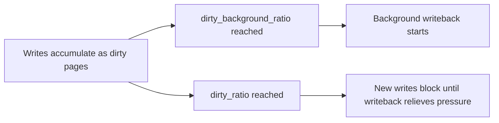

The previous article described buffered and direct I/O, and noted that a buffered write returns before the data reaches the device. This chapter explains where that data waits and what it takes to make it durable. It is the fifth article of Stage 7, still in the subject of file I/O and correctness.

The page cache is the single most important performance mechanism in storage I/O, and also the source of the most common durability bug. A write that returns success is, by default, only a promise that the kernel has the bytes. Making that promise hold across a crash or power loss is a separate, explicit step. Understanding the cache, the writeback engine, and the flush path is how you avoid telling users their data is saved when it is merely cached. This article is a reference covering the cache internals, the tunable writeback machinery, the full set of flush calls, the atomic file-replace pattern, device flush semantics, and how to observe and debug all of it.

## What the page cache is

The page cache is the kernel's in-memory store of file contents. When you read a file, the kernel fetches the needed pages from the device into the cache and serves later reads from there. When you write, the kernel places your bytes into the cache and marks the pages dirty. The cache is shared by `read`, `write`, and the `mmap` path from Stage 6, so a file mapped or read by several processes lives in memory only once. Internally each open file's cache is tracked by an `address_space` object that maps file offsets to pages in a radix or xarray structure, which is why lookups by offset are cheap and why `mmap` and `read`/`write` see the same coherent pages.


The diagram shows the buffered write lifecycle. The write returns at step B, long before step C happens. Durability is only reached at step D, when the data is pushed to the device and the device confirms it. Most programs never issue D, which is fine for temporary data and dangerous for data that must survive.

## Read caching, readahead, and the warm versus cold distinction

A first read of a file pays the device latency to fill the cache, then subsequent reads of the same pages are memory-speed. A service that serves the same files repeatedly, such as a web server or a model loader, is fast precisely because the cache absorbs the repeated reads. The distinction between a cold start, where the cache is empty, and a warm steady state, where it is full of useful pages, explains why first requests are slow and later ones are fast.

The kernel also performs readahead: when it sees a sequential read, it prefetches the next pages so the application does not stall waiting on the device. This is why sequential scans are much faster than random access of small blocks, and why `posix_fadvise` with `POSIX_FADV_SEQUENTIAL` widens the prefetch window. The opposite, `POSIX_FADV_RANDOM`, disables readahead for workloads that will never use it, avoiding wasted prefetch. Cache thrashing, where the working set exceeds memory and pages are evicted before reuse, is visible through PSI (pressure stall information) in `/proc/pressure/memory` and through `sar` and `vmstat`.

This is also why benchmark numbers are misleading unless they state cache state. A throughput test that fits in cache measures memory, not storage. A test that starts cold measures the device. A backend engineer reads a benchmark by asking which one it was.

## Write caching and the writeback engine

A buffered write only copies bytes into the cache and returns. The kernel later writes dirty pages to the device through a per-backing-device writeback thread, governed by several thresholds. The key ones are `vm.dirty_background_ratio` (a percentage of memory, with a byte twin `vm.dirty_background_bytes`) that starts background writeback when enough dirty data has accumulated, and `vm.dirty_ratio` (with byte twin `vm.dirty_bytes`) that is a hard ceiling: once exceeded, new writes block until writeback relieves the pressure. Two more timers matter: `vm.dirty_writeback_centisecs` controls how often the writeback thread wakes to consider work, and `vm.dirty_expire_centisecs` controls how old a dirty page must be before it is eligible to be written.



This design trades a little risk for a lot of speed. Many small writes become one large, efficient device write. Reads of recently written data are served from cache. The cost is that the data is not on stable storage until writeback runs, and if the machine loses power first, those dirty pages are gone. The thresholds are tunable precisely because the right balance depends on whether you value throughput or how much you can afford to lose. A database that wants bounded loss lowers the dirty ratios; a batch writer that wants throughput raises them.

## Dirty pages, memory pressure, and backpressure

Dirty pages cannot be evicted the way clean pages can, because they hold the only copy of pending changes. Under memory pressure the kernel must write them back before it can reclaim the memory, which is why a system with a lot of dirty data can suddenly stall as writeback competes with everything else. Watching the `Dirty` field in `/proc/meminfo` tells you how much data is in this pending state.

A service that writes faster than the device can absorb eventually hits the dirty limit and its writes begin to wait for the flusher. This is a form of backpressure from storage, and it shows up as latency that tracks write volume rather than CPU. Tuning the dirty ratios, or calling `fsync` at controlled points, keeps the pending set bounded. The related `Writeback` field shows pages currently being written, and `nr_dirty` in `/proc/vmstat` gives the same count for scripts.

## Double buffering and why databases bypass the cache

When an application already keeps its own in-memory copy of data, such as a database buffer pool, the page cache holds a second copy of the same bytes. That duplication wastes memory that could hold more useful data and adds copy work. This is the double-buffering problem, and it is the main reason databases open their files with `O_DIRECT`, covered in the previous article, so the kernel does not cache what the application already caches.

The tradeoff is real: bypassing the cache means losing readahead and the free speedup for data the database did not pre-plan. Databases accept that because they have their own caching and prefetching logic tuned to their access patterns, which is usually better than the generic page cache for their workload. Persistent-memory and DAX filesystems go further, mapping storage directly into the address space and bypassing the page cache entirely, which is appropriate when the backing store is already byte-addressable memory.

## fsync, fdatasync, sync_file_range, and the durability boundary

`fsync` forces all dirty data and metadata for a file down to the device and waits for the device to acknowledge the write. After `fsync` returns, the data is durable against a normal crash or power loss (subject to the device's own write cache, discussed below). `fdatasync` is a lighter version that flushes data and the minimal metadata needed to access it, such as file size, but not things like modification time, so it is often faster when only the contents matter.

For finer control there is `sync_file_range`, which can write a specific byte range without waiting (`SYNC_FILE_RANGE_WRITE`), wait for an already-queued write (`SYNC_FILE_RANGE_WAIT_BEFORE`/`WAIT_AFTER`), or combine these. It is a performance tool for large files where flushing the whole file is wasteful, but it is not a full durability guarantee because it does not force the metadata needed to find the data. `sync` and `syncfs` flush every filesystem or a single one; `O_SYNC` and `O_DSYNC` at open time make every write wait for the equivalent of `fsync`/`fdatasync`, which is simpler but heavier than checkpointing.


The diagram shows the canonical atomic file-replace sequence, which this article returns to. The durability point for writes is that a write without `fsync` is a cache entry, not a committed byte, and renaming into place does not make it durable unless the new file was flushed first.

## The atomic rename-replace pattern

A common correctness requirement is "replace this file with new contents such that readers never see a half-written file, and the replace survives a crash." The robust recipe is: write the new contents to a temporary file in the same directory; `fsync` that temporary file so its data and metadata are on the device; `rename` the temporary file onto the target name (which is atomic: readers see either the old or the new, never a mix); then `fsync` the directory so the rename itself is recorded. The directory `fsync` is easy to forget but necessary, because the rename is a directory-metadata change that also lives in the cache until flushed. `O_TMPFILE` is a convenient way to create the temporary file without a visible name, and the same pattern underlies how editors save and how package managers commit.

## Durability guarantees and device write caches

There is a subtlety beyond `fsync`. Many devices, especially hard disks, have a volatile write cache that acknowledges a write before the bytes are physically on the platter. Unless the device is told to flush that cache, a power loss can still lose data the kernel believed was durable. File systems issue cache-flush commands (and, on modern drives, use the FUA, force-unit-access, bit to bypass the cache for specific writes) as part of `fsync` to close this gap. Disabling the device write cache with `sdparm` or `hdparm -W0` trades latency for honest durability, which some compliance scenarios require.

Solid state drives behave similarly, and their controllers aggregate and reorder writes for wear leveling, which makes the flush contract even more important. The practical guarantee is: `fsync` plus a device that honors flushes gives you durability across power loss. Anything less is a gamble whose odds depend on the exact hardware and its settings. Enterprise SSDs with power-loss protection (a capacitor that flushes the cache on power failure) can honestly acknowledge writes without a flush, but the kernel still issues flushes to be safe, so behavior depends on the drive class.

## Lost writeback errors

A subtle failure mode is that a writeback error may never reach the application. When a dirty page fails to reach the device (a bad sector, a detached network mount, a thin-provisioned volume that ran out of space), the error is recorded on the file's mapping, and the next `fsync`, `fdatasync`, or `close` on that file is supposed to return `EIO`. But once that error is reported, it is cleared, so a second `fsync` may return success even though the data was lost. Worse, in some configurations the error is reported only to one file descriptor, and a different descriptor or a later `close` sees nothing wrong. The lesson is to check the return value of the `fsync` or `close` that follows the writes you care about, and not to assume a later silent success means the earlier data landed. Applications that need to know about writeback failure should `fsync` promptly after important writes rather than relying on a distant `close`.

## Flush behavior and related controls

Beyond per-file `fsync`, the system offers `sync` and `syncfs` to flush all dirty data, and sysctl knobs under `/proc/sys/vm` to tune how aggressively the flusher runs. Mount options such as `sync` make every write durable immediately, which is safe but slow, while `async` (the default) lets the cache do its work; `relatime`/`noatime` reduce metadata writes, as the paths article covered. Choosing among these is a deliberate trade of performance for safety on the critical path. Journaling (covered in the next article) interacts with all of this, because the filesystem must itself decide the order in which metadata and data reach the device so that a crash leaves a consistent structure.

## Observing the cache and durability path

The cache is visible in `/proc/meminfo` (`Cached`, `Dirty`, `Writeback`, `Mapped`, `Buffers`) and the dirty counts in `/proc/vmstat`. The flusher thresholds are in `sysctl`. Disk activity and queue depth show in `iostat`. For a service that should be calling `fsync`, `strace` reveals whether it actually does. `vmtouch` or `pcstat` report which pages of a file are resident, and `mincore` (or the `mincore` syscall) queries residency from a program. PSI under `/proc/pressure/memory` shows whether the cache is causing allocation stalls.

```bash
# memory used by the page cache and the dirty pending set
grep -E "Cached|Dirty|Writeback|Mapped" /proc/meminfo
# flusher thresholds and timers
sysctl vm.dirty_background_ratio vm.dirty_ratio vm.dirty_expire_centisecs vm.dirty_writeback_centisecs
# disk activity while the service writes
iostat -x 1
# does the service actually fsync its important files
strace -e trace=fsync,fdatasync,sync_file_range -p $(pgrep myservice) 2>&1 | head
# which pages of a file are in cache
vmtouch -v somefile.dat
```

```go
package main

import (
    "fmt"
    "os"
)

func main() {
    f, err := os.Create("durable.txt")
    if err != nil {
        panic(err)
    }
    defer f.Close()

    f.WriteString("important state\n")
    // without the next line this may live only in the page cache
    if err := f.Sync(); err != nil {
        // a real service must check this; a lost writeback error can surface here
        panic(err)
    }
    fmt.Println("fsync returned: data now pushed to the device")

    // atomic replace pattern
    tmp, err := os.CreateTemp("", "replace-*.tmp")
    if err != nil {
        panic(err)
    }
    tmp.WriteString("new contents\n")
    tmp.Sync()
    tmp.Close()
    os.Rename(tmp.Name(), "target.txt")
    // fsync the directory so the rename is durable
    dir, _ := os.Open(".")
    dir.Sync()
    dir.Close()
    select {}
}
```

What it demonstrates is the boundary. The `WriteString` places bytes in the cache; `Sync` (Go's `fsync`) pushes them to the device and waits, and its error must be checked. The atomic-replace block writes to a temp file, flushes it, renames it over the target, and flushes the directory, which is the pattern that survives both partial readers and crashes. Watching `Dirty` in `meminfo` before and after `Sync` shows the pending set drop. The `strace` invocation on a running service tells you whether it calls `fsync` at all on the path you care about, which is the difference between claimed and actual durability.

## A realistic production example

A team ran an analytics pipeline that appended events to a file throughout the day and rotated it hourly. They treated a successful `write` as persisted, and for months it was, because the machine rarely rebooted. Then a scheduled maintenance reboot, and a power event during it, lost the last several minutes of events that were sitting dirty in the page cache. The data was not corrupted, it was simply never on disk.

The fix was to `fsync` at checkpoints, not on every write, which would have been too slow, but on a cadence that bounded the loss window to seconds. They also `fsync`'d the directory after creating each new hourly file, because the directory entry recording the new file is itself metadata that writeback must reach the device, and they adopted the atomic-replace pattern for the rolled summary files so readers never saw a half-written summary during rotation. After the change, a reboot lost at most the few seconds since the last checkpoint, which the pipeline's design already tolerated. A later incident taught the lost-error lesson: a network mount briefly dropped, writeback failed, and a distant `close` reported success while a prompt `fsync` had correctly returned `EIO`, which is why they now check `fsync` results immediately after important writes. The lesson was that durability is a separate guarantee from a successful write, and the cache is an explicit, tunable risk rather than a transparent freebie.

## How engineers actually reason about the cache

They separate "written" from "durable." A write returning success means the kernel has the bytes; `fsync` is what makes them survive. For anything a user would be angry to lose, they call `fsync` at a deliberate point, balancing the latency cost against the acceptable loss window, and they check the return value.

They watch the dirty set. A growing `Dirty` count under load is pending data and a clue to future stalls. Keeping it bounded with checkpoints or tuned thresholds prevents the flusher from becoming a surprise bottleneck.

They use atomic replace for visible files. New contents go to a temp file, get `fsync`'d, get renamed over the target, and the directory gets `fsync`'d, so readers never see a partial file and the change survives a crash.

They avoid double buffering. Programs that already cache their own data open with `O_DIRECT` so the page cache is not a redundant, memory-hungry copy. The cache earns its keep for data the application does not manage, not for data it does.

They account for device caches. `fsync` is the kernel's promise only if the device honors flushes; on storage where honesty matters, they verify the device write cache setting and consider FUA and power-loss protection rather than assuming.

## The page cache under cgroups v2 and memory pressure

The page cache is accounted to the cgroup whose process first touched the file, which means cache usage is not global but belongs to a workload. Under cgroups v2, memory.current includes the cache pages a cgroup has dirtied or read, and memory.stat reports the cache and the reclaim activity. A cgroup can be limited with memory.max, and when it approaches the limit the kernel reclaims its own clean cache pages first. If the workload keeps re-reading the same files, that reclaim causes cache misses and latency, a form of self-inflicted thrashing. memory.high is a softer limit that triggers reclaim before the hard cap, which is the recommended control to keep a workload from hoarding cache at the expense of others.

Pressure stall information, in /proc/pressure/memory and the cgroup's pressure file, reports the fraction of time tasks waited on memory and, specifically, on I/O caused by memory reclaim. A rising io pressure value means the cache is not satisfying reads and the device is being hit, which connects directly back to the warm-versus-cold distinction and to the dirty-limit backpressure discussed earlier. For a backend engineer, the diagnosis path is: high memory.io pressure means the working set no longer fits in the allowed cache, so raise memory.high, reduce the working set, or move the hot data to a device the cgroup is not throttled on. Tools such as vmtouch or mincore show residency, but PSI shows the pain.

## Definitions

### The page cache

> The kernel's in-memory store of file contents, shared by read, write, and mmap through an address-space structure, so repeated access to the same pages is memory-speed and files mapped by many processes occupy memory only once.

### A dirty page

> A page in the cache that has been written but not yet written back to the device, and therefore holds the only copy of pending changes until the flusher or an fsync moves it to stable storage.

### Writeback

> The kernel writeback thread's periodic copying of dirty pages from the cache to the device, governed by dirty thresholds and timers so that memory pressure and throughput stay balanced. Exceeding the hard dirty limit stalls new writers.

### fsync, fdatasync, and sync_file_range

> `fsync` forces a file's dirty data and metadata to the device and waits for acknowledgement; `fdatasync` flushes data and the minimal metadata to access it, usually faster; `sync_file_range` flushes a selected range with optional waiting and is a performance tool, not a full durability guarantee.

### Atomic file replace

> The pattern of writing new contents to a temp file, `fsync`-ing it, renaming it over the target, and `fsync`-ing the directory, so readers never see partial data and the change is durable across a crash.

### Double buffering

> The waste that occurs when an application keeps its own in-memory copy of data that the page cache also holds, duplicating memory and copy work, avoided by opening such files with `O_DIRECT` or using a DAX mapping.

## Beyond the definitions

### Why does the cache not make writes durable by itself

> Because the cache is volatile memory. A write lands there and returns immediately, and the bytes reach the device later, if at all, through writeback. A crash before that point loses the dirty pages, which is why durability requires an explicit flush and a checked return value.

### When is fdatasync enough instead of fsync

> When only the file's contents and the metadata needed to read them, such as its size, matter. Skipping metadata like modification time makes `fdatasync` faster, which is useful for append-only logs where the timestamp is not critical.

### How much can a reboot lose without fsync

> At most the dirty data not yet written back, which can be seconds to minutes of writes depending on the dirty thresholds and write rate. A power loss loses the same, plus anything still in a volatile device write cache the flush did not cover.

### Why fsync the directory after a rename

> Because the rename is a change to the directory's metadata, and like any metadata it sits in the cache until flushed. Without an `fsync` on the directory, the rename may not survive a crash, so the file may reappear under its old name with old contents.

### What does the device write cache do to the guarantee

> It can acknowledge writes before bytes are physically stored, so without a flush command (or FUA) the data is still vulnerable to power loss even after the kernel's `fsync`. Honest durability needs both the `fsync` and a device that honors flushes or has power-loss protection.

### Why might a second fsync report success after a lost write

> Because a writeback error is reported once and then cleared. The first `fsync` after the failure returns `EIO`, but a later `fsync` or `close` may see a clean state and report success even though the data was lost. Checking `fsync` promptly after important writes is the mitigation.

## Common misconceptions

**"The write returned, so the data is saved."** It is saved to the kernel cache, not the device. A crash can lose it. Durability needs `fsync` (with a checked return), and even then depends on the device honoring flushes.

**"fsync is free, call it often."** It waits for the device and is one of the slower things a storage path does. Calling it per write can tank throughput; batching and checkpointing is the usual answer.

**"The page cache is just for reads."** It is equally central to writes, where it absorbs and coalesces them. The write path's speed comes from the cache, and the durability risk comes from it too.

**"O_DIRECT is faster because it skips the cache."** It is faster only when the application already caches well. Otherwise it removes readahead and caching the application now must rebuild, often slower.

**"A reboot is the same as a crash for durability."** A clean reboot flushes dirty pages during shutdown, so data is usually safe. A power loss or kernel panic does not, so it exposes the un-flushed dirty set. The difference is whether writeback got to run.

**"Renaming a file makes the new data durable."** The rename is atomic for readers but is itself a cached metadata change. The new file's data must be `fsync`'d first and the directory `fsync`'d after, or a crash can leave the old data or no file at all.

## Summary

The page cache is what makes buffered I/O fast: reads are served from memory with readahead, and writes are coalesced by the writeback engine before they reach the device, bounded by the dirty ratio thresholds that also provide backpressure. The same mechanism is what makes a successful write lie about durability, because the bytes sit dirty in memory until the flusher or an `fsync` moves them. `fsync`, `fdatasync`, and `sync_file_range` are the explicit boundary, and they only hold if the device honors flushes and the application checks for lost writeback errors. The atomic rename-replace pattern, with a temp file, a file `fsync`, a rename, and a directory `fsync`, is how visible files are updated safely. Double buffering explains why self-caching programs bypass the cache with `O_DIRECT`. The next article stays on correctness but turns from durability to consistency: how journaling, ordering, and locks keep a filesystem coherent across crashes and concurrent writers.
