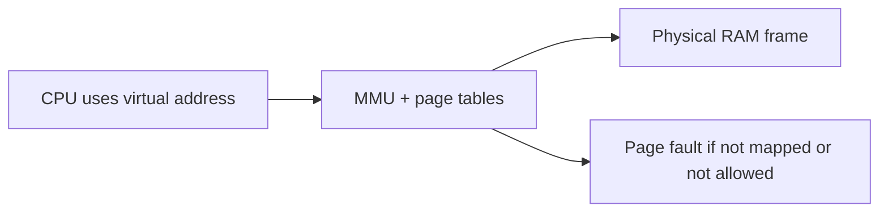
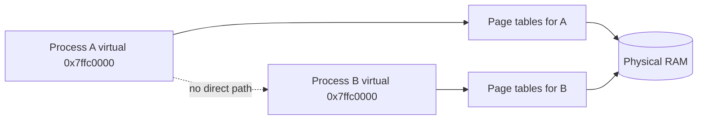
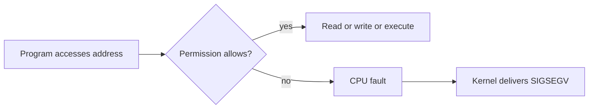
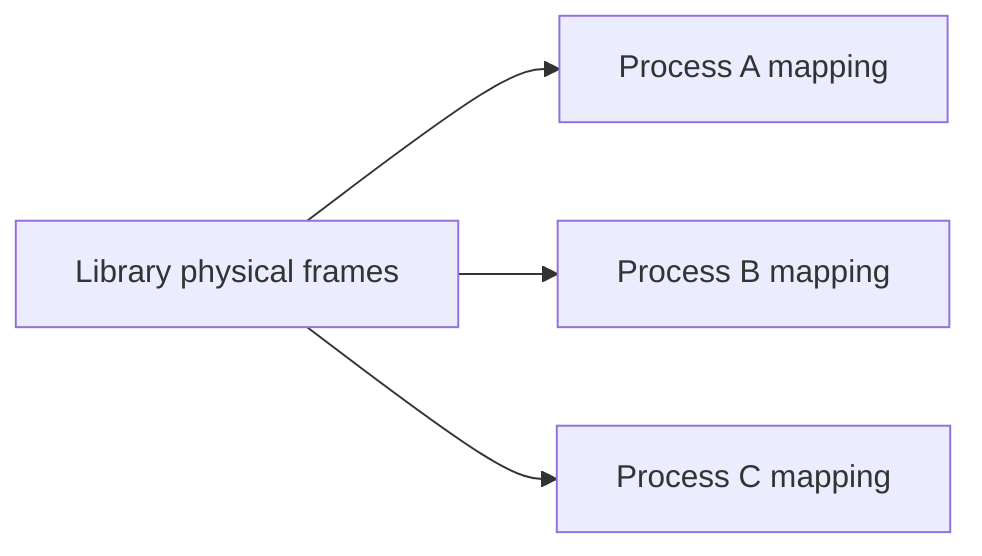
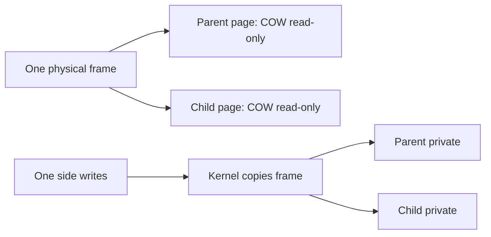
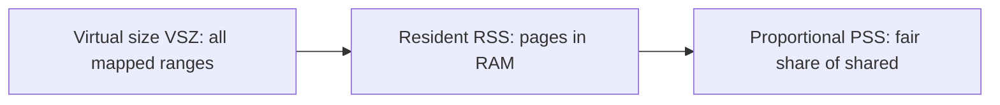
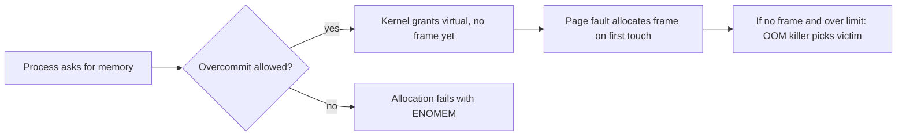

Stage 5 showed a process as an isolated container. It showed threads sharing the address space inside that container. It showed pipelines moving work without growing without bound. Stage 6 looks at the memory that processes and threads actually use. This article starts that stage.

A process never touches physical memory directly. It works with virtual addresses instead. The hardware and the kernel turn each virtual address into a physical one on every access.

That translation gives each process a private view of memory. It lets many processes share the same library code without copying it. It makes a fork cheap. It also lets the kernel place guard pages so that an overflow faults instead of corrupting nearby memory.

Translation also makes address randomization possible. The kernel can place important data at a different spot each time the program runs.

This chapter stays at the level of the address space itself. Later chapters in this stage will open the page tables that do the translation. They will cover the faults that bring pages in. They will cover the `mmap` calls that create mappings.

This article is a reference. It covers the address-space model and the permission and sharing machinery. It covers copy-on-write. It covers the difference between virtual and resident memory. It covers the overcommit and OOM behavior you will meet in production. It covers the NUMA and huge-page choices that change where memory lives physically. It also covers the tools that show all of this.

## Virtual addresses and physical addresses

A physical address is a real spot in the machine's RAM chips. A virtual address is the number a program uses when it reads or writes. The two numbers are not the same.

The instruction `mov rax, [rbx]` gives the CPU a virtual address in `rbx`. The memory management unit turns that virtual address into a physical one before the bytes are read.



The diagram shows the key fact. The program only ever sees virtual addresses. The translation happens on the way to the memory chips. It can fail.

If the page tables say the address is not mapped, the hardware raises a fault. If they say the process may not do what it asked, the hardware also faults. The kernel then decides what to do.

A virtual address space is the full set of virtual addresses a process may use. On a 64-bit Linux machine that set is huge. A process uses only a small part of it. Most of that part is not mapped until the program needs it.

## Why translation exists

Translation exists for two reasons. First, programs do not need to know where their data lives in physical memory. Second, the kernel can give each process a clean and private view of memory.

Without translation, every program would need to know the physical location of its code and data. Two programs that both wanted the virtual number `0x400000` would clash on the real chips.

With translation, the kernel can map the same virtual address in two processes to two different physical frames. Or it can map that address to the same frame when the pages should be shared.

A program is written as if it owns the whole machine. The kernel and hardware make that illusion real, one process at a time.

Translation also lets the kernel move a page's physical location without telling the program. The virtual address stays the same while the frame underneath changes. This is the base for swapping, for sharing, and for copy-on-write. This chapter returns to all three.

## Address-space isolation

Isolation means one process cannot normally read or write another process's memory. The kernel enforces this by giving each process its own page tables.

Process A's translation points to a different set of physical frames than process B's. So a virtual address in A has no way to reach B's bytes.



The diagram uses the same shape as the process isolation diagram earlier in the series. This is where that isolation is actually enforced. The dotted line shows there is no shortcut.

To share data, the two processes must ask the kernel to build a mapping that points at the same physical frame on purpose. A shared memory region is one example.

Isolation is why a crash in one process does not usually corrupt another. It is also why a bug that reads past the end of an array stays inside the faulting process.

The kernel runs at a higher privilege level. It is the only software that can change the mappings.

## Memory permissions and the cost of a fault

Each page in the page tables has permission bits. The common ones are readable, writable, and executable. The kernel sets them from the executable's segments at startup.

Code is readable and executable but not writable. Constants are readable only. The heap and stack are readable and writable but not executable. Guard pages are none of the three.

When a program accesses an address, the hardware checks the permission against the operation. A write to a read-only page is not allowed. An instruction fetch from a non-executable page is also not allowed. The CPU raises a fault. The kernel turns that fault into `SIGSEGV` for the process.



This is the same protection we covered with executable formats. The `PT_GNU_STACK` marker decides whether the stack is executable. The non-executable memory hardening keeps injected data from running as code.

A `SIGSEGV` is not a mystery. It is the hardware and kernel doing their job when a program touches memory it was not allowed to touch.

## Shared pages across processes

Some physical frames are mapped into more than one address space on purpose. Shared library code is the clearest example.

Suppose ten processes load the same read-only library. The kernel maps the same physical pages of that library into each process. It marks them read and execute but not writable. Only one copy sits in RAM, even though ten processes run it.



Sharing also happens through explicit requests. A file can be mapped into several processes so they all see the same bytes. A block of anonymous memory can be made shared so cooperating processes exchange data without copying through a pipe.

The key point is this: sharing is a choice the kernel makes at mapping time. It is recorded in the page tables. You can see it later in tools like `pmap`.

Read-only sharing is safe because no process can change the bytes. Writable sharing needs the processes to agree on a protocol. That harder kind of shared memory is covered in later stages about interprocess communication.

## Copy-on-write, and when it stops saving you

Copy-on-write is what makes `fork` cheap. When a process forks, the kernel does not copy the parent's pages right away. It marks the parent's and child's pages as read-only and shared. It records that they are copy-on-write.

While both processes only read those pages, they share one physical copy. The moment either process writes to a page, the hardware faults. The kernel makes a private copy of just that page. The writer then continues with its own copy.



This is why `fork` followed quickly by `exec` is so fast. The child usually touches almost no pages before it replaces its image. So almost nothing is copied.

The optimization is real but conditional. It only saves work while the pages stay unmodified.

The warning matters. Copy-on-write delays copying, it does not remove it. Suppose a forked child walks a large buffer that the parent built. Every touched page becomes a private copy. The resident memory can grow to about the size of the shared data, because each side now holds its own copy.

A team that assumes `fork` is free for large state is often surprised when memory doubles.

## Guard pages and overflow protection

A guard page is a region of the address space that is left unmapped on purpose. When code tries to read or write it, the access faults because there is no translation. The kernel and runtime place guard pages at the edge of stacks and sometimes heaps. An overrun then hits the guard instead of the next live region.

For a thread stack, a guard page sits just past the area the stack may grow into. A deep recursion can run past the stack's real end. A large stack frame can do the same. Both reach the guard and fault. That becomes a clear crash instead of silent corruption of the next allocation.

On Linux the kernel grows the stack automatically up to a limit when the fault is in the expected guard region. Past that limit it hard-fails.

Guard pages use permissions as a tripwire. They are not memory the program uses. They are an absence of mapping, placed where an accident would otherwise do damage.

## Address randomization

Address space layout randomization changes the base addresses of the major regions each time a process starts. The executable's load base, the heap, the stacks, and the shared libraries are placed at offsets chosen by the kernel. They are not fixed locations.

This is the same randomization called ASLR in the executable formats chapter. It pairs with position-independent code so the binary can load anywhere.

The security value is simple. An attacker who needs the address of a function or a buffer cannot rely on it staying the same across runs. A mistake that leaks one address during testing does not reveal the layout in production.

Randomization has a cost. It can make debugging slightly harder because addresses differ from run to run. It can break code that wrongly assumes fixed layouts.

It also does not randomize the content, only the placement. So it slows an attacker rather than stopping a flaw.

## Virtual size versus resident memory

Two numbers dominate memory discussion. Confusing them causes most of the false "we are running out of memory" alarms.

The virtual size, shown as VSZ in `ps` and `top`, is the sum of every mapped region in the address space. This is true whether or not the pages are in RAM. It includes mapped libraries, the full arena the allocator reserved, and sparse mappings that may never be touched.

The resident set size, RSS, is only the pages actually in physical RAM right now. A process can show a VSZ of many gigabytes but an RSS of a few hundred megabytes. This happens because most of its virtual ranges are unused or shared.



The diagram shows the relationship. RSS is what competes for RAM. But RSS overstates a process's true cost when it shares library or file pages with others.

The proportional set size, PSS, divides each shared page by the number of processes using it. The memory charged to a process is its private pages plus its fair share of shared ones. `smaps` reports PSS per mapping. `smem` sums it. Use that number when you reason about how much memory a process really costs the system.

## Memory overcommit and the OOM killer

The kernel normally lets a process reserve more virtual memory than there is physical RAM. This is called overcommit. Most programs allocate optimistically and touch only part of what they reserve. So overcommit fits that habit.

The policy is controlled by `vm.overcommit_memory`. The value 0 is the default heuristic. It allows overcommit but refuses requests that are clearly impossible. The value 1 always allows. The value 2 never commits more than `vm.overcommit_ratio` percent of RAM plus swap.

A service that allocates a huge buffer but only uses a little benefits from overcommit. A service that truly needs the memory will be caught later.



The diagram shows the two moments that matter. The allocation usually only reserves virtual space. The first touch demands a real frame.

When RAM and swap are exhausted, the kernel runs the out-of-memory killer. It scores processes by `oom_score`. That score is weighted by memory use and adjusted by `oom_score_adj`. It kills the highest-scoring process to free space.

A fork that triggers copy-on-write over a large buffer is a classic OOM trigger. The first write to each shared page needs a new frame.

The fix is usually to shrink the working set. Or you disable overcommit only for the specific workload that must fail fast instead of being killed.

## NUMA, huge pages, and cgroup memory limits

Physical memory is not uniform. On a multi-socket machine, a frame attached to a different CPU socket is slower to reach than one local to the running thread. This is the non-uniform memory access effect, or NUMA.

The kernel tries to allocate local frames. The command `numactl --hardware` shows the topology. The command `numastat` shows per-node allocation. The file `/proc/<pid>/numa_maps` shows where a process's pages landed.

A latency-sensitive service on a large box should pin threads and memory to one node. Use `numactl` or `set_mempolicy`. Cross-node access can add measurable latency.

Page size also matters. The default page is 4 KiB. A large mapping then needs many page-table entries and creates more TLB pressure. Huge pages of 2 MiB or 1 GiB reduce that overhead.

Transparent huge pages (THP) let the kernel promote aligned regions on its own. You tune them through `/sys/kernel/mm/transparent_hugepage/enabled` and `madvise MADV_HUGEPAGE`. Explicit huge pages are reserved with `vm.nr_hugepages` and mapped with `MAP_HUGETLB` or `hugetlbfs`.

For databases and large heaps, huge pages cut TLB misses and improve throughput. The cost is fragmentation and the need to reserve them ahead of time.

Per-process and per-cgroup limits bound all of the above. `RLIMIT_AS` caps the total virtual size a process may map. Under cgroups v2, `memory.max` is the hard cap on memory and swap the cgroup may use. `memory.high` is a softer throttle. It triggers reclaim before the hard limit. `memory.swap.max` controls swap use.

These controls keep one container from consuming the host's memory. They interact with overcommit. A cgroup that hits `memory.max` reclaims or OOM-kills within its own boundary, not the whole machine.

## Looking at a real address space

You can see the address space of a running process with ordinary tools. The file `/proc/<pid>/maps` lists each mapped region, its virtual range, its permissions, and what created it. The file `/proc/<pid>/smaps` adds per-region memory accounting, including RSS and PSS. The command `pmap` shows the same information. The command `smem` aggregates PSS across processes so you can rank true memory cost. The file `/proc/<pid>/status` reports VmSize and VmRSS in one place.

A small Go program makes the regions concrete. It prints where its own code, data, stack, and heap live.

```go
package main

import (
    "fmt"
    "os"
)

var globalVar = "in the data or bss region"

func main() {
    stackVar := "on the current goroutine stack"
    heapVar := new(string)
    *heapVar = "allocated on the heap"

    fmt.Printf("code   (func main): %p\n", main)
    fmt.Printf("global           : %p\n", &globalVar)
    fmt.Printf("stack var        : %p\n", &stackVar)
    fmt.Printf("heap var         : %p\n", heapVar)

    fmt.Println("my pid is", os.Getpid())
    select {} // stay alive so we can inspect the mappings
}
```

```bash
go build -o tiny main.go
./tiny &
pid=$!
sleep 0.2
echo "--- mappings for $pid (first lines) ---"
cat /proc/$pid/maps | head -n 20
echo "--- permission and size summary ---"
pmap -x $pid 2>/dev/null | head -n 15
echo "--- per-region RSS and PSS (smaps) ---"
grep -E "^(Rss|Pss|Shared|Private)" /proc/$pid/smaps | head -n 20
echo "--- run twice to see ASLR change the bases ---"
cat /proc/$pid/maps | grep -E "r-xp" | head -n 1
echo "--- true memory cost across processes ---"
smem -t -p 2>/dev/null | head
kill $pid
```

All four pointers are virtual addresses inside one process. They fall into different ranges with different permissions. The code address is in a readable and executable region. The global is in a readable and writable one. The stack and heap are in their own ranges. The command `cat /proc/$pid/maps` shows the kernel's record of each.

Run the binary twice and compare the base lines. The load addresses move because of randomization. `smaps` adds RSS and PSS. You can see how much is resident and how much is fairly shared. That is the difference between an alarming VSZ and the real memory bill.

A second exercise shows copy-on-write and sharing directly. Start a process that maps a file with `mmap`. Then fork. Compare the mapped region in both processes with `cat /proc/<pid>/maps`. Before either side writes, the physical frame is shared. The command `smaps` reports that as a shared count.

## A realistic production example

A team ran a Go service. For part of its work, it started a helper process by forking. The helper used a large in-memory cache the parent had already built.

The helper only read the cache to answer a few requests, then exited. In testing the memory looked fine. The fork was followed quickly by work that did not modify the cache.

In production the helper sometimes updated a small part of the cache for the request it served. That write touched pages of the large buffer. Copy-on-write turned those pages into private copies for the child.

Under burst load the service forked many helpers. Each wrote a little. The resident memory of the machine climbed until the OOM killer appeared in the logs.

The team had assumed forking the cache was nearly free. The parent and child were not supposed to change it much.

The fix was to stop treating the cache as implicitly shared through `fork`. They moved the cache into an explicitly shared, read-only mapping. The helper opened it the same way the parent did. No copy was needed. They moved the small per-request updates into a separate small structure that did not live in the big buffer.

For cases where a helper truly needed private writable state, they switched to the worker pool pattern from the concurrency stage. They passed only the needed bytes over a pipe.

After the change, `pmap` and `/proc/<pid>/smaps` showed the cache as a single shared region again. Memory under burst stayed flat.

The lesson is that copy-on-write is an optimization with a condition. It saves memory only while the pages stay read-only. The moment a forked process writes, the saving stops. The cost appears in exactly the resource the team thought they were sparing.

The same mind-set applies to virtual versus resident memory. A large VSZ is not a problem until pages are actually touched and charged. That is when overcommit and the OOM killer enter the story.

## How engineers actually reason about memory layout

They start by separating what is private from what is shared. Which regions are mapped into only one process. Which are shared read-only by design. Which were made shared by accident through `fork`.

Then they ask where a fault would land. A `SIGSEGV` at a stack address suggests overflow into a guard. One at a code address suggests something tried to write instructions.

They also separate virtual from resident. A large VSZ is not an emergency. RSS and PSS are what consume RAM.

They ask whether a mapping's permission matches its use. When memory grows after `fork`, they reach for `smaps`. They check whether the growth is shared or private. That single distinction explains most surprises.

They watch overcommit and the OOM killer. When a service is killed without an obvious leak, they read `dmesg` for the OOM report and check `oom_score_adj`. Then they decide. Shrink the working set, or raise `memory.max`, or disable overcommit for that workload.

They treat VSZ, RSS, and PSS as three different measurements, not one.

## Definitions

### Virtual memory

> The system where programs use virtual addresses. The hardware and kernel translate each one to a physical address on every access. Each process gets a private, contiguous-looking view of memory that may be spread across physical RAM.

### An address space

> The set of virtual addresses a process may use. It includes the permissions and mappings for each region. Most of it is unmapped until the program or kernel asks for it.

### Address-space isolation

> The property that each process has its own page tables. Its virtual addresses translate to physical frames that other processes cannot reach. The only way across is an explicit shared mapping created by the kernel.

### Memory permissions

> The read, write, and execute flags attached to each page in the page tables. An access that breaks these rules faults. The kernel usually turns the fault into `SIGSEGV`.

### Shared pages

> Physical frames mapped into more than one address space. They are used for read-only library code or for explicit shared memory. The same bytes live in RAM once instead of once per process.

### Copy-on-write

> A technique where a forked child shares the parent's pages as read-only. When one side writes, the kernel copies only the written page. This makes `fork` cheap. It works only while the pages stay unmodified.

### A guard page

> An intentionally unmapped region placed at the edge of a stack or heap. An overrun faults there instead of corrupting neighboring live memory.

### Address randomization

> The kernel's choice of randomized base addresses for the executable, heap, stacks, and libraries on each start. This is usually called ASLR. It makes memory layout unpredictable to an attacker. It depends on position-independent code.

### Virtual size, resident set, and PSS

> VSZ is the sum of all mapped virtual ranges. RSS is the pages actually in RAM. PSS is RSS divided fairly across the processes that share each page. RSS and PSS reflect real memory cost. VSZ usually does not.

### Overcommit and the OOM killer

> Overcommit lets the kernel grant more virtual memory than there is physical RAM. It commits frames only on first touch. When memory is truly exhausted, the OOM killer scores processes by `oom_score`. It kills the highest to recover space.

## Beyond the definitions

### Why can a process not just use physical addresses

> Because two processes would collide on the same real frames. Neither could get a clean private view. Virtual addresses let the kernel place real memory wherever it wants while the program keeps a stable number.

### Why does fork use copy-on-write

> To avoid copying the parent's entire address space. The child usually replaces it with `exec` or touches little of it. Sharing read-only first, and copying only on write, makes the common case fast.

### Why does a segfault happen on a permission violation

> The hardware checks the page's permission bits against the access. A write to a read-only page is rejected. An execute from a non-executable page is rejected. The CPU faults. The kernel delivers `SIGSEGV` to the process.

### How does ASLR help and what does it cost

> It makes the location of code and buffers unpredictable across runs. This slows exploits that need a known address. The cost is that addresses vary run to run, which can complicate debugging. It only randomizes placement, not correctness.

### Why does shared library code not multiply memory

> The kernel maps the same read-only physical frames of the library into each process that loads it. One copy sits in RAM. Many processes execute it. The pages are read-only and need no private copy.

### Why is a huge VSZ not the same as running out of memory

> VSZ counts reserved virtual ranges. Many are never touched or are shared. RSS and PSS show what is actually in RAM. A process can have a large VSZ and a small RSS. Overcommit means RSS growth only fails when frames are truly unavailable and the OOM killer acts.

### How does a cgroup limit change the OOM behavior

> Under cgroups v2, `memory.max` bounds the cgroup's memory and swap. Reclaim or OOM happens inside that boundary. The host is protected because the killer operates on the cgroup's processes, not the whole machine. `memory.high` softly throttles before the hard cap.

## Common misconceptions

**"Virtual memory means disk swap."** Virtual memory is the address translation system. Swapping to disk is one use of it. A machine with plenty of RAM still uses virtual addresses, isolation, and permissions.

**"Each process has its own physical memory."** A process has its own virtual address space. The physical frames behind it may be shared with other processes for read-only or explicit shared mappings. The same virtual number means different physical frames in different processes.

**"ASLR randomizes everything."** It randomizes base addresses of major regions. It does not change the contents of memory. Code that wrongly assumes fixed addresses can still break in surprising ways.

**"Copy-on-write means no copying ever happens."** It means copying is deferred until a write. Once a forked process writes a page, that page is copied. Many writes can make the memory cost approach a full private copy.

**"A segfault means the kernel is broken."** Almost always it means the program touched memory it was not permitted to touch. Examples are writing past a buffer or jumping through a bad pointer. The kernel is reporting a legitimate protection fault.

**"VSZ is how much memory the process uses."** VSZ is the virtual size. It includes reservations and shared mappings. RSS is the real RAM use. PSS is the fair share once sharing is accounted. A large VSZ with a small RSS is normal and not a leak.

## Summary

A process uses virtual addresses. The hardware translates them to physical frames through page tables that the kernel controls. That translation isolates processes. It lets library code be shared as one physical copy. It makes `fork` cheap through copy-on-write. It places guard pages where overruns should fault.

Memory permissions decide what each page may be used for. Address randomization makes the layout differ on each start.

The useful numbers are not just one. VSZ is the virtual reservation. RSS is what is in RAM. PSS is the fair share of shared pages. Confusing them causes most memory false alarms.

Overcommit defers the cost of allocation until first touch. The OOM killer is the backstop when frames run out. cgroups v2 and `RLIMIT_AS` bound the damage per workload.

NUMA and huge pages change where and how big the physical frames are. That matters for latency and TLB pressure.

The address space is the stage on which everything in the earlier concurrency and executable chapters actually runs. The next chapters will open the page tables and faults that make it work.
