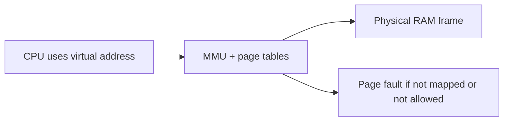
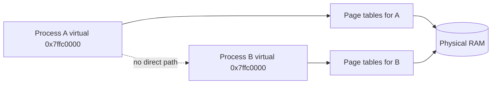
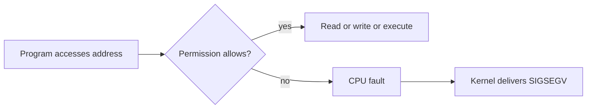
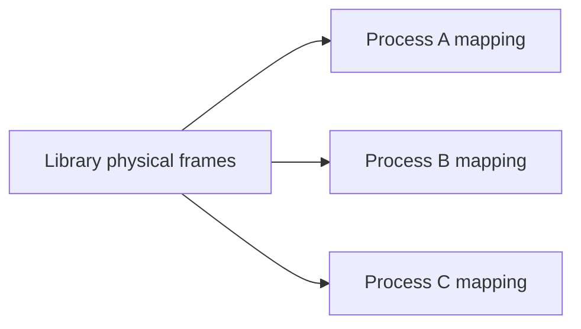
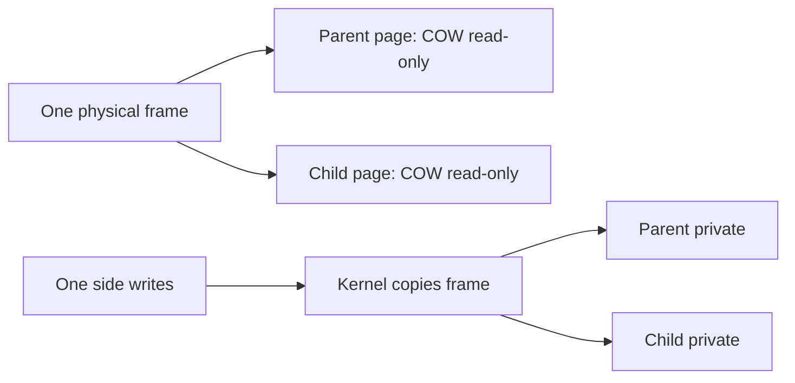
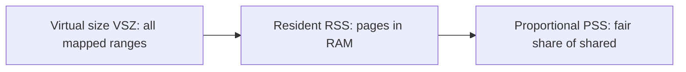
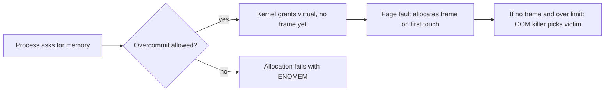

Stage 5 showed how a process is an isolated container, how threads share the address space inside it, and how pipelines move work without growing without bound. Stage 6 turns to the memory those processes and threads actually use. This is the first article of that stage.

A process does not touch physical memory directly. It works with virtual addresses, and the hardware and kernel translate those addresses into physical ones on every access. That translation is what gives each process its own private view of memory, lets the same library code be shared between processes without copying, makes a fork cheap, and places guard pages where overflows should fault instead of corrupting neighbors. It is also what makes address randomization possible, so that the location of important data is not the same every time a program runs.

This chapter stays at the level of the address space itself. Later chapters in this stage will go inside the page tables that do the translation, the faults that bring pages in, and the `mmap` calls that create mappings. This article is a reference: it covers the address-space model, the permission and sharing machinery, copy-on-write, the difference between virtual and resident memory, the overcommit and OOM behavior you will meet in production, the NUMA and huge-page choices that change physical placement, and the tools that expose all of it.

## Virtual addresses and physical addresses

A physical address names a real location in the machine's RAM chips. A virtual address is the number a program uses when it reads or writes. They are not the same number. The code `mov rax, [rbx]` hands the CPU a virtual address in `rbx`, and the memory management unit turns it into a physical address before the bytes are fetched.



The diagram shows the important fact. The program only ever sees virtual addresses. The translation happens on the way to the memory chips, and it can fail. If the page tables say the address is not mapped, or that the process is not allowed to do what it asked, the hardware raises a fault and the kernel decides what to do.

A virtual address space is the full range of virtual addresses a process may use. On a 64-bit Linux machine the range is huge, but a process uses only a small part of it. Most of that part is not mapped at all until the program needs it.

## Why translation exists

Translation exists so that programs do not need to know where their data physically lives, and so that the kernel can give each process a clean, private view of memory.

Without it, every program would have to be told the physical location of its code and data, and two programs that wanted the same virtual number `0x400000` would collide on the real chips. With it, the kernel can map the same virtual address in two processes to two different physical frames, or map it to the same frame when the pages are meant to be shared. The program is written as if it owns the machine, and the kernel and hardware make that illusion true for one process at a time.

Translation also lets the kernel move a page's physical location without telling the program. The virtual address stays the same while the underlying frame changes. That is the foundation for swapping, for sharing, and for copy-on-write, all of which this chapter returns to.

## Address-space isolation

Isolation is the property that one process cannot normally read or write another process's memory. It is enforced by giving each process its own set of page tables. Because the translation for process A points to a different set of physical frames than the translation for process B, a virtual address in A has no path to B's bytes.



The diagram is the same shape used for process isolation earlier in the series, because this is where that isolation is actually enforced. The dotted line says there is no shortcut. To share data, the two processes must ask the kernel to create a mapping that points at the same physical frame on purpose, such as a shared memory region.

Isolation is why a crash in one process does not usually corrupt another, and why a bug that reads past an array stays inside the faulting process. The kernel, which runs in a higher privilege level, is the only piece of software that can change the mappings.

## Memory permissions and the cost of a fault

Each page in the page tables carries permission bits. The common ones are readable, writable, and executable. The kernel sets them from the executable's segments described during startup. Code is readable and executable but not writable, constants are readable only, the heap and stack are readable and writable but not executable, and guard pages are none of the three.

When a program accesses an address, the hardware checks the permission against the operation. A write to a read-only page, or an instruction fetch from a non-executable page, is not allowed, and the CPU raises a fault. The kernel turns that fault into `SIGSEGV` for the process.



This is the same protection described when executable formats were covered. The `PT_GNU_STACK` marker decides whether the stack is executable, and the non-executable memory hardening keeps injected data from being run as code. A `SIGSEGV` is not a mystery. It is the hardware and kernel doing their job when a program touches memory it was not permitted to touch.

## Shared pages across processes

Some physical frames are intentionally mapped into more than one address space. The clearest example is shared library code. When ten processes load the same read-only library, the kernel maps the same physical pages of that library's code into each process, marked read and execute but not writable. Only one copy sits in RAM even though ten processes can run it.



Sharing also happens through explicit requests. A file can be mapped into several processes so they all see the same bytes, and a block of anonymous memory can be created as shared so cooperating processes exchange data without copying through a pipe. The key point is that sharing is a decision made by the kernel at mapping time, recorded in the page tables, and visible later in tools like `pmap`.

Read-only sharing is safe because no process can change the bytes. Writable sharing requires the processes to agree on a protocol, which is the harder kind of shared memory discussed in later stages about interprocess communication.

## Copy-on-write, and when it stops saving you

Copy-on-write is what makes `fork` cheap. When a process forks, the kernel does not immediately copy the parent's pages. It marks the parent's and child's pages as read-only and shared, and records that they are copy-on-write. As long as both processes only read those pages, they share one physical copy. The moment either process writes to a page, the hardware faults, the kernel makes a private copy of just that page, and the writer continues with its own copy.



This is why `fork` followed quickly by `exec` is so fast. The child usually touches almost no pages before it replaces the image, so almost nothing is ever copied. The optimization is real but conditional. It only saves work while the pages are not written.

The warning is important. Copy-on-write defers copying, it does not abolish it. If a forked child walks a large buffer that the parent built, every touched page becomes a private copy. The resident memory can grow to roughly the size of the shared data, because each side now holds its own copy. A team that assumes `fork` is free for large state is often surprised when memory doubles.

## Guard pages and overflow protection

A guard page is a region of the address space that is deliberately left unmapped. When code tries to read or write it, the access faults, because there is no translation. The kernel and runtime place guard pages at the edge of stacks and sometimes heaps so that an overrun hits the guard instead of the next live region.

For a thread stack, a guard page sits just past the area the stack may grow into. A deep recursion or a large stack frame that runs past the stack's real end reaches the guard and faults, which becomes a clear crash rather than silent corruption of an adjacent allocation. On Linux the kernel grows the stack automatically up to a limit when the fault is in the expected guard region, and hard-fails past that.

Guard pages are a use of permissions as a tripwire. They are not memory the program uses. They are absence of mapping, placed where an accident would otherwise do damage.

## Address randomization

Address space layout randomization changes the base addresses of the major regions each time a process starts. The executable's load base, the heap, the stacks, and shared libraries are placed at offsets chosen by the kernel instead of fixed locations.

This is the same randomization that appeared in the executable formats chapter as ASLR, paired with position-independent code so the binary can be loaded anywhere. The security value is that an attacker who needs the address of a function or a buffer cannot rely on it being the same across runs. A mistake that leaks one address during testing does not reveal the layout in production.

Randomization has a cost. It can make debugging slightly harder because addresses differ run to run, and it can interact with code that wrongly assumes fixed layouts. It also does not randomize the content, only the placement, so it slows an attacker rather than stopping a flaw.

## Virtual size versus resident memory

Two numbers dominate memory discussion, and confusing them causes most of the mistaken "we are running out of memory" alarms. The virtual size, shown as VSZ in `ps` and `top`, is the sum of every mapped region in the address space, whether or not the pages are in RAM. It includes mapped libraries, the full arena the allocator reserved, and sparse mappings that may never be touched. The resident set size, RSS, is only the pages actually present in physical RAM right now. A process can have a VSZ of many gigabytes but an RSS of a few hundred megabytes because most of its virtual ranges are unused or shared.



The diagram shows the relationship. RSS is what competes for RAM, but even RSS overstates a process's true cost when it shares library or file pages with others. The proportional set size, PSS, divides each shared page by the number of processes using it, so the memory attributed to a process is its private pages plus its fair share of shared ones. `smaps` reports PSS per mapping, and `smem` sums it, which is the number to use when reasoning about how much memory a process is really costing the system.

## Memory overcommit and the OOM killer

The kernel normally lets a process reserve more virtual memory than there is physical RAM, called overcommit, because most programs allocate optimistically and touch only part of what they reserve. The policy is controlled by `vm.overcommit_memory`: 0 is the default heuristic that allows overcommit but refuses obviously impossible requests, 1 always allows, and 2 never commits more than `vm.overcommit_ratio` percent of RAM plus swap. A service that allocates a huge buffer but only uses a little benefits from overcommit; a service that needs the memory for real will be caught later.



The diagram shows the two moments that matter: the allocation, which usually only reserves virtual space, and the first touch, which demands a real frame. When RAM and swap are exhausted, the kernel invokes the out-of-memory killer, which scores processes by `oom_score` (weighted by memory use and adjusted by `oom_score_adj`) and kills the highest-scoring one to free space. A fork that triggers copy-on-write over a large buffer is a classic OOM trigger, because the first write to each shared page needs a new frame. The fix is usually to reduce the working set or to disable overcommit only for the specific workload that must fail fast instead of being killed.

## NUMA, huge pages, and cgroup memory limits

Physical memory is not uniform. On a multi-socket machine, a frame attached to a different CPU socket is slower to reach than one local to the running thread, which is the non-uniform memory access, or NUMA, effect. The kernel tries to allocate local frames, and `numactl --hardware` shows the topology, `numastat` shows per-node allocation, and `/proc/<pid>/numa_maps` shows where a process's pages landed. A latency-sensitive service on a large box should pin threads and memory to one node with `numactl` or `set_mempolicy`, because cross-node access can add measurable latency.

Page size also matters. The default page is 4 KiB, so a large mapping needs many page-table entries and more TLB pressure. Huge pages, 2 MiB or 1 GiB, reduce that overhead. Transparent huge pages (THP) let the kernel promote aligned regions automatically and are tuned via `/sys/kernel/mm/transparent_hugepage/enabled` and `madvise MADV_HUGEPAGE`; explicit huge pages are reserved with `vm.nr_hugepages` and mapped with `MAP_HUGETLB` or `hugetlbfs`. For databases and large heaps, huge pages cut TLB misses and improve throughput, at the cost of fragmentation and the need to reserve them ahead of time.

Per-process and per-cgroup limits bound all of the above. `RLIMIT_AS` caps the total virtual size a process may map, and under cgroups v2 `memory.max` is the hard cap on memory and swap the cgroup may use, with `memory.high` as a softer throttle that triggers reclaim before the hard limit. `memory.swap.max` controls swap use. These are the controls that keep one container from consuming the host's memory, and they interact with overcommit: a cgroup that hits `memory.max` reclaims or OOM-kills within its own boundary, not the whole machine.

## Looking at a real address space

You can see the address space of a running process with ordinary tools. The file `/proc/<pid>/maps` lists each mapped region, its virtual range, its permissions, and what created it. `/proc/<pid>/smaps` adds per-region memory accounting, including RSS and PSS, and `pmap` presents the same information. `smem` aggregates PSS across processes so you can rank true memory cost, and `/proc/<pid>/status` reports VmSize and VmRSS in one place.

A small Go program makes the regions concrete by printing where its own code, data, stack, and heap live.

```go
package main

import (
    "fmt"
    "os"
)

var globalVar = "in the data or bss region"

func main() {
    stackVar := "on the current goroutine stack"
    heapVar := new(string)
    *heapVar = "allocated on the heap"

    fmt.Printf("code   (func main): %p\n", main)
    fmt.Printf("global           : %p\n", &globalVar)
    fmt.Printf("stack var        : %p\n", &stackVar)
    fmt.Printf("heap var         : %p\n", heapVar)

    fmt.Println("my pid is", os.Getpid())
    select {} // stay alive so we can inspect the mappings
}
```

```bash
go build -o tiny main.go
./tiny &
pid=$!
sleep 0.2
echo "--- mappings for $pid (first lines) ---"
cat /proc/$pid/maps | head -n 20
echo "--- permission and size summary ---"
pmap -x $pid 2>/dev/null | head -n 15
echo "--- per-region RSS and PSS (smaps) ---"
grep -E "^(Rss|Pss|Shared|Private)" /proc/$pid/smaps | head -n 20
echo "--- run twice to see ASLR change the bases ---"
cat /proc/$pid/maps | grep -E "r-xp" | head -n 1
echo "--- true memory cost across processes ---"
smem -t -p 2>/dev/null | head
kill $pid
```

What it demonstrates is that all four pointers are virtual addresses inside one process, but they fall into different ranges with different permissions. The code address is in a readable and executable region, the global in a readable and writable one, the stack and heap in their own ranges, and `cat /proc/$pid/maps` shows the kernel's record of each. Running the binary twice and comparing the base lines shows the load addresses move because of randomization. `smaps` adds RSS and PSS so you can see how much is resident and how much is fairly shared, which is the difference between an alarming VSZ and the real memory bill.

A second exercise shows copy-on-write and sharing directly. Start a process that maps a file with `mmap`, then fork, and compare the mapped region in both processes with `cat /proc/<pid>/maps`. Before either side writes, the physical frame is shared, which `smaps` reports as a shared count.

## A realistic production example

A team ran a Go service that, for part of its work, started a helper process by forking so the helper could use a large in-memory cache the parent had already built. The helper only read the cache to answer a few requests, then exited. In testing the memory looked fine, because the fork was followed quickly by work that did not modify the cache.

In production the helper sometimes updated a small part of the cache for the request it served. That write touched pages of the large buffer, and copy-on-write turned those pages into private copies for the child. Under burst load the service forked many helpers, each wrote a little, and the resident memory of the machine climbed until the OOM killer appeared in the logs. The team had assumed forking the cache was nearly free, because the parent and child were not supposed to change it much.

The fix was to stop treating the cache as implicitly shared through `fork`. They moved the cache into an explicitly shared, read-only mapping that the helper opened the same way the parent did, so no copy was needed, and they moved the small per-request updates into a separate small structure that did not live in the big buffer. For the cases where a helper truly needed private writable state, they switched to the worker pool pattern from the concurrency stage and passed only the needed bytes over a pipe. After the change, `pmap` and `/proc/<pid>/smaps` showed the cache as a single shared region again, and memory under burst stayed flat.

The lesson was that copy-on-write is an optimization with a condition. It saves memory only while the pages stay read-only. The moment a forked process writes, the saving stops, and the cost appears in exactly the resource the team thought they were sparing. The same mind-set applies to virtual versus resident memory: a large VSZ is not a problem until pages are actually touched and charged, which is when overcommit and the OOM killer enter the story.

## How engineers actually reason about memory layout

They start by separating what is private from what is shared. Which regions are mapped into only one process, which are shared read-only by design, and which were made shared by accident through `fork`. Then they ask where a fault would land. A `SIGSEGV` at a stack address suggests overflow into a guard, while one at a code address suggests something tried to write instructions.

They also separate virtual from resident. A large VSZ is not an emergency; RSS and PSS are what consume RAM. They ask whether a mapping's permission matches its use, and when memory grows after `fork` they reach for `smaps` to see whether the growth is shared or private, because that single distinction explains most surprises.

They watch overcommit and the OOM killer. When a service is killed without an obvious leak, they read `dmesg` for the OOM report and check `oom_score_adj`, then decide whether to shrink the working set, raise `memory.max`, or disable overcommit for that workload. They treat VSZ, RSS, and PSS as three different measurements, not one.

## Definitions

### Virtual memory

> The system where programs use virtual addresses that the hardware and kernel translate to physical addresses on every access, so each process gets a private, contiguous-looking view of memory that may be spread across physical RAM.

### An address space

> The set of virtual addresses a process may use, together with the permissions and mappings for each region. Most of it is unmapped until the program or kernel asks for it.

### Address-space isolation

> The property that each process has its own page tables, so its virtual addresses translate to physical frames that other processes cannot reach without an explicit shared mapping created by the kernel.

### Memory permissions

> The read, write, and execute flags attached to each page in the page tables. An access that violates them faults, and the kernel usually turns the fault into `SIGSEGV`.

### Shared pages

> Physical frames mapped into more than one address space, used for read-only library code or for explicit shared memory, so the same bytes live in RAM once instead of once per process.

### Copy-on-write

> A technique where a forked child shares the parent's pages as read-only until one side writes, at which point the kernel copies only the written page. It makes `fork` cheap, but only while the pages stay unmodified.

### A guard page

> An intentionally unmapped region placed at the edge of a stack or heap so that an overrun faults there instead of corrupting neighboring live memory.

### Address randomization

> The kernel's choice of randomized base addresses for the executable, heap, stacks, and libraries on each start, usually called ASLR, which makes memory layout unpredictable to an attacker and depends on position-independent code.

### Virtual size, resident set, and PSS

> VSZ is the sum of all mapped virtual ranges, RSS is the pages actually in RAM, and PSS is RSS divided fairly across processes that share each page. RSS and PSS reflect real memory cost; VSZ usually does not.

### Overcommit and the OOM killer

> Overcommit lets the kernel grant more virtual memory than physical RAM, committing frames only on first touch. When memory is truly exhausted, the OOM killer scores processes by `oom_score` and kills the highest to recover space.

## Beyond the definitions

### Why can a process not just use physical addresses

> Because two processes would collide on the same real frames, and neither could be given a clean private view. Virtual addresses let the kernel place real memory wherever it wants while the program keeps a stable number.

### Why does fork use copy-on-write

> To avoid copying the parent's entire address space when the child usually replaces it with `exec` or touches little of it. Sharing read-only first, and copying only on write, makes the common case fast.

### Why does a segfault happen on a permission violation

> The hardware checks the page's permission bits against the access. A write to a read-only page or an execute from a non-executable page is rejected, the CPU faults, and the kernel delivers `SIGSEGV` to the process.

### How does ASLR help and what does it cost

> It makes the location of code and buffers unpredictable across runs, which slows exploits that need a known address. The cost is that addresses vary run to run, which can complicate debugging, and it only randomizes placement, not correctness.

### Why does shared library code not multiply memory

> The kernel maps the same read-only physical frames of the library into each process that loads it. One copy sits in RAM and many processes execute it, because the pages are read-only and need no private copy.

### Why is a huge VSZ not the same as running out of memory

> VSZ counts reserved virtual ranges, many of which are never touched or are shared. RSS and PSS show what is actually in RAM. A process can have a large VSZ and a small RSS, and overcommit means even RSS growth only fails when frames are truly unavailable and the OOM killer acts.

### How does a cgroup limit change the OOM behavior

> Under cgroups v2, `memory.max` bounds the cgroup's memory and swap, and reclaim or OOM happens inside that boundary. The host is protected because the killer operates on the cgroup's processes, not the whole machine, and `memory.high` softly throttles before the hard cap.

## Common misconceptions

**"Virtual memory means disk swap."** Virtual memory is the address translation system. Swapping to disk is one use of it, but a machine with plenty of RAM still uses virtual addresses, isolation, and permissions.

**"Each process has its own physical memory."** A process has its own virtual address space. The physical frames behind it may be shared with other processes for read-only or explicit shared mappings, and the same virtual number means different physical frames in different processes.

**"ASLR randomizes everything."** It randomizes base addresses of major regions. It does not change the contents of memory, and code that wrongly assumes fixed addresses can still break in surprising ways.

**"Copy-on-write means no copying ever happens."** It means copying is deferred until a write. Once a forked process writes a page, that page is copied, and many writes can make the memory cost approach a full private copy.

**"A segfault means the kernel is broken."** Almost always it means the program touched memory it was not permitted to touch, such as writing past a buffer or jumping through a bad pointer. The kernel is reporting a legitimate protection fault.

**"VSZ is how much memory the process uses."** VSZ is the virtual size, including reservations and shared mappings. RSS is the real RAM use, and PSS is the fair share once sharing is accounted. A large VSZ with a small RSS is normal and not a leak.

## Summary

A process uses virtual addresses, and the hardware translates them to physical frames through page tables that the kernel controls. That translation is what isolates processes, lets library code be shared as one physical copy, makes `fork` cheap through copy-on-write, and places guard pages where overruns should fault. Memory permissions decide what each page may be used for, and address randomization makes the layout differ on each start. The useful numbers are not just one: VSZ is the virtual reservation, RSS is what is in RAM, and PSS is the fair share of shared pages, and confusing them causes most memory false alarms. Overcommit defers the cost of allocation until first touch, and the OOM killer is the backstop when frames run out, while cgroups v2 and `RLIMIT_AS` bound the damage per workload. NUMA and huge pages change where and how big the physical frames are, which matters for latency and TLB pressure. The address space is the stage on which everything in the earlier concurrency and executable chapters actually runs, and the next chapters will open the page tables and faults that make it work.
