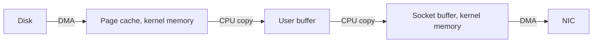
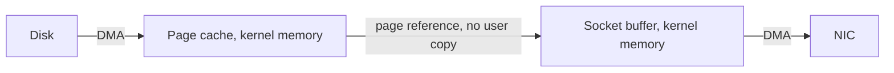
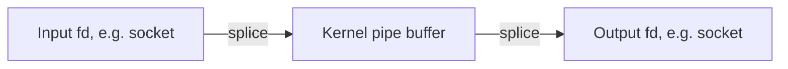
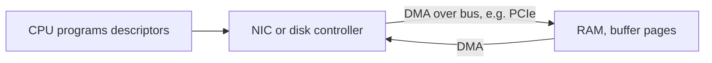
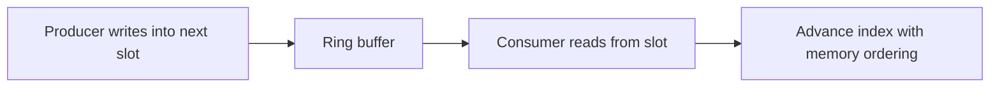
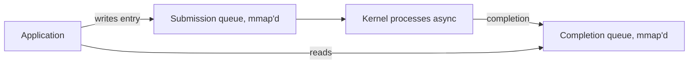

Earlier chapters showed how memory is addressed, allocated, and kept correct. This final chapter of the stage shows how to move data without copying it. That is the core idea behind fast systems. This is the eighth article in Stage 6.

Suppose your service reads a file and sends it over the network. Or suppose it relays bytes from one socket to another. In both cases, the data travels from one device into memory and then out to another device. The simple path copies those bytes several times. At high volume, those copies become the bottleneck, not the devices. Zero-copy is a set of techniques that removes those extra copies. DMA (direct memory access) is the hardware feature that makes this possible. With DMA, a device can move bytes into RAM without the CPU touching each one. A high-performance buffer is a way to lay out memory so the data path stays free of copies and stays friendly to the CPU cache.

## The hidden cost of a copy

Take the ordinary way to serve a file over a socket. The program calls `read`. This asks the kernel to fetch the file into a buffer the program owns. The program then calls `write` on the socket. It hands that buffer back to the kernel to send. Each call looks cheap. But the bytes travel through the machine several times.



The disk controller uses DMA to place the bytes into the kernel page cache. The CPU does not copy them. From there, the kernel copies them into the user buffer. The program passes them back. The kernel copies them into the socket buffer. Then the NIC uses DMA again. The two CPU copies in the middle are pure waste. The CPU loads each cache line, stores it somewhere else, and pushes useful data out of the CPU cache. For a 1 GB file, that wastes gigabytes of memory bandwidth on data that never changes. At high request rates, this copy work becomes the limit, not the disk or the network.

## What zero-copy actually removes

Zero-copy does not mean the data is never copied. It means the extra copies into and out of user space are removed. The bytes stay in kernel memory. Instead of copying them into a program buffer, the kernel passes the existing memory pages from one part of the system to another by reference. The file's pages in the page cache become the source for the socket. The program never sees the bytes.

This is the same idea the `mmap` chapter touched on. There, the idea applied to one file read. Here, it applies to the whole path. `mmap` lets a program read a file without a copy into its own buffer. Zero-copy syscalls like `sendfile` go further. They let the kernel move data from a file to a socket without the program copying it either.

## sendfile and the kernel-to-kernel handoff

`sendfile` takes an open file descriptor and a socket descriptor. It tells the kernel to send the file's contents to the socket. The program never allocates a buffer. It never touches the bytes. The kernel moves the pages from the page cache straight into the socket path.



On many systems, this removes the two user-space copies entirely. The remaining work is the DMA from disk and the DMA to the NIC, plus some bookkeeping. For a file server or a proxy that forwards static content, `sendfile` can roughly double throughput and cut CPU use. The expensive copy is gone. The catch is that the data path must be a simple source-to-sink transfer. If the program must inspect or change the bytes, it has to copy them first. The production example later in this article shows this tradeoff.

## splice, tee, and moving pages between descriptors

`sendfile` only works between a file and a socket. `splice` is the more general tool. It moves data between any two file descriptors, as long as one of them is a pipe. The bytes move through a kernel pipe buffer by reference. A program can relay from one socket to another, or from a file to a socket, without copying into user space. `tee` is a variant. It copies the data within the kernel without consuming it. This is useful when you want to tap a stream while still forwarding it.



A fast proxy often uses this pattern. It calls `splice` from the inbound socket into a pipe. Then it calls `splice` from the pipe to the outbound socket. The program sets up the transfer. It never copies the payload. `vmsplice` lets a program push its own user memory into a pipe without a copy. This works when that memory is already page-aligned and safe to share. It is the bridge between user buffers and the kernel zero-copy path.

## MSG_ZEROCOPY for the network send

Sometimes the source data already sits in a user buffer. For this case, `MSG_ZEROCOPY` on a socket send tells the kernel to skip copying the buffer into the socket layer. Instead, the NIC reads the bytes straight from the user pages using DMA. The device reads the buffer while it is in flight. So the program must not change or free those pages until the kernel signals that it is done. The kernel sends this signal through the socket's error queue, after the send finishes. This moves the cost from a copy done right away to a lifetime problem. The buffer must stay valid until the hardware is done with it.

One detail matters. The data still goes out on the wire. The NIC still DMAs it out. What zero-copy removes is the CPU copy, not the move to the device. The benefit is largest for large sends, where the copy would otherwise take most of the time. For tiny sends, the setup and completion work costs more than the copy it saves. So zero-copy send is an optimization for large messages.

## DMA, the hardware foundation

All of this rests on DMA. A DMA-capable device, such as a NIC or a disk controller, can read and write RAM on its own. It uses the system bus. The CPU does not run a load or store for each byte. Instead, the CPU's job is to set up the device with a list of descriptors. Each descriptor says: here is a buffer address and a length, now move this data. The device then DMAs the bytes and raises an interrupt when it is done.



DMA is why the CPU can stay out of the data path. Without DMA, every byte would pass through a CPU register. With DMA, the CPU sets up the transfer and then moves on to other work. The device fills or empties memory on its own.

Two details matter for correctness and safety. First, the buffer the device DMAs into must be physically contiguous from the device's point of view. Or the device must support scatter-gather. Scatter-gather means a single transfer is described by a list of address and length pairs. Most modern devices support scatter-gather. That is why non-contiguous kernel or user pages can still be sent without first copying them into one contiguous region. Second, the device must be told the right addresses. An untrusted device could DMA into any memory. The IOMMU (called SMU on some chip designs) fixes this. It translates the addresses the device can see. It also restricts each device to only the pages it may touch. This is both a safety and an isolation mechanism.

Older or limited systems sometimes need bounce buffers. A bounce buffer is a contiguous region the device can address. The system copies data into it so the device can reach the data. Bounce buffers bring back a copy. They show a device or platform limit, not a design choice.

## Scatter-gather I/O in the program

The same idea shows up at the syscall level as vectored I/O. `readv` and `writev` let a program issue one read or write. That one call fills or drains several separate buffers. The buffers are described by an array of base and length pairs. This helps when a message is spread across non-contiguous regions. For example, a header sits in one buffer and the body in another. Vectored I/O avoids copying them into one linear buffer just to make a single call.

```go
package main

import (
    "fmt"
    "os"
    "syscall"
)

func main() {
    f, err := os.Open("/etc/hosts")
    if err != nil {
        panic(err)
    }
    defer f.Close()

    bufA := make([]byte, 16)
    bufB := make([]byte, 48)
    iovs := []syscall.Iovec{
        {Base: &bufA[0], Len: uint64(len(bufA))},
        {Base: &bufB[0], Len: uint64(len(bufB))},
    }
    n, err := syscall.Readv(int(f.Fd()), iovs)
    if err != nil {
        panic(err)
    }
    fmt.Printf("readv placed %d bytes into two separate buffers with one syscall\n", n)
    _ = bufA
    _ = bufB
    select {}
}
```

```bash
go build -o sgread main.go
strace -e trace=readv,read,write ./sgread 2>&1 | head
```

The program shows one syscall filling two buffers. This mirrors how a device can DMA into several pages at once. The kernel copies from the file into each buffer in turn. But the program avoided allocating one big contiguous region and stitching the data together by hand. For fast servers, vectored I/O is how a response built from a status line, headers, and a file region gets sent in one operation. The parts are not concatenated first.

## High-performance buffer design

When the data path must be fast, you design the buffers. You do not just allocate them. Several principles come up again and again.

Pre-allocate a pool instead of asking the allocator for each message. The allocator chapter explained the cost of frequent small allocations. They also cause contention when many threads run. A buffer pool hands out reused buffers. This removes allocation churn and keeps the memory footprint steady.

Align buffers to the cache line. For DMA, align them to the page. A misaligned access can cross cache lines or pages. This forces extra work or stops a device from DMAing directly. This is why zero-copy paths often require page-aligned user buffers.

Avoid false sharing by giving each core its own buffer. Suppose two cores write to different fields. If those fields sit on the same cache line, the hardware keeps the line coherent by bouncing it between the cores. This destroys performance. Per-core buffers, padded to cache-line boundaries, keep each core's hot data private.

Batch operations to spread out the cost. One transfer of many messages is cheaper than many transfers of one. The fixed cost of a syscall or a descriptor setup is paid only once. Lock-free ring buffers make batching practical between a producer and a consumer. They do this without a mutex on the hot path.



Use huge pages for large buffers when the translation chapter's TLB pressure applies. A ring buffer spanning gigabytes of packet data, backed by huge pages, reduces TLB misses exactly as described earlier. The buffer design and the memory hardware story are the same story told at different layers.

Touch the buffer on purpose. Reading or writing a buffer pulls it into the cache. This can push out hotter data. Sometimes a small copy into a local scratch buffer is faster. You process it and discard it. This beats working directly on a large buffer that fills the cache. This is the rare case where a copy is a win, not a loss.

## When zero-copy helps and when it does not

Zero-copy pays off for large transfers and high throughput. There, the CPU copies would otherwise take most of the time. File serving, proxying, and bulk data movement are the classic wins. It does not help for small messages. It can even hurt. The setup, the completion notice, and the lifetime work cost more than the copy they remove.

Zero-copy also changes the correctness model. A buffer given to a device or handed to the kernel by reference is owned by that component while in flight. The program must not write to it, read from it, or free it until the transfer completes. If it does, it corrupts the data or crashes with a use-after-free. Reference counting and completion callbacks become required. This is more complex than a simple send-and-forget copy. A system that changes data in transit often needs a copy for the part it touches. Take a proxy that rewrites headers or compresses a body. It needs a copy for those parts. So the design is a mix. Zero-copy the parts that pass through untouched. Copy the parts that change.

## Observing the data path

You can check which path a program takes. `strace` shows whether a transfer uses `read` and `write` in a loop. Or it shows `sendfile`, `splice`, or `vmsplice`. A proxy that issues many `read` and `write` syscalls per connection is copying. One that issues `splice` is not.

```bash
# watch a server's syscalls for copy vs zero-copy primitives
strace -f -e trace=sendfile,splice,vmsplice,read,write,recvfrom,sendto -p $(pgrep myservice) 2>&1 | head
# NIC and per-device DMA statistics
ethtool -S eth0 | grep -iE "rx|tx|dma|copy" | head
# kernel-side copy accounting is indirect, but high context switches
# plus high CPU per byte suggests memcpy-bound work
```

At a deeper level, `perf` can show time spent in `memcpy` and related routines. That is the sign of a copy-bound data path. If a large fraction of CPU is in memory copy while the devices are not full, zero-copy is the lever to pull. The buffer pool and cache behavior show up in cache-miss counters. This ties back to the CPU and memory-locality material from earlier in the series.

## A realistic production example

A team ran a reverse proxy. It relayed responses from upstream services to clients. The original code read each response chunk into a heap buffer with `read`. It wrote the chunk to the client socket with `write`. Under modest load it was fine. As traffic grew to serve large API payloads and media, the proxy boxes hit CPU limits. This happened well before the network or disks were full.

A `perf` profile showed a large share of CPU inside `memcpy`. That is the copy between the kernel buffers and the proxy's own buffers. The data moved through user space only so the proxy could forward it. That copy was the bottleneck. They switched the relay path to `splice`. Data flowed from the upstream socket into a pipe. Then from the pipe to the client socket. The proxy only coordinated the transfer. It never copied the payload. CPU on the proxy dropped sharply. Throughput rose. The bytes traveled kernel to kernel.

The complication was the parts of the response the proxy did need to touch. For example, a small header it rewrote, and a compacting transform on certain content types. Those paths could not use zero-copy safely. The buffer was in flight and owned by the kernel pipe. They kept a copy-based path for the header and the transformed content. They used `splice` only for the untouched body. The result was a hybrid. Most of the bytes skipped user space. The small, latency-sensitive parts that needed inspection used a normal copy. The lesson is that zero-copy is a tool for the bulk path, not a full replacement. The engineering is in knowing which bytes must be seen, and copying only those.

## How engineers actually reason about the data path

They count the copies. For any data movement, they ask where the bytes live at each step. They ask whether a copy between kernel and user is needed. If the program never inspects the bytes, a copy is waste. `sendfile` or `splice` removes it.

They respect device ownership. A buffer handed to a device or the kernel by reference must stay valid until completion. So they design lifetime with reference counts and completion signals. They do not just hope the copy is done. This is the memory-safety discipline applied to I/O.

They match the technique to the size. Large transfers earn zero-copy. Small ones do not. A system that applies zero-copy everywhere often pays more in complexity and completion overhead than it saves.

They design buffers, not just allocate them. Pooling, alignment, per-core ownership, batching, and huge-page backing turn a correct data path into a fast one. The same principles appear whether the buffer feeds a NIC, a disk, or another thread.

## Beyond syscalls: io_uring and userspace I/O rings

The zero-copy syscalls still cross the user-kernel boundary once per transfer. io_uring removes even that cost for high-volume I/O. The kernel and the program share two ring buffers: the submission queue and the completion queue. They are mapped into the process with `mmap`. The program posts I/O requests by writing an entry and advancing an index. The kernel consumes and completes them in place. With the rings in user space, a tight loop can submit and reap operations with no syscall for each one. The kernel processes them asynchronously.



Registered (or fixed) buffers extend zero-copy into this path. The program pins a set of buffers once and refers to them by index. The kernel does not copy or re-check them per operation. This is the same page handoff idea as `MSG_ZEROCOPY`, applied to the whole I/O submission. At the extreme, userspace network drivers such as DPDK map the NIC's descriptor rings and buffers directly into the process. They poll them in a loop. This bypasses the kernel entirely for the data path. That is the logical end of zero-copy. It comes at the cost of kernel scheduling, isolation, and simplicity.

## More zero-copy primitives and hardware offloads

`copy_file_range` is the in-kernel cousin of `sendfile`. It copies a range from one file to another entirely within the kernel. The bytes never enter user space, even though the source and destination are both files. A backup or replication tool that moves large files gains from this. It removes the read-into-buffer then write-from-buffer pair, just as `sendfile` does for a socket.

The other half of the story is offload. Once bytes head to a NIC, the hardware can do work the CPU would otherwise do per packet. TCP segmentation offload (called TSO or GSO) lets the kernel hand one large segment to the device. The NIC splits it into wire-sized frames. Generic receive offload (GRO) reassembles frames back into large segments before they reach the stack. Checksum offload pushes the checksum computation to the device. These are zero-copy's siblings. They do not remove a memory copy. They remove per-byte CPU labor. This is the same battle the DMA section described from the other side.

## Registered memory and the cost of pinned pages

Every zero-copy path that lets a device or the kernel read user pages directly must make those pages stable. The device cannot follow a page fault the way the CPU does. The common mechanism is pinning. The kernel marks the pages as non-movable and non-reclaimable. They stay at a fixed physical address for the duration of the I/O. This is the same `mlock` behavior from the paging chapter. It comes with the same cost. Pinned memory cannot be swapped or reclaimed. So it counts against the process and its cgroup's memory limit. It also reduces what the system can reclaim under pressure.

The danger is twofold. A service that registers large buffer pools for io_uring or RDMA can pin gigabytes. The OOM killer and the reclaim path cannot touch that memory. The box runs out of movable memory while looking like it has free RAM. Also, the pages are shared with a device by physical address. A bug that writes the wrong index corrupts memory that no virtual-address check would catch. Zero-copy is fast precisely because it removes the safety of the per-copy boundary. This is why registered buffers demand the lifetime discipline from the previous section. They must stay valid, pinned, and untouched until the completion arrives.

## Definitions

### Zero-copy

> A set of techniques that remove extra copies of data between kernel and user space. The bytes stay in kernel memory. The system hands them between parts by reference instead of copying them through a program buffer.

### DMA

> Direct memory access (DMA) is a hardware feature. It lets a device such as a NIC or disk controller read and write RAM on its own over the system bus. The CPU sets up the transfer with descriptors instead of moving each byte.

### sendfile and splice

> `sendfile` sends a file to a socket entirely in the kernel. `splice` moves data between any two descriptors through a kernel pipe. This lets a program relay bytes without copying them into user space.

### Scatter-gather I/O

> The ability, at both device and syscall level, to describe a transfer as a list of buffers or pages. Non-contiguous memory can then be moved or filled in one operation. This avoids first copying it into one linear region.

### A high-performance buffer

> A buffer designed for the data path. It is pre-allocated from a pool. It is aligned to a cache line or a page. A single core or a producer-consumer pair owns it. It is often backed by huge pages. This keeps movement free of copies and friendly to the cache.

## Beyond the definitions

### Why does the CPU still matter if DMA does the moving

> Because the CPU sets up the transfer, manages completion, and handles the parts of the data path that are not a simple bulk move. DMA removes the per-byte CPU work. But copying into and out of user space is a separate cost. Zero-copy removes that on top of DMA.

### What is the danger of modifying a zero-copy buffer

> The buffer is owned by the kernel or device while in flight. Writing to it corrupts the transfer. Freeing it causes a use-after-free in hardware. The program must wait for completion before touching or releasing it. This is why zero-copy adds lifetime complexity.

### Why is zero-copy not always faster

> For small messages, the overhead of setting up the transfer and waiting for completion exceeds the cost of a single copy. A program that must inspect or change the data has to copy it anyway. Zero-copy is a large-transfer optimization, not a universal one.

### What does the IOMMU add to DMA

> It translates the addresses a device can see. It restricts each device to the memory it may access. This stops a malicious or buggy device from DMAing into arbitrary RAM. It is both a safety boundary and an isolation boundary. It is like the process isolation described earlier in the series.

### How is a ring buffer different from a plain queue

> A ring buffer is a fixed array of slots with producer and consumer indices. It is often used lock-free between one producer and one consumer. They advance the indices with careful memory ordering. It avoids allocation and locking on the hot path. This is why fast data paths favor it over a heap-allocated queue.

## Common misconceptions

**"Zero-copy means the data is never copied."** It means the extra user-space copies are removed. The device still DMAs the bytes to and from RAM. Some paths still copy once inside the kernel. The win is removing the copies the program would otherwise pay for.

**"sendfile works for any transfer."** It is for a file to a socket. For socket-to-socket or a more general relay you need `splice`. If the data must be inspected or changed, a copy is required for those bytes regardless.

**"DMA means the CPU is uninvolved."** The CPU is involved in setting up descriptors, handling completion interrupts, and managing buffer lifetime. DMA removes per-byte CPU movement, not CPU responsibility.

**"Zero-copy is always the right default."** For small messages or data that must be transformed, the complexity and overhead can cost more than the copy saved. It is a deliberate optimization for bulk paths. Apply it where measurements show copies dominate.

**"A buffer passed to the kernel can be reused immediately."** Not while it is in flight. Until the kernel or device signals completion, the lower layers own that memory. Reusing it corrupts data or crashes the transfer. Lifetime discipline is the price of the performance.

## Summary

Moving data through a system is mostly about avoiding unneeded copies. The techniques build on everything earlier in this stage. DMA lets devices place bytes in RAM without the CPU. Zero-copy syscalls like `sendfile` and `splice` keep those bytes out of user space for bulk transfers. Scatter-gather and vectored I/O let non-contiguous memory move in one operation. High-performance buffers are pooled, aligned, per-core, and often huge-page backed. They keep the path free of copies and friendly to the cache. The cost of zero-copy is lifetime discipline. A buffer in flight is owned by the kernel or device, not by the program. With this chapter, Stage 6 has covered the full memory story, from address space to moving bytes at speed. The next stage builds on it for the subsystems that use memory this way.
