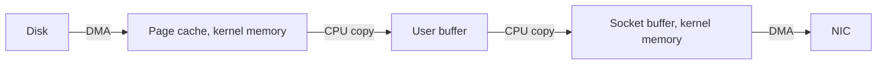
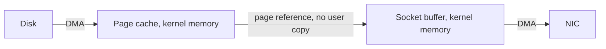
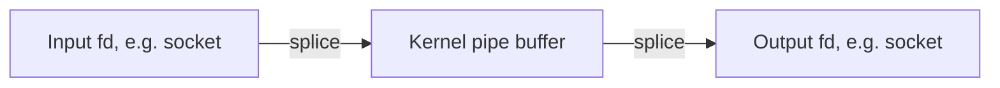
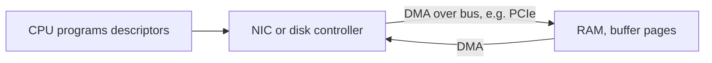
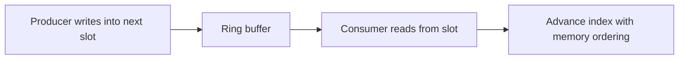
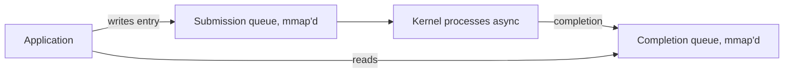

The previous chapters covered how memory is addressed, allocated, and kept correct. This final deep dive of the stage is about moving data without moving it, which is the heart of high-throughput systems. It is the eighth article of Stage 6.

When a service reads a file and sends it over the network, or relays bytes from one socket to another, the data has to travel from a device into memory and out to another device. The naive path copies those bytes several times, and at high volume those copies, not the devices, become the bottleneck. Zero-copy is the set of techniques that removes redundant copies. DMA is the hardware capability that makes it possible, because devices can move bytes into RAM without the CPU touching each one. High-performance buffers are how you structure memory so the data path stays copy-free and cache-friendly.

## The hidden cost of a copy

Consider the ordinary way to serve a file over a socket. The program calls `read`, which asks the kernel to fetch the file into a buffer the program owns. The program then calls `write` on the socket, handing that buffer back to the kernel to send. Each call looks cheap, but the bytes travel through the machine several times.



The disk controller uses DMA to place bytes into the kernel page cache without the CPU copying them. From there, the kernel copies them into the user buffer, the program copies or passes them back, and the kernel copies them into the socket buffer, after which the NIC uses DMA again. The two CPU copies in the middle are pure overhead: the CPU loads each cache line, stores it somewhere else, and pollutes caches along the way. For a 1 GB file, that is gigabytes of memory bandwidth spent on moving data that never changes. At high request rates this memcpy work, not the disk or network, becomes the limiting factor.

## What zero-copy actually removes

Zero-copy does not mean the data is never copied. It means the redundant copies into and out of user space are removed. The bytes stay in kernel memory, and instead of being copied into a program buffer, the kernel hands the existing pages from one subsystem to another by reference. The file's pages in the page cache become the source for the socket, and the program never sees the bytes.

This is the same idea the `mmap` chapter touched on, but applied to the whole path rather than to one file read. `mmap` lets a program read a file without a copy into its own buffer; zero-copy syscalls like `sendfile` go further and let the kernel move data from a file to a socket without the program copying it either.

## sendfile and the kernel-to-kernel handoff

`sendfile` takes an open file descriptor and a socket descriptor and tells the kernel to transmit the file's contents to the socket. The program never allocates a buffer or touches the bytes. The kernel moves the pages from the page cache directly into the socket path.



On many systems this removes the two user-space copies entirely. The remaining work is the DMA from disk and the DMA to the NIC, plus bookkeeping. For a file server or a proxy that forwards static content, `sendfile` can roughly double throughput and cut CPU usage, because the expensive memcpy is gone. The catch is that the data path must be a simple source-to-sink transfer; if the program needs to inspect or modify the bytes, it has to copy them to look at them, which is exactly the tradeoff the production example later shows.

## splice, tee, and moving pages between descriptors

`sendfile` is limited to a file and a socket. `splice` is the more general primitive: it moves data between any two file descriptors, as long as at least one is a pipe. The bytes travel through a kernel pipe buffer by reference, so a program can relay from one socket to another, or from a file to a socket, without copying into user space. `tee` is a variant that copies the data within the kernel without consuming it, useful for tapping a stream while forwarding it.



The pattern behind a high-performance proxy is often `splice` from the inbound socket into a pipe, then `splice` from the pipe to the outbound socket. The program orchestrates the transfer but never copies the payload. `vmsplice` lets a program push its own user memory into a pipe without a copy when that memory is already page-aligned and safe to share, which is the bridge between user buffers and the kernel zero-copy path.

## MSG_ZEROCOPY for the network send

For cases where the source is already in a user buffer, `MSG_ZEROCOPY` on a socket send tells the kernel to avoid copying the buffer into the socket layer and instead let the NIC DMA straight from the user pages. Because the device reads the buffer while it is in flight, the program must not modify or free those pages until the kernel signals completion, which arrives asynchronously through the socket's error queue. This shifts the cost from a synchronous copy to a lifetime-management problem: the buffer has to stay valid until the hardware is done with it.

The nuance is that the data still ends up on the wire, and the NIC still DMAs it out, so the CPU copy is what is removed, not the movement to the device. The benefit is largest for large sends, where the copy would otherwise dominate. For tiny sends the setup and completion overhead outweighs the saved copy, so zero-copy send is a large-message optimization.

## DMA, the hardware foundation

All of this rests on direct memory access. A DMA-capable device, such as a NIC or a disk controller, can read and write RAM on its own, over the system bus, without the CPU executing a load or store for each byte. The CPU's job is to program the device with a list of descriptors: here is a buffer address and length, go move this data. The device then DMAs the bytes and raises an interrupt when done.



DMA is why the CPU can stay out of the data path. Without it, every byte would pass through a CPU register. With it, the CPU sets up the transfer and moves on to other work while the device fills or empties memory.

Two details matter for correctness and safety. First, the buffer the device DMAs into must be physically contiguous from the device's view, or the device must support scatter-gather, where a single transfer is described by a list of address and length pairs. Most modern devices support scatter-gather, which is why non-contiguous kernel or user pages can still be transmitted without first copying them into one contiguous region. Second, the device must be told the right addresses, and an untrusted device could DMA into arbitrary memory. The IOMMU, called SMU on some architectures, translates device-visible addresses and restricts each device to the pages it is allowed to touch, which is both a safety and an isolation mechanism.

Older or constrained systems sometimes need bounce buffers: a contiguous region the device can address, into which data is copied so the device can reach it. Bounce buffers are a fallback that reintroduces a copy, so they are a sign of a device or platform limitation rather than a design choice.

## Scatter-gather I/O in the program

The same idea appears at the syscall level through vectored I/O. `readv` and `writev` let a program issue one read or write that fills or drains several separate buffers, described by an array of base and length pairs. This is useful when a message is spread across non-contiguous regions, such as a header in one buffer and a body in another, and it avoids copying them into a single linear buffer just to issue one call.

```go
package main

import (
    "fmt"
    "os"
    "syscall"
)

func main() {
    f, err := os.Open("/etc/hosts")
    if err != nil {
        panic(err)
    }
    defer f.Close()

    bufA := make([]byte, 16)
    bufB := make([]byte, 48)
    iovs := []syscall.Iovec{
        {Base: &bufA[0], Len: uint64(len(bufA))},
        {Base: &bufB[0], Len: uint64(len(bufB))},
    }
    n, err := syscall.Readv(int(f.Fd()), iovs)
    if err != nil {
        panic(err)
    }
    fmt.Printf("readv placed %d bytes into two separate buffers with one syscall\n", n)
    _ = bufA
    _ = bufB
    select {}
}
```

```bash
go build -o sgread main.go
strace -e trace=readv,read,write ./sgread 2>&1 | head
```

What it shows is one syscall filling two buffers, which mirrors how a device can DMA into several pages at once. The kernel copies from the file into each buffer in turn, but the program avoided allocating one big contiguous region and stitching the data together by hand. For high-performance servers, vectored I/O is how a response built from a status line, headers, and a file region is sent in a single operation without first concatenating them.

## High-performance buffer design

When the data path must be fast, the buffers themselves are designed, not just allocated. Several principles recur.

Pre-allocate a pool instead of asking the allocator per message. The allocator chapter explained the cost of frequent small allocations and the contention they cause under many threads. A buffer pool hands out reused buffers, which removes allocation churn and keeps memory footprint steady.

Align buffers to the cache line and, for DMA, to the page. Misaligned access can cross cache lines or pages, forcing extra work or preventing a device from DMAing directly. Alignment is why zero-copy paths often require page-aligned user buffers.

Avoid false sharing by giving each core its own buffer. If two cores write to different fields that happen to sit on the same cache line, the hardware keeps the line coherent by bouncing it between them, which destroys performance. Per-core buffers, padded to cache-line boundaries, keep each core's hot data private.

Batch operations to amortize cost. One transfer of many messages is cheaper than many transfers of one, because the fixed cost of a syscall or a descriptor setup is paid once. Lock-free ring buffers make batching practical between a producer and a consumer without a mutex on the hot path.



Use huge pages for large buffers when the translation chapter's TLB pressure applies. A ring buffer spanning gigabytes of packet data, backed by huge pages, reduces TLB misses exactly as described earlier. The buffer design and the memory hardware story are the same story told at different layers.

Touch the buffer deliberately. Reading or writing a buffer pulls it into cache, which can evict hotter data. Sometimes a small copy into a local scratch buffer, processed and discarded, is faster than operating directly on a large buffer that pollutes the cache, which is the rare case where a copy is a performance win rather than a loss.

## When zero-copy helps and when it does not

Zero-copy pays off for large transfers and high throughput, where the CPU copies would otherwise dominate. File serving, proxying, and bulk data movement are the classic wins. It does not help, and can hurt, for small messages, where the setup, the completion notification, and the lifetime management cost more than the copy they remove.

It also changes the correctness model. A buffer given to a device or handed to the kernel by reference is owned by that component while in flight. The program must not write to it, read from it, or free it until the transfer completes, or it will corrupt the data or crash on a use-after-free. Reference counting and completion callbacks become mandatory, which is more complex than a simple send-and-forget copy. A system that modifies data in transit, such as a proxy that rewrites headers or compresses a body, often needs a copy for the part it touches, so the design is a mix: zero-copy the parts that pass through untouched, copy the parts that change.

## Observing the data path

You can confirm which path a program takes. `strace` shows whether a transfer uses `read` and `write` in a loop or `sendfile`, `splice`, or `vmsplice`. A proxy that issues many `read` and `write` syscalls per connection is copying; one that issues `splice` is not.

```bash
# watch a server's syscalls for copy vs zero-copy primitives
strace -f -e trace=sendfile,splice,vmsplice,read,write,recvfrom,sendto -p $(pgrep myservice) 2>&1 | head
# NIC and per-device DMA statistics
ethtool -S eth0 | grep -iE "rx|tx|dma|copy" | head
# kernel-side copy accounting is indirect, but high context switches
# plus high CPU per byte suggests memcpy-bound work
```

At a deeper level, `perf` can show time spent in `memcpy` and related routines, which is the signature of a copy-bound data path. If a large fraction of CPU is in memory copy while devices are not saturated, zero-copy is the lever. The buffer pool and cache behavior show up in cache-miss counters, tying back to the CPU and memory-locality material from earlier in the series.

## A realistic production example

A team operated a reverse proxy that relayed responses from upstream services to clients. The original code read each response chunk into a heap buffer with `read` and wrote it to the client socket with `write`. Under modest load it was fine. As traffic grew to serve large API payloads and media, the proxy boxes hit CPU limits well before the network or disks were saturated.

A `perf` profile showed a large share of CPU inside `memcpy`, the copy between the kernel buffers and the proxy's own buffers. The data was being moved through user space only so the proxy could forward it, and that copy was the bottleneck. They switched the relay path to `splice`: from the upstream socket into a pipe, then from the pipe to the client socket, with the proxy only coordinating the transfer and never copying the payload. CPU on the proxy dropped sharply and throughput rose, because the bytes traveled kernel-to-kernel.

The complication was the parts of the response the proxy did need to touch, such as a small header it rewrote and a compacting transform on certain content types. Those paths could not use zero-copy safely, because the buffer was in flight and owned by the kernel pipe. They kept a copy-based path for the header and the transformed content, and used `splice` only for the untouched body. The result was a hybrid: most of the bytes skipped user space, and the small, latency-sensitive parts that needed inspection used a normal copy. The lesson was that zero-copy is a tool for the bulk path, not a wholesale replacement, and the engineering is in knowing which bytes must be seen and copying only those.

## How engineers actually reason about the data path

They count the copies. For any data movement, they ask where the bytes live at each step and whether a copy between kernel and user is necessary. If the program never inspects the bytes, a copy is waste, and `sendfile` or `splice` removes it.

They respect device ownership. A buffer handed to a device or the kernel by reference must stay valid until completion, so they design lifetime with reference counts and completion signals rather than hoping the copy is done. This is the memory-safety discipline applied to I/O.

They match the technique to the size. Large transfers earn zero-copy; small ones do not. A system that applies zero-copy universally often pays more in complexity and completion overhead than it saves.

They design buffers, not just allocate them. Pooling, alignment, per-core ownership, batching, and huge-page backing turn a correct data path into a fast one, and the same principles appear whether the buffer feeds a NIC, a disk, or another thread.

## Beyond syscalls: io_uring and userspace I/O rings

The zero-copy syscalls still cross the user-kernel boundary once per transfer. io_uring removes even that cost for high-volume I/O. The kernel and the program share two ring buffers, the submission queue and the completion queue, mapped into the process with `mmap`, so the program posts I/O requests by writing an entry and advancing an index, and the kernel consumes and completes them in place. With the rings in user space, a tight loop can submit and reap operations with no syscall for each one, and the kernel processes them asynchronously.



Registered, or fixed, buffers extend zero-copy into this path: the program pins a set of buffers once and refers to them by index, so the kernel does not copy or re-validate them per operation. This is the same page handoff idea as `MSG_ZEROCOPY`, applied to the whole I/O submission. At the extreme, userspace network drivers such as DPDK map the NIC's descriptor rings and buffers directly into the process and poll them in a loop, bypassing the kernel entirely for the data path; that is the logical end of zero-copy, bought with the loss of kernel scheduling, isolation, and simplicity.

## More zero-copy primitives and hardware offloads

`copy_file_range` is the in-kernel cousin of `sendfile`: it copies a range from one file to another entirely within the kernel, so the bytes never enter user space even though the source and destination are both files. For a backup or replication tool that moves large files, it removes the read-into-buffer then write-from-buffer pair just as `sendfile` does for a socket.

The other half of the story is offload. Once bytes are heading to a NIC, the hardware can do work the CPU would otherwise do per packet: TCP segmentation offload, called TSO or GSO, lets the kernel hand one large segment to the device and the NIC splits it into wire-sized frames, and generic receive offload, GRO, reassembles frames back into large segments before they reach the stack. Checksum offload pushes the checksum computation to the device. These are zero-copy's siblings: not removing a memory copy but removing per-byte CPU labor, which is the same battle the DMA section described from the other side.

## Registered memory and the cost of pinned pages

Every zero-copy path that lets a device or the kernel read user pages directly has to make those pages stable, because the device cannot follow a page fault the way the CPU does. The common mechanism is pinning: the kernel marks the pages as non-movable and non-reclaimable so they stay at a fixed physical address for the duration of the I/O. This is the same `mlock` behavior from the paging chapter, and it comes with the same cost: pinned memory cannot be swapped or reclaimed, so it counts against the process and its cgroup's memory limit and reduces what the system can reclaim under pressure.

The danger is twofold. A service that registers large buffer pools for io_uring or RDMA can pin gigabytes that the OOM killer and the reclaim path cannot touch, so the box runs out of movable memory while looking like it has free RAM. And because the pages are shared with a device by physical address, a bug that writes the wrong index corrupts memory that no virtual-address check would catch. Zero-copy is fast precisely because it removes the safety of the per-copy boundary, which is why registered buffers demand the lifetime discipline from the previous section: valid, pinned, and untouched until the completion arrives.

## Definitions

### Zero-copy

> A set of techniques that remove redundant copies of data between kernel and user space, keeping bytes in kernel memory and handing them between subsystems by reference rather than by copying them through a program buffer.

### DMA

> Direct memory access, the hardware capability that lets a device such as a NIC or disk controller read and write RAM on its own over the system bus, so the CPU programs the transfer with descriptors instead of moving each byte.

### sendfile and splice

> `sendfile` transmits a file to a socket entirely in the kernel. `splice` moves data between arbitrary descriptors through a kernel pipe, letting a program relay bytes without copying them into user space.

### Scatter-gather I/O

> The ability, at both device and syscall level, to describe a transfer as a list of buffers or pages, so non-contiguous memory can be moved or filled in one operation without first linearizing it with a copy.

### A high-performance buffer

> A buffer designed for the data path: pre-allocated from a pool, aligned to cache line or page, owned by a single core or producer-consumer pair, and often backed by huge pages, so movement stays copy-free and cache-friendly.

## Beyond the definitions

### Why does the CPU still matter if DMA does the moving

> Because the CPU programs the transfer, manages completion, and handles the parts of the data path that are not a simple bulk move. DMA removes the per-byte CPU work, but copying into and out of user space is a separate cost that zero-copy removes on top of DMA.

### What is the danger of modifying a zero-copy buffer

> The buffer is owned by the kernel or device while in flight, so writing to it corrupts the transfer and freeing it causes a use-after-free in hardware. The program must wait for completion before touching or releasing it, which is why zero-copy adds lifetime complexity.

### Why is zero-copy not always faster

> For small messages the overhead of setting up the transfer and waiting for completion exceeds the cost of a single copy, and a program that must inspect or transform the data has to copy it anyway. It is a large-transfer optimization, not a universal one.

### What does the IOMMU add to DMA

> It translates device-visible addresses and restricts each device to the memory it is permitted to access, preventing a malicious or buggy device from DMAing into arbitrary RAM. It is both a safety boundary and an isolation boundary, much like the process isolation described earlier in the series.

### How is a ring buffer different from a plain queue

> A ring buffer is a fixed array of slots with producer and consumer indices, often used lock-free between one producer and one consumer by advancing indices with careful memory ordering. It avoids allocation and locking on the hot path, which is why high-performance data paths favor it over a heap-allocated queue.

## Common misconceptions

**"Zero-copy means the data is never copied."** It means the redundant user-space copies are removed. The device still DMAs the bytes to and from RAM, and some paths still copy once inside the kernel. The win is removing the copies the program would otherwise pay for.

**"sendfile works for any transfer."** It is for a file to a socket. For socket-to-socket or more general relay you need `splice`, and if the data must be inspected or changed, a copy is required for those bytes regardless.

**"DMA means the CPU is uninvolved."** The CPU is involved in setting up descriptors, handling completion interrupts, and managing buffer lifetime. DMA removes per-byte CPU movement, not CPU responsibility.

**"Zero-copy is always the right default."** For small messages or data that must be transformed, the complexity and overhead can cost more than the copy saved. It is a deliberate optimization for bulk paths, applied where measurements show copies dominate.

**"A buffer passed to the kernel can be reused immediately."** Not while it is in flight. Until the kernel or device signals completion, that memory is owned by the lower layers, and reusing it corrupts data or crashes the transfer. Lifetime discipline is the price of the performance.

## Summary

Moving data through a system is mostly about avoiding unnecessary copies, and the techniques build on everything earlier in this stage. DMA lets devices place bytes in RAM without the CPU, zero-copy syscalls like `sendfile` and `splice` keep those bytes out of user space for bulk transfers, and scatter-gather plus vectored I/O let non-contiguous memory move in one operation. High-performance buffers, pooled, aligned, per-core, and often huge-page backed, keep the path copy-free and cache-friendly. The cost of zero-copy is lifetime discipline, because a buffer in flight is owned by the kernel or device, not by the program. With this chapter, Stage 6 has covered the full memory story from address space to moving bytes at speed, and the next stage of the series builds on it for the subsystems that use memory this way.
